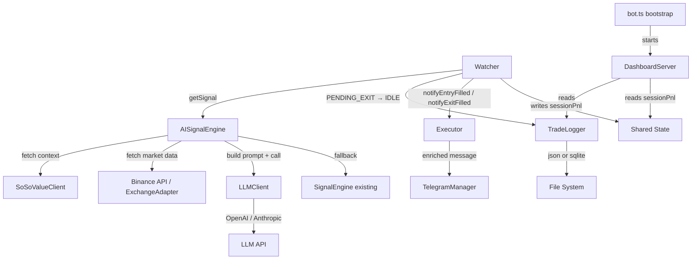

# Design Document: AI Alpha Execution Engine

## Overview

The AI Alpha Execution Engine replaces the rule-based `SignalEngine` with an AI-powered decision layer. The system fetches macro market context (sector index, fear/greed) from the SoSoValue API, combines it with existing Binance-sourced technical indicators, and sends the enriched data to an LLM (OpenAI GPT-4o or Anthropic Claude) to produce a structured trade decision. Every completed trade is persisted with its AI reasoning, Telegram notifications are enriched with that reasoning, and a minimal Express.js dashboard exposes live PnL and trade history.

The existing `Watcher` state machine and `Executor` are preserved unchanged in their core logic. The integration is additive: new modules slot in via the same `Signal` interface, with two new fields (`reasoning`, `fallback`) appended to it.

---

## Architecture



### Key Design Decisions

1. **Drop-in replacement**: `AISignalEngine` implements the same `getSignal(symbol): Promise<Signal>` interface as `SignalEngine`. `Watcher` only changes its import — no logic changes.
2. **Signal interface extension**: Two new fields (`reasoning`, `fallback`) are appended to the existing `Signal` type. All existing consumers ignore unknown fields, so backward compatibility is preserved.
3. **Fire-and-forget logging**: `TradeLogger.log()` is async but `Watcher` does not await it — errors are caught internally and logged to console. This ensures the state machine is never blocked by I/O.
4. **Shared state for PnL**: A simple exported mutable object `sharedState` in `src/ai/sharedState.ts` holds `sessionPnl`. `Watcher` writes to it; `DashboardServer` reads from it. No IPC or pub/sub needed.
5. **No build step for dashboard**: The HTML page is a template literal in `server.ts`, served from memory. No bundler, no static files directory.
6. **Graceful degradation**: Every external call (SoSoValue, LLM) has a timeout and a catch that returns `null` / triggers fallback. `AISignalEngine.getSignal()` never throws.

---

## Components and Interfaces

### Extended Signal Interface

```typescript
// src/modules/SignalEngine.ts — extended
export interface Signal {
  base_score: number;
  regime: 'TREND_UP' | 'TREND_DOWN' | 'SIDEWAY';
  direction: 'long' | 'short' | 'skip';
  confidence: number;
  imbalance: number;
  tradePressure: number;
  score: number;
  chartTrend: 'bullish' | 'bearish' | 'neutral';
  reasoning: string;   // NEW: LLM reasoning or empty string for fallback
  fallback: boolean;   // NEW: true if rule-based fallback was used
}
```

### SoSoValueClient (`src/ai/SoSoValueClient.ts`)

```typescript
export interface SoSoValueData {
  sectorIndex: number;
  fearGreedIndex: number;
  fearGreedLabel: string;
}

export class SoSoValueClient {
  async fetch(): Promise<SoSoValueData | null>
}
```

- Uses `axios` with a 5-second timeout.
- Returns `null` on any error (network, timeout, non-2xx, parse failure).
- Logs errors to console without throwing.

### LLMClient (`src/ai/LLMClient.ts`)

```typescript
export interface LLMDecision {
  direction: 'long' | 'short' | 'skip';
  confidence: number;  // clamped to [0, 1] before return
  reasoning: string;
}

export interface MarketContext {
  sma50: number;
  currentPrice: number;
  lsRatio: number;
  imbalance: number;
  tradePressure: number;
  fearGreedIndex: number | null;
  fearGreedLabel: string | null;
  sectorIndex: number | null;
}

export class LLMClient {
  constructor(provider: 'openai' | 'anthropic', apiKey: string)
  buildPrompt(ctx: MarketContext): string
  async call(ctx: MarketContext): Promise<LLMDecision | null>
}
```

- Uses `axios` with a 15-second timeout.
- `buildPrompt()` is a pure function — testable in isolation.
- Returns `null` on timeout, network error, or JSON parse failure.
- Clamps `confidence` to `[0, 1]` before returning.

### AISignalEngine (`src/ai/AISignalEngine.ts`)

```typescript
export class AISignalEngine {
  constructor(adapter: ExchangeAdapter)
  async getSignal(symbol: string): Promise<Signal>
}
```

- Orchestrates: fetch SoSoValue → fetch Binance data → call LLM → map to Signal.
- On any failure, delegates to the existing `SignalEngine` and sets `fallback: true`.
- Never throws — always returns a valid `Signal`.

### TradeLogger (`src/ai/TradeLogger.ts`)

```typescript
export interface TradeRecord {
  id: string;           // uuid (crypto.randomUUID())
  timestamp: string;    // ISO 8601
  symbol: string;
  direction: 'long' | 'short';
  confidence: number;
  reasoning: string;
  fallback: boolean;
  entryPrice: number;
  exitPrice: number;
  pnl: number;
  sessionPnl: number;
}

export class TradeLogger {
  constructor(backend: 'json' | 'sqlite', logPath: string)
  log(record: TradeRecord): void          // fire-and-forget, never throws
  async readAll(): Promise<TradeRecord[]> // ordered by timestamp descending
}
```

- `log()` is synchronous from the caller's perspective (fire-and-forget). Internally it calls an async write and catches all errors.
- JSON backend: appends a newline-delimited JSON line to the file.
- SQLite backend: inserts a row using `better-sqlite3` (synchronous API — no async needed).

### DashboardServer (`src/dashboard/server.ts`)

```typescript
export class DashboardServer {
  constructor(tradeLogger: TradeLogger, port: number)
  start(): void
}
```

Endpoints:
- `GET /` — serves inline HTML page (template literal, no file read).
- `GET /api/trades` — returns `TradeRecord[]` from `tradeLogger.readAll()`, ordered by timestamp descending.
- `GET /api/pnl` — returns `{ sessionPnl: number, updatedAt: string }` from `sharedState`.

### Shared State (`src/ai/sharedState.ts`)

```typescript
export const sharedState = {
  sessionPnl: 0,
  updatedAt: new Date().toISOString(),
};
```

`Watcher` imports and writes `sharedState.sessionPnl` on each tick. `DashboardServer` reads it on each `/api/pnl` request.

---

## Data Models

### TradeRecord

| Field | Type | Description |
|---|---|---|
| `id` | `string` | UUID v4 |
| `timestamp` | `string` | ISO 8601 exit time |
| `symbol` | `string` | e.g. `"BTC-USD"` |
| `direction` | `'long' \| 'short'` | Trade direction |
| `confidence` | `number` | LLM confidence [0, 1] |
| `reasoning` | `string` | LLM reasoning or `"Fallback — rule-based signal"` |
| `fallback` | `boolean` | Whether rule-based fallback was used |
| `entryPrice` | `number` | Fill price at entry |
| `exitPrice` | `number` | Fill price at exit |
| `pnl` | `number` | Realized PnL in USDC |
| `sessionPnl` | `number` | Cumulative session PnL at time of exit |

### JSON Storage Format

Newline-delimited JSON (NDJSON) — one `TradeRecord` JSON object per line:

```
{"id":"...","timestamp":"2025-01-01T00:00:00.000Z","symbol":"BTC-USD",...}
{"id":"...","timestamp":"2025-01-01T00:05:00.000Z","symbol":"BTC-USD",...}
```

### SQLite Schema

```sql
CREATE TABLE IF NOT EXISTS trades (
  id TEXT PRIMARY KEY,
  timestamp TEXT NOT NULL,
  symbol TEXT NOT NULL,
  direction TEXT NOT NULL,
  confidence REAL NOT NULL,
  reasoning TEXT NOT NULL,
  fallback INTEGER NOT NULL,
  entry_price REAL NOT NULL,
  exit_price REAL NOT NULL,
  pnl REAL NOT NULL,
  session_pnl REAL NOT NULL
);
```

### LLM Prompt Template

```
You are a crypto trading AI. Given the following market data, decide whether to LONG, SHORT, or SKIP trading BTC.

Market Data:
- SMA(50): {sma50}, Current Price: {currentPrice} → {above/below} SMA
- L/S Ratio: {lsRatio} (crowd sentiment)
- Orderbook Imbalance: {imbalance}
- Trade Pressure (buy%): {tradePressure}
- SoSoValue Fear/Greed: {fearGreedIndex} ({fearGreedLabel})
- SoSoValue Sector Index: {sectorIndex}

Strategy: Contrarian — fade crowd extremes, buy oversold, sell overbought.

Respond ONLY with valid JSON: {"direction": "long"|"short"|"skip", "confidence": 0.0-1.0, "reasoning": "one sentence"}
```

When SoSoValue data is unavailable, those two lines are replaced with `- SoSoValue data: unavailable`.

### Environment Variables

| Variable | Default | Description |
|---|---|---|
| `LLM_PROVIDER` | `'openai'` | `'openai'` or `'anthropic'` |
| `OPENAI_API_KEY` | — | Required when provider is `openai` |
| `ANTHROPIC_API_KEY` | — | Required when provider is `anthropic` |
| `SOSOVALUE_API_KEY` | — | Optional; sent as Bearer token if set |
| `TRADE_LOG_PATH` | `'./trades.json'` | Path to JSON log or SQLite DB file |
| `TRADE_LOG_BACKEND` | `'json'` | `'json'` or `'sqlite'` |
| `DASHBOARD_PORT` | `3000` | HTTP port for dashboard server |

---

## Correctness Properties

*A property is a characteristic or behavior that should hold true across all valid executions of a system — essentially, a formal statement about what the system should do. Properties serve as the bridge between human-readable specifications and machine-verifiable correctness guarantees.*

### Property 1: SoSoValue response always yields a complete structured object

*For any* valid SoSoValue API response body, `SoSoValueClient.fetch()` SHALL return an object containing `sectorIndex` (number), `fearGreedIndex` (number), and `fearGreedLabel` (string) — never a partial object.

**Validates: Requirements 1.2**

---

### Property 2: LLM prompt always contains all market data fields

*For any* `MarketContext` object with valid numeric fields, `LLMClient.buildPrompt()` SHALL return a string that contains each of: the SMA value, current price, L/S ratio, orderbook imbalance, and trade pressure.

**Validates: Requirements 2.1**

---

### Property 3: LLM confidence is always clamped to [0, 1]

*For any* raw confidence value returned by the LLM (including values below 0, above 1, or at the boundaries), the `Signal.confidence` field returned by `AISignalEngine.getSignal()` SHALL satisfy `0 <= confidence <= 1`.

**Validates: Requirements 2.3**

---

### Property 4: AISignalEngine always returns a valid Signal

*For any* combination of LLM failure modes (timeout, network error, malformed JSON, missing fields) and SoSoValue failure modes (null return), `AISignalEngine.getSignal()` SHALL return a `Signal` object with all required fields populated and `fallback: true`, without throwing an exception.

**Validates: Requirements 3.1, 3.3**

---

### Property 5: TradeLogger round-trip fidelity

*For any* `TradeRecord` object logged via `TradeLogger.log()`, a subsequent call to `TradeLogger.readAll()` SHALL return a collection containing a record with identical field values (id, timestamp, symbol, direction, confidence, reasoning, fallback, entryPrice, exitPrice, pnl, sessionPnl).

**Validates: Requirements 4.1, 4.2, 4.3, 4.4**

---

### Property 6: Telegram reasoning is always truncated to ≤ 200 characters

*For any* `Signal` or `TradeRecord` with a `reasoning` string of arbitrary length, the Telegram notification message produced by `Executor.notifyEntryFilled()` or `notifyExitFilled()` SHALL contain a reasoning snippet of at most 200 characters.

**Validates: Requirements 5.1, 5.2**

---

### Property 7: Fallback signals are always labeled in Telegram notifications

*For any* `Signal` with `fallback: true`, the Telegram notification message SHALL contain the string `"[Fallback Mode]"` and SHALL NOT contain the raw `reasoning` field value.

**Validates: Requirements 5.3**

---

### Property 8: Dashboard trades endpoint returns records ordered by timestamp descending

*For any* set of `TradeRecord` entries in the persistent store with distinct timestamps, `GET /api/trades` SHALL return a JSON array where each record's `timestamp` is greater than or equal to the `timestamp` of the record that follows it.

**Validates: Requirements 6.2**

---

### Property 9: Dashboard PnL endpoint reflects current shared state

*For any* value written to `sharedState.sessionPnl`, a subsequent `GET /api/pnl` request SHALL return a response where `sessionPnl` equals the written value.

**Validates: Requirements 7.2**

---

## Error Handling

| Failure Scenario | Component | Behavior |
|---|---|---|
| SoSoValue API timeout / error | `SoSoValueClient` | Returns `null`, logs error. LLM call proceeds without SoSoValue fields. |
| LLM API timeout / error | `LLMClient` | Returns `null`. `AISignalEngine` falls back to `SignalEngine`. |
| LLM returns malformed JSON | `LLMClient` | Returns `null`. `AISignalEngine` falls back to `SignalEngine`. |
| LLM confidence out of range | `LLMClient` | Clamps to `[0, 1]` before returning. |
| TradeLogger write failure | `TradeLogger` | Catches error, logs to console, does not throw. Bot continues. |
| Dashboard read failure | `DashboardServer` | Returns `500` with JSON error body. Does not crash server. |
| Missing LLM API key | `bot.ts` bootstrap | Throws at startup with a descriptive error message before the bot enters its loop. |

---

## Testing Strategy

### Unit Tests (example-based)

- `SoSoValueClient`: mock axios, verify null on error, verify correct field extraction on success.
- `LLMClient.buildPrompt()`: verify prompt contains all required fields for a known input.
- `AISignalEngine`: verify fallback is triggered when LLM returns null; verify `fallback: false` when LLM succeeds.
- `DashboardServer`: verify `GET /` returns HTML, `GET /api/pnl` returns correct shape.
- `Executor.notifyEntryFilled` / `notifyExitFilled`: verify `[Fallback Mode]` label when `fallback: true`.

### Property-Based Tests

Uses **fast-check** (already compatible with the Vitest setup in this project).

Each property test runs a minimum of **100 iterations**.

Tag format: `// Feature: ai-alpha-execution-engine, Property N: <property text>`

| Property | Generator | Assertion |
|---|---|---|
| P1: SoSoValue response completeness | Random numeric sectorIndex, fearGreedIndex, random label string | Returned object has all three fields with correct types |
| P2: LLM prompt completeness | Random `MarketContext` with valid numbers | Prompt string contains all required data fields |
| P3: Confidence clamping | `fc.float({ min: -10, max: 10 })` including boundary values | Output confidence is always in `[0, 1]` |
| P4: AISignalEngine never throws | Random failure mode selection (timeout / parse error / null) | Returns valid Signal with `fallback: true`, no exception |
| P5: TradeLogger round-trip | Random `TradeRecord` with `fc.record(...)` | `readAll()` contains record with identical fields |
| P6: Reasoning truncation | `fc.string({ minLength: 0, maxLength: 1000 })` | Notification reasoning snippet length ≤ 200 |
| P7: Fallback label | Random Signal with `fallback: true` | Notification contains `"[Fallback Mode]"`, not raw reasoning |
| P8: Trades ordered descending | Random array of TradeRecords with random timestamps | Response array is sorted by timestamp descending |
| P9: PnL state reflection | `fc.float()` written to sharedState | `/api/pnl` response matches written value |

### Integration Tests

- End-to-end: `AISignalEngine.getSignal()` with real Binance data (mocked SoSoValue + LLM) returns a valid Signal.
- `DashboardServer` + `TradeLogger`: log a record, verify it appears in `GET /api/trades` response.

### Smoke Tests

- Verify `LLMClient` axios instance has 15-second timeout configured.
- Verify `SoSoValueClient` axios instance has 5-second timeout configured.
- Verify `DashboardServer` starts on the configured `DASHBOARD_PORT`.
- Verify `TRADE_LOG_BACKEND` env var routes to the correct backend class.
