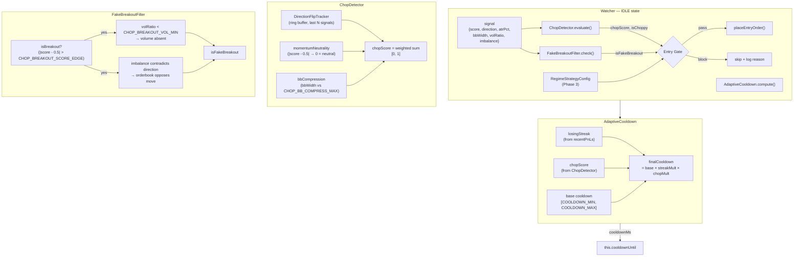
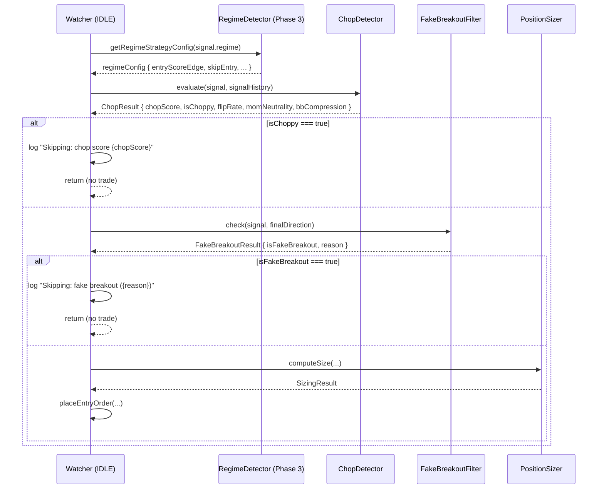
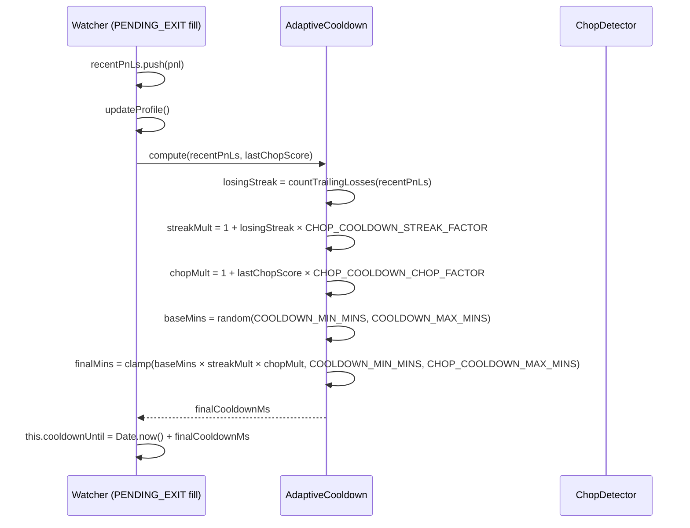

# Design Document: Anti-Chop & Trade Filtering (Phase 4)

## Overview

Phase 4 adds a `ChopDetector` service and an adaptive cooldown mechanism to APEX's Watcher state machine. The goal is to suppress low-quality entries during choppy, directionless market conditions and to dynamically extend the post-trade cooldown when the bot is on a losing streak or the market is noisy.

Phase 3 already handles `SIDEWAY` and `HIGH_VOLATILITY` regimes by raising the entry score edge and reducing position size. Phase 4 operates at a finer granularity: it computes a continuous **chop score** from direction flip rate, momentum neutrality, and BB compression, then gates entries and scales cooldown independently of the regime label. The two systems are complementary — Phase 3 adjusts *how* to trade in a regime; Phase 4 decides *whether* to trade at all given recent signal quality and performance.

A `FakeBreakoutFilter` sub-component guards against breakout entries that lack volume confirmation or are contradicted by orderbook imbalance, catching a class of false signals that the regime classifier misses because they occur within otherwise trending conditions.

---

## Architecture



Key design decisions:

| Decision | Choice | Rationale |
|---|---|---|
| New service vs inline | New `ChopDetector` class | Testable in isolation; Watcher stays thin; mirrors Phase 3 pattern |
| Chop score formula | Weighted sum of 3 sub-scores | Each component is independently tunable; avoids multiplicative collapse |
| Direction flip tracking | Extend `_lastSignal` into a ring buffer (`_signalHistory`) | Minimal state addition; reuses existing `_lastSignal` pattern |
| Flip window size | Configurable `CHOP_FLIP_WINDOW` (default 5 signals) | 5 signals ≈ 10–450s of history given random tick delays |
| Phase 3 interaction | ChopDetector runs *after* regime check; SIDEWAY regime already raises score edge | Avoid double-penalizing: chop score adds a *continuous* gate on top of the discrete regime label |
| Adaptive cooldown | Multiplicative: `base × streakMult × chopMult` | Keeps cooldown bounded; each factor is independently capped |
| Fake breakout definition | Entry where `isBreakout=true` AND (`volRatio < threshold` OR `imbalance contradicts direction`) | Breakout without volume or against orderbook = likely fake |
| `imbalance` field | Already present in `signal.imbalance` (from AISignalEngine) | No new data fetch needed |
| Config exposure | New `CHOP_*` keys in `config.ts` + `OverridableConfig` | Consistent with existing dashboard override pattern |
| Cooldown application | Replace the fixed random cooldown in `PENDING_EXIT` fill handler | Single cooldown path; adaptive formula replaces the existing `Math.random()` range |

---

## Sequence Diagrams

### IDLE Entry Decision with Chop Filtering



### Adaptive Cooldown on Trade Exit



---

## Components and Interfaces

### ChopDetector

**Purpose**: Computes a continuous chop score `[0, 1]` from three market quality signals and determines whether the current market is too choppy to enter.

**Interface**:
```typescript
interface SignalHistoryEntry {
  direction: 'long' | 'short' | 'skip';
  score: number;
  ts: number;
}

interface ChopResult {
  chopScore: number;        // [0, 1] — 0 = clean, 1 = maximum chop
  isChoppy: boolean;        // chopScore >= CHOP_SCORE_THRESHOLD
  flipRate: number;         // [0, 1] — fraction of direction changes in window
  momNeutrality: number;    // [0, 1] — how close score is to 0.5
  bbCompression: number;    // [0, 1] — how compressed BB width is
}

interface ChopDetectorInterface {
  evaluate(
    signal: { score: number; bbWidth: number },
    signalHistory: SignalHistoryEntry[]
  ): ChopResult;
}
```

**Responsibilities**:
- Compute `flipRate` from the last `CHOP_FLIP_WINDOW` entries in `signalHistory`
- Compute `momNeutrality` from `|signal.score - 0.5|` normalized to `[0, 1]`
- Compute `bbCompression` from `signal.bbWidth` relative to `CHOP_BB_COMPRESS_MAX`
- Combine into `chopScore` via configurable weighted sum
- Return `isChoppy = chopScore >= CHOP_SCORE_THRESHOLD`

**Phase 3 interaction**: `ChopDetector.evaluate()` is called *after* `getRegimeStrategyConfig()`. If the regime is already `SIDEWAY`, the `entryScoreEdge` is already raised to 0.05. The chop score provides an additional continuous gate — a `SIDEWAY` market with a high chop score will be blocked even if the score edge is technically met.

---

### FakeBreakoutFilter

**Purpose**: Detects entries that look like breakouts (strong score edge) but lack the volume or orderbook confirmation to be genuine.

**Interface**:
```typescript
interface FakeBreakoutResult {
  isFakeBreakout: boolean;
  reason: 'low_volume' | 'imbalance_contradiction' | 'both' | null;
}

interface FakeBreakoutFilterInterface {
  check(
    signal: { score: number; volRatio: number; imbalance: number },
    direction: 'long' | 'short'
  ): FakeBreakoutResult;
}
```

**Responsibilities**:
- Determine if the entry qualifies as a "breakout attempt": `|score - 0.5| > CHOP_BREAKOUT_SCORE_EDGE`
- If breakout: check `volRatio < CHOP_BREAKOUT_VOL_MIN` (volume absent)
- If breakout: check if `imbalance` contradicts `direction` (orderbook opposes move)
  - Long entry: `imbalance < -CHOP_BREAKOUT_IMBALANCE_THRESHOLD` (sell pressure dominates)
  - Short entry: `imbalance > CHOP_BREAKOUT_IMBALANCE_THRESHOLD` (buy pressure dominates)
- Return `isFakeBreakout = true` if either condition holds

**Non-breakout entries** (score edge below `CHOP_BREAKOUT_SCORE_EDGE`) are not checked — the fake breakout filter only applies to entries that *look* like breakouts.

---

### AdaptiveCooldown

**Purpose**: Computes the post-trade cooldown duration based on recent performance and market choppiness.

**Interface**:
```typescript
interface AdaptiveCooldownInput {
  recentPnLs: number[];   // last N trade PnLs (same array as Watcher.recentPnLs)
  lastChopScore: number;  // most recent ChopResult.chopScore
}

interface AdaptiveCooldownResult {
  cooldownMs: number;
  baseMins: number;
  streakMult: number;
  chopMult: number;
  losingStreak: number;
}

function computeAdaptiveCooldown(input: AdaptiveCooldownInput): AdaptiveCooldownResult;
```

**Responsibilities**:
- Count trailing losses in `recentPnLs` to determine `losingStreak`
- Compute `streakMult = 1 + losingStreak × CHOP_COOLDOWN_STREAK_FACTOR`
- Compute `chopMult = 1 + lastChopScore × CHOP_COOLDOWN_CHOP_FACTOR`
- Draw `baseMins` from `[COOLDOWN_MIN_MINS, COOLDOWN_MAX_MINS]` (existing range)
- Compute `finalMins = clamp(baseMins × streakMult × chopMult, COOLDOWN_MIN_MINS, CHOP_COOLDOWN_MAX_MINS)`
- Return `cooldownMs = finalMins × 60 × 1000`

---

### Config Extensions

New keys added to `config.ts` and `OverridableConfig`:

```typescript
// ── Anti-Chop & Trade Filtering (Phase 4) ────────────────────────────────────

// Chop detection
CHOP_FLIP_WINDOW: 5,                  // number of recent signals to check for direction flips
CHOP_FLIP_WEIGHT: 0.4,                // weight of flip rate in chop score
CHOP_MOM_WEIGHT: 0.35,                // weight of momentum neutrality in chop score
CHOP_BB_WEIGHT: 0.25,                 // weight of BB compression in chop score
CHOP_BB_COMPRESS_MAX: 0.015,          // bbWidth below this = maximum compression (score = 1.0)
CHOP_SCORE_THRESHOLD: 0.55,           // chopScore >= this → isChoppy = true, skip entry

// Fake breakout filter
CHOP_BREAKOUT_SCORE_EDGE: 0.08,       // |score - 0.5| > this = "breakout attempt"
CHOP_BREAKOUT_VOL_MIN: 0.8,           // volRatio below this = insufficient volume for breakout
CHOP_BREAKOUT_IMBALANCE_THRESHOLD: 0.15, // |imbalance| above this = orderbook contradicts direction

// Adaptive cooldown
CHOP_COOLDOWN_STREAK_FACTOR: 0.5,     // each losing trade adds 50% to cooldown multiplier
CHOP_COOLDOWN_CHOP_FACTOR: 1.0,       // chopScore=1.0 doubles the cooldown
CHOP_COOLDOWN_MAX_MINS: 30,           // hard ceiling on adaptive cooldown (mins)
```

---

## Data Models

### SignalHistoryEntry

```typescript
interface SignalHistoryEntry {
  direction: 'long' | 'short' | 'skip';
  score: number;   // raw momentum score [0, 1]
  ts: number;      // Date.now() at signal evaluation
}
```

**Validation rules**:
- Ring buffer capped at `CHOP_FLIP_WINDOW` entries (oldest dropped)
- Stored in `Watcher._signalHistory: SignalHistoryEntry[]` (replaces `_lastSignal` for farm mode)

### ChopResult

```typescript
interface ChopResult {
  chopScore: number;       // [0, 1]
  isChoppy: boolean;
  flipRate: number;        // [0, 1]
  momNeutrality: number;   // [0, 1]
  bbCompression: number;   // [0, 1]
}
```

**Validation rules**:
- All numeric fields are clamped to `[0, 1]`
- `isChoppy = chopScore >= config.CHOP_SCORE_THRESHOLD`

### AdaptiveCooldownResult

```typescript
interface AdaptiveCooldownResult {
  cooldownMs: number;    // final cooldown in milliseconds
  baseMins: number;      // random base before multipliers
  streakMult: number;    // >= 1.0
  chopMult: number;      // >= 1.0
  losingStreak: number;  // >= 0
}
```

---

## Algorithmic Pseudocode

### Main: ChopDetector.evaluate()

```pascal
ALGORITHM evaluate(signal, signalHistory)
INPUT: signal — { score: float, bbWidth: float },
       signalHistory — array of SignalHistoryEntry (length <= CHOP_FLIP_WINDOW)
OUTPUT: ChopResult

BEGIN
  // Component 1: Direction flip rate
  IF signalHistory.length < 2 THEN
    flipRate ← 0.0  // insufficient history → no chop signal
  ELSE
    flips ← 0
    FOR i FROM 1 TO signalHistory.length - 1 DO
      prev ← signalHistory[i - 1].direction
      curr ← signalHistory[i].direction
      IF prev ≠ 'skip' AND curr ≠ 'skip' AND prev ≠ curr THEN
        flips ← flips + 1
      END IF
    END FOR
    comparisons ← signalHistory.length - 1
    flipRate ← flips / comparisons
  END IF

  // Component 2: Momentum neutrality
  // |score - 0.5| = 0 → fully neutral (chop = 1.0)
  // |score - 0.5| = 0.5 → fully directional (chop = 0.0)
  deviation ← abs(signal.score - 0.5)
  momNeutrality ← 1.0 - clamp(deviation / 0.5, 0.0, 1.0)

  // Component 3: BB compression
  // bbWidth <= CHOP_BB_COMPRESS_MAX → compression = 1.0 (maximum chop)
  // bbWidth >= CHOP_BB_COMPRESS_MAX * 2 → compression = 0.0 (no compression)
  IF signal.bbWidth <= 0 THEN
    bbCompression ← 1.0
  ELSE
    ratio ← signal.bbWidth / CHOP_BB_COMPRESS_MAX
    bbCompression ← clamp(1.0 - (ratio - 1.0), 0.0, 1.0)
    // ratio=1 (at threshold) → compression=1.0
    // ratio=2 (2× threshold) → compression=0.0
  END IF

  // Weighted sum
  chopScore ← (flipRate × CHOP_FLIP_WEIGHT)
             + (momNeutrality × CHOP_MOM_WEIGHT)
             + (bbCompression × CHOP_BB_WEIGHT)
  chopScore ← clamp(chopScore, 0.0, 1.0)

  isChoppy ← chopScore >= CHOP_SCORE_THRESHOLD

  RETURN ChopResult {
    chopScore, isChoppy, flipRate, momNeutrality, bbCompression
  }
END
```

**Preconditions**:
- `signal.score ∈ [0, 1]`
- `signal.bbWidth >= 0`
- `signalHistory.length <= CHOP_FLIP_WINDOW`
- `CHOP_FLIP_WEIGHT + CHOP_MOM_WEIGHT + CHOP_BB_WEIGHT = 1.0`

**Postconditions**:
- `result.chopScore ∈ [0, 1]`
- `result.flipRate ∈ [0, 1]`
- `result.momNeutrality ∈ [0, 1]`
- `result.bbCompression ∈ [0, 1]`
- `result.isChoppy = (result.chopScore >= CHOP_SCORE_THRESHOLD)`

**Loop invariants**:
- Each iteration compares adjacent entries; `flips` is non-decreasing
- `comparisons = signalHistory.length - 1` is constant throughout the loop

---

### Sub-algorithm: FakeBreakoutFilter.check()

```pascal
ALGORITHM check(signal, direction)
INPUT: signal — { score: float, volRatio: float, imbalance: float },
       direction ∈ { 'long', 'short' }
OUTPUT: FakeBreakoutResult

BEGIN
  // Only apply to breakout-strength entries
  scoreEdge ← abs(signal.score - 0.5)
  IF scoreEdge <= CHOP_BREAKOUT_SCORE_EDGE THEN
    RETURN { isFakeBreakout: false, reason: null }
  END IF

  // Check 1: volume confirmation
  lowVolume ← signal.volRatio < CHOP_BREAKOUT_VOL_MIN

  // Check 2: orderbook imbalance contradiction
  // imbalance > 0 = buy pressure, imbalance < 0 = sell pressure
  imbalanceContradicts ← false
  IF direction = 'long' AND signal.imbalance < -CHOP_BREAKOUT_IMBALANCE_THRESHOLD THEN
    imbalanceContradicts ← true
  END IF
  IF direction = 'short' AND signal.imbalance > CHOP_BREAKOUT_IMBALANCE_THRESHOLD THEN
    imbalanceContradicts ← true
  END IF

  IF lowVolume AND imbalanceContradicts THEN
    RETURN { isFakeBreakout: true, reason: 'both' }
  ELSE IF lowVolume THEN
    RETURN { isFakeBreakout: true, reason: 'low_volume' }
  ELSE IF imbalanceContradicts THEN
    RETURN { isFakeBreakout: true, reason: 'imbalance_contradiction' }
  ELSE
    RETURN { isFakeBreakout: false, reason: null }
  END IF
END
```

**Preconditions**:
- `signal.score ∈ [0, 1]`
- `signal.volRatio >= 0`
- `signal.imbalance ∈ [-1, 1]` (normalized orderbook imbalance)
- `direction ∈ { 'long', 'short' }`

**Postconditions**:
- If `|score - 0.5| <= CHOP_BREAKOUT_SCORE_EDGE`: `result.isFakeBreakout = false` always
- If `isFakeBreakout = true`: `result.reason` is non-null
- No side effects (pure function)

---

### Sub-algorithm: computeAdaptiveCooldown()

```pascal
ALGORITHM computeAdaptiveCooldown(recentPnLs, lastChopScore)
INPUT: recentPnLs — array of float (up to 5),
       lastChopScore — float ∈ [0, 1]
OUTPUT: AdaptiveCooldownResult

BEGIN
  // Count trailing losses (from most recent backward)
  losingStreak ← 0
  FOR i FROM recentPnLs.length - 1 DOWNTO 0 DO
    IF recentPnLs[i] < 0 THEN
      losingStreak ← losingStreak + 1
    ELSE
      BREAK
    END IF
  END FOR

  // Streak multiplier: each loss adds CHOP_COOLDOWN_STREAK_FACTOR
  streakMult ← 1.0 + losingStreak × CHOP_COOLDOWN_STREAK_FACTOR
  streakMult ← clamp(streakMult, 1.0, 4.0)  // cap at 4× (3 consecutive losses at 0.5 factor = 2.5×)

  // Chop multiplier: high chop score extends cooldown
  chopMult ← 1.0 + lastChopScore × CHOP_COOLDOWN_CHOP_FACTOR
  chopMult ← clamp(chopMult, 1.0, 3.0)

  // Base cooldown (existing random range)
  baseMins ← random(COOLDOWN_MIN_MINS, COOLDOWN_MAX_MINS)

  // Final cooldown
  finalMins ← baseMins × streakMult × chopMult
  finalMins ← clamp(finalMins, COOLDOWN_MIN_MINS, CHOP_COOLDOWN_MAX_MINS)

  RETURN AdaptiveCooldownResult {
    cooldownMs: finalMins × 60 × 1000,
    baseMins,
    streakMult,
    chopMult,
    losingStreak
  }
END
```

**Preconditions**:
- `recentPnLs.length <= 5`
- `lastChopScore ∈ [0, 1]`
- `COOLDOWN_MIN_MINS > 0`
- `CHOP_COOLDOWN_MAX_MINS >= COOLDOWN_MAX_MINS`

**Postconditions**:
- `result.cooldownMs >= COOLDOWN_MIN_MINS × 60 × 1000`
- `result.cooldownMs <= CHOP_COOLDOWN_MAX_MINS × 60 × 1000`
- `result.streakMult >= 1.0`
- `result.chopMult >= 1.0`
- `result.losingStreak >= 0`

**Loop invariants**:
- `losingStreak` is non-decreasing; loop terminates on first non-negative PnL

---

### Main: Watcher IDLE entry gate (updated)

```pascal
ALGORITHM idleEntryGate(signal, balance, markPrice)
INPUT: signal — Signal (with score, direction, bbWidth, volRatio, imbalance, regime),
       balance — float, markPrice — float
OUTPUT: proceed with entry OR skip

BEGIN
  // Phase 3: regime check (unchanged)
  regimeConfig ← getRegimeStrategyConfig(signal.regime)
  IF regimeConfig.skipEntry THEN
    LOG "Skipping: HIGH_VOLATILITY skip enabled"
    RETURN skip
  END IF

  // Phase 4a: chop detection
  chopResult ← chopDetector.evaluate(signal, _signalHistory)
  _lastChopScore ← chopResult.chopScore

  // Append current signal to history AFTER evaluation (so it's available next tick)
  _signalHistory.push({ direction: finalDirection, score: signal.score, ts: now })
  IF _signalHistory.length > CHOP_FLIP_WINDOW THEN
    _signalHistory.shift()
  END IF

  IF chopResult.isChoppy THEN
    LOG "Skipping: chop score {chopResult.chopScore:.2f} (flip:{chopResult.flipRate:.2f} mom:{chopResult.momNeutrality:.2f} bb:{chopResult.bbCompression:.2f})"
    RETURN skip
  END IF

  // Phase 4b: fake breakout filter
  IF finalDirection ≠ 'skip' THEN
    fakeResult ← fakeBreakoutFilter.check(signal, finalDirection)
    IF fakeResult.isFakeBreakout THEN
      LOG "Skipping: fake breakout ({fakeResult.reason}) volRatio:{signal.volRatio:.2f} imbalance:{signal.imbalance:.2f}"
      RETURN skip
    END IF
  END IF

  // Proceed with sizing and entry (Phase 2 + 3 logic unchanged)
  ...
END
```

---

## Key Functions with Formal Specifications

### ChopDetector.evaluate()

```typescript
evaluate(
  signal: { score: number; bbWidth: number },
  signalHistory: SignalHistoryEntry[]
): ChopResult
```

**Preconditions**:
- `signal.score ∈ [0, 1]`
- `signal.bbWidth >= 0`
- `signalHistory.length <= config.CHOP_FLIP_WINDOW`
- `config.CHOP_FLIP_WEIGHT + config.CHOP_MOM_WEIGHT + config.CHOP_BB_WEIGHT === 1.0`

**Postconditions**:
- `result.chopScore ∈ [0, 1]`
- `result.isChoppy === (result.chopScore >= config.CHOP_SCORE_THRESHOLD)`
- All sub-scores (`flipRate`, `momNeutrality`, `bbCompression`) ∈ `[0, 1]`
- No I/O performed (pure function)
- `signalHistory.length < 2` implies `result.flipRate === 0.0`

---

### FakeBreakoutFilter.check()

```typescript
check(
  signal: { score: number; volRatio: number; imbalance: number },
  direction: 'long' | 'short'
): FakeBreakoutResult
```

**Preconditions**:
- `signal.score ∈ [0, 1]`
- `signal.volRatio >= 0`
- `direction ∈ { 'long', 'short' }`

**Postconditions**:
- `|signal.score - 0.5| <= config.CHOP_BREAKOUT_SCORE_EDGE` implies `result.isFakeBreakout === false`
- `result.isFakeBreakout === true` implies `result.reason !== null`
- No I/O performed (pure function)

---

### computeAdaptiveCooldown()

```typescript
function computeAdaptiveCooldown(input: AdaptiveCooldownInput): AdaptiveCooldownResult
```

**Preconditions**:
- `input.recentPnLs.length <= 5`
- `input.lastChopScore ∈ [0, 1]`
- `config.COOLDOWN_MIN_MINS > 0`
- `config.CHOP_COOLDOWN_MAX_MINS >= config.COOLDOWN_MAX_MINS`

**Postconditions**:
- `result.cooldownMs ∈ [COOLDOWN_MIN_MINS × 60000, CHOP_COOLDOWN_MAX_MINS × 60000]`
- `result.streakMult >= 1.0`
- `result.chopMult >= 1.0`
- `input.recentPnLs` is empty implies `result.losingStreak === 0` and `result.streakMult === 1.0`
- `input.lastChopScore === 0` implies `result.chopMult === 1.0`

---

## Example Usage

```typescript
// In Watcher.ts — new private fields
private _signalHistory: SignalHistoryEntry[] = [];
private _lastChopScore: number = 0;
private chopDetector = new ChopDetector();
private fakeBreakoutFilter = new FakeBreakoutFilter();

// In IDLE state, after finalDirection is determined and before sizing:

// Phase 4a: chop detection
const chopResult = this.chopDetector.evaluate(
  { score: signal.score, bbWidth: signal.bbWidth ?? 0 },
  this._signalHistory
);
this._lastChopScore = chopResult.chopScore;

// Update signal history (append current, trim to window)
this._signalHistory.push({ direction: finalDirection, score: signal.score, ts: Date.now() });
if (this._signalHistory.length > config.CHOP_FLIP_WINDOW) {
  this._signalHistory.shift();
}

if (chopResult.isChoppy) {
  console.log(
    `🌀 [CHOP] Skipping entry — chop score: ${chopResult.chopScore.toFixed(2)}` +
    ` (flip: ${chopResult.flipRate.toFixed(2)}, mom: ${chopResult.momNeutrality.toFixed(2)}, bb: ${chopResult.bbCompression.toFixed(2)})`
  );
  return;
}

// Phase 4b: fake breakout filter
if (finalDirection !== 'skip') {
  const fakeResult = this.fakeBreakoutFilter.check(
    { score: signal.score, volRatio: signal.volRatio ?? 1, imbalance: signal.imbalance ?? 0 },
    finalDirection
  );
  if (fakeResult.isFakeBreakout) {
    console.log(
      `🚫 [CHOP] Fake breakout detected (${fakeResult.reason})` +
      ` | volRatio: ${(signal.volRatio ?? 1).toFixed(2)}, imbalance: ${(signal.imbalance ?? 0).toFixed(2)}`
    );
    return;
  }
}
```

```typescript
// In PENDING_EXIT fill handler — replace fixed random cooldown:

// Before (Phase 3):
const delayMins = Math.floor(Math.random() * (config.COOLDOWN_MAX_MINS - config.COOLDOWN_MIN_MINS + 1)) + config.COOLDOWN_MIN_MINS;
this.cooldownUntil = Date.now() + delayMins * 60 * 1000;

// After (Phase 4):
const cooldownResult = computeAdaptiveCooldown({
  recentPnLs: this.recentPnLs,
  lastChopScore: this._lastChopScore,
});
this.cooldownUntil = Date.now() + cooldownResult.cooldownMs;
console.log(
  `⏱️ Adaptive cooldown: ${(cooldownResult.cooldownMs / 60000).toFixed(1)} mins` +
  ` (base: ${cooldownResult.baseMins.toFixed(1)}, streak×${cooldownResult.streakMult.toFixed(2)}, chop×${cooldownResult.chopMult.toFixed(2)})` +
  ` | Profile: ${this.currentProfile}`
);
```

```typescript
// Example: clean trending market (low chop)
const result = chopDetector.evaluate(
  { score: 0.72, bbWidth: 0.025 },
  [
    { direction: 'long', score: 0.68, ts: Date.now() - 30000 },
    { direction: 'long', score: 0.71, ts: Date.now() - 15000 },
    { direction: 'long', score: 0.70, ts: Date.now() - 5000 },
  ]
);
// flipRate=0.0, momNeutrality=0.44, bbCompression=0.0
// chopScore ≈ 0 × 0.4 + 0.44 × 0.35 + 0 × 0.25 = 0.154 → isChoppy=false ✓

// Example: choppy market (high chop)
const result2 = chopDetector.evaluate(
  { score: 0.51, bbWidth: 0.008 },
  [
    { direction: 'long',  score: 0.52, ts: Date.now() - 40000 },
    { direction: 'short', score: 0.48, ts: Date.now() - 25000 },
    { direction: 'long',  score: 0.51, ts: Date.now() - 10000 },
    { direction: 'short', score: 0.49, ts: Date.now() - 3000 },
  ]
);
// flipRate=3/3=1.0, momNeutrality≈0.98, bbCompression≈0.47 (0.008/0.015=0.53, 1-(0.53-1)=1.47→clamped 1.0... wait: ratio=0.53, compression=1-(0.53-1)=1.47→1.0)
// chopScore ≈ 1.0×0.4 + 0.98×0.35 + 1.0×0.25 = 0.4 + 0.343 + 0.25 = 0.993 → isChoppy=true ✓

// Example: fake breakout
const fbResult = fakeBreakoutFilter.check(
  { score: 0.62, volRatio: 0.6, imbalance: -0.2 },
  'long'
);
// |0.62 - 0.5| = 0.12 > CHOP_BREAKOUT_SCORE_EDGE(0.08) → breakout attempt
// volRatio 0.6 < CHOP_BREAKOUT_VOL_MIN(0.8) → low volume
// imbalance -0.2 < -CHOP_BREAKOUT_IMBALANCE_THRESHOLD(-0.15) → contradicts long
// → isFakeBreakout=true, reason='both' ✓

// Example: adaptive cooldown after 3 losses in choppy market
const cooldown = computeAdaptiveCooldown({
  recentPnLs: [-0.3, -0.5, -0.2],
  lastChopScore: 0.7,
});
// losingStreak=3, streakMult=1+3×0.5=2.5, chopMult=1+0.7×1.0=1.7
// baseMins=random(2,10)≈6, finalMins=clamp(6×2.5×1.7, 2, 30)=clamp(25.5, 2, 30)=25.5 mins
```

---

## Correctness Properties

*A property is a characteristic or behavior that should hold true across all valid executions of a system — essentially, a formal statement about what the system should do. Properties serve as the bridge between human-readable specifications and machine-verifiable correctness guarantees.*

### Property 1: Chop score bounds

*For any* valid `signal` (with `score ∈ [0, 1]` and `bbWidth >= 0`) and any `signalHistory` array, `ChopDetector.evaluate().chopScore ∈ [0, 1]` and all sub-scores (`flipRate`, `momNeutrality`, `bbCompression`) are each in `[0, 1]`.

**Validates: Requirements 1.6, 1.8**

---

### Property 2: Chop score threshold consistency

*For any* valid inputs, `ChopDetector.evaluate().isChoppy === (chopScore >= config.CHOP_SCORE_THRESHOLD)` — the boolean flag is always consistent with the numeric score.

**Validates: Requirements 1.7**

---

### Property 3: Empty history → zero flip rate

*For any* `signalHistory` with fewer than 2 entries, `ChopDetector.evaluate().flipRate === 0.0`.

**Validates: Requirements 1.2**

---

### Property 4: Non-breakout entries never filtered by FakeBreakoutFilter

*For any* `signal` where `|signal.score - 0.5| <= config.CHOP_BREAKOUT_SCORE_EDGE`, `FakeBreakoutFilter.check()` returns `isFakeBreakout === false` regardless of `volRatio` or `imbalance`.

**Validates: Requirements 3.1**

---

### Property 5: Fake breakout reason non-null when flagged

*For any* inputs where `FakeBreakoutFilter.check()` returns `isFakeBreakout === true`, `result.reason` is one of `'low_volume'`, `'imbalance_contradiction'`, or `'both'` — never null.

**Validates: Requirements 3.2, 3.8**

---

### Property 6: Adaptive cooldown bounds

*For any* valid `AdaptiveCooldownInput`, `computeAdaptiveCooldown().cooldownMs ∈ [COOLDOWN_MIN_MINS × 60000, CHOP_COOLDOWN_MAX_MINS × 60000]` — the adaptive cooldown is always within the configured range.

**Validates: Requirements 2.1, 2.2**

---

### Property 7: No-loss, no-chop → neutral multipliers

*For any* `recentPnLs` with no trailing losses and `lastChopScore === 0`, `computeAdaptiveCooldown()` returns `streakMult === 1.0` and `chopMult === 1.0` — the cooldown is purely the base random range.

**Validates: Requirements 2.3, 2.7, 2.8**

---

### Property 8: Streak multiplier monotonicity

*For any* fixed `lastChopScore`, a `recentPnLs` array with a longer trailing loss streak produces a `streakMult` greater than or equal to the multiplier for a shorter trailing loss streak.

**Validates: Requirements 2.11**

---

### Property 9: Chop score weight sum invariant

*For any* dashboard patch where `CHOP_FLIP_WEIGHT + CHOP_MOM_WEIGHT + CHOP_BB_WEIGHT ≠ 1.0` (deviation > 1e-9), `validateOverrides` rejects the patch — any override that violates the weight sum constraint is rejected.

**Validates: Requirements 6.3**

---

### Property 10: Phase 3 non-interference

`ChopDetector.evaluate()` is a pure function that reads only `signal.score` and `signal.bbWidth` — it does not read or modify `signal.regime`, `signal.atrPct`, or any Phase 3 state. The two systems are compositionally independent.

**Validates: Requirements 8.1, 8.2, 8.3**

---

## Error Handling

### Scenario 1: `signalHistory` is empty (first tick of session)

**Condition**: `Watcher._signalHistory` is `[]` at session start

**Response**: `ChopDetector.evaluate()` returns `flipRate = 0.0`; chop score is driven only by `momNeutrality` and `bbCompression`. No crash, no false positive.

**Recovery**: Automatic; flip rate becomes meaningful after `CHOP_FLIP_WINDOW` signals accumulate

---

### Scenario 2: `signal.bbWidth` is undefined (Phase 3 not yet returning it)

**Condition**: `signal.bbWidth` is `undefined` or `null` (e.g. fallback signal path)

**Response**: `ChopDetector.evaluate()` receives `bbWidth = 0` (caller passes `signal.bbWidth ?? 0`). `bbCompression` is treated as maximum (1.0) — conservative: assumes compressed range.

**Recovery**: Normal operation when full signal is available

---

### Scenario 3: `signal.volRatio` or `signal.imbalance` missing

**Condition**: Fallback signal path does not populate `volRatio` or `imbalance`

**Response**: `FakeBreakoutFilter.check()` receives `volRatio = 1.0` (neutral) and `imbalance = 0` (neutral). Neither fake breakout condition triggers — filter is effectively disabled for fallback signals.

**Recovery**: Automatic when full signal data is available

---

### Scenario 4: Config weight sum ≠ 1.0 after override

**Condition**: Dashboard sends `CHOP_FLIP_WEIGHT = 0.5` without updating other weights

**Response**: `validateOverrides` rejects the patch: "CHOP_FLIP_WEIGHT + CHOP_MOM_WEIGHT + CHOP_BB_WEIGHT must equal 1.0"

**Recovery**: Config unchanged; existing weights remain in effect

---

### Scenario 5: `CHOP_COOLDOWN_MAX_MINS < COOLDOWN_MAX_MINS`

**Condition**: Misconfigured ceiling below the base maximum

**Response**: `validateOverrides` rejects: "CHOP_COOLDOWN_MAX_MINS must be >= COOLDOWN_MAX_MINS"

**Recovery**: Config unchanged

---

### Scenario 6: All recent PnLs are losses (maximum streak)

**Condition**: `recentPnLs = [-0.5, -0.3, -0.4, -0.2, -0.6]` (5/5 losses)

**Response**: `losingStreak = 5`, `streakMult = 1 + 5 × 0.5 = 3.5` (clamped to 4.0 max). Combined with `chopMult`, `finalMins` is clamped to `CHOP_COOLDOWN_MAX_MINS`. Bot pauses for up to 30 minutes.

**Recovery**: Cooldown expires normally; `recentPnLs` is not reset (preserves performance history)

---

## Testing Strategy

### Unit Testing Approach

All three new components are pure functions — no mocks needed:

**ChopDetector**:
- `flipRate`: 0 flips (all same direction), all flips (alternating), mixed, empty history
- `momNeutrality`: score=0.5 → 1.0, score=0.0 or 1.0 → 0.0, score=0.72 → 0.44
- `bbCompression`: bbWidth=0 → 1.0, bbWidth=COMPRESS_MAX → 1.0, bbWidth=2×COMPRESS_MAX → 0.0
- `chopScore`: verify weighted sum, verify `isChoppy` threshold
- Edge: single entry in history, all 'skip' directions

**FakeBreakoutFilter**:
- Non-breakout score → always false
- Breakout + low volume → `low_volume`
- Breakout + imbalance contradiction (long) → `imbalance_contradiction`
- Breakout + imbalance contradiction (short) → `imbalance_contradiction`
- Breakout + both conditions → `both`
- Breakout + sufficient volume + neutral imbalance → false

**AdaptiveCooldown**:
- Empty `recentPnLs` → `losingStreak=0`, `streakMult=1.0`
- Mixed PnLs ending in win → `losingStreak=0`
- 3 trailing losses → `streakMult=2.5`
- `lastChopScore=0` → `chopMult=1.0`
- `lastChopScore=1.0` → `chopMult=2.0`
- Verify `cooldownMs` is always within `[COOLDOWN_MIN_MINS, CHOP_COOLDOWN_MAX_MINS]` bounds

### Property-Based Testing Approach

**Property Test Library**: `fast-check`

Key properties to test with generated inputs:

1. `chopScore ∈ [0, 1]` for any valid `signal` and `signalHistory`
2. `isChoppy === (chopScore >= CHOP_SCORE_THRESHOLD)` for all inputs
3. `signalHistory.length < 2` implies `flipRate === 0.0`
4. `|score - 0.5| <= CHOP_BREAKOUT_SCORE_EDGE` implies `isFakeBreakout === false`
5. `cooldownMs ∈ [COOLDOWN_MIN_MINS × 60000, CHOP_COOLDOWN_MAX_MINS × 60000]` for any input
6. `recentPnLs` with no trailing losses implies `streakMult === 1.0`
7. Longer trailing loss streak → `streakMult` is non-decreasing (monotonicity)
8. `lastChopScore = 0` implies `chopMult === 1.0`

### Integration Testing Approach

- Verify `ChopDetector` and `FakeBreakoutFilter` are called in the correct order in Watcher's IDLE state
- Verify `_signalHistory` ring buffer is correctly maintained (capped at `CHOP_FLIP_WINDOW`)
- Verify adaptive cooldown replaces the fixed random cooldown in the `PENDING_EXIT` fill handler
- Verify `_lastChopScore` is updated on every IDLE tick and carried into the cooldown computation
- Verify existing Watcher unit tests still pass (non-regression)

---

## Performance Considerations

- All three new components are pure synchronous computations — no I/O, no async
- `ChopDetector.evaluate()` iterates over at most `CHOP_FLIP_WINDOW` (default 5) entries — O(1) effectively
- `_signalHistory` ring buffer is bounded at `CHOP_FLIP_WINDOW` entries — no unbounded growth
- Called once per IDLE tick that reaches the entry decision — negligible overhead

---

## Security Considerations

- All `CHOP_*` config values are validated by `validateOverrides` before being applied
- Weight sum validation (`CHOP_FLIP_WEIGHT + CHOP_MOM_WEIGHT + CHOP_BB_WEIGHT = 1.0`) prevents misconfigured scoring
- `CHOP_COOLDOWN_MAX_MINS` provides a hard ceiling on cooldown — prevents the bot from being locked out indefinitely by a misconfigured `CHOP_COOLDOWN_CHOP_FACTOR`

---

## Dependencies

- No new npm dependencies
- `src/config.ts` — new `CHOP_*` keys
- `src/config/ConfigStore.ts` — expose new keys in `OverridableConfig` + `validateOverrides`
- `src/modules/Watcher.ts` — add `_signalHistory`, `_lastChopScore`, instantiate `ChopDetector` and `FakeBreakoutFilter`, replace fixed cooldown with `computeAdaptiveCooldown`
- `src/ai/RegimeDetector.ts` — no changes (Phase 3 untouched)
- `src/modules/PositionSizer.ts` — no changes
- `fast-check` (already in project) — property-based tests
