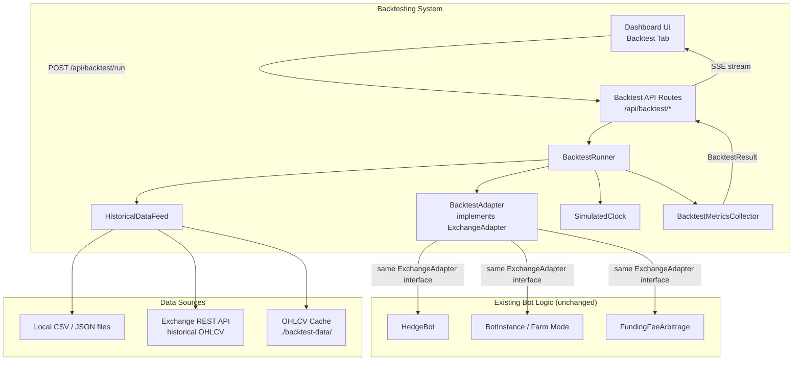
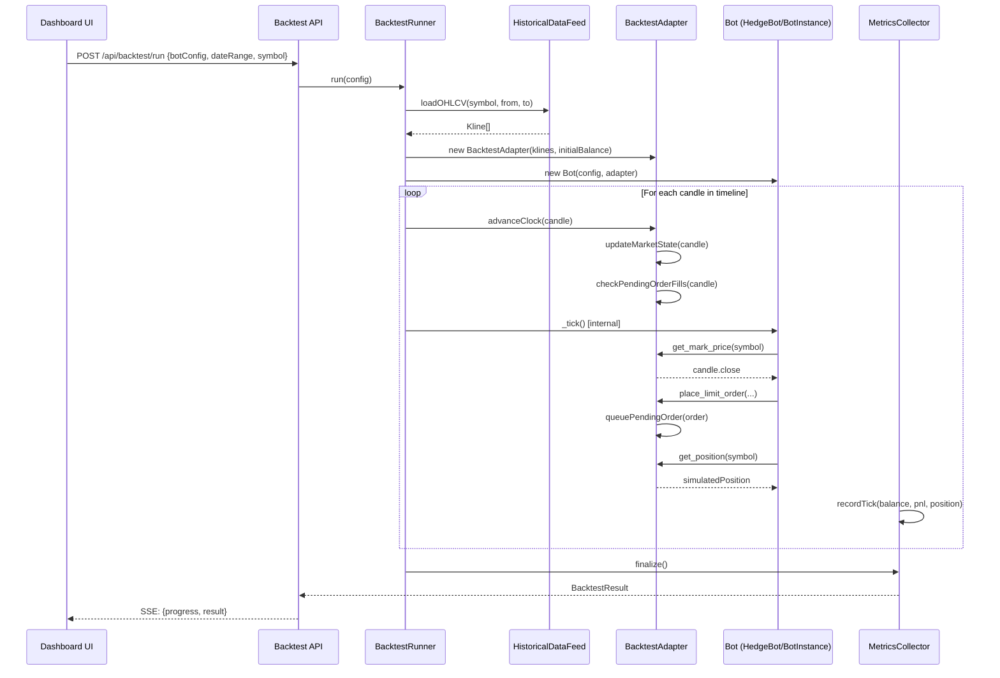
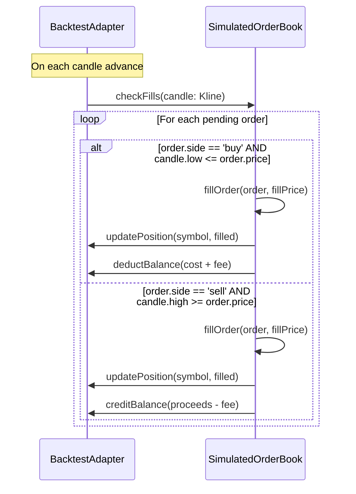

# Design Document: Backtesting / Dry-Run Engine

## Overview

Backtesting cho phép user replay historical OHLCV/trade data qua đúng bot logic hiện tại (HedgeBot, Farm Mode, FundingFeeArbitrage) mà không đặt lệnh thật. Thay vì kết nối exchange thật, engine sẽ inject một `BacktestAdapter` — implement đúng interface `ExchangeAdapter` — để simulate order fills, position tracking, và balance updates dựa trên dữ liệu lịch sử. Kết quả được hiển thị trên dashboard với metrics: PnL, win rate, max drawdown, Sharpe ratio, và trade-by-trade log.

Mục tiêu cốt lõi: **user có thể test strategy trên historical data trước khi bỏ tiền thật**, không cần thay đổi bất kỳ dòng code nào trong bot logic.

---

## Architecture

### High-Level System Diagram



### Key Design Principle

Bot logic (HedgeBot, BotInstance, etc.) **không biết** mình đang chạy backtest hay live. `BacktestAdapter` implement đúng `ExchangeAdapter` interface — đây là điểm cốt lõi của thiết kế. Không cần sửa bất kỳ dòng code nào trong các bot hiện tại.

---

## Sequence Diagrams

### Backtest Execution Flow



### Order Fill Simulation



---

## Components and Interfaces

### Component 1: BacktestAdapter

**Purpose**: Implements `ExchangeAdapter` interface với simulated market state. Là trái tim của toàn bộ hệ thống — thay thế hoàn toàn live adapter mà không cần sửa bot logic.

**Interface**:
```typescript
class BacktestAdapter implements ExchangeAdapter {
  constructor(
    klines: Map<string, Kline[]>,  // symbol → sorted candles
    initialBalance: number,
    config: BacktestAdapterConfig
  )

  // Clock control — called by BacktestRunner
  advanceTo(candle: Kline, symbol: string): void
  
  // ExchangeAdapter methods (simulated)
  get_mark_price(symbol: string): Promise<number>
  get_orderbook(symbol: string): Promise<{ best_bid: number; best_ask: number }>
  place_limit_order(symbol, side, price, size, reduceOnly?): Promise<string>
  cancel_order(orderId: string, symbol: string): Promise<boolean>
  cancel_all_orders(symbol: string): Promise<boolean>
  get_open_orders(symbol: string): Promise<Order[]>
  get_position(symbol: string, markPrice?: number): Promise<Position | null>
  get_balance(): Promise<number>
  get_recent_trades(symbol: string, limit: number): Promise<RawTrade[]>
  get_klines(symbol: string, interval: string, limit: number): Promise<Kline[]>
  
  // Metrics access
  getTradeLog(): SimulatedTrade[]
  getBalanceHistory(): BalanceSnapshot[]
}
```

**Responsibilities**:
- Maintain simulated positions per symbol
- Simulate limit order fills based on candle high/low
- Track balance with fee deduction (maker/taker fee configurable)
- Provide mark price = candle close price
- Provide recent trades from historical kline data

### Component 2: HistoricalDataFeed

**Purpose**: Load và cache OHLCV data từ nhiều nguồn (local files, exchange REST API).

**Interface**:
```typescript
interface HistoricalDataFeed {
  loadKlines(
    symbol: string,
    interval: string,
    from: Date,
    to: Date
  ): Promise<Kline[]>
  
  listAvailableSymbols(): Promise<string[]>
  listAvailableIntervals(): string[]
  getCacheInfo(): CacheInfo
}

class LocalFileFeed implements HistoricalDataFeed { ... }
class ExchangeApiFeed implements HistoricalDataFeed { ... }
class CachedFeed implements HistoricalDataFeed { ... }  // decorator
```

**Responsibilities**:
- Load OHLCV từ CSV/JSON files trong `./backtest-data/`
- Fetch từ exchange REST API nếu không có local data
- Cache fetched data locally để tái sử dụng
- Validate data integrity (no gaps, sorted timestamps)

### Component 3: BacktestRunner

**Purpose**: Orchestrate toàn bộ backtest — setup, tick loop, teardown.

**Interface**:
```typescript
class BacktestRunner {
  constructor(
    config: BacktestRunConfig,
    dataFeed: HistoricalDataFeed,
    onProgress?: (progress: BacktestProgress) => void
  )
  
  async run(): Promise<BacktestResult>
  abort(): void
}
```

**Responsibilities**:
- Instantiate `BacktestAdapter` với historical data
- Instantiate bot (HedgeBot / BotInstance) với adapter
- Drive tick loop: advance clock → call bot._tick() → collect metrics
- Emit progress events via SSE
- Handle abort/cancellation

### Component 4: BacktestMetricsCollector

**Purpose**: Tính toán performance metrics từ trade log và balance history.

**Interface**:
```typescript
class BacktestMetricsCollector {
  recordTick(snapshot: TickSnapshot): void
  recordTrade(trade: SimulatedTrade): void
  finalize(): BacktestResult
}
```

**Responsibilities**:
- Track equity curve (balance over time)
- Compute: total PnL, win rate, max drawdown, Sharpe ratio, profit factor
- Build trade-by-trade log
- Compute per-symbol breakdown

### Component 5: Backtest API Routes

**Purpose**: REST + SSE endpoints cho dashboard.

**Interface**:
```typescript
// POST /api/backtest/run
// GET  /api/backtest/status/:runId
// GET  /api/backtest/result/:runId
// GET  /api/backtest/stream/:runId  (SSE)
// GET  /api/backtest/history        (past results)
// DELETE /api/backtest/:runId       (abort)
```

---

## Data Models

### BacktestRunConfig

```typescript
interface BacktestRunConfig {
  // Bot to test
  botId: string                    // existing bot config ID, OR
  botConfig?: BotConfig | HedgeBotConfig  // inline config override
  
  // Time range
  from: string                     // ISO date: "2024-01-01"
  to: string                       // ISO date: "2024-03-31"
  interval: '1m' | '5m' | '15m' | '1h' | '4h' | '1d'
  
  // Simulation parameters
  initialBalance: number           // USD, e.g. 1000
  makerFeeBps: number              // basis points, e.g. 10 = 0.1%
  takerFeeBps: number              // basis points, e.g. 15 = 0.15%
  slippageBps: number              // simulated slippage, e.g. 5 = 0.05%
  
  // Data source
  dataSource: 'local' | 'exchange_api' | 'auto'
  
  // Speed control
  speedMultiplier?: number         // 1 = real-time sim, 100 = fast, 0 = max speed
}
```

### BacktestResult

```typescript
interface BacktestResult {
  runId: string
  status: 'completed' | 'aborted' | 'error'
  config: BacktestRunConfig
  
  // Summary metrics
  metrics: {
    totalPnl: number               // USD
    totalPnlPercent: number        // %
    winRate: number                // 0-1
    totalTrades: number
    winningTrades: number
    losingTrades: number
    maxDrawdown: number            // USD
    maxDrawdownPercent: number     // %
    sharpeRatio: number
    profitFactor: number           // gross profit / gross loss
    avgTradeReturn: number         // USD per trade
    avgHoldingPeriodSecs: number
    totalFeesPaid: number          // USD
    totalVolume: number            // USD notional
  }
  
  // Time series
  equityCurve: BalanceSnapshot[]   // balance over time
  trades: SimulatedTrade[]         // trade-by-trade log
  
  // Metadata
  startedAt: string
  completedAt: string
  candlesProcessed: number
  durationMs: number
}
```

### SimulatedTrade

```typescript
interface SimulatedTrade {
  id: string
  symbol: string
  side: 'long' | 'short'
  entryPrice: number
  exitPrice: number
  size: number
  entryTime: string              // ISO timestamp
  exitTime: string
  holdingPeriodSecs: number
  grossPnl: number               // before fees
  netPnl: number                 // after fees
  feePaid: number
  exitReason: string             // 'PROFIT_TARGET' | 'MAX_LOSS' | 'TIME_EXPIRY' | 'SIGNAL'
}
```

### BalanceSnapshot

```typescript
interface BalanceSnapshot {
  timestamp: string
  balance: number
  equity: number                 // balance + unrealized PnL
  drawdown: number               // from peak equity
}
```

### BacktestAdapterConfig

```typescript
interface BacktestAdapterConfig {
  makerFeeBps: number
  takerFeeBps: number
  slippageBps: number
  fillMode: 'optimistic' | 'realistic' | 'pessimistic'
  // optimistic: fill at exact limit price
  // realistic: fill at candle close (default)
  // pessimistic: fill with slippage applied
}
```

---

## Algorithmic Pseudocode

### Main Backtest Loop

```typescript
async function runBacktest(config: BacktestRunConfig): Promise<BacktestResult> {
  // Preconditions:
  //   config.from < config.to
  //   config.initialBalance > 0
  //   config.botId references a valid bot config
  
  const klines = await dataFeed.loadKlines(
    config.symbol, config.interval, config.from, config.to
  )
  // Postcondition: klines.length > 0, sorted ascending by timestamp
  
  const adapter = new BacktestAdapter(klines, config.initialBalance, {
    makerFeeBps: config.makerFeeBps,
    takerFeeBps: config.takerFeeBps,
    slippageBps: config.slippageBps,
    fillMode: 'realistic'
  })
  
  const bot = createBot(config.botConfig, adapter)
  await bot.start()
  
  const metrics = new BacktestMetricsCollector()
  
  // Loop invariant: adapter.currentCandleIndex increases monotonically
  for (let i = 0; i < klines.length; i++) {
    const candle = klines[i]
    
    // 1. Advance simulated clock to this candle
    adapter.advanceTo(candle, config.symbol)
    
    // 2. Check if any pending orders fill on this candle
    //    (happens inside advanceTo)
    
    // 3. Drive bot tick — bot calls adapter methods internally
    await bot._tick()  // or equivalent internal tick method
    
    // 4. Collect snapshot
    const balance = await adapter.get_balance()
    const position = await adapter.get_position(config.symbol)
    metrics.recordTick({
      timestamp: new Date(candle.t).toISOString(),
      balance,
      equity: balance + (position?.unrealizedPnl ?? 0),
      candleIndex: i
    })
    
    // 5. Emit progress
    onProgress({ processed: i + 1, total: klines.length, currentBalance: balance })
  }
  
  await bot.stop()
  return metrics.finalize()
  
  // Postconditions:
  //   result.metrics.totalTrades >= 0
  //   result.equityCurve.length == klines.length
  //   result.trades are sorted by entryTime ascending
}
```

### Order Fill Simulation

```typescript
function checkPendingOrderFills(candle: Kline): void {
  // Preconditions:
  //   candle.low <= candle.high
  //   candle.open, close, high, low are all > 0
  
  for (const order of this.pendingOrders) {
    let filled = false
    let fillPrice = order.price
    
    if (order.side === 'buy') {
      // Buy limit fills when price drops to or below limit
      // Loop invariant: candle.low is the lowest price in this period
      if (candle.low <= order.price) {
        filled = true
        fillPrice = applySlippage(order.price, 'buy', this.config.slippageBps)
      }
    } else {
      // Sell limit fills when price rises to or above limit
      if (candle.high >= order.price) {
        filled = true
        fillPrice = applySlippage(order.price, 'sell', this.config.slippageBps)
      }
    }
    
    if (filled) {
      const fee = fillPrice * order.size * (this.config.makerFeeBps / 10000)
      this.applyFill(order, fillPrice, fee)
      this.pendingOrders.delete(order.id)
      this.tradeLog.push(buildTradeRecord(order, fillPrice, fee, candle.t))
    }
  }
  
  // Postconditions:
  //   All filled orders removed from pendingOrders
  //   Positions updated for filled orders
  //   Balance reduced by fees for filled orders
}
```

### Metrics Computation

```typescript
function computeMetrics(trades: SimulatedTrade[], equityCurve: BalanceSnapshot[]): BacktestMetrics {
  // Preconditions:
  //   trades is non-empty array (or empty → return zero metrics)
  //   equityCurve is sorted ascending by timestamp
  
  const winningTrades = trades.filter(t => t.netPnl > 0)
  const losingTrades = trades.filter(t => t.netPnl <= 0)
  
  const totalPnl = trades.reduce((sum, t) => sum + t.netPnl, 0)
  const winRate = trades.length > 0 ? winningTrades.length / trades.length : 0
  
  // Max drawdown: peak-to-trough in equity curve
  // Loop invariant: peakEquity >= all previously seen equity values
  let peakEquity = equityCurve[0]?.equity ?? 0
  let maxDrawdown = 0
  for (const snapshot of equityCurve) {
    if (snapshot.equity > peakEquity) peakEquity = snapshot.equity
    const drawdown = peakEquity - snapshot.equity
    if (drawdown > maxDrawdown) maxDrawdown = drawdown
  }
  
  // Sharpe ratio: (mean daily return) / (std dev daily return) * sqrt(252)
  const dailyReturns = computeDailyReturns(equityCurve)
  const meanReturn = mean(dailyReturns)
  const stdReturn = stdDev(dailyReturns)
  const sharpeRatio = stdReturn > 0 ? (meanReturn / stdReturn) * Math.sqrt(252) : 0
  
  // Profit factor: gross profit / |gross loss|
  const grossProfit = winningTrades.reduce((sum, t) => sum + t.netPnl, 0)
  const grossLoss = Math.abs(losingTrades.reduce((sum, t) => sum + t.netPnl, 0))
  const profitFactor = grossLoss > 0 ? grossProfit / grossLoss : grossProfit > 0 ? Infinity : 0
  
  return {
    totalPnl,
    totalPnlPercent: (totalPnl / equityCurve[0].balance) * 100,
    winRate,
    totalTrades: trades.length,
    winningTrades: winningTrades.length,
    losingTrades: losingTrades.length,
    maxDrawdown,
    maxDrawdownPercent: peakEquity > 0 ? (maxDrawdown / peakEquity) * 100 : 0,
    sharpeRatio,
    profitFactor,
    avgTradeReturn: trades.length > 0 ? totalPnl / trades.length : 0,
    avgHoldingPeriodSecs: mean(trades.map(t => t.holdingPeriodSecs)),
    totalFeesPaid: trades.reduce((sum, t) => sum + t.feePaid, 0),
    totalVolume: trades.reduce((sum, t) => sum + t.entryPrice * t.size * 2, 0)
  }
  
  // Postconditions:
  //   0 <= winRate <= 1
  //   maxDrawdown >= 0
  //   profitFactor >= 0
}
```

---

## Key Functions with Formal Specifications

### BacktestAdapter.advanceTo()

```typescript
advanceTo(candle: Kline, symbol: string): void
```

**Preconditions:**
- `candle.t > this.currentCandle?.t ?? -Infinity` (monotonically increasing time)
- `candle.low <= candle.high`
- `candle.open > 0 && candle.close > 0`

**Postconditions:**
- `this.currentCandle === candle`
- All pending orders whose fill condition is met are removed from `pendingOrders`
- Positions updated for filled orders
- Balance updated for filled orders (deducted fees)
- `this.recentTrades` updated with candle data

**Loop Invariants (order fill loop):**
- `pendingOrders.size` decreases or stays the same each iteration
- `balance` is non-negative after each fill (enforced by risk check)

### BacktestAdapter.place_limit_order()

```typescript
place_limit_order(symbol, side, price, size, reduceOnly?): Promise<string>
```

**Preconditions:**
- `price > 0`
- `size > 0`
- `symbol` is in the loaded klines map

**Postconditions:**
- Returns a unique order ID string
- Order added to `pendingOrders` with status `'pending'`
- No immediate balance change (balance changes on fill)

**Side effects:** None beyond adding to pendingOrders

### BacktestAdapter.get_position()

```typescript
get_position(symbol: string, markPrice?: number): Promise<Position | null>
```

**Preconditions:**
- `symbol` is a valid symbol string

**Postconditions:**
- Returns `null` if no open position for symbol
- Returns `Position` with `unrealizedPnl` computed from `markPrice ?? currentCandle.close`
- `position.size > 0` always (zero-size positions are cleared)

### BacktestMetricsCollector.finalize()

```typescript
finalize(): BacktestResult
```

**Preconditions:**
- At least one `recordTick()` call has been made

**Postconditions:**
- `result.metrics.winRate` ∈ [0, 1]
- `result.metrics.maxDrawdown >= 0`
- `result.equityCurve.length == number of recordTick() calls`
- `result.trades` sorted ascending by `entryTime`
- `result.metrics.totalPnl == sum(result.trades.map(t => t.netPnl))`

---

## Error Handling

### Error Scenario 1: No Historical Data Available

**Condition**: `dataFeed.loadKlines()` returns empty array or throws
**Response**: Return `BacktestResult` with `status: 'error'`, `error: 'No historical data for symbol/range'`
**Recovery**: UI shows error message with suggestion to download data first

### Error Scenario 2: Bot Tick Throws Unhandled Error

**Condition**: Bot's internal `_tick()` throws an exception during backtest loop
**Response**: Log error, skip candle, continue loop (don't abort entire backtest)
**Recovery**: Record error in `BacktestResult.errors[]`, report in UI

### Error Scenario 3: Insufficient Balance for Order

**Condition**: Bot tries to place order but simulated balance < required margin
**Response**: `place_limit_order()` throws `InsufficientBalanceError`
**Recovery**: Bot's existing error handling catches it (same as live trading)

### Error Scenario 4: Backtest Aborted by User

**Condition**: User clicks "Stop" during backtest run
**Response**: `runner.abort()` sets abort flag; loop exits after current candle
**Recovery**: Return partial `BacktestResult` with `status: 'aborted'` and metrics up to abort point

### Error Scenario 5: Data Gap in OHLCV

**Condition**: Missing candles in historical data (exchange downtime, etc.)
**Response**: Log warning, skip gap, continue with next available candle
**Recovery**: Record gap count in `BacktestResult.dataQuality`

---

## Testing Strategy

### Unit Testing Approach

Test each component in isolation with mock dependencies:

- `BacktestAdapter`: verify order fills at correct prices, balance accounting, position tracking
- `BacktestMetricsCollector`: verify metric formulas with known trade sequences
- `HistoricalDataFeed`: verify CSV parsing, caching behavior, data validation
- `BacktestRunner`: verify tick loop drives bot correctly, progress events emitted

### Property-Based Testing Approach

**Property Test Library**: `fast-check` (already in devDependencies)

Key properties to test:

```typescript
// Property 1: Balance conservation
// For any sequence of trades, balance + sum(positions value) == initialBalance + totalPnl
fc.property(fc.array(tradeArbitrary), (trades) => {
  const result = runSimulation(trades)
  expect(result.finalBalance).toBeCloseTo(
    result.initialBalance + result.metrics.totalPnl
  )
})

// Property 2: Win rate bounds
// winRate is always in [0, 1]
fc.property(fc.array(tradeArbitrary), (trades) => {
  const metrics = computeMetrics(trades, [])
  expect(metrics.winRate).toBeGreaterThanOrEqual(0)
  expect(metrics.winRate).toBeLessThanOrEqual(1)
})

// Property 3: Max drawdown non-negative
// maxDrawdown >= 0 for any equity curve
fc.property(fc.array(equitySnapshotArbitrary), (curve) => {
  const metrics = computeMetrics([], curve)
  expect(metrics.maxDrawdown).toBeGreaterThanOrEqual(0)
})

// Property 4: Order fill monotonicity
// Orders placed at time T are never filled before time T
fc.property(klineArbitrary, orderArbitrary, (candle, order) => {
  const adapter = new BacktestAdapter(...)
  adapter.advanceTo(candle, symbol)
  // order placed AFTER candle should not be filled by that candle
  adapter.place_limit_order(...)
  expect(adapter.get_open_orders(symbol)).toHaveLength(1)
})
```

### Integration Testing Approach

- Run full backtest with a known dataset and verify results match hand-calculated expectations
- Test that `HedgeBot` + `BacktestAdapter` produces the same trade decisions as live mode given identical market data
- Test SSE progress stream delivers events in correct order

---

## Performance Considerations

- **Candle processing speed**: Target >10,000 candles/second on a single core. Avoid async I/O inside the tick loop — all market data reads from in-memory state.
- **Memory**: For 1-year of 1m data (~525,600 candles), pre-load all klines into memory (~50MB). For longer ranges, use streaming/chunked loading.
- **Bot tick acceleration**: In backtest mode, bot's `_sleep()` calls are replaced with immediate resolution (no real waiting). `BacktestRunner` controls timing via `speedMultiplier`.
- **Parallel backtests**: Each `BacktestRunner` is stateless — multiple runs can execute concurrently without interference.

---

## Security Considerations

- Backtest runs entirely in-process — no real API keys needed, no real orders placed
- `BacktestRunConfig` is validated server-side before execution (date range limits, balance limits)
- Historical data files are read-only; no user input is written to disk except cached OHLCV data
- SSE streams are scoped per `runId` — users cannot access other users' backtest streams

---

## Dependencies

### New Files to Create

| File | Purpose |
|------|---------|
| `src/backtest/BacktestAdapter.ts` | Core simulated exchange adapter |
| `src/backtest/BacktestRunner.ts` | Orchestrates backtest execution |
| `src/backtest/HistoricalDataFeed.ts` | OHLCV data loading & caching |
| `src/backtest/BacktestMetricsCollector.ts` | Performance metrics computation |
| `src/backtest/types.ts` | All backtest-specific types |
| `src/backtest/index.ts` | Public exports |
| `src/dashboard/routes/backtestRoutes.ts` | API routes for backtest |
| `src/dashboard/views/backtest.ejs` | Dashboard UI tab |

### Existing Files to Modify

| File | Change |
|------|--------|
| `src/dashboard/server.ts` | Register `backtestRoutes` |
| `src/adapters/ExchangeAdapter.ts` | Ensure `get_klines` is in interface (already optional) |
| `src/bot/HedgeBot.ts` | Expose `_tick()` as `protected` or add `tickOnce()` method |
| `src/bot/BotInstance.ts` | Same — expose tick for backtest runner |

### External Dependencies

No new npm packages required. Uses:
- `fast-check` (already in devDependencies) — property-based tests
- `better-sqlite3` (already in dependencies) — optional: store backtest results in SQLite
- Node.js built-in `fs` — read local OHLCV CSV/JSON files

---

## Correctness Properties

*A property is a characteristic or behavior that should hold true across all valid executions of a system — essentially, a formal statement about what the system should do. Properties serve as the bridge between human-readable specifications and machine-verifiable correctness guarantees.*

### Property 1: Balance Conservation

*For any* backtest run with any sequence of simulated trades, the final simulated balance must equal the initial balance plus the sum of all `netPnl` values across all completed trades: `finalBalance = initialBalance + Σ(trade.netPnl)`.

**Validates: Requirements 1.12, 2.6, 5.1**

---

### Property 2: Fill Monotonicity

*For any* order placed by the bot during the processing of candle at index `i`, that order SHALL NOT be filled during the same `advanceTo` call for candle `i`. It may only be filled when `advanceTo` is called for a subsequent candle `j` where `j > i`.

**Validates: Requirements 2.10, 4.2**

---

### Property 3: Position Consistency

*For any* symbol `s` at any point during a backtest, a non-null position with `size > 0` exists in the adapter's position map if and only if `s` is in the set of open positions. Zero-size positions are always cleared.

**Validates: Requirements 1.10, 1.11, 2.7**

---

### Property 4: Win Rate Bounds

*For any* set of `SimulatedTrade` records (including the empty set), the computed `winRate` must satisfy `0 ≤ winRate ≤ 1`.

**Validates: Requirements 5.2, 5.3**

---

### Property 5: Drawdown Non-Negative

*For any* equity curve (sequence of `BalanceSnapshot` records), the computed `maxDrawdown` must be greater than or equal to 0.

**Validates: Requirements 5.4**

---

### Property 6: Trade Log Completeness

*For any* order that is filled during a backtest simulation, there exists exactly one corresponding `SimulatedTrade` record in `result.trades`. No filled order is missing from the log, and no unfilled order appears in the log.

**Validates: Requirements 2.9, 2.8**

---

### Property 7: Adapter Transparency

*For any* bot instance `b` and any sequence of market candles, the sequence of exchange method calls made by `b` when using `BacktestAdapter` is identical to the sequence it would make when using a live adapter given the same market data. The bot cannot distinguish between the two adapters.

**Validates: Requirements 1.1, 11.4**

---

### Property 8: Fee Accounting

*For any* `SimulatedTrade` record `t`, the `netPnl` must equal `grossPnl - feePaid`: `t.netPnl = t.grossPnl - t.feePaid`. This must hold for every trade in every backtest run.

**Validates: Requirements 2.6, 5.10**

---

### Property 9: Mark Price Equals Candle Close

*For any* candle advanced to via `advanceTo(candle, symbol)`, a subsequent call to `get_mark_price(symbol)` must return exactly `candle.close`.

**Validates: Requirements 1.2**

---

### Property 10: Kline Sort and Range Invariant

*For any* call to `HistoricalDataFeed.loadKlines(symbol, interval, from, to)` that returns a non-empty array, the returned klines must be sorted in strictly ascending order by timestamp, and every kline's timestamp must fall within the `[from, to]` range.

**Validates: Requirements 3.4, 3.5**

---

### Property 11: Equity Curve Length Invariant

*For any* backtest run over `N` candles, the `result.equityCurve` must contain exactly `N` entries — one per candle processed — in the same chronological order as the candles.

**Validates: Requirements 4.3, 5.9**
