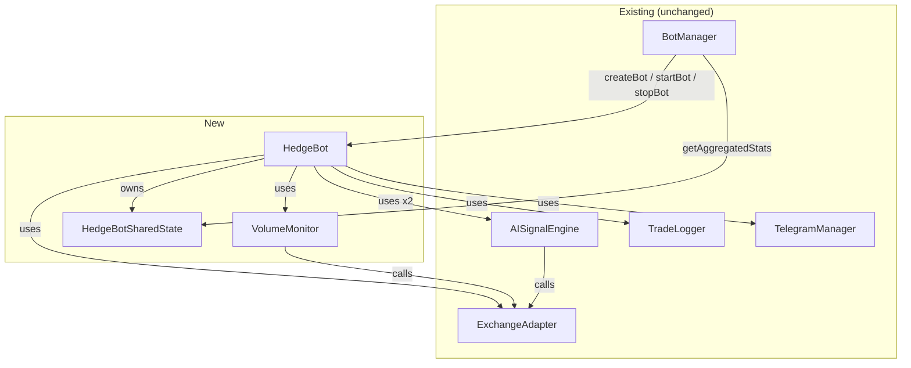

# Design Document: Correlation Hedging Bot

## Overview

The Correlation Hedging Bot (`HedgeBot`) is a new bot type that trades two correlated assets (BTC and ETH) simultaneously on the same exchange in opposite directions. One leg goes long while the other goes short, with equal USD notional value on each side. The goal is to capture divergence between the two assets while remaining approximately delta-neutral.

The design introduces a `HedgeBot` class that mirrors the `BotInstance` lifecycle interface so it integrates with the existing `BotManager` without any modification to that class. A `VolumeMonitor` component handles dual-asset volume spike detection. The existing `AISignalEngine`, `ExchangeAdapter`, and `TradeLogger` are reused directly.

### Key Design Decisions

- **No BotManager modification**: `HedgeBot` implements the same duck-typed interface as `BotInstance` (`start()`, `stop()`, `getStatus()`, `state`). `BotManager` stores it as a `BotInstance` via a union type or interface extension.
- **Single-exchange, dual-symbol**: Both legs use the same `ExchangeAdapter` instance. The config stores `symbolA` and `symbolB` as separate fields so a future cross-exchange mode can split them across two adapters without a schema change.
- **Atomic pair semantics**: Entry and exit always operate on both legs together via `Promise.all`. A single-leg failure triggers cancellation of the other leg.
- **Separate monitoring loop**: `HedgeBot` runs its own tick loop (similar to `Watcher`) rather than reusing `Watcher`, because the state machine is fundamentally different (pair state vs. single-position state).

---

## Architecture



### State Machine

The `HedgeBot` runs a five-state machine:

```
IDLE ──entry triggered──► OPENING ──both filled──► IN_PAIR
  ▲                           │                       │
  │                     one leg failed                │ exit condition met
  │                           │                       ▼
  │                        IDLE ◄──────────────── CLOSING
  │                                                   │
  └──────────── cooldown expired ──── COOLDOWN ◄──────┘
```

- **IDLE**: Monitoring volume. Evaluates entry on each tick.
- **OPENING**: Both leg orders placed; waiting for fills. Cancels and returns to IDLE if either leg fails.
- **IN_PAIR**: Both legs filled. Evaluates exit conditions on each tick.
- **CLOSING**: AtomicClose in progress. Retries failed close orders up to 3 times.
- **COOLDOWN**: Post-close cooldown before next entry evaluation.

---

## Components and Interfaces

### HedgeBotConfig

Extends the base config schema. Stored in `bot-configs.json` alongside standard `BotConfig` entries.

```typescript
interface HedgeBotConfig {
  // Identity (same as BotConfig)
  id: string;
  name: string;
  botType: 'hedge';                          // discriminant field
  exchange: 'sodex' | 'dango' | 'decibel';
  tags: string[];
  autoStart: boolean;
  credentialKey: string;
  tradeLogBackend: 'json' | 'sqlite';
  tradeLogPath: string;

  // Hedge-specific
  symbolA: string;                           // e.g. "BTC-USD"
  symbolB: string;                           // e.g. "ETH-USD"
  legValueUsd: number;                       // USD notional per leg
  holdingPeriodSecs: number;                 // max hold time before TIME_EXPIRY
  profitTargetUsd: number;                   // CombinedPnL threshold for PROFIT_TARGET
  maxLossUsd: number;                        // CombinedPnL threshold for MAX_LOSS
  volumeSpikeMultiplier: number;             // e.g. 2.0 = 2× rolling average
  volumeRollingWindow: number;               // number of samples in rolling window
  fundingRateWeight: number;                 // 0–1, weight for funding rate adjustment
  cooldownSecs?: number;                     // post-close cooldown (default: 30)
}
```

**Config loader changes**: `loadBotConfigs` will be extended to detect `botType: "hedge"` and call `validateHedgeBotConfig` instead of `validateBotConfig`. The `bot.ts` bootstrap will call `botManager.createHedgeBot(config, adapter, telegram)` for hedge configs.

### HedgeBot

Located at `src/bot/HedgeBot.ts`. Implements the same duck-typed interface as `BotInstance`.

```typescript
class HedgeBot {
  readonly id: string;
  readonly config: HedgeBotConfig;
  readonly state: HedgeBotSharedState;

  constructor(config: HedgeBotConfig, adapter: ExchangeAdapter, telegram: TelegramManager)

  async start(): Promise<boolean>
  async stop(): Promise<void>
  getStatus(): HedgeBotStatus          // BotStatus-compatible + hedgePosition field
}
```

`BotManager` will be extended with an overloaded `createBot` that accepts `HedgeBotConfig` and returns a `HedgeBot`. The registry type changes from `Map<string, BotInstance>` to `Map<string, BotInstance | HedgeBot>`. `getAllBots()` returns `(BotInstance | HedgeBot)[]`. This is the only change to `BotManager`.

### VolumeMonitor

Located at `src/bot/VolumeMonitor.ts`. A pure, stateful component with no external dependencies beyond `ExchangeAdapter`.

```typescript
class VolumeMonitor {
  constructor(
    private adapter: ExchangeAdapter,
    private symbolA: string,
    private symbolB: string,
    private windowSize: number,
    private spikeMultiplier: number,
  )

  // Fetch latest volume sample for both symbols and update rolling windows
  async sample(): Promise<void>

  // Returns true only when both windows are full AND both show a spike
  shouldEnter(): boolean

  // Exposed for testing
  getWindowA(): number[]
  getWindowB(): number[]
  getRollingAverageA(): number
  getRollingAverageB(): number
}
```

Volume is sampled by calling `adapter.get_recent_trades(symbol, limit)` and summing `trade.size` values. The rolling window is a fixed-length FIFO array: when full, the oldest element is shifted out before the new one is pushed.

### HedgeBotSharedState

Located at `src/bot/HedgeBotSharedState.ts`. Extends `BotSharedState` with hedge-specific fields.

```typescript
interface LegState {
  symbol: string;
  side: 'long' | 'short';
  size: number;
  entryPrice: number;
  unrealizedPnl: number;
}

interface ActiveLegPair {
  legA: LegState;
  legB: LegState;
  entryTimestamp: string;
  combinedPnl: number;
}

interface HedgeBotSharedState extends BotSharedState {
  hedgePosition: ActiveLegPair | null;
  hedgeBotState: 'IDLE' | 'OPENING' | 'IN_PAIR' | 'CLOSING' | 'COOLDOWN';
}
```

### HedgeBotStatus

```typescript
interface HedgeBotStatus {
  // All BotStatus fields
  id: string;
  name: string;
  exchange: string;
  status: 'active' | 'inactive';
  symbol: string;          // set to "symbolA/symbolB" for display
  tags: string[];
  sessionPnl: number;
  sessionVolume: number;
  sessionFees: number;
  efficiencyBps: number;
  walletAddress: string;
  uptime: number;
  hasPosition: boolean;
  openPosition: null;      // always null (hedge uses hedgePosition instead)
  progress: number;

  // Hedge-specific extension
  hedgePosition: ActiveLegPair | null;
}
```

### HedgeTradeRecord

A new log record type for hedge trades, written via `TradeLogger`. Stored as a JSON line in the configured `tradeLogPath`.

```typescript
interface HedgeTradeRecord {
  id: string;
  botId: string;
  timestamp: string;        // exit time (ISO 8601)
  exchange: string;
  symbolA: string;
  symbolB: string;
  legValueUsd: number;
  entryPriceA: number;
  entryPriceB: number;
  exitPriceA: number;
  exitPriceB: number;
  sizeA: number;
  sizeB: number;
  pnlA: number;
  pnlB: number;
  combinedPnl: number;
  holdDurationSecs: number;
  exitReason: 'PROFIT_TARGET' | 'MAX_LOSS' | 'MEAN_REVERSION' | 'TIME_EXPIRY' | 'FORCE';
  entryTimestamp: string;
  exitTimestamp: string;
  signalScoreA: number;
  signalScoreB: number;
  longSymbol: string;
  shortSymbol: string;
}
```

---

## Data Models

### Rolling Window

The `VolumeMonitor` maintains two independent rolling windows, one per symbol:

```
windowA: number[]   // length ≤ volumeRollingWindow
windowB: number[]   // length ≤ volumeRollingWindow
```

A window is "full" when `window.length === volumeRollingWindow`. The rolling average is `sum(window) / window.length`. A spike is detected when `currentVolume > rollingAverage * spikeMultiplier`.

### LegPair Lifecycle

```
null (no active pair)
  → ActiveLegPair (both legs filled, IN_PAIR state)
    → null (AtomicClose confirmed, COOLDOWN/IDLE state)
```

Only one `ActiveLegPair` can exist at a time. The `HedgeBot` is strictly single-pair.

### Equilibrium Spread

The `EquilibriumSpread` is the rolling mean of the BTC/ETH price ratio over the last `volumeRollingWindow` samples. It is computed from the mark prices fetched on each tick:

```
ratioSamples: number[]   // rolling window of (markPriceA / markPriceB)
equilibriumSpread = mean(ratioSamples)
currentRatio = markPriceA / markPriceB
meanReversionTriggered = |currentRatio - equilibriumSpread| / equilibriumSpread < 0.005
```

### Funding Rate Adjustment

When `fundingRateWeight > 0`, the `HedgeBot` fetches funding rates for both symbols via the adapter (duck-typed: if the adapter exposes `get_funding_rate(symbol)`, it is called; otherwise the adjustment is skipped). The adjusted score is:

```
adjustedScore = signal.score + fundingRate * fundingRateWeight
```

Direction assignment uses `adjustedScore` instead of `signal.score`.

---

## Correctness Properties

*A property is a characteristic or behavior that should hold true across all valid executions of a system — essentially, a formal statement about what the system should do. Properties serve as the bridge between human-readable specifications and machine-verifiable correctness guarantees.*

### Property 1: Config round-trip serialization

*For any* valid `HedgeBotConfig` object, serializing it to JSON and deserializing it back should produce an object equal to the original.

**Validates: Requirements 1.5**

---

### Property 2: Config validation rejects missing required fields

*For any* required field in `HedgeBotConfig`, a config object missing that field should cause `validateHedgeBotConfig` to throw an error whose message names the missing field.

**Validates: Requirements 1.4**

---

### Property 3: getStatus always returns all required fields

*For any* `HedgeBot` state (running or stopped, with or without active pair), `getStatus()` should return an object containing all required fields: `id`, `name`, `exchange`, `status`, `tags`, `sessionPnl`, `sessionVolume`, `uptime`, and `hedgePosition`.

**Validates: Requirements 2.2**

---

### Property 4: BotManager aggregated stats include HedgeBot contributions

*For any* collection of bots registered with `BotManager` (including `HedgeBot` instances), `getAggregatedStats().totalPnl` should equal the arithmetic sum of `sessionPnl` across all registered bots.

**Validates: Requirements 2.4**

---

### Property 5: Rolling window never exceeds configured size

*For any* sequence of volume samples added to a `VolumeMonitor`, the internal rolling window for each symbol should never contain more than `volumeRollingWindow` elements, and should always contain the most recently added samples.

**Validates: Requirements 3.1, 3.2**

---

### Property 6: Volume spike detection formula

*For any* rolling window of volume samples and any current volume value, `VolumeMonitor.shouldEnter()` should return `true` only when `currentVolumeA > mean(windowA) * spikeMultiplier` AND `currentVolumeB > mean(windowB) * spikeMultiplier` AND both windows are full.

**Validates: Requirements 3.3, 3.4, 3.5**

---

### Property 7: Direction assignment follows signal score ordering

*For any* two signals where `scoreA ≠ scoreB` (after funding rate adjustment), the symbol with the higher adjusted score should always be assigned the `LongLeg` and the symbol with the lower adjusted score should always be assigned the `ShortLeg`.

**Validates: Requirements 4.2, 4.3**

---

### Property 8: Leg size computation

*For any* `legValueUsd` and `markPrice > 0`, the computed leg size should equal `legValueUsd / markPrice` within floating-point precision.

**Validates: Requirements 5.1**

---

### Property 9: Leg value equality invariant

*For any* `legValueUsd` and two mark prices `markPriceA` and `markPriceB`, the computed leg values `sizeA * markPriceA` and `sizeB * markPriceB` should differ by no more than 1% of `legValueUsd`.

**Validates: Requirements 5.3, 8.1**

---

### Property 10: Exit condition priority ordering

*For any* `HedgeBot` state where multiple exit conditions are simultaneously true, the exit reason returned by the exit evaluator should be the highest-priority condition: `MAX_LOSS` > `PROFIT_TARGET` > `MEAN_REVERSION` > `TIME_EXPIRY`.

**Validates: Requirements 6.6**

---

### Property 11: Mean reversion trigger threshold

*For any* current BTC/ETH price ratio and equilibrium spread, the mean reversion trigger should fire if and only if `|currentRatio - equilibriumSpread| / equilibriumSpread < 0.005`.

**Validates: Requirements 6.5**

---

### Property 12: CombinedPnL arithmetic identity

*For any* two leg unrealized PnL values `pnlA` and `pnlB`, `combinedPnl` should equal `pnlA + pnlB` within floating-point precision.

**Validates: Requirements 8.3, 8.4**

---

### Property 13: Trade log record completeness

*For any* completed `AtomicClose`, the `HedgeTradeRecord` written to the trade log should contain all required fields: `botId`, `exchange`, `symbolA`, `symbolB`, `legValueUsd`, `entryPriceA`, `entryPriceB`, `exitPriceA`, `exitPriceB`, `pnlA`, `pnlB`, `combinedPnl`, `holdDurationSecs`, `exitReason`, `entryTimestamp`, and `exitTimestamp`.

**Validates: Requirements 7.5, 9.2**

---

## Error Handling

### Entry Failures

| Scenario | Behavior |
|---|---|
| One leg placement fails | Cancel the successfully placed leg; log error; return to IDLE |
| Both leg placements fail | Log error; return to IDLE |
| Signal engine throws | Skip entry; log error; remain IDLE |
| Volume monitor sample fails | Log warning; skip tick; remain IDLE |

### Close Failures

| Scenario | Behavior |
|---|---|
| One close order fails | Retry up to 3 times with exponential backoff (1s, 2s, 4s) |
| Both close orders fail | Log critical error; remain in CLOSING state; alert via Telegram |
| Position not flat after close | Poll `get_position` up to 5 times (1s interval); log warning if still open |

### Imbalance Detection

After both legs fill, the `HedgeBot` computes `|legValueA - legValueB| / legValueUsd`. If this exceeds 0.01 (1%), a warning is logged with the actual values and deviation percentage. The position is **not** aborted — the bot continues managing it and records the imbalance in the trade log.

### Stop with Open Positions

When `stop()` is called while a `LegPair` is active, the `HedgeBot` logs a warning:
```
[HedgeBot:{id}] WARNING: Stopped with active LegPair. Positions remain open: {symbolA} {sideA}, {symbolB} {sideB}
```
No close orders are placed. This matches the existing `BotInstance.stop()` behavior.

---

## Testing Strategy

### Unit Tests

Located at `src/bot/__tests__/HedgeBot.test.ts` and `src/bot/__tests__/VolumeMonitor.test.ts`.

Focus areas:
- `VolumeMonitor` rolling window mechanics (add, overflow, average, spike detection)
- Direction assignment logic (score comparison, funding rate adjustment, tie/skip handling)
- Exit condition evaluation (each trigger, priority ordering)
- `CombinedPnL` computation
- `HedgeTradeRecord` field completeness
- Error paths: one-leg failure, signal engine error, close retry logic

### Property-Based Tests

Located at `src/bot/__tests__/HedgeBot.properties.test.ts`.

Uses [fast-check](https://github.com/dubzzz/fast-check) (already used in the codebase for other property tests).

Each property test runs a minimum of 100 iterations.

**Property 1 — Config round-trip:**
```typescript
// Feature: correlation-hedging-bot, Property 1: Config round-trip serialization
fc.assert(fc.property(arbitraryHedgeBotConfig(), (config) => {
  const serialized = JSON.stringify(config);
  const deserialized = JSON.parse(serialized);
  expect(deserialized).toEqual(config);
}), { numRuns: 100 });
```

**Property 2 — Config validation rejects missing fields:**
```typescript
// Feature: correlation-hedging-bot, Property 2: Config validation rejects missing required fields
fc.assert(fc.property(arbitraryRequiredField(), (field) => {
  const config = validHedgeBotConfig();
  delete config[field];
  expect(() => validateHedgeBotConfig(config)).toThrow(field);
}), { numRuns: 100 });
```

**Property 5 — Rolling window size invariant:**
```typescript
// Feature: correlation-hedging-bot, Property 5: Rolling window never exceeds configured size
fc.assert(fc.property(fc.array(fc.float({ min: 0 })), fc.integer({ min: 1, max: 50 }), (samples, windowSize) => {
  const monitor = new VolumeMonitor(mockAdapter, 'A', 'B', windowSize, 2.0);
  for (const s of samples) monitor._addSampleA(s);
  expect(monitor.getWindowA().length).toBeLessThanOrEqual(windowSize);
  if (samples.length > 0) {
    expect(monitor.getWindowA()[monitor.getWindowA().length - 1]).toBe(samples[samples.length - 1]);
  }
}), { numRuns: 200 });
```

**Property 6 — Volume spike detection formula:**
```typescript
// Feature: correlation-hedging-bot, Property 6: Volume spike detection formula
fc.assert(fc.property(
  fc.array(fc.float({ min: 1 }), { minLength: 5, maxLength: 20 }),
  fc.array(fc.float({ min: 1 }), { minLength: 5, maxLength: 20 }),
  fc.float({ min: 0.1 }), fc.float({ min: 0.1 }), fc.float({ min: 1.1, max: 5 }),
  (windowA, windowB, currentA, currentB, multiplier) => {
    const avgA = windowA.reduce((a, b) => a + b, 0) / windowA.length;
    const avgB = windowB.reduce((a, b) => a + b, 0) / windowB.length;
    const expectedSpike = currentA > avgA * multiplier && currentB > avgB * multiplier;
    // ... set up monitor with full windows and check shouldEnter()
    expect(result).toBe(expectedSpike);
  }
), { numRuns: 200 });
```

**Property 7 — Direction assignment:**
```typescript
// Feature: correlation-hedging-bot, Property 7: Direction assignment follows signal score ordering
fc.assert(fc.property(
  fc.float({ min: 0, max: 1 }), fc.float({ min: 0, max: 1 }),
  fc.filter((a, b) => Math.abs(a - b) > 0.001),
  (scoreA, scoreB) => {
    const { longSymbol, shortSymbol } = assignDirections('A', scoreA, 'B', scoreB);
    if (scoreA > scoreB) {
      expect(longSymbol).toBe('A');
      expect(shortSymbol).toBe('B');
    } else {
      expect(longSymbol).toBe('B');
      expect(shortSymbol).toBe('A');
    }
  }
), { numRuns: 200 });
```

**Property 9 — Leg value equality invariant:**
```typescript
// Feature: correlation-hedging-bot, Property 9: Leg value equality invariant
fc.assert(fc.property(
  fc.float({ min: 10, max: 10000 }),
  fc.float({ min: 100, max: 100000 }),
  fc.float({ min: 10, max: 10000 }),
  (legValueUsd, markPriceA, markPriceB) => {
    const sizeA = legValueUsd / markPriceA;
    const sizeB = legValueUsd / markPriceB;
    const legValueA = sizeA * markPriceA;
    const legValueB = sizeB * markPriceB;
    const deviation = Math.abs(legValueA - legValueB) / legValueUsd;
    expect(deviation).toBeLessThanOrEqual(0.01);
  }
), { numRuns: 500 });
```

**Property 10 — Exit priority ordering:**
```typescript
// Feature: correlation-hedging-bot, Property 10: Exit condition priority ordering
fc.assert(fc.property(arbitraryExitConditionSet(), (conditions) => {
  const result = evaluateExitConditions(conditions);
  if (conditions.maxLossHit) expect(result.reason).toBe('MAX_LOSS');
  else if (conditions.profitTargetHit) expect(result.reason).toBe('PROFIT_TARGET');
  else if (conditions.meanReversionHit) expect(result.reason).toBe('MEAN_REVERSION');
  else if (conditions.timeExpired) expect(result.reason).toBe('TIME_EXPIRY');
  else expect(result.shouldExit).toBe(false);
}), { numRuns: 200 });
```

**Property 12 — CombinedPnL arithmetic identity:**
```typescript
// Feature: correlation-hedging-bot, Property 12: CombinedPnL arithmetic identity
fc.assert(fc.property(fc.float(), fc.float(), (pnlA, pnlB) => {
  expect(computeCombinedPnl(pnlA, pnlB)).toBeCloseTo(pnlA + pnlB, 10);
}), { numRuns: 500 });
```

**Property 13 — Trade log record completeness:**
```typescript
// Feature: correlation-hedging-bot, Property 13: Trade log record completeness
fc.assert(fc.property(arbitraryCompletedTrade(), (trade) => {
  const record = buildHedgeTradeRecord(trade);
  const requiredFields = ['botId', 'exchange', 'symbolA', 'symbolB', 'legValueUsd',
    'entryPriceA', 'entryPriceB', 'exitPriceA', 'exitPriceB', 'pnlA', 'pnlB',
    'combinedPnl', 'holdDurationSecs', 'exitReason', 'entryTimestamp', 'exitTimestamp'];
  for (const field of requiredFields) {
    expect(record).toHaveProperty(field);
    expect(record[field]).not.toBeUndefined();
  }
}), { numRuns: 100 });
```

### Integration Tests

Located at `src/bot/__tests__/HedgeBot.integration.test.ts`.

Uses mock adapters to verify end-to-end flows:
- Full entry → fill → exit cycle with each exit reason
- One-leg failure during entry (verify cancellation)
- Close retry with exponential backoff
- Stop with open positions (verify no close orders)
- BotManager aggregation with mixed bot types

### Dashboard Compatibility

The existing dashboard routes iterate `botManager.getAllBots()` and call `bot.getStatus()`. Since `HedgeBotStatus` is a superset of `BotStatus`, existing dashboard templates will render the standard fields correctly. The `hedgePosition` field will be ignored by templates that don't know about it, and can be used by a future hedge-specific dashboard partial.
