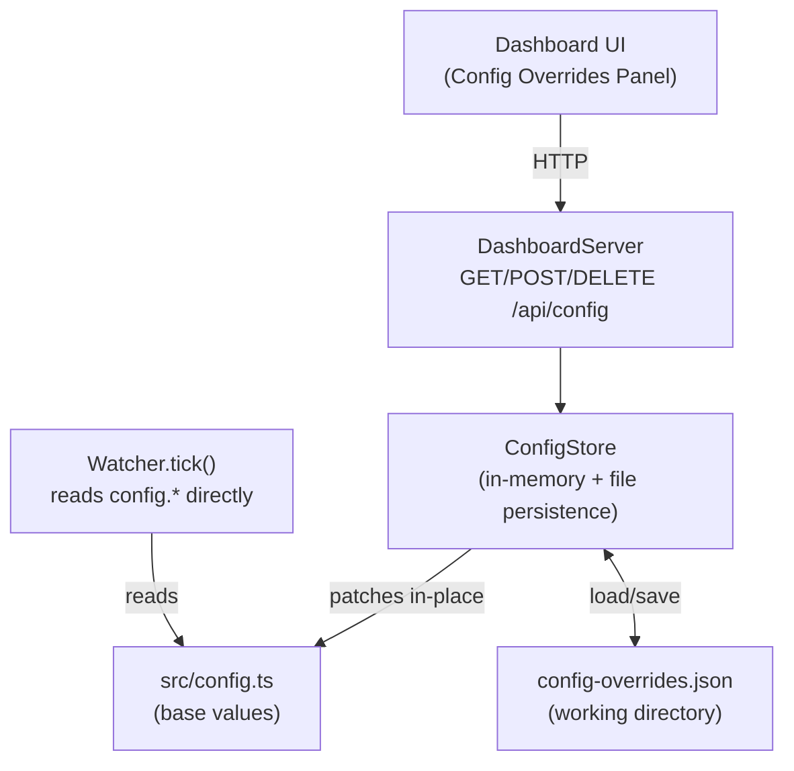

# Design Document: dashboard-config-override

## Overview

This feature adds a runtime config override layer to the APEX trading bot. Operators can read, modify, and reset key trading parameters (order sizing, risk management, farm/trade mode exit rules, cooldown) directly from the dashboard UI without SSH access or bot restarts.

The design introduces a `ConfigStore` singleton that sits between `src/config.ts` (base values) and the bot's runtime logic. The `Watcher` already reads `config.*` directly on each tick, so the store patches the live `config` object in-place — no changes to `Watcher` are needed. Three new REST endpoints (`GET/POST/DELETE /api/config`) are added to `DashboardServer`, and a "Config Overrides" panel is injected into the existing dashboard HTML.

---

## Architecture



The `ConfigStore` is the single source of truth for overrides. On `applyOverrides()` it writes values directly onto the exported `config` object, so `Watcher` picks them up on the next tick with zero changes to the bot loop.

---

## Components and Interfaces

### ConfigStore (`src/config/ConfigStore.ts`)

```typescript
export type OverridableConfig = {
  ORDER_SIZE_MIN: number;
  ORDER_SIZE_MAX: number;
  STOP_LOSS_PERCENT: number;
  TAKE_PROFIT_PERCENT: number;
  POSITION_SL_PERCENT: number;
  FARM_MIN_HOLD_SECS: number;
  FARM_MAX_HOLD_SECS: number;
  FARM_TP_USD: number;
  FARM_SL_PERCENT: number;
  TRADE_TP_PERCENT: number;
  TRADE_SL_PERCENT: number;
  COOLDOWN_MIN_MINS: number;
  COOLDOWN_MAX_MINS: number;
};

export type PartialOverride = Partial<OverridableConfig>;

export interface ConfigStoreInterface {
  /** Returns the current effective values (base merged with overrides). */
  getEffective(): OverridableConfig;
  /** Validates and applies a partial override. Throws ValidationError on failure. */
  applyOverrides(patch: PartialOverride): void;
  /** Clears all overrides, restoring base config values. */
  resetToDefaults(): void;
  /** Loads persisted overrides from disk (called at startup). */
  loadFromDisk(): void;
}
```

Key design decisions:
- `applyOverrides` mutates the live `config` object in-place so `Watcher` picks up changes on the next tick without any coupling changes.
- Validation runs before any mutation — either all submitted values pass or none are applied.
- `loadFromDisk` is called once at bot startup (in `src/bot.ts`) before the first tick.

### Validation (`src/config/validateOverrides.ts`)

A pure function that takes a `PartialOverride` plus the current effective config (for cross-field checks) and returns a list of `ValidationError` objects. No side effects.

```typescript
export interface ValidationError {
  field: string;
  message: string;
}

export function validateOverrides(
  patch: PartialOverride,
  effective: OverridableConfig
): ValidationError[];
```

### API Routes (added to `DashboardServer._setupRoutes`)

| Method | Path | Auth | Description |
|--------|------|------|-------------|
| GET | `/api/config` | Required | Returns current effective config |
| POST | `/api/config` | Required | Applies partial override |
| DELETE | `/api/config` | Required | Resets all overrides to base |

All three routes reuse the existing `_authMiddleware` — no new auth logic needed.

---

## Data Models

### Effective Config Response (GET / POST 200 / DELETE 200)

```json
{
  "ORDER_SIZE_MIN": 0.003,
  "ORDER_SIZE_MAX": 0.005,
  "STOP_LOSS_PERCENT": 0.05,
  "TAKE_PROFIT_PERCENT": 0.05,
  "POSITION_SL_PERCENT": 0.05,
  "FARM_MIN_HOLD_SECS": 120,
  "FARM_MAX_HOLD_SECS": 600,
  "FARM_TP_USD": 1.0,
  "FARM_SL_PERCENT": 0.05,
  "TRADE_TP_PERCENT": 0.10,
  "TRADE_SL_PERCENT": 0.10,
  "COOLDOWN_MIN_MINS": 2,
  "COOLDOWN_MAX_MINS": 10
}
```

### POST /api/config Request Body

Partial — any subset of the keys above. Unknown keys are ignored. Empty body returns HTTP 400.

### Validation Error Response (HTTP 400)

```json
{
  "errors": [
    { "field": "ORDER_SIZE_MIN", "message": "Must be a positive number" },
    { "field": "ORDER_SIZE_MIN", "message": "Must be less than ORDER_SIZE_MAX (0.005)" }
  ]
}
```

### config-overrides.json (persistence file)

Same shape as the effective config response — a flat JSON object containing only the keys that have been overridden. Missing keys fall back to base config.

```json
{
  "FARM_TP_USD": 2.0,
  "COOLDOWN_MIN_MINS": 5
}
```

---

## Correctness Properties

*A property is a characteristic or behavior that should hold true across all valid executions of a system — essentially, a formal statement about what the system should do. Properties serve as the bridge between human-readable specifications and machine-verifiable correctness guarantees.*

### Property 1: Effective config reflects overrides

*For any* partial override containing valid values, after `applyOverrides(patch)` is called, `getEffective()` SHALL return the patched values for all keys present in the patch, and the original base values for all keys not present in the patch.

**Validates: Requirements 1.2, 1.3, 2.2, 2.5**

### Property 2: Validation rejects invalid order sizing

*For any* submitted `ORDER_SIZE_MIN` or `ORDER_SIZE_MAX` that is not a positive number, or where `ORDER_SIZE_MIN >= ORDER_SIZE_MAX` (considering the effective value of the other field), `validateOverrides` SHALL return at least one error and `applyOverrides` SHALL leave the config unchanged.

**Validates: Requirements 3.1, 3.2**

### Property 3: Validation rejects out-of-range percent parameters

*For any* submitted percent-based parameter (`STOP_LOSS_PERCENT`, `TAKE_PROFIT_PERCENT`, `POSITION_SL_PERCENT`, `FARM_SL_PERCENT`, `TRADE_TP_PERCENT`, `TRADE_SL_PERCENT`) that is not in the range (0, 1], `validateOverrides` SHALL return at least one error and `applyOverrides` SHALL leave the config unchanged.

**Validates: Requirements 3.3**

### Property 4: Validation rejects invalid range pairs

*For any* submitted pair where `FARM_MIN_HOLD_SECS >= FARM_MAX_HOLD_SECS` or `COOLDOWN_MIN_MINS >= COOLDOWN_MAX_MINS`, `validateOverrides` SHALL return at least one error and `applyOverrides` SHALL leave the config unchanged.

**Validates: Requirements 3.4, 3.6**

### Property 5: Reset restores base config

*For any* sequence of `applyOverrides` calls followed by `resetToDefaults`, `getEffective()` SHALL return values identical to the original base config values from `src/config.ts`.

**Validates: Requirements 4.2**

### Property 6: Persistence round-trip

*For any* valid set of overrides applied via `applyOverrides`, serializing to disk and then loading via `loadFromDisk` on a fresh `ConfigStore` instance SHALL produce an effective config identical to the one before serialization.

**Validates: Requirements 6.1, 6.2**

### Property 7: Invalid persisted values are discarded individually

*For any* `config-overrides.json` that contains a mix of valid and invalid values, `loadFromDisk` SHALL apply all valid values and discard only the invalid ones, leaving the effective config equal to base config merged with only the valid stored overrides.

**Validates: Requirements 6.4**

---

## Error Handling

| Scenario | Behaviour |
|----------|-----------|
| POST with empty body or no recognised keys | HTTP 400 `{ errors: [{ field: '*', message: '...' }] }` |
| POST with one or more invalid values | HTTP 400 `{ errors: [...] }` — no partial application |
| Unauthenticated request to any `/api/config` route | HTTP 401 (existing `_authMiddleware`) |
| `config-overrides.json` missing at startup | Log info, start with no overrides |
| `config-overrides.json` contains invalid JSON | Log warning, start with no overrides |
| Individual stored value fails validation at startup | Log warning per field, skip that field, apply the rest |
| File write failure on `applyOverrides` / `resetToDefaults` | Log error, continue — in-memory state is still updated |

---

## Testing Strategy

### Unit Tests

- `validateOverrides` — example-based tests for each validation rule (positive numbers, range checks, cross-field checks)
- `ConfigStore.getEffective` — verify base values returned when no overrides set
- `ConfigStore.applyOverrides` — verify partial patch merges correctly
- `ConfigStore.resetToDefaults` — verify config returns to base after overrides
- `ConfigStore.loadFromDisk` — verify missing file, invalid JSON, and mixed valid/invalid values
- API routes — verify HTTP 400/401/200 responses with mock `ConfigStore`

### Property-Based Tests

Using [fast-check](https://github.com/dubzzz/fast-check) (already available in the Node/TS ecosystem). Minimum 100 iterations per property.

Each test is tagged: `// Feature: dashboard-config-override, Property N: <property_text>`

- **Property 1** — Generate random valid partial overrides; assert `getEffective()` reflects them correctly
- **Property 2** — Generate invalid order sizing values; assert validation rejects and config is unchanged
- **Property 3** — Generate out-of-range percent values; assert validation rejects and config is unchanged
- **Property 4** — Generate inverted range pairs; assert validation rejects and config is unchanged
- **Property 5** — Generate random override sequences; assert `resetToDefaults` always restores base values
- **Property 6** — Generate random valid overrides; assert persistence round-trip produces identical effective config
- **Property 7** — Generate mixed valid/invalid persisted JSON; assert only valid values are applied

### Integration Tests

- `GET /api/config` returns base values on fresh start
- `POST /api/config` → `GET /api/config` returns updated values
- `DELETE /api/config` → `GET /api/config` returns base values
- Unauthenticated requests return 401
