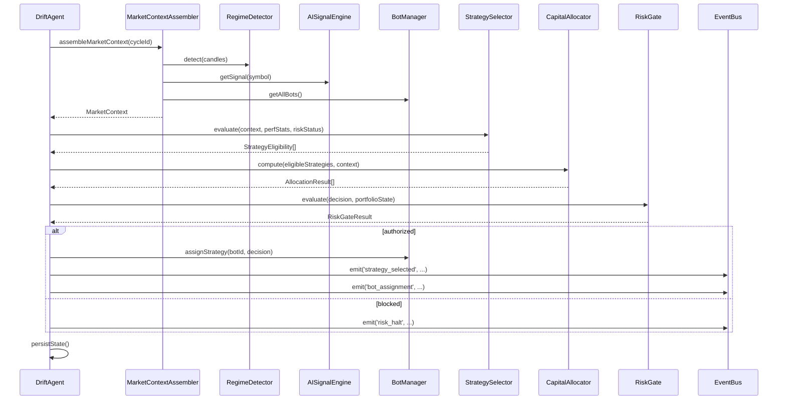

# Design Document: DRIFT Agent Layer

## Overview

The DRIFT Agent Layer is an autonomous orchestration brain that sits above the existing per-bot execution stack. It transforms DRIFT from a configurable multi-bot system into a self-directing trading entity that simultaneously pursues two objectives: **Volume** (incentive farming) and **Profit** (PnL generation).

The Agent Layer does not replace any existing component. It adds a coordination layer above `BotManager` that runs its own evaluation loop (AgentCycle), consumes intelligence from `AISignalEngine`, `RegimeDetector`, and `FeedbackLoop`, and emits typed `AgentDecision` objects that instruct `BotManager` which bots to activate, in which mode, and with how much capital.

### Key Design Principles

1. **Non-invasive integration** — existing `Watcher`, `Executor`, `BotInstance`, and `BotManager` are unchanged. The Agent wraps them.
2. **Typed decision boundary** — the `AgentDecision` struct is the single, immutable contract between the Agent and the execution layer.
3. **Fail-safe degradation** — any data source failure causes the Agent to enter degraded mode (no new entries, monitor exits only).
4. **Persistent state** — `AgentState` is persisted to disk after every cycle so restarts are seamless.
5. **Observable by design** — every decision, allocation, and risk gate event is logged with a unique cycle ID.

---

## Architecture

The Agent Layer introduces four new sub-components that compose into the `DriftAgent` class:

```
┌─────────────────────────────────────────────────────────────────────┐
│                         DriftAgent                                  │
│                                                                     │
│  ┌──────────────┐  ┌──────────────────┐  ┌──────────────────────┐  │
│  │ MarketContext│  │  StrategySelector │  │   CapitalAllocator   │  │
│  │  Assembler   │  │  (FARM vs TRADE)  │  │  (position sizing)   │  │
│  └──────┬───────┘  └────────┬─────────┘  └──────────┬───────────┘  │
│         │                   │                        │              │
│         └───────────────────┴────────────────────────┘             │
│                             │                                       │
│                    ┌────────▼────────┐                              │
│                    │    RiskGate     │                              │
│                    │ (portfolio risk)│                              │
│                    └────────┬────────┘                              │
│                             │                                       │
│                    ┌────────▼────────┐                              │
│                    │  AgentDecision  │                              │
│                    │    Emitter      │                              │
│                    └────────┬────────┘                              │
└─────────────────────────────┼───────────────────────────────────────┘
                              │
              ┌───────────────▼───────────────┐
              │          BotManager           │
              │  (existing, unchanged)        │
              └───────────────────────────────┘
```

### AgentCycle Flow

Each cycle follows the **observe → decide → allocate → gate → emit** pattern:

```
AgentCycle (every AGENT_CYCLE_INTERVAL_SECS seconds)
│
├─ 1. Observe: assemble MarketContext
│     ├─ RegimeDetector.detect()
│     ├─ AISignalEngine.getSignal() (cached ≤ 60s)
│     └─ BotManager.getAllBots() → PortfolioState
│
├─ 2. Decide: StrategySelector.evaluate(MarketContext)
│     ├─ Rank FARM vs TRADE by regime
│     ├─ Apply win-rate cooldowns
│     └─ Ensure at least one eligible strategy
│
├─ 3. Allocate: CapitalAllocator.compute(MarketContext, selectedStrategies)
│     ├─ baseSize × confidenceMultiplier × performanceMultiplier × regimeVolatilityFactor
│     ├─ Clamp to [ORDER_SIZE_MIN, ORDER_SIZE_MAX]
│     └─ Enforce ExposureCap
│
├─ 4. Gate: RiskGate.evaluate(AgentDecision, PortfolioState)
│     ├─ MAX_LOSS check
│     ├─ ExposureCap check
│     └─ Consecutive loss cooldown
│
├─ 5. Emit: AgentDecision → BotManager.assignStrategy()
│
└─ 6. Persist: AgentState → disk
```

### Integration with Existing Stack

```
src/
├── agent/                          ← NEW
│   ├── DriftAgent.ts               ← Main agent class (lifecycle + cycle loop)
│   ├── StrategySelector.ts         ← FARM vs TRADE ranking
│   ├── CapitalAllocator.ts         ← Position sizing with exposure cap
│   ├── RiskGate.ts                 ← Portfolio-level risk enforcement
│   ├── MarketContextAssembler.ts   ← Unified market snapshot
│   ├── AgentStateStore.ts          ← Persist/restore AgentState
│   ├── types.ts                    ← AgentDecision, AgentState, MarketContext, etc.
│   └── __tests__/
│       ├── StrategySelector.test.ts
│       ├── CapitalAllocator.test.ts
│       ├── RiskGate.test.ts
│       └── DriftAgent.integration.test.ts
├── bot/
│   └── BotManager.ts               ← UNCHANGED (Agent calls existing API)
├── modules/
│   └── Watcher.ts                  ← UNCHANGED
└── dashboard/
    └── server.ts                   ← Extended with /agent/* routes
```

---

## Components and Interfaces

### DriftAgent

The top-level class managing the agent lifecycle and cycle loop.

```typescript
interface DriftAgentOptions {
  botManager: BotManager;
  configStore: ConfigStoreInterface;
  telegram: TelegramManager;
  adapter: ExchangeAdapter;
  stateFilePath?: string;  // default: './agent-state.json'
}

class DriftAgent {
  // Lifecycle
  async initialize(): Promise<void>;
  async start(): Promise<void>;
  async pause(): Promise<void>;
  async stop(): Promise<void>;

  // Observability
  getAgentState(): AgentState;
  getLastDecision(): AgentDecision | null;
  getPerformanceSummary(): PerformanceSummary;

  // Internal
  private async _runCycle(): Promise<void>;
  private async _assembleMarketContext(): Promise<MarketContext>;
  private _persistState(): void;
}
```

**Lifecycle state machine:**

```
UNINITIALIZED → INITIALIZED → RUNNING → PAUSED → STOPPED
                                  ↑          │
                                  └──────────┘ (resume)
```

### StrategySelector

Evaluates both strategies each cycle and returns a ranked eligibility list.

```typescript
interface StrategyEligibility {
  strategy: 'FARM' | 'TRADE';
  eligible: boolean;
  rank: number;           // 1 = highest priority
  score: number;          // 0–1 composite eligibility score
  reason: string;         // human-readable explanation
  cooldownCyclesLeft: number;
}

class StrategySelector {
  evaluate(
    context: MarketContext,
    performanceStats: PerStrategyStats,
    riskGateStatus: RiskGateStatus
  ): StrategyEligibility[];
}
```

**Ranking rules (in priority order):**
1. `risk_halt` → FARM ineligible (only rule that blocks FARM)
2. `HIGH_VOLATILITY` + `REGIME_HIGH_VOL_SKIP_ENTRY=true` → TRADE ineligible
3. Win rate < 30% over last 10 trades → strategy enters 3-cycle cooldown
4. `SIDEWAY` → FARM rank 1, TRADE rank 2
5. `TREND_UP` / `TREND_DOWN` → TRADE rank 1, FARM rank 2
6. Fallback: strategy with highest recent win rate is always eligible

### CapitalAllocator

Computes position sizes respecting portfolio-level constraints.

```typescript
interface AllocationInput {
  strategy: 'FARM' | 'TRADE';
  context: MarketContext;
  currentExposureUsd: number;
  exposureCapUsd: number;
  sessionDrawdown: number;
}

interface AllocationResult {
  strategy: 'FARM' | 'TRADE';
  sizeBtc: number;
  confidenceMultiplier: number;
  performanceMultiplier: number;
  regimeVolatilityFactor: number;
  drawdownMultiplier: number;
  cappedByExposure: boolean;
  reasoning: string;
}

class CapitalAllocator {
  compute(inputs: AllocationInput[]): AllocationResult[];
  computeDynamicFarmTP(spreadBps: number, positionValue: number): number;
}
```

**Sizing formula:**
```
size = baseSize × confidenceMultiplier × performanceMultiplier × regimeVolatilityFactor
     → clamped to [ORDER_SIZE_MIN, ORDER_SIZE_MAX]
     → if drawdown > SIZING_DRAWDOWN_THRESHOLD: × SIZING_DRAWDOWN_FLOOR
     → if exposure within 80–100% of cap: × 0.5
     → if exposure ≥ cap: size = 0 (blocked)
```

**Dual-strategy capital split:**
```
FARM allocation  = available_capital × AGENT_FARM_CAPITAL_RATIO   (default 0.6)
TRADE allocation = available_capital × (1 - AGENT_FARM_CAPITAL_RATIO) (default 0.4)
```

**Dynamic FARM take-profit:**
```
dynamicTP = max(FARM_TP_USD, spread_bps × position_value × 1.5)
```

### RiskGate

Evaluates portfolio-level risk before authorizing any entry.

```typescript
type RiskGateStatus = 'OPEN' | 'HALTED' | 'COOLDOWN';

interface RiskGateResult {
  authorized: boolean;
  status: RiskGateStatus;
  reason: string | null;
  cooldownExpiresAt: number | null;
}

class RiskGate {
  evaluate(
    decision: Partial<AgentDecision>,
    portfolioState: PortfolioState
  ): RiskGateResult;

  getRiskStatus(): { status: RiskGateStatus; reason: string | null };
  recordTradeOutcome(win: boolean): void;
  reset(): void;
}
```

**Gate rules (evaluated in order):**
1. `sessionPnl < MAX_LOSS` → `HALTED`, emit `risk_halt`, send Telegram
2. `totalExposureUsd >= exposureCapUsd` → `HALTED` until exposure < 90% of cap
3. `consecutiveLosses >= AGENT_CONSECUTIVE_LOSS_HALT` → `COOLDOWN` for `AGENT_LOSS_COOLDOWN_MINS`
4. All rules pass → `OPEN`

### MarketContextAssembler

Assembles the unified snapshot at the start of each cycle.

```typescript
interface MarketContext {
  cycleId: string;           // UUID
  timestamp: number;
  regime: Regime;
  confidenceScore: number;
  signalDirection: 'long' | 'short' | 'skip';
  portfolioState: PortfolioState;
  sessionPnl: number;
  sessionVolume: number;
  farmVolume: number;
  totalExposureUsd: number;
  degraded: boolean;
  degradedFields: string[];  // which fields used stale data
}

interface PortfolioState {
  bots: BotPortfolioEntry[];
  totalExposureUsd: number;
  sessionPnl: number;
  sessionVolume: number;
  farmVolume: number;
  tradeVolume: number;
  openPositionCount: number;
}

interface BotPortfolioEntry {
  botId: string;
  exchange: string;
  status: 'RUNNING' | 'STOPPED' | 'COOLDOWN' | 'EXITING' | 'STALE';
  openPosition: OpenPositionState | null;
  exposureUsd: number;
  sessionPnl: number;
  strategy: 'FARM' | 'TRADE' | null;
  lastUpdateAt: number;
}
```

### AgentDecision

The immutable output of each AgentCycle.

```typescript
interface AgentDecision {
  readonly cycleId: string;          // UUID
  readonly timestamp: number;
  readonly selectedStrategy: 'FARM' | 'TRADE' | 'BOTH' | 'HOLD';
  readonly direction: 'long' | 'short' | 'hold';
  readonly allocatedSize: number;    // BTC
  readonly regime: Regime;
  readonly confidenceScore: number;
  readonly riskGateStatus: RiskGateStatus;
  readonly reasoning: string;        // human-readable explanation
  readonly farmAllocation?: AllocationResult;
  readonly tradeAllocation?: AllocationResult;
}
```

### AgentStateStore

Handles persistence of AgentState.

```typescript
interface AgentState {
  lifecycleStatus: 'UNINITIALIZED' | 'INITIALIZED' | 'RUNNING' | 'PAUSED' | 'STOPPED';
  lastDecision: AgentDecision | null;
  lastCycleAt: number | null;
  sessionStartAt: number | null;
  consecutiveLosses: number;
  farmWinRate: number;
  tradeWinRate: number;
  farmTotalTrades: number;
  tradeTotalTrades: number;
  farmTotalPnl: number;
  tradeTotalPnl: number;
  farmVolume: number;
  tradeVolume: number;
  strategyCooldowns: Record<'FARM' | 'TRADE', number>;  // cycles remaining
  cycleLatencies: number[];  // last 100 cycle durations (ms)
  updatedAt: string;
}

class AgentStateStore {
  load(filePath: string): AgentState;
  save(state: AgentState, filePath: string): void;
}
```

---

## Data Models

### Configuration Parameters

New Agent-specific parameters added to `ConfigStore`:

| Parameter | Type | Default | Description |
|-----------|------|---------|-------------|
| `AGENT_CYCLE_INTERVAL_SECS` | number | 30 | Seconds between AgentCycles |
| `AGENT_EXPOSURE_CAP_USD` | number | 500 | Max total open exposure (USD) |
| `AGENT_CONSECUTIVE_LOSS_HALT` | number | 3 | Consecutive losses before cooldown |
| `AGENT_LOSS_COOLDOWN_MINS` | number | 10 | Cooldown duration after loss streak |
| `AGENT_FARM_CAPITAL_RATIO` | number | 0.6 | Fraction of capital allocated to FARM |
| `TRADE_MIN_CONFIDENCE` | number | 0.65 | Minimum confidence for TRADE entry |
| `TRADE_MAX_CHOP_SCORE` | number | 0.6 | Maximum chop score for TRADE entry |
| `AGENT_DRY_RUN` | boolean | false | Log decisions without emitting orders |
| `FARM_MAX_LOSS_USD` | number | 20 | Max FARM session loss before halt |
| `SIZING_MAX_BTC` | number | (existing) | Hard BTC cap per allocation |

### Event Types

Events emitted by the Agent to the EventBus:

| Event | Payload | Trigger |
|-------|---------|---------|
| `strategy_selected` | `{ strategy, regime, eligibilityScores }` | Every cycle |
| `bot_assignment` | `{ botId, strategy, direction, allocatedSize }` | Per bot assignment |
| `risk_halt` | `{ reason, sessionPnl, portfolioState }` | RiskGate HALTED |
| `farm_loss_halt` | `{ sessionFarmPnl, threshold }` | FARM loss limit hit |
| `strategy_improvement` | `{ strategy, oldWinRate, newWinRate, tradeCount }` | Win rate +10pp over 20 trades |
| `slow_cycle` | `{ cycleId, durationMs }` | Cycle > 10 seconds |
| `agent_lifecycle` | `{ from, to, reason }` | Lifecycle state change |

### Mermaid: AgentCycle Sequence



---

## Correctness Properties

*A property is a characteristic or behavior that should hold true across all valid executions of a system — essentially, a formal statement about what the system should do. Properties serve as the bridge between human-readable specifications and machine-verifiable correctness guarantees.*

### Property 1: AgentState round-trip persistence

*For any* valid `AgentState` object, serializing it to disk and then loading it back should produce an object that is deeply equal to the original.

**Validates: Requirements 1.7, 1.8**

---

### Property 2: StrategySelector always produces at least one eligible strategy

*For any* `MarketContext` and performance statistics, the `StrategySelector` SHALL always return at least one eligible strategy — even when both strategies are in cooldown or one is blocked by regime rules.

**Validates: Requirements 3.7**

---

### Property 3: FARM eligibility invariant

*For any* `MarketContext` where the `RiskGate` has NOT issued a `risk_halt`, the `StrategySelector` SHALL mark FARM Mode as eligible, regardless of confidence score, regime, or chop score.

**Validates: Requirements 3.5**

---

### Property 4: Regime-based strategy ranking

*For any* `MarketContext` with regime `SIDEWAY`, the `StrategySelector` SHALL rank FARM above TRADE. *For any* `MarketContext` with regime `TREND_UP` or `TREND_DOWN`, the `StrategySelector` SHALL rank TRADE above FARM.

**Validates: Requirements 3.2, 3.3**

---

### Property 5: CapitalAllocator output is always in valid range

*For any* valid `AllocationInput`, the `CapitalAllocator` SHALL produce an `allocatedSize` that is greater than zero and less than or equal to `SIZING_MAX_BTC`, and always within `[ORDER_SIZE_MIN, ORDER_SIZE_MAX]` before the BTC cap is applied.

**Validates: Requirements 6.2, 6.7**

---

### Property 6: ExposureCap is never exceeded

*For any* set of allocation inputs, the total allocated capital across all strategies SHALL never cause `totalExposureUsd` to exceed `AGENT_EXPOSURE_CAP_USD`.

**Validates: Requirements 6.4, 7.3**

---

### Property 7: Drawdown floor is applied when threshold is exceeded

*For any* session drawdown that exceeds `SIZING_DRAWDOWN_THRESHOLD`, the `CapitalAllocator` SHALL apply the `SIZING_DRAWDOWN_FLOOR` multiplier to all computed sizes, resulting in a size strictly less than the size that would have been computed without the drawdown.

**Validates: Requirements 6.3**

---

### Property 8: Dynamic FARM take-profit formula invariant

*For any* `spread_bps` and `position_value`, the computed dynamic take-profit SHALL always be greater than or equal to `FARM_TP_USD` (i.e., `max(FARM_TP_USD, spread_bps × position_value × 1.5)` is always ≥ `FARM_TP_USD`).

**Validates: Requirements 4.5**

---

### Property 9: TRADE entry requires all filters to pass simultaneously

*For any* signal, a TRADE Mode entry SHALL only be authorized when ALL of the following hold simultaneously: `confidenceScore >= TRADE_MIN_CONFIDENCE`, `chopScore < TRADE_MAX_CHOP_SCORE`, and `FakeBreakoutFilter` does not flag the signal. If any single filter fails, the entry SHALL be blocked.

**Validates: Requirements 5.1, 5.2, 5.3, 5.4**

---

### Property 10: RiskGate blocks entries when MAX_LOSS is breached

*For any* `PortfolioState` where `sessionPnl < MAX_LOSS`, the `RiskGate` SHALL block all new entries and return status `HALTED`.

**Validates: Requirements 7.2**

---

### Property 11: AgentDecision directional size invariant

*For any* `AgentDecision` where `direction` is `long` or `short`, the `allocatedSize` SHALL be strictly greater than zero.

**Validates: Requirements 8.6**

---

### Property 12: Weight adjustment invariants

*For any* weight adjustment cycle, the resulting `SignalWeights` SHALL satisfy: (a) the sum of all weights equals 1.0 (within tolerance 0.001), and (b) each individual weight is within `[0.05, 0.60]`.

**Validates: Requirements 9.7**

---

### Property 13: Invalid config values are always rejected

*For any* configuration value that violates the defined constraints (e.g., `AGENT_CYCLE_INTERVAL_SECS < 5`, negative exposure cap, confidence threshold outside `[0, 1]`), the Agent's config endpoint SHALL reject the request and leave the current configuration unchanged.

**Validates: Requirements 12.6**

---

### Property 14: PortfolioState aggregation correctness

*For any* set of `BotInstance` states, the assembled `PortfolioState.totalExposureUsd` SHALL equal the sum of all individual bot exposure values, and `sessionPnl` SHALL equal the sum of all individual bot session PnL values.

**Validates: Requirements 2.4, 10.5**

---

## Error Handling

### Data Source Failures (Degraded Mode)

When any upstream data source fails to respond within 10 seconds, the Agent enters degraded mode:

```typescript
// MarketContextAssembler degradation logic
try {
  regime = await withTimeout(regimeDetector.detect(...), 10_000);
} catch {
  regime = this._lastKnownRegime ?? 'SIDEWAY';
  degradedFields.push('regime');
}
// ... same pattern for AISignalEngine, BotManager
context.degraded = degradedFields.length > 0;
```

In degraded mode:
- `StrategySelector` returns `HOLD` for all strategies
- `CapitalAllocator` returns zero allocations
- `RiskGate` blocks all new entries
- Existing positions continue to be monitored via `BotManager`
- Degraded state is logged and included in the `AgentDecision.reasoning`

### Lifecycle Error Handling

| Scenario | Behavior |
|----------|----------|
| `initialize()` fails to load state file | Log warning, start with fresh `AgentState` |
| `initialize()` fails to connect to BotManager | Throw — cannot operate without BotManager |
| Cycle throws unexpected error | Log error, increment error counter, continue next cycle |
| 5 consecutive cycle errors | Transition to `PAUSED`, send Telegram alert |
| `stop()` with open position, 60s timeout exceeded | Force hard stop, log warning |

### RiskGate Error Handling

The RiskGate is the last line of defense. It must never throw — all errors are caught internally and result in a `HALTED` status with the error message as the reason:

```typescript
evaluate(...): RiskGateResult {
  try {
    // ... evaluation logic
  } catch (err) {
    return { authorized: false, status: 'HALTED', reason: `RiskGate error: ${err}`, ... };
  }
}
```

### Bot Staleness

If a bot has not reported a state update for more than 60 seconds:
- It is marked `STALE` in `PortfolioState`
- Its exposure is still counted toward `totalExposureUsd` (conservative)
- No new assignments are made to it
- A `bot_stale` event is emitted

---

## Testing Strategy

### Unit Tests

Each sub-component has isolated unit tests covering:

- **StrategySelector**: regime-based ranking, cooldown logic, fallback to highest win-rate strategy
- **CapitalAllocator**: formula correctness, clamping, drawdown floor, exposure cap enforcement, dynamic FARM TP formula
- **RiskGate**: MAX_LOSS halt, exposure cap halt, consecutive loss cooldown, exit orders not blocked
- **MarketContextAssembler**: field assembly, degraded mode when sources fail, stale data handling
- **AgentStateStore**: serialization round-trip, missing file handling, corrupt file handling

### Property-Based Tests

Using [fast-check](https://github.com/dubzzz/fast-check) (already available in the TypeScript ecosystem). Each property test runs a minimum of 100 iterations.

**Tag format:** `// Feature: drift-agent-layer, Property N: <property_text>`

| Property | Test File | Generator |
|----------|-----------|-----------|
| P1: AgentState round-trip | `AgentStateStore.properties.test.ts` | `fc.record(...)` with all AgentState fields |
| P2: At least one eligible strategy | `StrategySelector.properties.test.ts` | `fc.record({ regime, perfStats, riskStatus })` |
| P3: FARM eligibility invariant | `StrategySelector.properties.test.ts` | `fc.record({ ...context, riskHalt: false })` |
| P4: Regime-based ranking | `StrategySelector.properties.test.ts` | `fc.constantFrom('SIDEWAY', 'TREND_UP', 'TREND_DOWN')` |
| P5: Allocator output range | `CapitalAllocator.properties.test.ts` | `fc.record({ confidence, drawdown, exposure })` |
| P6: ExposureCap never exceeded | `CapitalAllocator.properties.test.ts` | `fc.array(allocationInputArb)` |
| P7: Drawdown floor applied | `CapitalAllocator.properties.test.ts` | `fc.float({ min: -1000, max: SIZING_DRAWDOWN_THRESHOLD - 0.01 })` |
| P8: Dynamic FARM TP ≥ FARM_TP_USD | `CapitalAllocator.properties.test.ts` | `fc.float({ min: 0 })` × `fc.float({ min: 0 })` |
| P9: TRADE filter conjunction | `StrategySelector.properties.test.ts` | `fc.record({ confidence, chopScore, fakeBreakout })` |
| P10: RiskGate MAX_LOSS halt | `RiskGate.properties.test.ts` | `fc.float({ max: MAX_LOSS - 0.01 })` |
| P11: Directional size > 0 | `DriftAgent.properties.test.ts` | `fc.constantFrom('long', 'short')` |
| P12: Weight adjustment invariants | `AdaptiveWeightAdjuster.properties.test.ts` | `fc.array(tradeOutcomeArb, { minLength: 10 })` |
| P13: Invalid config rejected | `AgentConfig.properties.test.ts` | `fc.record({ invalidField: invalidValueArb })` |
| P14: PortfolioState aggregation | `MarketContextAssembler.properties.test.ts` | `fc.array(botStateArb)` |

### Integration Tests

- **Full AgentCycle**: mock all external dependencies (RegimeDetector, AISignalEngine, BotManager), run a complete cycle, verify AgentDecision structure and BotManager calls
- **Lifecycle transitions**: initialize → start → pause → resume → stop, verify state persistence at each step
- **Degraded mode**: simulate data source timeouts, verify no new entries are authorized
- **Dashboard endpoints**: verify `/agent/status`, `/agent/history`, `/agent/config` return correct data

### Test Configuration

```typescript
// vitest.config.ts — no changes needed, existing config applies
// Run with: npx vitest --run src/agent
```

Property tests use `fast-check` with `{ numRuns: 100 }` minimum. For computationally cheap properties (pure functions), use `{ numRuns: 1000 }`.
