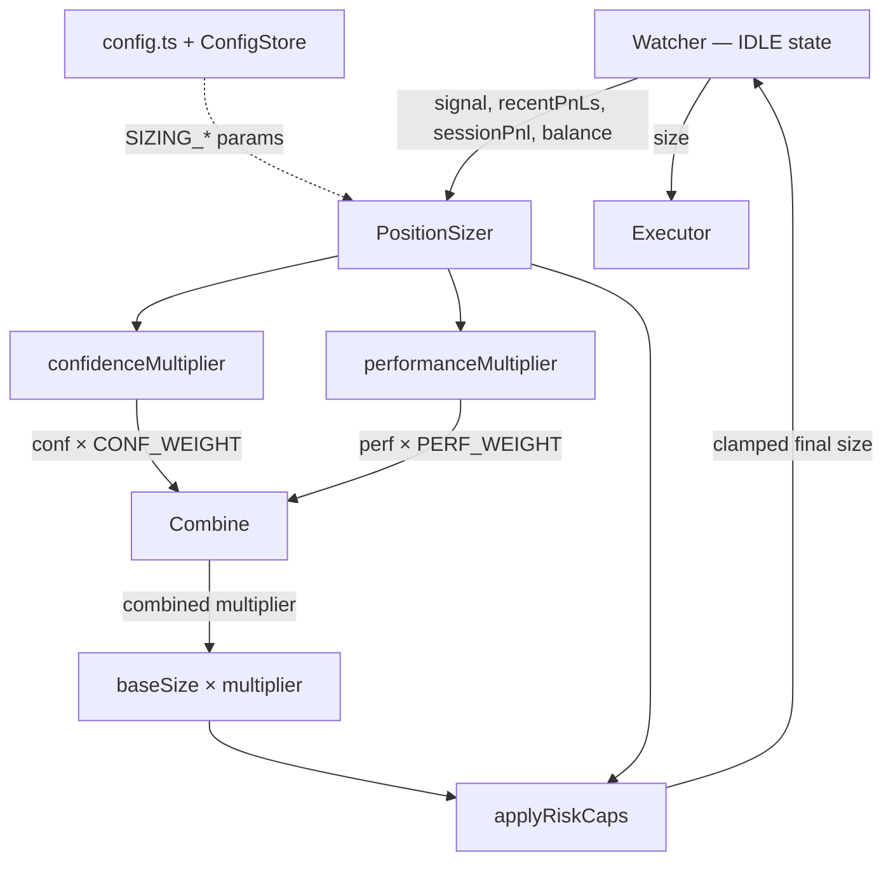
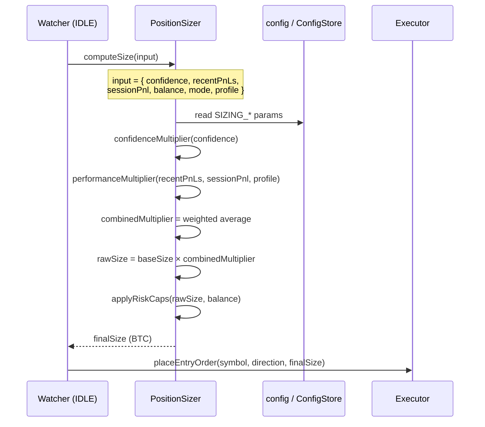
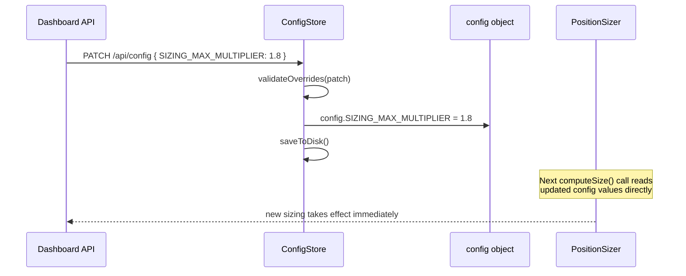

# Design Document: Dynamic Position Sizing (Phase 2)

## Overview

Phase 2 replaces APEX's static random-range position sizing with a multi-factor dynamic sizer that combines signal confidence, recent trade performance, and session drawdown into a single, risk-capped output size. The result is a `PositionSizer` service that `Watcher` calls in the IDLE state instead of the current inline formula — keeping the trade loop clean while making sizing a first-class, testable concern.

The three inputs to the final size are: (1) a **confidence multiplier** derived from `signal.confidence` (Phase 1 already calibrates this), (2) a **performance multiplier** derived from `recentPnLs` win rate and session drawdown, and (3) hard **risk caps** (absolute BTC ceiling and optional % of balance). The existing `currentProfile` (SCALP/NORMAL/RUNNER/DEGEN) is preserved as a complementary signal that feeds into the performance multiplier rather than being replaced.

New config keys (`SIZING_CONF_WEIGHT`, `SIZING_PERF_WEIGHT`, `SIZING_DRAWDOWN_THRESHOLD`, `SIZING_MAX_MULTIPLIER`, `SIZING_MIN_MULTIPLIER`, `SIZING_MAX_BTC`) are added to `config.ts` and exposed through `ConfigStore` for live dashboard overrides.

---

## Architecture



Key design decisions:

| Decision | Choice | Rationale |
|---|---|---|
| New service vs inline | New `PositionSizer` class | Testable in isolation; Watcher stays thin |
| Combine confidence + performance | Weighted average of two multipliers | Avoids multiplicative explosion; weights are tunable |
| Lookback window | Existing `recentPnLs` (last 5) | No new state needed; consistent with `updateProfile()` |
| Drawdown definition | `sessionCurrentPnl` (session PnL from `sessionStartBalance`) | Already tracked; captures real capital at risk |
| Risk cap | Hard BTC cap (`SIZING_MAX_BTC`) + soft % of balance | BTC cap prevents runaway size; % cap adapts to account growth |
| Profile interaction | Profile feeds `performanceMultiplier` as a bias | Preserves existing SCALP/DEGEN behaviour; doesn't duplicate logic |
| Farm vs trade mode | Both use `PositionSizer`; farm skips confidence scaling | Farm confidence is naturally lower — same formula, different weight defaults |
| Config exposure | New `SIZING_*` keys in `OverridableConfig` | Consistent with existing dashboard override pattern |

---

## Sequence Diagrams

### Position Sizing Flow (IDLE → PENDING_ENTRY)



### Config Override Flow (Dashboard → Live Sizing)



---

## Components and Interfaces

### PositionSizer

**Purpose**: Computes the final order size in BTC given signal confidence, recent performance, and session state. Enforces all risk caps.

**Interface**:
```typescript
interface SizingInput {
  confidence: number;          // calibrated signal confidence [0, 1]
  recentPnLs: number[];        // last N trade PnLs (USD)
  sessionPnl: number;          // running session PnL (USD)
  balance: number;             // current account balance (USD)
  mode: 'farm' | 'trade';
  profile: 'SCALP' | 'NORMAL' | 'RUNNER' | 'DEGEN';
}

interface SizingResult {
  size: number;                // final order size (BTC)
  confidenceMultiplier: number;
  performanceMultiplier: number;
  combinedMultiplier: number;
  cappedBy: 'none' | 'btc_cap' | 'balance_pct';  // which cap was applied
}

interface PositionSizerInterface {
  computeSize(input: SizingInput): SizingResult;
}
```

**Responsibilities**:
- Compute `confidenceMultiplier` from signal confidence
- Compute `performanceMultiplier` from recent win rate, drawdown, and profile
- Combine multipliers via configurable weighted average
- Apply hard BTC cap and soft balance-% cap
- Return full `SizingResult` for logging/dashboard transparency

---

### Config Extensions

New keys added to `config.ts` and `OverridableConfig`:

```typescript
// Position sizing multiplier bounds
SIZING_MIN_MULTIPLIER: 0.5,   // floor multiplier (never size below 50% of base)
SIZING_MAX_MULTIPLIER: 2.0,   // ceiling multiplier (never size above 2× base)

// Weighting between confidence and performance signals
SIZING_CONF_WEIGHT: 0.6,      // weight of confidence multiplier (0–1)
SIZING_PERF_WEIGHT: 0.4,      // weight of performance multiplier (0–1); must sum to 1 with CONF_WEIGHT

// Drawdown protection
SIZING_DRAWDOWN_THRESHOLD: -3.0,  // session PnL (USD) below which sizing scales down
SIZING_DRAWDOWN_FLOOR: 0.5,       // multiplier floor when drawdown is severe

// Hard risk cap
SIZING_MAX_BTC: 0.008,        // absolute max order size in BTC (hard cap)
SIZING_MAX_BALANCE_PCT: 0.02, // max order value as % of balance (soft cap, 2%)
```

---

## Data Models

### SizingInput

```typescript
interface SizingInput {
  confidence: number;       // [0, 1] — calibrated by Phase 1 ConfidenceCalibrator
  recentPnLs: number[];     // up to last 5 trade PnLs in USD; may be empty
  sessionPnl: number;       // USD; negative = drawdown
  balance: number;          // USD; must be > 0
  mode: 'farm' | 'trade';
  profile: 'SCALP' | 'NORMAL' | 'RUNNER' | 'DEGEN';
}
```

**Validation rules**:
- `confidence ∈ [0, 1]`
- `balance > 0`
- `recentPnLs.length ≤ 5` (Watcher already enforces this)

### SizingResult

```typescript
interface SizingResult {
  size: number;                  // BTC, > 0
  confidenceMultiplier: number;  // [SIZING_MIN_MULTIPLIER, SIZING_MAX_MULTIPLIER]
  performanceMultiplier: number; // [SIZING_MIN_MULTIPLIER, SIZING_MAX_MULTIPLIER]
  combinedMultiplier: number;    // weighted average, clamped
  cappedBy: 'none' | 'btc_cap' | 'balance_pct';
}
```

---

## Algorithmic Pseudocode

### Main: computeSize

```pascal
ALGORITHM computeSize(input)
INPUT: input — SizingInput
OUTPUT: SizingResult

BEGIN
  ASSERT input.balance > 0
  ASSERT input.confidence ∈ [0, 1]

  // Step 1: base size (uniform random in [ORDER_SIZE_MIN, ORDER_SIZE_MAX])
  baseSize ← ORDER_SIZE_MIN + random() × (ORDER_SIZE_MAX - ORDER_SIZE_MIN)

  // Step 2: compute individual multipliers
  confMult ← confidenceMultiplier(input.confidence, input.mode)
  perfMult ← performanceMultiplier(input.recentPnLs, input.sessionPnl, input.profile)

  // Step 3: weighted combination
  combined ← (confMult × SIZING_CONF_WEIGHT) + (perfMult × SIZING_PERF_WEIGHT)
  combined ← clamp(combined, SIZING_MIN_MULTIPLIER, SIZING_MAX_MULTIPLIER)

  // Step 4: raw size
  rawSize ← baseSize × combined

  // Step 5: apply risk caps
  { finalSize, cappedBy } ← applyRiskCaps(rawSize, input.balance)

  ASSERT finalSize >= ORDER_SIZE_MIN
  ASSERT finalSize <= SIZING_MAX_BTC

  RETURN SizingResult {
    size: finalSize,
    confidenceMultiplier: confMult,
    performanceMultiplier: perfMult,
    combinedMultiplier: combined,
    cappedBy
  }
END
```

**Preconditions**:
- `ORDER_SIZE_MIN > 0`, `ORDER_SIZE_MAX >= ORDER_SIZE_MIN`
- `SIZING_CONF_WEIGHT + SIZING_PERF_WEIGHT = 1.0`
- `SIZING_MIN_MULTIPLIER > 0`, `SIZING_MAX_MULTIPLIER >= SIZING_MIN_MULTIPLIER`

**Postconditions**:
- `result.size ∈ [ORDER_SIZE_MIN, SIZING_MAX_BTC]`
- `result.combinedMultiplier ∈ [SIZING_MIN_MULTIPLIER, SIZING_MAX_MULTIPLIER]`

**Loop invariants**: N/A

---

### Sub-algorithm: confidenceMultiplier

```pascal
ALGORITHM confidenceMultiplier(confidence, mode)
INPUT: confidence ∈ [0, 1], mode ∈ {'farm', 'trade'}
OUTPUT: multiplier ∈ [SIZING_MIN_MULTIPLIER, SIZING_MAX_MULTIPLIER]

BEGIN
  // Farm mode: confidence is naturally lower and less reliable for sizing
  // Use a dampened scale so farm sizing stays closer to base
  IF mode = 'farm' THEN
    // Linear scale: confidence 0.5 → 1.0x, confidence 1.0 → 1.3x
    multiplier ← 1.0 + (confidence - 0.5) × 0.6
  ELSE
    // Trade mode: full scale relative to MIN_CONFIDENCE baseline
    // confidence at MIN_CONFIDENCE → 1.0x; at 1.0 → SIZING_MAX_MULTIPLIER
    range ← 1.0 - MIN_CONFIDENCE
    IF range <= 0 THEN
      multiplier ← 1.0
    ELSE
      normalised ← (confidence - MIN_CONFIDENCE) / range
      multiplier ← 1.0 + normalised × (SIZING_MAX_MULTIPLIER - 1.0)
    END IF
  END IF

  RETURN clamp(multiplier, SIZING_MIN_MULTIPLIER, SIZING_MAX_MULTIPLIER)
END
```

**Preconditions**: `confidence ∈ [0, 1]`

**Postconditions**: `result ∈ [SIZING_MIN_MULTIPLIER, SIZING_MAX_MULTIPLIER]`

---

### Sub-algorithm: performanceMultiplier

```pascal
ALGORITHM performanceMultiplier(recentPnLs, sessionPnl, profile)
INPUT: recentPnLs — array of USD PnLs (up to 5),
       sessionPnl — USD (negative = drawdown),
       profile ∈ {'SCALP', 'NORMAL', 'RUNNER', 'DEGEN'}
OUTPUT: multiplier ∈ [SIZING_MIN_MULTIPLIER, SIZING_MAX_MULTIPLIER]

BEGIN
  // Step 1: recent win rate component
  IF recentPnLs.length = 0 THEN
    winRateMult ← 1.0  // no data → neutral
  ELSE
    wins ← COUNT pnl IN recentPnLs WHERE pnl > 0
    winRate ← wins / recentPnLs.length

    // Linear scale: 0% win rate → 0.7x, 50% → 1.0x, 100% → 1.3x
    winRateMult ← 0.7 + winRate × 0.6
  END IF

  // Step 2: drawdown component
  IF sessionPnl <= SIZING_DRAWDOWN_THRESHOLD THEN
    // Scale down linearly as drawdown deepens
    // At threshold → SIZING_DRAWDOWN_FLOOR; at 2× threshold → SIZING_DRAWDOWN_FLOOR × 0.8
    severity ← sessionPnl / SIZING_DRAWDOWN_THRESHOLD  // ≥ 1.0 when in drawdown
    drawdownMult ← SIZING_DRAWDOWN_FLOOR × (1.0 - 0.2 × (severity - 1.0))
    drawdownMult ← max(drawdownMult, SIZING_MIN_MULTIPLIER)
  ELSE
    drawdownMult ← 1.0
  END IF

  // Step 3: profile bias
  profileBias ← profileBiasMap[profile]
  // SCALP → 0.85 (conservative), NORMAL → 1.0, RUNNER → 1.15 (on a streak), DEGEN → 0.9 (chaotic)

  // Step 4: combine
  multiplier ← winRateMult × drawdownMult × profileBias
  RETURN clamp(multiplier, SIZING_MIN_MULTIPLIER, SIZING_MAX_MULTIPLIER)
END
```

**Preconditions**:
- `recentPnLs.length ≤ 5`
- `SIZING_DRAWDOWN_THRESHOLD < 0`
- `SIZING_DRAWDOWN_FLOOR ∈ (0, 1)`

**Postconditions**:
- `result ∈ [SIZING_MIN_MULTIPLIER, SIZING_MAX_MULTIPLIER]`
- If `sessionPnl > SIZING_DRAWDOWN_THRESHOLD`, drawdown component is neutral (1.0)
- If `recentPnLs` is empty, win rate component is neutral (1.0)

**Loop invariants**: N/A

---

### Sub-algorithm: applyRiskCaps

```pascal
ALGORITHM applyRiskCaps(rawSize, balance)
INPUT: rawSize — BTC, balance — USD
OUTPUT: { finalSize: BTC, cappedBy: 'none' | 'btc_cap' | 'balance_pct' }

BEGIN
  cappedBy ← 'none'
  finalSize ← rawSize

  // Hard BTC cap
  IF finalSize > SIZING_MAX_BTC THEN
    finalSize ← SIZING_MAX_BTC
    cappedBy ← 'btc_cap'
  END IF

  // Soft balance % cap (uses current mark price approximation via ORDER_SIZE_MAX)
  // Estimate position value: size × (balance / (ORDER_SIZE_MAX × estimated_leverage))
  // Simpler: cap position value at SIZING_MAX_BALANCE_PCT × balance
  // position_value_usd ≈ finalSize × markPrice
  // We don't have markPrice here — use balance-relative cap on BTC size:
  // max_btc_from_balance = (balance × SIZING_MAX_BALANCE_PCT) / markPrice
  // Since markPrice is not passed in, we enforce this cap in Watcher after computeSize()
  // and pass markPrice separately. PositionSizer returns the BTC-capped size only.
  // The balance-% cap is applied by the caller (Watcher) with access to markPrice.

  // Floor: never go below ORDER_SIZE_MIN
  IF finalSize < ORDER_SIZE_MIN THEN
    finalSize ← ORDER_SIZE_MIN
  END IF

  RETURN { finalSize, cappedBy }
END
```

**Note on balance-% cap**: `PositionSizer.computeSize()` applies the BTC hard cap. The balance-% soft cap is applied by `Watcher` after receiving `SizingResult`, since `markPrice` is already available there. This keeps `PositionSizer` free of exchange state.

**Preconditions**: `rawSize > 0`, `balance > 0`

**Postconditions**:
- `finalSize ∈ [ORDER_SIZE_MIN, SIZING_MAX_BTC]`
- `cappedBy` accurately reflects which cap was binding

---

## Key Functions with Formal Specifications

### PositionSizer.computeSize()

```typescript
computeSize(input: SizingInput): SizingResult
```

**Preconditions**:
- `input.confidence ∈ [0, 1]`
- `input.balance > 0`
- `config.ORDER_SIZE_MIN > 0`
- `config.SIZING_CONF_WEIGHT + config.SIZING_PERF_WEIGHT === 1.0`

**Postconditions**:
- `result.size ∈ [config.ORDER_SIZE_MIN, config.SIZING_MAX_BTC]`
- `result.combinedMultiplier ∈ [config.SIZING_MIN_MULTIPLIER, config.SIZING_MAX_MULTIPLIER]`
- `result.confidenceMultiplier ∈ [config.SIZING_MIN_MULTIPLIER, config.SIZING_MAX_MULTIPLIER]`
- `result.performanceMultiplier ∈ [config.SIZING_MIN_MULTIPLIER, config.SIZING_MAX_MULTIPLIER]`
- No I/O performed (pure function)

**Loop invariants**: N/A

---

### confidenceMultiplier() (internal)

```typescript
confidenceMultiplier(confidence: number, mode: 'farm' | 'trade'): number
```

**Preconditions**: `confidence ∈ [0, 1]`

**Postconditions**:
- `result ∈ [SIZING_MIN_MULTIPLIER, SIZING_MAX_MULTIPLIER]`
- In trade mode: `confidence >= MIN_CONFIDENCE` implies `result >= 1.0`
- In farm mode: `confidence = 0.5` implies `result ≈ 1.0`

---

### performanceMultiplier() (internal)

```typescript
performanceMultiplier(
  recentPnLs: number[],
  sessionPnl: number,
  profile: 'SCALP' | 'NORMAL' | 'RUNNER' | 'DEGEN'
): number
```

**Preconditions**: `recentPnLs.length ≤ 5`

**Postconditions**:
- `result ∈ [SIZING_MIN_MULTIPLIER, SIZING_MAX_MULTIPLIER]`
- `sessionPnl > SIZING_DRAWDOWN_THRESHOLD` implies drawdown component = 1.0 (no penalty)
- `recentPnLs.length === 0` implies win rate component = 1.0 (neutral)

---

## Example Usage

```typescript
// In Watcher.ts — IDLE state, replacing the current inline sizing block:

const positionSizer = new PositionSizer();

// ... after finalDirection is determined ...

const sizingResult = positionSizer.computeSize({
  confidence: signal.confidence,
  recentPnLs: this.recentPnLs,
  sessionPnl: this.sessionCurrentPnl,
  balance,
  mode: config.MODE as 'farm' | 'trade',
  profile: this.currentProfile,
});

// Apply balance-% soft cap (Watcher has markPrice)
let size = sizingResult.size;
const maxSizeFromBalance = (balance * config.SIZING_MAX_BALANCE_PCT) / markPrice;
if (size > maxSizeFromBalance) {
  size = Math.max(config.ORDER_SIZE_MIN, maxSizeFromBalance);
}

console.log(
  `📐 Order size: ${size.toFixed(5)} BTC` +
  ` | confMult: ${sizingResult.confidenceMultiplier.toFixed(2)}x` +
  ` | perfMult: ${sizingResult.performanceMultiplier.toFixed(2)}x` +
  ` | combined: ${sizingResult.combinedMultiplier.toFixed(2)}x` +
  ` | cappedBy: ${sizingResult.cappedBy}`
);

const order = await this.executor.placeEntryOrder(this.symbol, finalDirection, size);
```

```typescript
// Example: high-confidence trade mode signal on a winning streak
const result = positionSizer.computeSize({
  confidence: 0.85,
  recentPnLs: [0.4, 0.6, 0.3, 0.5, 0.2],  // 5/5 wins
  sessionPnl: 2.0,                           // profitable session
  balance: 500,
  mode: 'trade',
  profile: 'RUNNER',
});
// confMult ≈ 1.75, perfMult ≈ 1.38, combined ≈ 1.60
// rawSize ≈ 0.003 × 1.60 = 0.0048 BTC → within caps

// Example: drawdown scenario
const result2 = positionSizer.computeSize({
  confidence: 0.70,
  recentPnLs: [-0.3, -0.5, -0.2, -0.4, 0.1],  // 1/5 wins
  sessionPnl: -4.5,                              // deep drawdown
  balance: 500,
  mode: 'trade',
  profile: 'SCALP',
});
// confMult ≈ 1.17, perfMult ≈ 0.50 (drawdown floor), combined ≈ 0.90
// rawSize ≈ 0.003 × 0.90 = 0.0027 BTC → floored to ORDER_SIZE_MIN = 0.003
```

---

## Correctness Properties

*A property is a characteristic or behavior that should hold true across all valid executions of a system — essentially, a formal statement about what the system should do. Properties serve as the bridge between human-readable specifications and machine-verifiable correctness guarantees.*

### Property 1: Size bounds

*For any* valid `SizingInput`, `computeSize().size` is in `[ORDER_SIZE_MIN, SIZING_MAX_BTC]`.

**Validates: Requirements 1.2, 4.1**

---

### Property 2: Multiplier bounds

*For any* valid `SizingInput`, all three multipliers (`confidenceMultiplier`, `performanceMultiplier`, `combinedMultiplier`) are each in `[SIZING_MIN_MULTIPLIER, SIZING_MAX_MULTIPLIER]`.

**Validates: Requirements 1.3, 2.5, 3.6**

---

### Property 3: Drawdown protection

*For any* `SizingInput` where `sessionPnl <= SIZING_DRAWDOWN_THRESHOLD`, `performanceMultiplier` is strictly less than 1.0 (size is reduced relative to neutral).

**Validates: Requirements 3.3**

---

### Property 4: Confidence monotonicity (trade mode)

*For any* fixed `recentPnLs`, `sessionPnl`, `profile`, and `mode = 'trade'`, if `conf_a >= conf_b` then `confidenceMultiplier(conf_a) >= confidenceMultiplier(conf_b)` (higher confidence → larger or equal multiplier).

**Validates: Requirements 2.3**

---

### Property 5: Win rate monotonicity

*For any* fixed `confidence`, `sessionPnl`, and `profile`, a `recentPnLs` array composed entirely of positive values produces a `performanceMultiplier` greater than or equal to the multiplier for an all-negative `recentPnLs` array of the same length.

**Validates: Requirements 3.7**

---

### Property 6: Farm dampening

*For any* `confidence` value in `[0, 1]`, the `confidenceMultiplier` in `'farm'` mode is always closer to 1.0 than the `confidenceMultiplier` in `'trade'` mode (dampened scale).

**Validates: Requirements 2.4**

---

### Property 7: Empty history neutral

*For any* `sessionPnl > SIZING_DRAWDOWN_THRESHOLD` and `profile = 'NORMAL'`, calling `performanceMultiplier` with an empty `recentPnLs` array returns exactly 1.0.

**Validates: Requirements 3.1**

---

### Property 8: Cap reporting accuracy

*For any* `SizingInput` that produces a `rawSize > SIZING_MAX_BTC`, the returned `SizingResult.cappedBy` is `'btc_cap'`; for any input where `rawSize <= SIZING_MAX_BTC`, `cappedBy` is `'none'`.

**Validates: Requirements 4.2, 4.3, 4.5**

---

## Error Handling

### Scenario 1: `recentPnLs` is empty (first trade of session)

**Condition**: `Watcher.recentPnLs` is `[]` at session start

**Response**: `performanceMultiplier` returns 1.0 (neutral) — no win rate or drawdown data to act on

**Recovery**: Automatic; multiplier adjusts after first trade is logged

---

### Scenario 2: `balance` is zero or negative

**Condition**: Exchange returns 0 or negative balance (API error or dust account)

**Response**: `computeSize()` receives `balance <= 0`; the balance-% cap in Watcher would produce `maxSizeFromBalance = 0`. Watcher already has a `balance < 15` guard that stops the bot before sizing is reached.

**Recovery**: Bot stops via existing emergency stop; no sizing call is made

---

### Scenario 3: Config weight sum ≠ 1.0 after override

**Condition**: Dashboard sends `SIZING_CONF_WEIGHT = 0.7` without updating `SIZING_PERF_WEIGHT`

**Response**: `validateOverrides` rejects the patch with a validation error: "SIZING_CONF_WEIGHT + SIZING_PERF_WEIGHT must equal 1.0"

**Recovery**: Dashboard shows validation error; existing config unchanged

---

### Scenario 4: `SIZING_MAX_BTC < ORDER_SIZE_MIN`

**Condition**: Misconfigured cap makes the hard ceiling below the floor

**Response**: `validateOverrides` rejects: "SIZING_MAX_BTC must be >= ORDER_SIZE_MIN"

**Recovery**: Config unchanged; bot continues with previous valid config

---

### Scenario 5: Extreme drawdown (sessionPnl << threshold)

**Condition**: Session PnL far below `SIZING_DRAWDOWN_THRESHOLD` (e.g. -$20 with threshold -$3)

**Response**: `drawdownMult` is clamped to `SIZING_MIN_MULTIPLIER`; `performanceMultiplier` hits its floor. Final size is `ORDER_SIZE_MIN` (minimum possible).

**Recovery**: Sizing recovers automatically as session PnL improves above threshold

---

## Testing Strategy

### Unit Testing Approach

`PositionSizer` is a pure function class — all methods are tested in isolation with no mocks needed:

- `confidenceMultiplier`: verify farm dampening, trade mode scaling, boundary values (0, MIN_CONFIDENCE, 1.0)
- `performanceMultiplier`: verify win rate scale (0%, 50%, 100%), drawdown floor activation, profile bias ordering, empty `recentPnLs` neutrality
- `applyRiskCaps`: verify BTC cap, floor enforcement, `cappedBy` accuracy
- `computeSize`: verify end-to-end with representative inputs; verify all result fields are populated

### Property-Based Testing Approach

**Property Test Library**: `fast-check`

Key properties to test with generated inputs:

1. `computeSize().size ∈ [ORDER_SIZE_MIN, SIZING_MAX_BTC]` for any valid `SizingInput`
2. All multipliers ∈ `[SIZING_MIN_MULTIPLIER, SIZING_MAX_MULTIPLIER]` for any input
3. `confidenceMultiplier` is monotonically non-decreasing in `confidence` for fixed `mode`
4. `performanceMultiplier` with all-winning `recentPnLs` >= `performanceMultiplier` with all-losing `recentPnLs` (for same `sessionPnl`, `profile`)
5. `sessionPnl <= SIZING_DRAWDOWN_THRESHOLD` always produces `performanceMultiplier < 1.0`
6. `recentPnLs = []` and `sessionPnl > threshold` and `profile = 'NORMAL'` → `performanceMultiplier === 1.0`

### Integration Testing Approach

- Replace inline sizing in `Watcher` with `PositionSizer` and verify the existing `Watcher` unit tests still pass
- Verify `SizingResult` fields appear in the trade log (`TradeRecord`) for dashboard transparency
- Verify config overrides to `SIZING_*` keys propagate to `PositionSizer` on the next `computeSize()` call

---

## Performance Considerations

- `computeSize()` is a pure synchronous computation — no I/O, no async, no external calls
- Called once per IDLE tick that reaches the entry decision (after signal fetch) — negligible overhead
- All config reads are direct property accesses on the `config` object (already in memory)

---

## Security Considerations

- All `SIZING_*` config values are validated by `validateOverrides` before being applied — no unchecked numeric injection
- `SIZING_MAX_BTC` provides a hard ceiling that cannot be exceeded regardless of other multiplier values, protecting against runaway position sizes from misconfigured weights
- `SIZING_MAX_BALANCE_PCT` provides a second independent cap tied to account size

---

## Dependencies

- No new npm dependencies
- `src/config.ts` — new `SIZING_*` keys
- `src/config/ConfigStore.ts` — expose new keys in `OverridableConfig` + `validateOverrides`
- `src/modules/Watcher.ts` — replace inline sizing block with `PositionSizer.computeSize()`
- `src/ai/TradeLogger.ts` — optionally extend `TradeRecord` with `sizingResult` fields for analytics
- `fast-check` (already in project) — property-based tests
