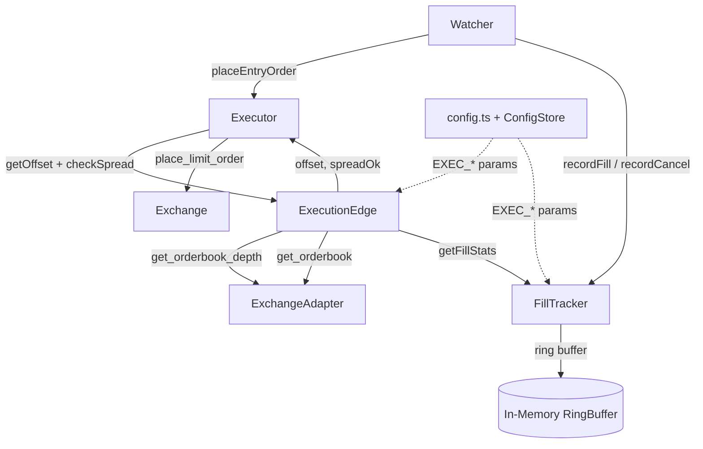
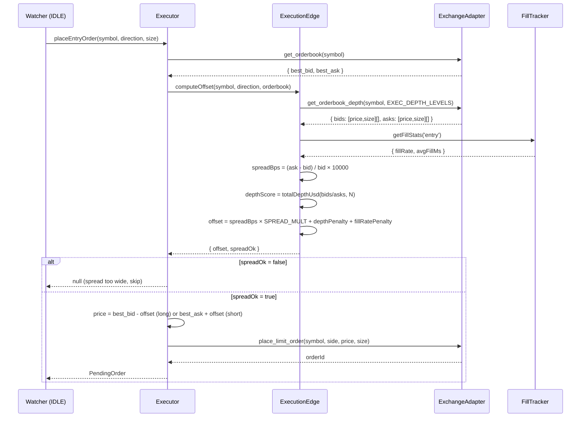
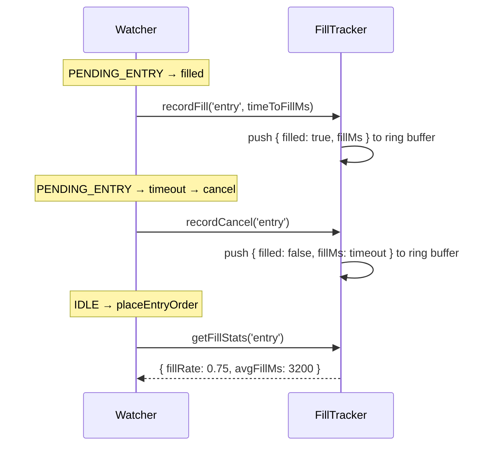

# Design Document: Execution Edge (Phase 5)

## Overview

Phase 5 upgrades APEX's order placement from static best-bid/best-ask to a market-aware execution layer. Three capabilities are added: (1) **smart dynamic offset** — the price offset for Post-Only entry orders is computed from live spread width and orderbook depth rather than always being zero; (2) **fill probability tracking** — a lightweight in-memory ring buffer records fill rate and time-to-fill per order type, and the offset formula uses this feedback to self-correct; (3) **spread guard** — entries are skipped when the spread exceeds a configurable basis-point threshold, preventing execution during illiquid or manipulated market conditions.

The result is a new `ExecutionEdge` service that `Executor` delegates to for offset computation and spread validation, and a `FillTracker` service that `Watcher` updates on every fill/cancel event. All new config keys follow the existing `config.ts` + `ConfigStore` pattern and are dashboard-overridable.

---

## Architecture



Key design decisions:

| Decision | Choice | Rationale |
|---|---|---|
| New service vs inline in Executor | New `ExecutionEdge` class | Keeps Executor thin; edge logic is independently testable |
| Fill tracking storage | In-memory ring buffer (no persistence) | Fill stats are session-local; persistence adds complexity with minimal benefit |
| Spread check location | Inside `ExecutionEdge.checkSpread()`, called from `Executor.placeEntryOrder()` | Executor already has orderbook data; avoids a second fetch in Watcher |
| Depth metric | Sum of quote value at top N bid/ask levels | More stable than just top-of-book; N is configurable |
| Offset formula | `spreadBps × EXEC_SPREAD_OFFSET_MULT + depthPenalty + fillRatePenalty` | Additive components are independently tunable |
| Fill rate feedback | Penalty term added to offset when fill rate drops below threshold | Conservative: low fill rate → move price closer to mid (larger offset) |
| Ring buffer size | Configurable `EXEC_FILL_WINDOW` (default 20) | Enough history to be meaningful; small enough to stay reactive |

---

## Sequence Diagrams

### Entry Order Placement with Dynamic Offset



### Fill Tracking Lifecycle



---

## Components and Interfaces

### ExecutionEdge

**Purpose**: Computes the dynamic price offset for Post-Only entry orders and validates spread conditions before order placement.

**Interface**:
```typescript
interface OffsetResult {
  offset: number;        // price offset in USD (always >= 0)
  spreadBps: number;     // current spread in basis points
  spreadOk: boolean;     // false if spread > EXEC_MAX_SPREAD_BPS
  depthScore: number;    // total depth USD at top N levels (bid side for long, ask side for short)
  fillRatePenalty: number; // extra offset added due to low fill rate
}

interface ExecutionEdgeInterface {
  computeOffset(
    symbol: string,
    direction: 'long' | 'short',
    orderbook: { best_bid: number; best_ask: number }
  ): Promise<OffsetResult>;
}
```

**Responsibilities**:
- Fetch orderbook depth via `ExchangeAdapter.get_orderbook_depth()`
- Compute spread in basis points
- Compute depth score (sum of quote value at top N levels)
- Query `FillTracker` for recent fill stats
- Combine spread, depth, and fill rate into a single offset value
- Return `spreadOk = false` when spread exceeds `EXEC_MAX_SPREAD_BPS`

---

### FillTracker

**Purpose**: Maintains a rolling window of fill/cancel outcomes for entry and exit orders, providing fill rate and average time-to-fill statistics.

**Interface**:
```typescript
type OrderType = 'entry' | 'exit';

interface FillRecord {
  filled: boolean;
  fillMs: number;   // ms from placement to fill (or timeout if cancelled)
  ts: number;       // timestamp
}

interface FillStats {
  fillRate: number;    // [0, 1] — fraction of recent orders that filled
  avgFillMs: number;   // average ms to fill (only filled orders)
  sampleSize: number;  // number of records in window
}

interface FillTrackerInterface {
  recordFill(type: OrderType, fillMs: number): void;
  recordCancel(type: OrderType): void;
  getFillStats(type: OrderType): FillStats;
  reset(): void;
}
```

**Responsibilities**:
- Maintain two separate ring buffers (entry, exit) of size `EXEC_FILL_WINDOW`
- Compute fill rate and average fill time on demand
- Expose `reset()` for session resets

---

### Config Extensions

New keys added to `config.ts` and `OverridableConfig`:

```typescript
// ── Execution Edge (Phase 5) ──────────────────────────────────────────────

// Spread guard
EXEC_MAX_SPREAD_BPS: 10,          // skip entry if spread > this (basis points)

// Dynamic offset formula
EXEC_SPREAD_OFFSET_MULT: 0.3,     // offset += spreadBps × this (USD per bps)
EXEC_DEPTH_LEVELS: 5,             // number of orderbook levels to sum for depth score
EXEC_DEPTH_THIN_THRESHOLD: 50000, // depth (USD) below which thin-book penalty applies
EXEC_DEPTH_PENALTY: 0.5,          // extra offset (USD) added when book is thin

// Fill rate feedback
EXEC_FILL_WINDOW: 20,             // ring buffer size (number of recent orders)
EXEC_FILL_RATE_THRESHOLD: 0.6,    // fill rate below this triggers penalty
EXEC_FILL_RATE_PENALTY: 1.0,      // extra offset (USD) added when fill rate is low

// Offset bounds
EXEC_OFFSET_MIN: 0,               // minimum offset (USD) — 0 = no floor
EXEC_OFFSET_MAX: 5,               // maximum offset (USD) — hard ceiling
```

---

## Data Models

### FillRecord

```typescript
interface FillRecord {
  filled: boolean;   // true = filled, false = cancelled/timed out
  fillMs: number;    // ms from placement to outcome
  ts: number;        // Unix ms timestamp
}
```

### OffsetResult

```typescript
interface OffsetResult {
  offset: number;          // final offset in USD, clamped to [EXEC_OFFSET_MIN, EXEC_OFFSET_MAX]
  spreadBps: number;       // (ask - bid) / bid × 10000
  spreadOk: boolean;       // spread <= EXEC_MAX_SPREAD_BPS
  depthScore: number;      // sum of (price × size) for top N levels on relevant side
  fillRatePenalty: number; // 0 or EXEC_FILL_RATE_PENALTY
}
```

**Validation rules**:
- `offset >= 0`
- `spreadBps >= 0`
- `depthScore >= 0`
- `fillRatePenalty ∈ {0, EXEC_FILL_RATE_PENALTY}`

---

## Algorithmic Pseudocode

### Main: computeOffset

```pascal
ALGORITHM computeOffset(symbol, direction, orderbook)
INPUT: symbol — string
       direction ∈ {'long', 'short'}
       orderbook — { best_bid: number, best_ask: number }
OUTPUT: OffsetResult

BEGIN
  // Step 1: compute spread
  spread ← orderbook.best_ask - orderbook.best_bid
  spreadBps ← (spread / orderbook.best_bid) × 10000

  // Step 2: spread guard
  IF spreadBps > EXEC_MAX_SPREAD_BPS THEN
    RETURN OffsetResult {
      offset: 0,
      spreadBps,
      spreadOk: false,
      depthScore: 0,
      fillRatePenalty: 0
    }
  END IF

  // Step 3: fetch depth and compute depth score
  depth ← get_orderbook_depth(symbol, EXEC_DEPTH_LEVELS)
  relevantLevels ← IF direction = 'long' THEN depth.bids ELSE depth.asks
  depthScore ← SUM of (price × size) FOR each [price, size] IN relevantLevels

  // Step 4: depth penalty
  depthPenalty ← IF depthScore < EXEC_DEPTH_THIN_THRESHOLD
                 THEN EXEC_DEPTH_PENALTY
                 ELSE 0

  // Step 5: fill rate penalty
  stats ← FillTracker.getFillStats('entry')
  fillRatePenalty ← IF stats.sampleSize > 0 AND stats.fillRate < EXEC_FILL_RATE_THRESHOLD
                    THEN EXEC_FILL_RATE_PENALTY
                    ELSE 0

  // Step 6: combine
  rawOffset ← (spreadBps × EXEC_SPREAD_OFFSET_MULT) + depthPenalty + fillRatePenalty
  offset ← clamp(rawOffset, EXEC_OFFSET_MIN, EXEC_OFFSET_MAX)

  ASSERT offset >= 0
  ASSERT spreadOk = true

  RETURN OffsetResult {
    offset,
    spreadBps,
    spreadOk: true,
    depthScore,
    fillRatePenalty
  }
END
```

**Preconditions**:
- `orderbook.best_bid > 0`, `orderbook.best_ask > orderbook.best_bid`
- `EXEC_DEPTH_LEVELS >= 1`
- `EXEC_SPREAD_OFFSET_MULT >= 0`

**Postconditions**:
- If `spreadBps > EXEC_MAX_SPREAD_BPS` → `result.spreadOk = false`
- If `spreadBps <= EXEC_MAX_SPREAD_BPS` → `result.offset ∈ [EXEC_OFFSET_MIN, EXEC_OFFSET_MAX]`
- `result.offset >= 0` always

**Loop invariants**: N/A (depth sum is a fold, no mutable loop state)

---

### Sub-algorithm: FillTracker.recordFill

```pascal
ALGORITHM recordFill(type, fillMs)
INPUT: type ∈ {'entry', 'exit'}, fillMs ≥ 0
OUTPUT: void

BEGIN
  buffer ← ringBuffers[type]
  record ← FillRecord { filled: true, fillMs, ts: now() }
  buffer.push(record)
  IF buffer.length > EXEC_FILL_WINDOW THEN
    buffer.shift()  // evict oldest
  END IF
END
```

**Loop invariant**: `buffer.length <= EXEC_FILL_WINDOW` after every push

---

### Sub-algorithm: FillTracker.getFillStats

```pascal
ALGORITHM getFillStats(type)
INPUT: type ∈ {'entry', 'exit'}
OUTPUT: FillStats

BEGIN
  buffer ← ringBuffers[type]

  IF buffer.length = 0 THEN
    RETURN FillStats { fillRate: 1.0, avgFillMs: 0, sampleSize: 0 }
  END IF

  filledRecords ← FILTER buffer WHERE record.filled = true
  fillRate ← filledRecords.length / buffer.length

  IF filledRecords.length > 0 THEN
    avgFillMs ← SUM(record.fillMs FOR record IN filledRecords) / filledRecords.length
  ELSE
    avgFillMs ← 0
  END IF

  RETURN FillStats { fillRate, avgFillMs, sampleSize: buffer.length }
END
```

**Preconditions**: `buffer` is a valid array of `FillRecord`

**Postconditions**:
- `fillRate ∈ [0, 1]`
- `avgFillMs >= 0`
- `sampleSize = buffer.length`
- Empty buffer → `fillRate = 1.0` (optimistic default, no penalty applied)

---

### Sub-algorithm: Executor.placeEntryOrder (updated)

```pascal
ALGORITHM placeEntryOrder(symbol, direction, size, priceOffset = 0)
INPUT: symbol, direction, size, priceOffset (legacy, default 0)
OUTPUT: PendingOrder | null

BEGIN
  ob ← get_orderbook(symbol)

  // Phase 5: compute dynamic offset (overrides legacy priceOffset)
  edgeResult ← ExecutionEdge.computeOffset(symbol, direction, ob)

  IF NOT edgeResult.spreadOk THEN
    LOG "Spread too wide (${edgeResult.spreadBps} bps > ${EXEC_MAX_SPREAD_BPS}). Skipping entry."
    RETURN null
  END IF

  effectiveOffset ← edgeResult.offset

  // Price placement (Post-Only maker)
  IF direction = 'long' THEN
    rawPrice ← ob.best_bid - effectiveOffset
    price ← FLOOR(rawPrice × 100) / 100
  ELSE
    rawPrice ← ob.best_ask + effectiveOffset
    price ← CEIL(rawPrice × 100) / 100
  END IF

  orderId ← place_limit_order(symbol, side, price, size)
  RETURN PendingOrder { orderId, price, size }
END
```

---

### Sub-algorithm: Watcher fill/cancel recording

```pascal
// On PENDING_ENTRY → filled:
ALGORITHM onEntryFilled(placedAt)
BEGIN
  fillMs ← now() - placedAt
  FillTracker.recordFill('entry', fillMs)
END

// On PENDING_ENTRY → timeout → cancel:
ALGORITHM onEntryCancel(placedAt, fillTimeout)
BEGIN
  FillTracker.recordCancel('entry')
  // recordCancel internally records { filled: false, fillMs: fillTimeout }
END
```

---

## Key Functions with Formal Specifications

### ExecutionEdge.computeOffset()

```typescript
computeOffset(
  symbol: string,
  direction: 'long' | 'short',
  orderbook: { best_bid: number; best_ask: number }
): Promise<OffsetResult>
```

**Preconditions**:
- `orderbook.best_bid > 0`
- `orderbook.best_ask > orderbook.best_bid`
- `EXEC_DEPTH_LEVELS >= 1`

**Postconditions**:
- `result.spreadBps = (best_ask - best_bid) / best_bid × 10000`
- `result.spreadOk = (result.spreadBps <= EXEC_MAX_SPREAD_BPS)`
- If `result.spreadOk`: `result.offset ∈ [EXEC_OFFSET_MIN, EXEC_OFFSET_MAX]`
- If `!result.spreadOk`: `result.offset = 0`
- `result.fillRatePenalty ∈ {0, EXEC_FILL_RATE_PENALTY}`

---

### FillTracker.getFillStats()

```typescript
getFillStats(type: OrderType): FillStats
```

**Preconditions**: `type ∈ {'entry', 'exit'}`

**Postconditions**:
- `result.fillRate ∈ [0, 1]`
- `result.sampleSize = ringBuffers[type].length`
- `result.sampleSize === 0` implies `result.fillRate === 1.0` (optimistic default)
- `result.avgFillMs >= 0`

---

### FillTracker.recordFill()

```typescript
recordFill(type: OrderType, fillMs: number): void
```

**Preconditions**: `fillMs >= 0`

**Postconditions**:
- `ringBuffers[type].length <= EXEC_FILL_WINDOW`
- Most recent record has `filled = true` and `fillMs = fillMs`

---

## Example Usage

```typescript
// ExecutionEdge instantiation (in Executor constructor)
const executionEdge = new ExecutionEdge(adapter, fillTracker);

// In Executor.placeEntryOrder():
const ob = await this.adapter.get_orderbook(symbol);
const edgeResult = await this.executionEdge.computeOffset(symbol, direction, ob);

if (!edgeResult.spreadOk) {
  console.log(`[Executor] Spread too wide (${edgeResult.spreadBps.toFixed(1)} bps). Skipping entry.`);
  return null;
}

console.log(
  `[ExecutionEdge] offset=${edgeResult.offset.toFixed(2)} | ` +
  `spread=${edgeResult.spreadBps.toFixed(1)}bps | ` +
  `depth=${(edgeResult.depthScore / 1000).toFixed(0)}k | ` +
  `fillPenalty=${edgeResult.fillRatePenalty.toFixed(2)}`
);

// In Watcher — on entry fill:
const fillMs = Date.now() - this.pendingEntry.placedAt;
this.fillTracker.recordFill('entry', fillMs);

// In Watcher — on entry cancel/timeout:
this.fillTracker.recordCancel('entry');

// Example: normal market (spread=2bps, deep book, good fill rate)
// spreadBps=2, depthScore=200k, fillRate=0.85
// offset = 2 × 0.3 + 0 + 0 = 0.6 USD

// Example: wide spread (spread=12bps) → spreadOk=false, order skipped

// Example: thin book (spread=3bps, depthScore=30k, fillRate=0.4)
// offset = 3 × 0.3 + 0.5 + 1.0 = 2.4 USD → more conservative placement
```

---

## Correctness Properties

### Property 1: Spread guard blocks wide spreads

*For any* orderbook where `(best_ask - best_bid) / best_bid × 10000 > EXEC_MAX_SPREAD_BPS`, `computeOffset()` returns `spreadOk = false` and `offset = 0`.

**Validates**: Spread-aware trading requirement

---

### Property 2: Offset is non-negative and bounded

*For any* valid orderbook with `spreadOk = true`, `computeOffset().offset ∈ [EXEC_OFFSET_MIN, EXEC_OFFSET_MAX]`.

**Validates**: Offset formula safety

---

### Property 3: Fill rate default is optimistic

*For any* empty ring buffer, `getFillStats().fillRate === 1.0` and `getFillStats().sampleSize === 0`.

**Validates**: No penalty applied on first order of session

---

### Property 4: Fill rate is monotone in filled count

*For any* ring buffer of size N, adding a `filled=true` record (replacing an older `filled=false` record) never decreases `fillRate`.

**Validates**: Fill rate accurately reflects recent performance

---

### Property 5: Ring buffer bounded

*For any* sequence of `recordFill` / `recordCancel` calls, `ringBuffers[type].length <= EXEC_FILL_WINDOW` always holds.

**Validates**: Memory safety of in-memory tracker

---

### Property 6: Spread monotonicity of offset

*For any* fixed depth and fill stats, a wider spread (higher `spreadBps`) produces a larger or equal offset (before clamping).

**Validates**: Wider spread → more conservative placement

---

### Property 7: Thin book increases offset

*For any* fixed spread and fill stats, `depthScore < EXEC_DEPTH_THIN_THRESHOLD` produces a strictly larger offset than `depthScore >= EXEC_DEPTH_THIN_THRESHOLD`.

**Validates**: Thin orderbook → more conservative placement

---

## Error Handling

### Scenario 1: `get_orderbook_depth` fails

**Condition**: Exchange API returns an error or empty depth response

**Response**: `computeOffset()` catches the error, logs a warning, and falls back to `depthScore = 0` (which triggers the thin-book penalty). Order placement continues with a conservative offset.

**Recovery**: Automatic on next tick when depth fetch succeeds

---

### Scenario 2: Spread is zero (exchange bug or test environment)

**Condition**: `best_bid === best_ask`

**Response**: `spreadBps = 0`, which is below `EXEC_MAX_SPREAD_BPS`. Offset formula produces `0 × SPREAD_MULT = 0`. Order is placed at best_bid/best_ask with no offset.

**Recovery**: N/A — zero spread is valid (though unusual)

---

### Scenario 3: All recent orders cancelled (fill rate = 0)

**Condition**: Ring buffer is full of `filled=false` records

**Response**: `fillRate = 0 < EXEC_FILL_RATE_THRESHOLD` → `fillRatePenalty = EXEC_FILL_RATE_PENALTY` is applied. Offset increases, moving price closer to mid to improve fill probability.

**Recovery**: As orders start filling, fill rate recovers and penalty is removed

---

### Scenario 4: `EXEC_OFFSET_MAX` misconfigured below `EXEC_OFFSET_MIN`

**Condition**: Dashboard override sets `EXEC_OFFSET_MAX < EXEC_OFFSET_MIN`

**Response**: `validateOverrides` rejects the patch: "EXEC_OFFSET_MAX must be >= EXEC_OFFSET_MIN"

**Recovery**: Config unchanged; bot continues with previous valid config

---

### Scenario 5: Spread check in exit orders

**Condition**: Exit orders are Post-Only (not IOC) and spread is wide

**Response**: Spread check is only applied to entry orders. Exit orders always proceed — exiting a position is always preferable to staying in it during a wide spread. Force-close (IOC) exits are unaffected.

**Recovery**: N/A — by design

---

## Testing Strategy

### Unit Testing Approach

`ExecutionEdge` and `FillTracker` are independently testable with no exchange mocks needed for `FillTracker`:

- `FillTracker`: ring buffer eviction, fill rate computation, empty buffer defaults, `reset()`
- `ExecutionEdge.computeOffset()`: spread guard threshold, offset formula components (spread term, depth penalty, fill rate penalty), offset clamping, `spreadOk` flag accuracy
- `Executor.placeEntryOrder()`: verify `null` returned when `spreadOk=false`, verify offset applied to price

### Property-Based Testing Approach

**Property Test Library**: `fast-check`

Key properties to test with generated inputs:

1. `computeOffset().offset ∈ [EXEC_OFFSET_MIN, EXEC_OFFSET_MAX]` for any valid orderbook with `spreadOk=true`
2. `spreadBps > EXEC_MAX_SPREAD_BPS` always produces `spreadOk=false`
3. `getFillStats().fillRate ∈ [0, 1]` for any sequence of record calls
4. `ringBuffers[type].length <= EXEC_FILL_WINDOW` after any number of record calls
5. Empty buffer → `fillRate === 1.0`
6. Wider spread (fixed depth/fill stats) → larger or equal offset (before clamp)

### Integration Testing Approach

- Verify `Watcher` calls `fillTracker.recordFill()` on entry fill and `recordCancel()` on timeout
- Verify `Executor` returns `null` (no order placed) when `spreadOk=false`
- Verify new config keys propagate from `ConfigStore` to `ExecutionEdge` on next `computeOffset()` call

---

## Performance Considerations

- `computeOffset()` makes one additional exchange API call (`get_orderbook_depth`) per entry order attempt. This is acceptable since entry orders are infrequent (one per IDLE tick that reaches the placement stage).
- `FillTracker` operations are O(1) push/shift and O(N) for stats where N = `EXEC_FILL_WINDOW` (max 20). Negligible overhead.
- No async work in `FillTracker` — all operations are synchronous.

---

## Security Considerations

- All `EXEC_*` config values are validated by `validateOverrides` before being applied.
- `EXEC_OFFSET_MAX` provides a hard ceiling preventing runaway offsets from misconfigured multipliers.
- `EXEC_MAX_SPREAD_BPS` acts as a market manipulation guard — extremely wide spreads (common during flash crashes or low-liquidity periods) are automatically rejected.

---

## Dependencies

- No new npm dependencies
- `src/config.ts` — new `EXEC_*` keys
- `src/config/ConfigStore.ts` — expose new keys in `OverridableConfig` + `validateOverrides`
- `src/modules/Executor.ts` — inject `ExecutionEdge`, call `computeOffset()`, handle `spreadOk=false`
- `src/modules/Watcher.ts` — inject `FillTracker`, call `recordFill()` / `recordCancel()` on state transitions
- `src/adapters/ExchangeAdapter.ts` — `get_orderbook_depth()` already defined; no changes needed
- `fast-check` (already in project) — property-based tests
