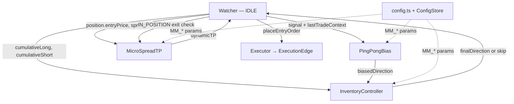
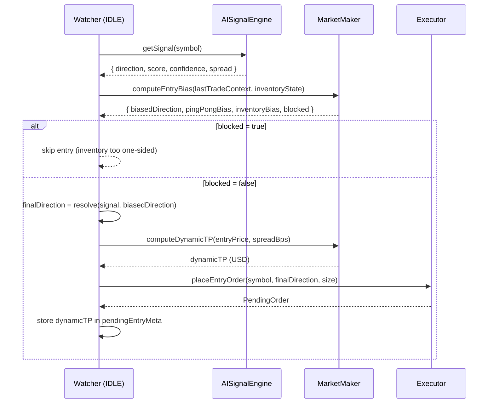
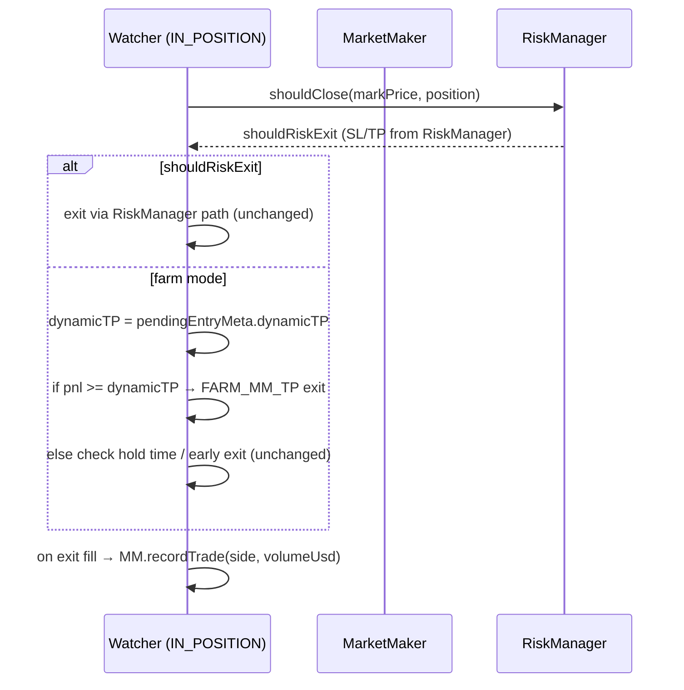
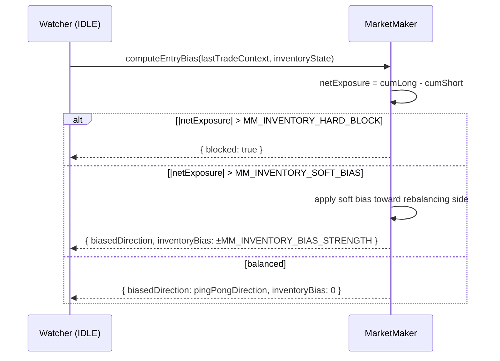

# Design Document: Farm Market Making (Phase 6)

## Overview

Phase 6 evolves APEX's FARM mode from a simple directional scalper into a pseudo market-maker that mimics the core profit mechanics of a real market maker: capturing the bid-ask spread repeatedly by alternating sides, controlling net inventory exposure, and sizing take-profit targets dynamically against the live spread.

Three interlocking subsystems are introduced: (1) **Ping-Pong** — after each exit, a directional bias is applied toward the opposite side so the bot naturally alternates long/short around mid-price, capturing the spread on each leg; (2) **Inventory Control** — cumulative net exposure (long volume minus short volume in USD) is tracked and used to soft-bias or hard-block entries that would deepen a one-sided book; (3) **Micro-Spread TP** — the fixed `FARM_TP_USD = $0.5` is replaced by a dynamic formula `profit_target = spread × MM_SPREAD_MULT`, so the bot targets a realistic fraction of the current spread rather than an arbitrary constant.

The existing state machine (`IDLE → PENDING_ENTRY → IN_POSITION → PENDING_EXIT → IDLE`), `ExecutionEdge` spread awareness, and `PositionSizer` are preserved and extended — no existing exit paths are removed.

---

## Architecture



Key design decisions:

| Decision | Choice | Rationale |
|---|---|---|
| Ping-pong as bias, not override | Soft bias added to score; LLM direction still wins if strong | Avoids fighting a strong trend; MM bias only matters in neutral markets |
| Inventory metric | Net USD exposure (cumLong − cumShort) | Directly comparable across different BTC price levels; intuitive threshold |
| Inventory enforcement | Soft bias first, hard block at 2× threshold | Graduated response; hard block only when exposure is extreme |
| Spread TP formula | `max(spread × MM_SPREAD_MULT, feeRoundTrip × MM_MIN_FEE_MULT)` | Ensures TP always covers fees; adapts to market conditions |
| Spread source | Reuse `ExecutionEdge` spread from entry tick | No extra API call; spread is already computed at entry |
| MM mode activation | Always-on in FARM mode (config flag `MM_ENABLED`) | Simplest activation; can be disabled via dashboard override |
| LLM interaction | MM bias applied after LLM signal, before direction decision | LLM provides market context; MM layer adjusts for inventory/spread |
| New module | `MarketMaker` class encapsulates all three subsystems | Keeps Watcher thin; all MM logic is independently testable |

---

## Sequence Diagrams

### IDLE → Entry with MM Bias



### IN_POSITION → Exit with Dynamic TP



### Inventory Rebalancing Flow



---

## Components and Interfaces

### MarketMaker

**Purpose**: Encapsulates all three MM subsystems — ping-pong bias, inventory control, and dynamic TP computation. Stateful: tracks `lastExitSide` and cumulative volume.

**Interface**:

```typescript
interface MMEntryBias {
  biasedDirection: 'long' | 'short' | null; // null = no MM preference
  pingPongBias: number;       // score delta from ping-pong (+/- MM_PINGPONG_BIAS_STRENGTH)
  inventoryBias: number;      // score delta from inventory (+/- MM_INVENTORY_BIAS_STRENGTH)
  blocked: boolean;           // true = hard block, do not enter
  blockReason?: string;       // 'inventory_long' | 'inventory_short'
  netExposureUsd: number;     // current cumLong - cumShort
}

interface MMState {
  cumLongUsd: number;         // cumulative long volume (USD) this session
  cumShortUsd: number;        // cumulative short volume (USD) this session
  lastExitSide: 'long' | 'short' | null;
  tradeCount: number;
}

interface MarketMakerInterface {
  computeEntryBias(
    lastTradeContext: { side: 'long' | 'short'; exitPrice: number; pnl: number } | null,
    inventoryState: MMState
  ): MMEntryBias;

  computeDynamicTP(entryPrice: number, spreadBps: number): number;

  recordTrade(side: 'long' | 'short', volumeUsd: number): void;

  getState(): MMState;

  reset(): void;
}
```

**Responsibilities**:
- Compute ping-pong directional bias from `lastExitSide`
- Compute inventory bias from `netExposureUsd`
- Hard-block entries when net exposure exceeds `MM_INVENTORY_HARD_BLOCK`
- Compute dynamic TP as `max(spread × MM_SPREAD_MULT × entryPrice / 10000, feeRoundTrip × MM_MIN_FEE_MULT)`
- Track cumulative long/short volume per session
- Expose `reset()` for session resets

---

### Config Extensions

New keys added to `config.ts` and `OverridableConfig`:

```typescript
// ── Farm Market Making (Phase 6) ──────────────────────────────────────────

// Master switch
MM_ENABLED: true,                    // enable pseudo market-making in FARM mode

// Ping-pong bias
MM_PINGPONG_BIAS_STRENGTH: 0.08,     // score delta added toward opposite side after exit
                                     // e.g. after LONG exit: short score += 0.08

// Inventory control
MM_INVENTORY_SOFT_BIAS: 50,          // net USD exposure above which soft bias activates
MM_INVENTORY_HARD_BLOCK: 150,        // net USD exposure above which entry is hard-blocked
MM_INVENTORY_BIAS_STRENGTH: 0.12,    // score delta applied when soft bias is active

// Micro-spread TP
MM_SPREAD_MULT: 1.5,                 // profit_target = spreadBps × MM_SPREAD_MULT × price / 10000
MM_MIN_FEE_MULT: 1.5,                // floor: profit_target >= feeRoundTrip × this
MM_TP_MAX_USD: 2.0,                  // ceiling on dynamic TP (USD) to avoid waiting forever
```

---

## Data Models

### MMState

```typescript
interface MMState {
  cumLongUsd: number;                    // USD; >= 0
  cumShortUsd: number;                   // USD; >= 0
  lastExitSide: 'long' | 'short' | null; // null at session start
  tradeCount: number;                    // total trades this session
}
```

**Validation rules**:
- `cumLongUsd >= 0`, `cumShortUsd >= 0`
- `tradeCount >= 0`

### MMEntryBias

```typescript
interface MMEntryBias {
  biasedDirection: 'long' | 'short' | null;
  pingPongBias: number;      // ∈ [-MM_PINGPONG_BIAS_STRENGTH, +MM_PINGPONG_BIAS_STRENGTH]
  inventoryBias: number;     // ∈ [-MM_INVENTORY_BIAS_STRENGTH, +MM_INVENTORY_BIAS_STRENGTH]
  blocked: boolean;
  blockReason?: string;
  netExposureUsd: number;
}
```

---

## Algorithmic Pseudocode

### Main: computeEntryBias

```pascal
ALGORITHM computeEntryBias(lastTradeContext, inventoryState)
INPUT: lastTradeContext — { side, exitPrice, pnl } | null
       inventoryState — MMState
OUTPUT: MMEntryBias

BEGIN
  netExposure ← inventoryState.cumLongUsd - inventoryState.cumShortUsd

  // Step 1: Hard block check
  IF netExposure > MM_INVENTORY_HARD_BLOCK THEN
    RETURN MMEntryBias {
      biasedDirection: null,
      pingPongBias: 0,
      inventoryBias: 0,
      blocked: true,
      blockReason: 'inventory_long',
      netExposureUsd: netExposure
    }
  END IF

  IF netExposure < -MM_INVENTORY_HARD_BLOCK THEN
    RETURN MMEntryBias {
      biasedDirection: null,
      pingPongBias: 0,
      inventoryBias: 0,
      blocked: true,
      blockReason: 'inventory_short',
      netExposureUsd: netExposure
    }
  END IF

  // Step 2: Ping-pong bias
  pingPongBias ← 0
  pingPongDirection ← null

  IF lastTradeContext IS NOT NULL THEN
    IF lastTradeContext.side = 'long' THEN
      // After long exit → bias toward short
      pingPongBias ← -MM_PINGPONG_BIAS_STRENGTH
      pingPongDirection ← 'short'
    ELSE
      // After short exit → bias toward long
      pingPongBias ← +MM_PINGPONG_BIAS_STRENGTH
      pingPongDirection ← 'long'
    END IF
  END IF

  // Step 3: Inventory soft bias (overrides ping-pong if conflicting)
  inventoryBias ← 0
  inventoryDirection ← pingPongDirection

  IF netExposure > MM_INVENTORY_SOFT_BIAS THEN
    // Too long → bias toward short
    inventoryBias ← -MM_INVENTORY_BIAS_STRENGTH
    inventoryDirection ← 'short'
  ELSE IF netExposure < -MM_INVENTORY_SOFT_BIAS THEN
    // Too short → bias toward long
    inventoryBias ← +MM_INVENTORY_BIAS_STRENGTH
    inventoryDirection ← 'long'
  END IF

  // Step 4: Combine — inventory bias takes precedence over ping-pong when active
  finalBiasedDirection ← IF inventoryBias ≠ 0 THEN inventoryDirection ELSE pingPongDirection

  RETURN MMEntryBias {
    biasedDirection: finalBiasedDirection,
    pingPongBias,
    inventoryBias,
    blocked: false,
    netExposureUsd: netExposure
  }
END
```

**Preconditions**:
- `MM_INVENTORY_HARD_BLOCK > MM_INVENTORY_SOFT_BIAS > 0`
- `MM_PINGPONG_BIAS_STRENGTH >= 0`
- `MM_INVENTORY_BIAS_STRENGTH >= 0`

**Postconditions**:
- If `|netExposure| > MM_INVENTORY_HARD_BLOCK` → `blocked = true`
- If `blocked = false` → `biasedDirection ∈ {'long', 'short', null}`
- `pingPongBias ∈ {-MM_PINGPONG_BIAS_STRENGTH, 0, +MM_PINGPONG_BIAS_STRENGTH}`
- `inventoryBias ∈ {-MM_INVENTORY_BIAS_STRENGTH, 0, +MM_INVENTORY_BIAS_STRENGTH}`

**Loop invariants**: N/A

---

### Sub-algorithm: computeDynamicTP

```pascal
ALGORITHM computeDynamicTP(entryPrice, spreadBps)
INPUT: entryPrice — USD price of entry fill
       spreadBps — current spread in basis points (from ExecutionEdge at entry)
OUTPUT: dynamicTP — USD profit target

BEGIN
  ASSERT entryPrice > 0
  ASSERT spreadBps >= 0

  // Spread-based target: capture MM_SPREAD_MULT × spread
  spreadTarget ← (spreadBps / 10000) × entryPrice × MM_SPREAD_MULT

  // Fee floor: always cover round-trip fees with margin
  positionValue ← entryPrice × ORDER_SIZE_MIN  // conservative estimate
  feeRoundTrip ← positionValue × FEE_RATE_MAKER × 2
  feeFloor ← feeRoundTrip × MM_MIN_FEE_MULT

  // Dynamic TP = max of spread target and fee floor, capped at MM_TP_MAX_USD
  dynamicTP ← max(spreadTarget, feeFloor)
  dynamicTP ← min(dynamicTP, MM_TP_MAX_USD)

  ASSERT dynamicTP > 0
  ASSERT dynamicTP <= MM_TP_MAX_USD

  RETURN dynamicTP
END
```

**Preconditions**:
- `entryPrice > 0`
- `spreadBps >= 0`
- `MM_SPREAD_MULT > 0`
- `MM_MIN_FEE_MULT >= 1.0`
- `MM_TP_MAX_USD > 0`

**Postconditions**:
- `dynamicTP > 0`
- `dynamicTP <= MM_TP_MAX_USD`
- `dynamicTP >= feeRoundTrip × MM_MIN_FEE_MULT` (always covers fees)
- Wider spread → larger `spreadTarget` → potentially larger `dynamicTP`

**Loop invariants**: N/A

---

### Sub-algorithm: Direction Resolution in Watcher (IDLE)

```pascal
ALGORITHM resolveFarmDirection(signal, mmBias)
INPUT: signal — { direction, score, confidence }
       mmBias — MMEntryBias
OUTPUT: finalDirection ∈ {'long', 'short', 'skip'}

BEGIN
  // MM hard block overrides everything
  IF mmBias.blocked THEN
    LOG "MM hard block: " + mmBias.blockReason
    RETURN 'skip'
  END IF

  // Combine signal score with MM biases
  adjustedScore ← signal.score + mmBias.pingPongBias + mmBias.inventoryBias

  // Determine direction from adjusted score
  signalDir ← signal.direction  // from LLM or momentum fallback
  scoreStrong ← |adjustedScore - 0.5| > FARM_SCORE_EDGE

  IF signalDir ≠ 'skip' AND scoreStrong THEN
    RETURN signalDir
  ELSE IF signal.confidence >= FARM_MIN_CONFIDENCE THEN
    // Weak signal — use adjusted score as tiebreaker
    // MM bias can tip a neutral signal toward the preferred side
    RETURN IF adjustedScore >= 0.5 THEN 'long' ELSE 'short'
  ELSE
    RETURN 'skip'
  END IF
END
```

**Preconditions**:
- `signal.score ∈ [0, 1]`
- `mmBias.blocked = false` (checked before calling)

**Postconditions**:
- Returns `'skip'` only when signal is too weak AND confidence is below threshold
- MM bias can convert a `'skip'` into a directional entry when confidence is sufficient
- MM bias cannot override a strong opposing signal (score edge check still applies)

**Loop invariants**: N/A

---

### Sub-algorithm: recordTrade

```pascal
ALGORITHM recordTrade(side, volumeUsd)
INPUT: side ∈ {'long', 'short'}, volumeUsd > 0
OUTPUT: void (mutates MMState)

BEGIN
  IF side = 'long' THEN
    state.cumLongUsd ← state.cumLongUsd + volumeUsd
  ELSE
    state.cumShortUsd ← state.cumShortUsd + volumeUsd
  END IF

  state.lastExitSide ← side
  state.tradeCount ← state.tradeCount + 1
END
```

**Postconditions**:
- `state.cumLongUsd >= 0`, `state.cumShortUsd >= 0`
- `state.lastExitSide = side`
- `state.tradeCount` incremented by 1

---

## Key Functions with Formal Specifications

### MarketMaker.computeEntryBias()

```typescript
computeEntryBias(
  lastTradeContext: { side: 'long' | 'short'; exitPrice: number; pnl: number } | null,
  inventoryState: MMState
): MMEntryBias
```

**Preconditions**:
- `inventoryState.cumLongUsd >= 0`
- `inventoryState.cumShortUsd >= 0`
- `config.MM_INVENTORY_HARD_BLOCK > config.MM_INVENTORY_SOFT_BIAS > 0`

**Postconditions**:
- `result.blocked = true` iff `|cumLongUsd - cumShortUsd| > MM_INVENTORY_HARD_BLOCK`
- `result.pingPongBias ∈ {-MM_PINGPONG_BIAS_STRENGTH, 0, +MM_PINGPONG_BIAS_STRENGTH}`
- `result.inventoryBias ∈ {-MM_INVENTORY_BIAS_STRENGTH, 0, +MM_INVENTORY_BIAS_STRENGTH}`
- No I/O performed (pure function given inputs)

---

### MarketMaker.computeDynamicTP()

```typescript
computeDynamicTP(entryPrice: number, spreadBps: number): number
```

**Preconditions**:
- `entryPrice > 0`
- `spreadBps >= 0`

**Postconditions**:
- `result > 0`
- `result <= config.MM_TP_MAX_USD`
- `result >= feeRoundTrip × config.MM_MIN_FEE_MULT` (fee floor always respected)
- `spreadBps_a >= spreadBps_b` implies `computeDynamicTP(p, spreadBps_a) >= computeDynamicTP(p, spreadBps_b)` (monotone in spread, before ceiling)

---

### MarketMaker.recordTrade()

```typescript
recordTrade(side: 'long' | 'short', volumeUsd: number): void
```

**Preconditions**:
- `volumeUsd > 0`

**Postconditions**:
- `state.cumLongUsd` or `state.cumShortUsd` increased by `volumeUsd`
- `state.lastExitSide = side`
- `state.tradeCount` incremented by 1

---

## Example Usage

```typescript
// In Watcher.ts — IDLE state, FARM mode, after signal fetch:

const mmBias = this.marketMaker.computeEntryBias(
  this.lastTradeContext,
  this.marketMaker.getState()
);

if (mmBias.blocked) {
  console.log(`🚫 [MM] Hard block: ${mmBias.blockReason} | net: ${mmBias.netExposureUsd.toFixed(0)} USD`);
  return;
}

console.log(
  `🔄 [MM] pingPong: ${mmBias.pingPongBias > 0 ? '+' : ''}${mmBias.pingPongBias.toFixed(2)}` +
  ` | inventory: ${mmBias.inventoryBias > 0 ? '+' : ''}${mmBias.inventoryBias.toFixed(2)}` +
  ` | net: ${mmBias.netExposureUsd.toFixed(0)} USD`
);

// Resolve final direction using adjusted score
const finalDirection = resolveFarmDirection(signal, mmBias);

// Compute dynamic TP using spread from ExecutionEdge (stored at entry)
const spreadBps = this._pendingEntrySpreadBps ?? 2; // fallback to 2bps if not available
const dynamicTP = this.marketMaker.computeDynamicTP(markPrice, spreadBps);
console.log(`🎯 [MM] Dynamic TP: $${dynamicTP.toFixed(3)} (spread: ${spreadBps.toFixed(1)}bps)`);

// Store for use in IN_POSITION exit check
this._pendingDynamicTP = dynamicTP;
```

```typescript
// In Watcher.ts — IN_POSITION exit check (farm mode):

const dynamicTP = config.MM_ENABLED
  ? (this._pendingDynamicTP ?? config.FARM_TP_USD)
  : config.FARM_TP_USD;

if (pnl >= dynamicTP) {
  shouldExit = true;
  exitTrigger = `FARM_MM_TP (${pnl.toFixed(3)} >= ${dynamicTP.toFixed(3)})`;
}
```

```typescript
// In Watcher.ts — PENDING_EXIT → exit filled:

if (config.MM_ENABLED) {
  const volumeUsd = filledSize * this.pendingExit.order.price;
  this.marketMaker.recordTrade(this.pendingExit.positionSide, volumeUsd);
}
```

```typescript
// Example: ping-pong in action
// Trade 1: LONG exit → lastExitSide = 'long'
// Trade 2: mmBias.pingPongBias = -0.08 → score biased toward short
// If signal.score = 0.52 (neutral), adjustedScore = 0.52 - 0.08 = 0.44 → SHORT entry

// Example: inventory hard block
// cumLong = $200, cumShort = $30 → netExposure = $170 > MM_INVENTORY_HARD_BLOCK ($150)
// → blocked = true, skip entry until short trades rebalance

// Example: dynamic TP
// spreadBps = 3, entryPrice = 95000
// spreadTarget = (3/10000) × 95000 × 1.5 = $42.75 → capped at MM_TP_MAX_USD = $2.0
// feeFloor = 0.003 × 95000 × 0.00012 × 2 × 1.5 = $0.103
// dynamicTP = max($42.75 capped to $2.0, $0.103) = $2.0

// Example: narrow spread
// spreadBps = 1, entryPrice = 95000
// spreadTarget = (1/10000) × 95000 × 1.5 = $14.25 → capped at $2.0
// dynamicTP = $2.0 (ceiling dominates at typical BTC prices)

// Example: very wide spread (illiquid)
// spreadBps = 8 → ExecutionEdge blocks entry (EXEC_MAX_SPREAD_BPS = 10)
// MM TP computation never reached
```

---

## Correctness Properties

*A property is a characteristic or behavior that should hold true across all valid executions of a system — essentially, a formal statement about what the system should do. Properties serve as the bridge between human-readable specifications and machine-verifiable correctness guarantees.*

### Property 1: Hard block is symmetric

*For any* `MMState` where `|cumLongUsd - cumShortUsd| > MM_INVENTORY_HARD_BLOCK`, `computeEntryBias()` returns `blocked = true` regardless of `lastTradeContext`.

**Validates: Requirements 2.1, 2.4**

---

### Property 2: Dynamic TP always covers fees

*For any* `entryPrice > 0` and `spreadBps >= 0`, `computeDynamicTP(entryPrice, spreadBps) >= feeRoundTrip × MM_MIN_FEE_MULT`.

**Validates: Requirements 5.5**

---

### Property 3: Dynamic TP is bounded above

*For any* `entryPrice > 0` and `spreadBps >= 0`, `computeDynamicTP(entryPrice, spreadBps) <= MM_TP_MAX_USD`.

**Validates: Requirements 5.4**

---

### Property 4: Dynamic TP is monotone in spread

*For any* fixed `entryPrice`, if `spreadBps_a >= spreadBps_b` then `computeDynamicTP(entryPrice, spreadBps_a) >= computeDynamicTP(entryPrice, spreadBps_b)` (before ceiling clamp).

**Validates: Requirements 5.6**

---

### Property 5: Ping-pong alternates sides

*For any* non-null `lastTradeContext` and non-blocked `MMState`, `computeEntryBias()` returns a `pingPongBias` with sign opposite to `lastTradeContext.side` (negative after long exit, positive after short exit).

**Validates: Requirements 3.1, 3.2, 3.4**

---

### Property 6: Inventory bias opposes net exposure

*For any* `MMState` where `netExposure > MM_INVENTORY_SOFT_BIAS` and `blocked = false`, `inventoryBias < 0`. *For any* `MMState` where `netExposure < -MM_INVENTORY_SOFT_BIAS` and `blocked = false`, `inventoryBias > 0`.

**Validates: Requirements 4.1, 4.2**

---

### Property 7: recordTrade accumulates volume correctly

*For any* sequence of `recordTrade()` calls with `volumeUsd > 0`, `state.cumLongUsd` equals the sum of all long volumes and `state.cumShortUsd` equals the sum of all short volumes, and both remain `>= 0`.

**Validates: Requirements 6.1, 6.2, 6.5**

---

### Property 8: Balanced inventory → no inventory bias

*For any* `MMState` where `|cumLongUsd - cumShortUsd| <= MM_INVENTORY_SOFT_BIAS`, `computeEntryBias().inventoryBias === 0`.

**Validates: Requirements 4.3**

---

## Error Handling

### Scenario 1: `spreadBps` unavailable at TP computation time

**Condition**: `ExecutionEdge` spread was not stored (e.g. entry placed before Phase 6 was active, or spread fetch failed)

**Response**: Fall back to `FARM_TP_USD` (existing fixed TP). `_pendingDynamicTP` is `null` → Watcher uses `config.FARM_TP_USD` as the TP target.

**Recovery**: Automatic on next trade when spread is available

---

### Scenario 2: `MM_INVENTORY_HARD_BLOCK < MM_INVENTORY_SOFT_BIAS` misconfiguration

**Condition**: Dashboard override sets hard block below soft bias threshold

**Response**: `validateOverrides` rejects: "MM_INVENTORY_HARD_BLOCK must be > MM_INVENTORY_SOFT_BIAS"

**Recovery**: Config unchanged; bot continues with previous valid config

---

### Scenario 3: `MM_SPREAD_MULT` set so high that TP is always at ceiling

**Condition**: `MM_SPREAD_MULT` is very large (e.g. 100), making `spreadTarget >> MM_TP_MAX_USD`

**Response**: `computeDynamicTP` clamps to `MM_TP_MAX_USD`. Bot behaves as if TP is fixed at `MM_TP_MAX_USD`. No crash or incorrect behavior.

**Recovery**: Operator adjusts `MM_SPREAD_MULT` via dashboard

---

### Scenario 4: Session reset clears inventory state

**Condition**: `Watcher.resetSession()` is called (manual or auto)

**Response**: `this.marketMaker.reset()` is called, zeroing `cumLongUsd`, `cumShortUsd`, `lastExitSide`, `tradeCount`. MM starts fresh.

**Recovery**: Automatic — inventory rebalances from zero on next session

---

### Scenario 5: `MM_ENABLED = false` (MM disabled via dashboard)

**Condition**: Operator disables MM mode mid-session

**Response**: Watcher skips `computeEntryBias()` and `computeDynamicTP()` calls. Falls back to existing FARM logic: fixed `FARM_TP_USD`, no ping-pong bias, no inventory control.

**Recovery**: Re-enable via dashboard; `MarketMaker` state is preserved (not reset on toggle)

---

## Testing Strategy

### Unit Testing Approach

`MarketMaker` is a pure-function class (no I/O) — all methods are testable in isolation:

- `computeEntryBias`: verify hard block at threshold, soft bias direction, ping-pong direction after long/short exit, inventory overrides ping-pong when conflicting, balanced inventory → zero bias
- `computeDynamicTP`: verify fee floor, ceiling clamp, spread monotonicity, zero spread → fee floor only
- `recordTrade`: verify cumulative accounting, `lastExitSide` update, `tradeCount` increment
- `resolveFarmDirection` (in Watcher): verify MM block → skip, bias tips neutral signal, strong signal not overridden by bias

### Property-Based Testing Approach

**Property Test Library**: `fast-check`

Key properties to test with generated inputs:

1. `|netExposure| > MM_INVENTORY_HARD_BLOCK` always produces `blocked = true`
2. `computeDynamicTP(p, s) <= MM_TP_MAX_USD` for any `p > 0`, `s >= 0`
3. `computeDynamicTP(p, s) >= feeFloor` for any `p > 0`, `s >= 0`
4. `computeDynamicTP(p, s_a) >= computeDynamicTP(p, s_b)` when `s_a >= s_b` (before ceiling)
5. After any sequence of `recordTrade()` calls, `cumLongUsd >= 0` and `cumShortUsd >= 0`
6. `|netExposure| <= MM_INVENTORY_SOFT_BIAS` implies `inventoryBias === 0`

### Integration Testing Approach

- Verify `Watcher` calls `marketMaker.recordTrade()` on every exit fill in FARM mode
- Verify `_pendingDynamicTP` is stored at entry and used in IN_POSITION exit check
- Verify `MM_ENABLED = false` falls back to `FARM_TP_USD` correctly
- Verify `marketMaker.reset()` is called in `Watcher.resetSession()`
- Verify new config keys propagate from `ConfigStore` to `MarketMaker` on next call

---

## Performance Considerations

- `computeEntryBias()` and `computeDynamicTP()` are pure synchronous computations — no I/O, no async
- `recordTrade()` is O(1) — two additions and two assignments
- `MarketMaker` state is in-memory only; no persistence needed (session-scoped)
- Spread value for TP computation is reused from `ExecutionEdge` — no extra API call

---

## Security Considerations

- All `MM_*` config values validated by `validateOverrides` before applying
- `MM_TP_MAX_USD` ceiling prevents runaway TP targets from misconfigured `MM_SPREAD_MULT`
- `MM_INVENTORY_HARD_BLOCK` provides a hard ceiling on one-sided exposure regardless of other biases
- `MM_ENABLED` flag allows instant disable without code changes

---

## Dependencies

- No new npm dependencies
- `src/config.ts` — new `MM_*` keys
- `src/config/ConfigStore.ts` — expose new keys in `OverridableConfig` + `validateOverrides`
- `src/modules/MarketMaker.ts` — new file (all three subsystems)
- `src/modules/Watcher.ts` — inject `MarketMaker`, call `computeEntryBias()` in IDLE, store `_pendingDynamicTP`, use dynamic TP in IN_POSITION, call `recordTrade()` on exit fill, call `reset()` in `resetSession()`
- `src/ai/TradeLogger.ts` — extend `TradeRecord` with `mmPingPongBias`, `mmInventoryBias`, `mmDynamicTP`, `mmNetExposure` fields for analytics
- `fast-check` (already in project) — property-based tests

