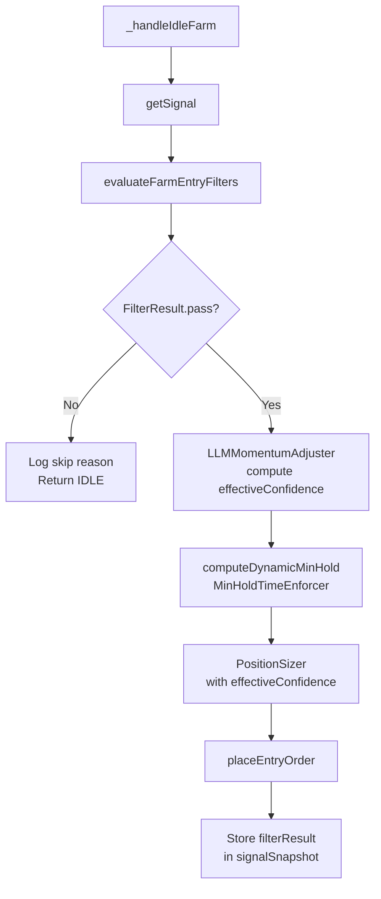

# Design Document: farm-signal-cost-optimizer

## Overview

Feature này implement một **signal filter pipeline** cho farm mode của trading bot, nhằm giảm số lượng trade có chi phí âm (fee > gross PnL) và tăng chất lượng entry signal. Dựa trên phân tích 1000+ trades thực tế, 6 vấn đề chính được giải quyết bằng 6 filter/adjuster thuần túy (pure functions), được tổ chức thành một pipeline có thứ tự rõ ràng.

**Mục tiêu chính:**
- Giảm tỷ lệ `wonBeforeFee = true` (trade thắng trước phí nhưng thua sau phí)
- Tăng `effectiveConfidence` accuracy bằng cách điều chỉnh theo LLM-Momentum alignment
- Enforce minimum hold time dựa trên ATR để price có đủ thời gian di chuyển cover fee
- Backward compatible: tất cả filters chỉ active khi `MODE === 'farm'`

---

## Architecture

### Tổng quan luồng xử lý



### Pipeline thứ tự filter

```
Signal
  │
  ▼
[1] RegimeConfidenceThreshold  ─── SKIP if regime-specific confidence too low
  │
  ▼
[2] TradePressureGate          ─── SKIP if pressure=0 AND confidence low
  │
  ▼
[3] FallbackQualityGate        ─── SKIP if fallback=true AND confidence very low
  │
  ▼
[4] FeeAwareEntryFilter        ─── SKIP if expectedEdge <= minRequiredMove × 1.5
  │
  ▼
[5] LLMMomentumAdjuster        ─── ADJUST effectiveConfidence (không reject)
  │
  ▼
[6] MinHoldTimeEnforcer        ─── COMPUTE dynamicMinHold at entry time
  │
  ▼
PositionSizer (uses effectiveConfidence)
  │
  ▼
placeEntryOrder
```

### Nguyên tắc thiết kế

1. **Pure functions**: Tất cả filters là pure functions — không có side effects, không đọc global state
2. **Single file**: Tất cả filters trong `src/modules/FarmSignalFilters.ts`
3. **Farm-only**: Mỗi filter có `mode` guard — no-op trong trade mode
4. **Short-circuit**: Pipeline dừng ngay khi có filter reject
5. **Immutable signal**: Filters không modify signal object — chỉ đọc và trả về kết quả

---

## Components and Interfaces

### 1. `FarmSignalFilters.ts` (file mới)

```typescript
// src/modules/FarmSignalFilters.ts

export interface FilterInput {
  // Signal fields
  regime: 'TREND_UP' | 'TREND_DOWN' | 'SIDEWAY' | 'HIGH_VOLATILITY';
  confidence: number;
  momentumScore: number;
  tradePressure: number;
  fallback: boolean;
  llmMatchesMomentum?: boolean | null;
  atrPct?: number;

  // Config fields
  mode: 'farm' | 'trade';
  FEE_RATE_MAKER: number;
  FARM_MIN_CONFIDENCE_PRESSURE_GATE: number;
  FARM_MIN_FALLBACK_CONFIDENCE: number;
  FARM_SIDEWAY_MIN_CONFIDENCE: number;
  FARM_TREND_MIN_CONFIDENCE: number;
  FARM_MIN_HOLD_SECS: number;
  FARM_MAX_HOLD_SECS: number;
}

export interface FilterResult {
  pass: boolean;
  reason?: string;           // filter name + rejection reason nếu pass=false
  effectiveConfidence: number;
  dynamicMinHold: number;    // seconds
}

// Pipeline entry point — gọi từ Watcher._handleIdleFarm
export function evaluateFarmEntryFilters(input: FilterInput): FilterResult

// Individual filters (exported for unit testing)
export function regimeConfidenceThreshold(input: FilterInput): { pass: boolean; reason?: string }
export function tradePressureGate(input: FilterInput): { pass: boolean; reason?: string }
export function fallbackQualityGate(input: FilterInput): { pass: boolean; reason?: string }
export function feeAwareEntryFilter(input: FilterInput): { pass: boolean; reason?: string }
export function llmMomentumAdjuster(input: FilterInput): number  // returns effectiveConfidence
export function computeDynamicMinHold(input: FilterInput): number  // returns seconds
```

### 2. Thay đổi `Watcher.ts`

Trong `_handleIdleFarm`, thêm pipeline call sau khi lấy signal:

```typescript
// Sau: const signal = await this.signalEngine.getSignal(this.symbol);
const filterResult = evaluateFarmEntryFilters({
  regime: signal.regime,
  confidence: signal.confidence,
  momentumScore: signal.score,
  tradePressure: signal.tradePressure,
  fallback: signal.fallback,
  llmMatchesMomentum: signal.llmMatchesMomentum,
  atrPct: signal.atrPct,
  mode: this._cfg.MODE as 'farm' | 'trade',
  FEE_RATE_MAKER: this._cfg.FEE_RATE_MAKER,
  FARM_MIN_CONFIDENCE_PRESSURE_GATE: this._cfg.FARM_MIN_CONFIDENCE_PRESSURE_GATE,
  FARM_MIN_FALLBACK_CONFIDENCE: this._cfg.FARM_MIN_FALLBACK_CONFIDENCE,
  FARM_SIDEWAY_MIN_CONFIDENCE: this._cfg.FARM_SIDEWAY_MIN_CONFIDENCE,
  FARM_TREND_MIN_CONFIDENCE: this._cfg.FARM_TREND_MIN_CONFIDENCE,
  FARM_MIN_HOLD_SECS: this._cfg.FARM_MIN_HOLD_SECS,
  FARM_MAX_HOLD_SECS: this._cfg.FARM_MAX_HOLD_SECS,
});

if (!filterResult.pass) {
  console.log(`[SignalFilter] SKIP: ${filterResult.reason}`);
  return; // ACTION: wait — RETURN
}

console.log(`[SignalFilter] PASS: regime=${signal.regime}, confidence=${signal.confidence.toFixed(2)}, pressure=${signal.tradePressure.toFixed(2)}, fallback=${signal.fallback}, effectiveConf=${filterResult.effectiveConfidence.toFixed(2)}`);
```

Thay thế `FARM_MIN_HOLD_SECS` random hold bằng `filterResult.dynamicMinHold`:

```typescript
// Thay vì: const holdSecs = Math.floor(Math.random() * ...) + FARM_MIN_HOLD_SECS
const holdSecs = filterResult.dynamicMinHold;
this.farmHoldUntil = Date.now() + holdSecs * 1000;
```

Truyền `effectiveConfidence` vào PositionSizer:

```typescript
const sizingResult = this.positionSizer.computeSize({
  confidence: filterResult.effectiveConfidence, // thay vì signal.confidence
  ...
});
```

Lưu `filterResult` vào `signalSnapshot`:

```typescript
this._pendingEntrySignalMeta = {
  ...
  signalSnapshot: {
    ...
    filterResult: filterResult.pass ? 'pass' : filterResult.reason,
    effectiveConfidence: filterResult.effectiveConfidence,
    dynamicMinHold: filterResult.dynamicMinHold,
  },
};
```

### 3. Thay đổi `config.ts`

Thêm 4 config keys mới:

```typescript
// Farm Signal Cost Optimizer
FARM_MIN_CONFIDENCE_PRESSURE_GATE: 0.55,
FARM_MIN_FALLBACK_CONFIDENCE: 0.25,
FARM_SIDEWAY_MIN_CONFIDENCE: 0.45,
FARM_TREND_MIN_CONFIDENCE: 0.35,
```

### 4. Thay đổi `TradeLogger.ts` — `SignalSnapshot`

```typescript
export interface SignalSnapshot {
  // ... existing fields ...
  filterResult?: string;          // 'pass' hoặc rejection reason
  effectiveConfidence?: number;   // confidence sau LLM adjustment
  dynamicMinHold?: number;        // computed min hold in seconds
}
```

### 5. Thay đổi `AnalyticsEngine.ts`

Thêm 3 stats mới vào `AnalyticsSummary`:

```typescript
export interface FilterSkipStats {
  regimeGate: number;
  pressureGate: number;
  fallbackGate: number;
  feeFilter: number;
  total: number;
}

export interface EffectiveConfidenceStats {
  avgRawConfidence: number;
  avgEffectiveConfidence: number;
  adjustedTradeCount: number;
}

export interface DynamicMinHoldStats {
  avgDynamicMinHold: number;
  avgActualHoldSecs: number;
  earlyExitRate: number;  // % trades exited before dynamicMinHold
}

// Thêm vào AnalyticsSummary:
filterSkipStats: FilterSkipStats;
effectiveConfidenceStats: EffectiveConfidenceStats;
dynamicMinHoldStats: DynamicMinHoldStats;
```

---

## Data Models

### FilterInput

| Field | Type | Source |
|-------|------|--------|
| `regime` | `'TREND_UP' \| 'TREND_DOWN' \| 'SIDEWAY' \| 'HIGH_VOLATILITY'` | `signal.regime` |
| `confidence` | `number` [0,1] | `signal.confidence` |
| `momentumScore` | `number` [0,1] | `signal.score` |
| `tradePressure` | `number` [0,1] | `signal.tradePressure` |
| `fallback` | `boolean` | `signal.fallback` |
| `llmMatchesMomentum` | `boolean \| null \| undefined` | `signal.llmMatchesMomentum` |
| `atrPct` | `number \| undefined` | `signal.atrPct` |
| `mode` | `'farm' \| 'trade'` | `this._cfg.MODE` |
| `FEE_RATE_MAKER` | `number` | `this._cfg.FEE_RATE_MAKER` |
| `FARM_MIN_CONFIDENCE_PRESSURE_GATE` | `number` | `this._cfg.FARM_MIN_CONFIDENCE_PRESSURE_GATE` |
| `FARM_MIN_FALLBACK_CONFIDENCE` | `number` | `this._cfg.FARM_MIN_FALLBACK_CONFIDENCE` |
| `FARM_SIDEWAY_MIN_CONFIDENCE` | `number` | `this._cfg.FARM_SIDEWAY_MIN_CONFIDENCE` |
| `FARM_TREND_MIN_CONFIDENCE` | `number` | `this._cfg.FARM_TREND_MIN_CONFIDENCE` |
| `FARM_MIN_HOLD_SECS` | `number` | `this._cfg.FARM_MIN_HOLD_SECS` |
| `FARM_MAX_HOLD_SECS` | `number` | `this._cfg.FARM_MAX_HOLD_SECS` |

### FilterResult

| Field | Type | Description |
|-------|------|-------------|
| `pass` | `boolean` | `true` nếu tất cả filters pass |
| `reason` | `string \| undefined` | Rejection reason nếu `pass=false`, format: `[FilterName] SKIP: ...` |
| `effectiveConfidence` | `number` | Confidence sau LLM adjustment (bằng raw confidence nếu không adjust) |
| `dynamicMinHold` | `number` | Minimum hold time tính bằng giây |

### Filter Logic Chi Tiết

#### RegimeConfidenceThreshold
```
if mode !== 'farm': return { pass: true }
threshold = regime === 'SIDEWAY' ? FARM_SIDEWAY_MIN_CONFIDENCE : FARM_TREND_MIN_CONFIDENCE
if confidence < threshold:
  return { pass: false, reason: '[RegimeGate] SKIP: regime={regime}, confidence={confidence} < {threshold}' }
return { pass: true }
```

#### TradePressureGate
```
if mode !== 'farm': return { pass: true }
if tradePressure === 0 AND confidence < FARM_MIN_CONFIDENCE_PRESSURE_GATE:
  return { pass: false, reason: '[PressureGate] SKIP: tradePressure=0, confidence={confidence} < {threshold}' }
return { pass: true }
```

#### FallbackQualityGate
```
if mode !== 'farm': return { pass: true }
if fallback === true AND confidence < FARM_MIN_FALLBACK_CONFIDENCE:
  return { pass: false, reason: '[FallbackGate] SKIP: fallback=true, confidence={confidence} < {threshold}' }
return { pass: true }
```

#### FeeAwareEntryFilter
```
if mode !== 'farm': return { pass: true }
minRequiredMove = FEE_RATE_MAKER * 2
expectedEdge = |momentumScore - 0.5| * 2 * (atrPct ?? 0)
if expectedEdge <= minRequiredMove * 1.5:
  return { pass: false, reason: '[FeeFilter] SKIP: edge={expectedEdge} <= minMove×1.5={threshold}' }
return { pass: true }
```

#### LLMMomentumAdjuster
```
if llmMatchesMomentum === true:
  return min(1.0, confidence * 1.10)
if llmMatchesMomentum === false AND confidence < 0.65:
  return confidence * 0.80
return confidence  // unchanged
```

#### MinHoldTimeEnforcer
```
if atrPct === 0 OR atrPct is null/undefined:
  return FARM_MIN_HOLD_SECS
feeBreakEvenSecs = (FEE_RATE_MAKER * 2 / atrPct) * 300
dynamicMinHold = max(FARM_MIN_HOLD_SECS, feeBreakEvenSecs)
return min(FARM_MAX_HOLD_SECS, dynamicMinHold)
```

---

## Correctness Properties

*A property is a characteristic or behavior that should hold true across all valid executions of a system — essentially, a formal statement about what the system should do. Properties serve as the bridge between human-readable specifications and machine-verifiable correctness guarantees.*

### Property 1: Fee filter rejects low-edge signals

*For any* farm mode signal where `|momentumScore - 0.5| * 2 * atrPct <= FEE_RATE_MAKER * 2 * 1.5`, the `feeAwareEntryFilter` SHALL return `pass = false`.

**Validates: Requirements 1.3**

---

### Property 2: Fee filter passes sufficient-edge signals

*For any* farm mode signal where `|momentumScore - 0.5| * 2 * atrPct > FEE_RATE_MAKER * 2 * 1.5`, the `feeAwareEntryFilter` SHALL return `pass = true`.

**Validates: Requirements 1.4**

---

### Property 3: All filters are no-ops in trade mode

*For any* signal with `mode = 'trade'`, all four gate filters (`regimeConfidenceThreshold`, `tradePressureGate`, `fallbackQualityGate`, `feeAwareEntryFilter`) SHALL return `pass = true` regardless of signal values.

**Validates: Requirements 1.5, 2.5, 4.5, 5.6**

---

### Property 4: Pressure gate rejects zero-pressure low-confidence signals

*For any* farm mode signal where `tradePressure === 0` AND `confidence < FARM_MIN_CONFIDENCE_PRESSURE_GATE`, the `tradePressureGate` SHALL return `pass = false`.

**Validates: Requirements 2.1**

---

### Property 5: Pressure gate passes non-zero-pressure or high-confidence signals

*For any* farm mode signal where `tradePressure > 0` OR `confidence >= FARM_MIN_CONFIDENCE_PRESSURE_GATE`, the `tradePressureGate` SHALL return `pass = true`.

**Validates: Requirements 2.2**

---

### Property 6: LLM mismatch penalty is applied correctly

*For any* confidence value `c ∈ [0, 0.65)` with `llmMatchesMomentum = false`, the `llmMomentumAdjuster` SHALL return `effectiveConfidence = c * 0.80`.

**Validates: Requirements 3.1**

---

### Property 7: LLM match boost is applied correctly and capped at 1.0

*For any* confidence value `c ∈ [0, 1]` with `llmMatchesMomentum = true`, the `llmMomentumAdjuster` SHALL return `effectiveConfidence = min(1.0, c * 1.10)`.

**Validates: Requirements 3.2**

---

### Property 8: LLM adjuster is identity for null/undefined and high-confidence mismatch

*For any* confidence value `c` where `llmMatchesMomentum` is `null`, `undefined`, or (`false` AND `c >= 0.65`), the `llmMomentumAdjuster` SHALL return `effectiveConfidence = c` unchanged.

**Validates: Requirements 3.3, 3.4**

---

### Property 9: Fallback gate rejects low-confidence fallback signals

*For any* farm mode signal where `fallback = true` AND `confidence < FARM_MIN_FALLBACK_CONFIDENCE`, the `fallbackQualityGate` SHALL return `pass = false`.

**Validates: Requirements 4.1**

---

### Property 10: Regime gate rejects low-confidence signals per regime

*For any* farm mode signal where `regime = 'SIDEWAY'` AND `confidence < FARM_SIDEWAY_MIN_CONFIDENCE`, OR where `regime ∈ {'TREND_UP', 'TREND_DOWN'}` AND `confidence < FARM_TREND_MIN_CONFIDENCE`, the `regimeConfidenceThreshold` SHALL return `pass = false`.

**Validates: Requirements 5.1, 5.2**

---

### Property 11: dynamicMinHold is bounded between FARM_MIN_HOLD_SECS and FARM_MAX_HOLD_SECS

*For any* valid `atrPct`, `FEE_RATE_MAKER`, `FARM_MIN_HOLD_SECS`, and `FARM_MAX_HOLD_SECS`, the `computeDynamicMinHold` function SHALL return a value `d` such that `FARM_MIN_HOLD_SECS <= d <= FARM_MAX_HOLD_SECS`.

**Validates: Requirements 6.2, 6.5**

---

### Property 12: dynamicMinHold falls back to FARM_MIN_HOLD_SECS when atrPct is zero or unavailable

*For any* input where `atrPct === 0` or `atrPct` is `null`/`undefined`, the `computeDynamicMinHold` function SHALL return exactly `FARM_MIN_HOLD_SECS`.

**Validates: Requirements 6.6**

---

### Property 13: Pipeline short-circuits on first rejection

*For any* signal that is rejected by filter N (where N ∈ {1,2,3,4}), the `evaluateFarmEntryFilters` pipeline SHALL return a `FilterResult` with `reason` identifying filter N, not any subsequent filter.

**Validates: Requirements 7.1, 7.2**

---

### Property 14: filterSkipStats counts match trade records

*For any* collection of farm trade records with `signalSnapshot.filterResult` values, the `AnalyticsEngine.compute()` SHALL return `filterSkipStats` where each per-filter count equals the number of records with that filter's rejection prefix in `filterResult`.

**Validates: Requirements 9.1, 9.2**

---

### Property 15: Config validation rejects out-of-range values

*For any* new config key (`FARM_MIN_CONFIDENCE_PRESSURE_GATE`, `FARM_MIN_FALLBACK_CONFIDENCE`, `FARM_SIDEWAY_MIN_CONFIDENCE`, `FARM_TREND_MIN_CONFIDENCE`) set to a value outside `[0, 1]`, the ConfigStore validation SHALL throw an error.

**Validates: Requirements 8.2**

---

## Error Handling

### atrPct = 0 hoặc undefined
- `computeDynamicMinHold` fallback về `FARM_MIN_HOLD_SECS`
- `feeAwareEntryFilter`: khi `atrPct = 0`, `expectedEdge = 0` → filter sẽ reject (vì `0 <= minRequiredMove * 1.5`)
- Đây là behavior đúng: không có volatility data → không nên enter

### tradePressure = NaN
- Treat như `tradePressure = 0` trong TradePressureGate (defensive check)

### llmMatchesMomentum = undefined (signal từ fallback engine)
- LLMMomentumAdjuster trả về `effectiveConfidence = confidence` unchanged
- Không penalty, không boost

### Config validation errors
- Throw `Error` với message rõ ràng tại startup
- Warning log khi `FARM_SIDEWAY_MIN_CONFIDENCE < FARM_TREND_MIN_CONFIDENCE`

### Pipeline với mode = 'trade'
- Tất cả filters return `pass = true` ngay lập tức
- `effectiveConfidence = confidence` (không adjust)
- `dynamicMinHold = FARM_MIN_HOLD_SECS` (không compute)

---

## Testing Strategy

### Dual Testing Approach

Feature này sử dụng cả **unit tests** (example-based) và **property-based tests** vì core logic là pure functions với input space lớn.

### Property-Based Testing

Sử dụng **fast-check** (đã có trong project hoặc thêm vào).

Mỗi property test chạy tối thiểu **100 iterations**.

Tag format: `Feature: farm-signal-cost-optimizer, Property {N}: {property_text}`

**File**: `src/modules/__tests__/FarmSignalFilters.properties.test.ts`

Các property tests cần implement (tương ứng với Correctness Properties):

- **Property 1 & 2**: Generate `momentumScore ∈ [0,1]`, `atrPct ∈ [0, 0.05]`, `FEE_RATE_MAKER = 0.00012` → verify fee filter pass/reject logic
- **Property 3**: Generate bất kỳ signal với `mode = 'trade'` → tất cả filters pass
- **Property 4 & 5**: Generate `tradePressure ∈ [0,1]`, `confidence ∈ [0,1]` → verify pressure gate
- **Property 6, 7, 8**: Generate `confidence ∈ [0,1]`, `llmMatchesMomentum ∈ {true, false, null, undefined}` → verify adjuster output
- **Property 9**: Generate `fallback ∈ {true, false}`, `confidence ∈ [0,1]` → verify fallback gate
- **Property 10**: Generate `regime ∈ {'SIDEWAY', 'TREND_UP', 'TREND_DOWN'}`, `confidence ∈ [0,1]` → verify regime gate
- **Property 11 & 12**: Generate `atrPct ∈ [0, 0.1]`, `FARM_MIN_HOLD_SECS`, `FARM_MAX_HOLD_SECS` → verify bounds
- **Property 13**: Generate signals that fail at each filter stage → verify short-circuit
- **Property 14**: Generate trade records with filterResult values → verify analytics counts
- **Property 15**: Generate out-of-range config values → verify validation throws

### Unit Tests (Example-Based)

**File**: `src/modules/__tests__/FarmSignalFilters.test.ts`

Các example tests:
- Default config values (Requirements 2.3, 4.3, 5.3, 5.4, 8.1)
- Log output format khi filter reject (Requirements 1.6, 2.4, 4.4, 5.5)
- Log output khi all filters pass (Requirement 7.5)
- PositionSizer nhận `effectiveConfidence` (Requirement 3.5)
- Pipeline happy path: signal passes all filters → entry placed (Requirement 7.4)
- Config warning khi `FARM_SIDEWAY_MIN_CONFIDENCE < FARM_TREND_MIN_CONFIDENCE` (Requirement 8.3)
- `AnalyticsSummary` có đủ 3 fields mới (Requirement 9.5)

### Integration Tests

**File**: `src/modules/__tests__/FarmSignalFilters.integration.test.ts`

- Watcher `_handleIdleFarm` với signal bị reject → không place order
- Watcher `_handleIdleFarm` với signal pass → place order với `effectiveConfidence`
- `farmHoldUntil` được set theo `dynamicMinHold` (không phải random)
- `signalSnapshot.filterResult` được lưu vào trade record
