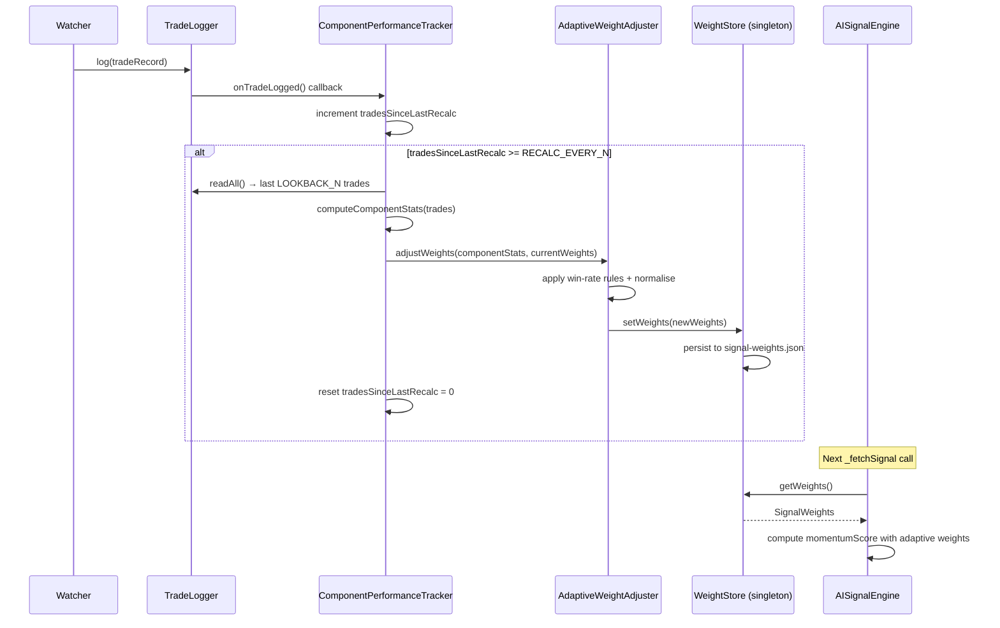
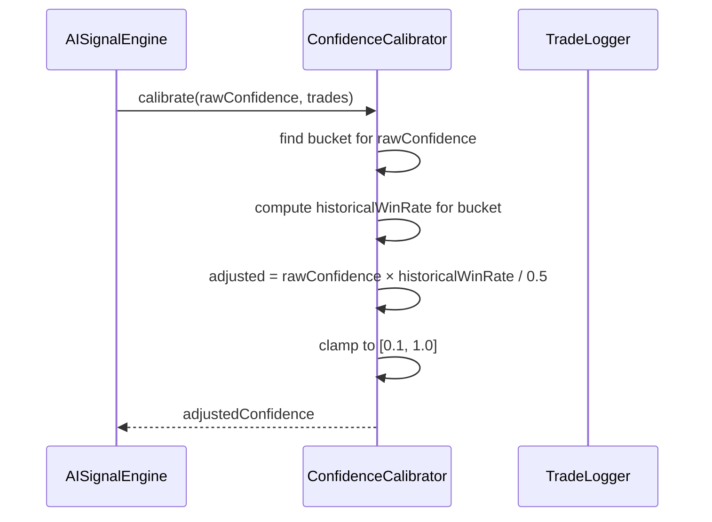

# Design Document: Feedback Loop (Phase 1)

## Overview

The Feedback Loop closes the signal-to-outcome gap in APEX by tracking how well each individual signal component (EMA trend, RSI, momentum, orderbook imbalance) predicts trade outcomes, then using that performance history to dynamically reweight the `momentumScore` formula in `AISignalEngine` and calibrate LLM confidence values. The system is designed as a lightweight addition on top of the existing `TradeLogger` + `AnalyticsEngine` stack — no new persistence backend is introduced; weights are stored in a JSON sidecar file alongside `config-overrides.json`.

The four sub-features are: **Component Performance Tracking** (2.2), **Adaptive Weight Adjustment** (2.3), **Confidence Calibration** (2.4), and the glue that wires them into `AISignalEngine` at signal-compute time. Trade outcome attribution (2.1) is already complete via `TradeRecord`/`TradeLogger` and requires no new work.

---

## Architecture

```mermaid
graph TD
    TL[TradeLogger] -->|TradeRecord written| CB[ComponentPerformanceTracker]
    CB -->|component stats| AWA[AdaptiveWeightAdjuster]
    AWA -->|SignalWeights| WP[weights.json on disk]
    WP -->|loaded at startup + after each recalc| ASE[AISignalEngine._fetchSignal]
    TL -->|TradeRecord[]| CC[ConfidenceCalibrator]
    CC -->|bucket multipliers| ASE
    ASE -->|adjusted momentumScore + calibrated confidence| Watcher
    CS[ConfigStore] -.->|optional weight override via API| AWA
```

Key design decisions resolved:

| Decision | Choice | Rationale |
|---|---|---|
| Where to compute component perf? | New `ComponentPerformanceTracker` service | Keeps `AnalyticsEngine` read-only/reporting; tracker owns write path |
| Recalculation frequency | Every N trades (default N=10) | Per-trade is noisy; time-based adds clock complexity; N=10 is a good rolling window |
| Weight bounds | min 0.05, max 0.60 per component | Prevents degenerate all-in on one signal; sum always normalised to 1.0 |
| How `AISignalEngine` reads weights | Singleton `WeightStore` (lazy-loaded, file-watched) | No DI refactor needed; engine reads current weights on each `_fetchSignal` call |
| Persistence | JSON file `signal-weights.json` | Consistent with `config-overrides.json` pattern; no new deps |
| Lookback window | Last 50 trades (configurable) | Enough signal for stats; recent enough to adapt to regime changes |

---

## Sequence Diagrams

### Weight Recalculation Flow (triggered every N trades)



### Confidence Calibration Flow



---

## Components and Interfaces

### ComponentPerformanceTracker

**Purpose**: Listens for new trade records, computes per-component win rates over a rolling lookback window, and triggers weight recalculation every N trades.

**Interface**:
```typescript
interface ComponentStats {
  ema: { total: number; wins: number; winRate: number };
  rsi: { total: number; wins: number; winRate: number; lossStreak: number };
  momentum: { total: number; wins: number; winRate: number };
  imbalance: { total: number; wins: number; winRate: number };
}

interface ComponentPerformanceTrackerInterface {
  /** Attach to TradeLogger.onTradeLogged — called after every trade */
  onTradeLogged(): void;
  /** Returns latest computed stats (for dashboard/debug) */
  getStats(): ComponentStats;
}
```

**Responsibilities**:
- Count trades where each component gave a directional signal and track whether the trade won
- Maintain `tradesSinceLastRecalc` counter; trigger recalc when it hits `RECALC_EVERY_N`
- Delegate weight update to `AdaptiveWeightAdjuster`
- Expose `getStats()` for the dashboard

**Component attribution rules**:
- EMA: `emaAbove === true` → predicted long; `emaAbove === false` → predicted short. Win = trade direction matches prediction AND `pnl > 0`
- RSI: `rsiOversold === true` → predicted long; `rsiOverbought === true` → predicted short. Only counted when one of these flags is set (neutral RSI excluded)
- Momentum: `momentum3candles > 0` → predicted long; `< 0` → predicted short
- Imbalance: `imbalance > 1` → predicted long; `< 1` → predicted short

---

### AdaptiveWeightAdjuster

**Purpose**: Takes component stats and current weights, applies adjustment rules, normalises to sum=1.0, and enforces bounds.

**Interface**:
```typescript
interface SignalWeights {
  ema: number;       // default 0.40
  rsi: number;       // default 0.25
  momentum: number;  // default 0.20
  imbalance: number; // default 0.15
}

interface AdaptiveWeightAdjusterInterface {
  adjustWeights(stats: ComponentStats, current: SignalWeights): SignalWeights;
}
```

**Adjustment rules** (applied sequentially, then normalised):

```typescript
// Step 1: apply delta per component
if (stats.ema.winRate > 0.60)      newEma   = current.ema   + WEIGHT_STEP;
if (stats.ema.winRate < 0.40)      newEma   = current.ema   - WEIGHT_STEP;
if (stats.rsi.lossStreak > RSI_LOSS_STREAK_THRESHOLD) newRsi = current.rsi - WEIGHT_STEP;
if (stats.rsi.winRate > 0.60)      newRsi   = current.rsi   + WEIGHT_STEP;
if (stats.momentum.winRate > 0.60) newMom   = current.momentum + WEIGHT_STEP;
if (stats.momentum.winRate < 0.40) newMom   = current.momentum - WEIGHT_STEP;
if (stats.imbalance.winRate > 0.60) newImb  = current.imbalance + WEIGHT_STEP;
if (stats.imbalance.winRate < 0.40) newImb  = current.imbalance - WEIGHT_STEP;

// Step 2: clamp each to [MIN_WEIGHT, MAX_WEIGHT]
// Step 3: normalise so sum === 1.0
```

**Constants**:
- `WEIGHT_STEP = 0.05`
- `MIN_WEIGHT = 0.05`
- `MAX_WEIGHT = 0.60`
- `RSI_LOSS_STREAK_THRESHOLD = 3`

---

### WeightStore

**Purpose**: Singleton that holds the current `SignalWeights` in memory, persists to `signal-weights.json`, and loads from disk at startup.

**Interface**:
```typescript
interface WeightStoreInterface {
  getWeights(): SignalWeights;
  setWeights(w: SignalWeights): void;
  loadFromDisk(): void;
  saveToDisk(): void;
}
```

**Responsibilities**:
- Provide a single in-memory source of truth for weights
- Persist atomically (write to `.tmp` then rename) to avoid corrupt reads
- Fall back to `DEFAULT_WEIGHTS` if file is missing or invalid
- Expose `getWeights()` as a zero-cost synchronous call (no I/O on hot path)

---

### ConfidenceCalibrator

**Purpose**: Adjusts raw LLM/fallback confidence using historical win rates per confidence bucket.

**Interface**:
```typescript
interface ConfidenceBucket {
  label: string;
  min: number;
  max: number;
  winRate: number;
  total: number;
}

interface ConfidenceCalibratorInterface {
  /** Compute bucket win rates from trade history */
  computeBuckets(trades: TradeRecord[]): ConfidenceBucket[];
  /** Adjust a raw confidence value using historical bucket win rate */
  calibrate(rawConfidence: number, trades: TradeRecord[]): number;
}
```

**Calibration formula**:
```
adjusted = rawConfidence × (historicalWinRate / BASELINE_WIN_RATE)
adjusted = clamp(adjusted, 0.10, 1.00)
```
Where `BASELINE_WIN_RATE = 0.50` (random baseline). If a bucket has fewer than `MIN_BUCKET_TRADES = 5` trades, calibration is skipped (returns `rawConfidence` unchanged) to avoid overfitting on sparse data.

**Buckets** (same as `AnalyticsEngine`):
- `0.5–0.6`, `0.6–0.7`, `0.7–0.8`, `0.8–1.0`

---

## Data Models

### SignalWeights

```typescript
interface SignalWeights {
  ema: number;        // [0.05, 0.60]
  rsi: number;        // [0.05, 0.60]
  momentum: number;   // [0.05, 0.60]
  imbalance: number;  // [0.05, 0.60]
  // Invariant: ema + rsi + momentum + imbalance === 1.0 (±0.001 float tolerance)
  updatedAt?: string; // ISO 8601 — when last recalculated
  tradeCount?: number; // how many trades were in the lookback window
}
```

**Validation rules**:
- Each weight ∈ [0.05, 0.60]
- Sum of all four weights ∈ [0.999, 1.001]
- `updatedAt` is optional (absent on default weights)

### ComponentStats

```typescript
interface ComponentStats {
  ema: ComponentStat;
  rsi: ComponentStat & { lossStreak: number };
  momentum: ComponentStat;
  imbalance: ComponentStat;
  computedAt: string;   // ISO 8601
  lookbackN: number;    // how many trades were analysed
}

interface ComponentStat {
  total: number;   // trades where component gave a directional signal
  wins: number;    // component prediction matched trade outcome
  winRate: number; // wins / total (0 if total === 0)
}
```

---

## Algorithmic Pseudocode

### Main: computeComponentStats

```pascal
ALGORITHM computeComponentStats(trades, lookbackN)
INPUT: trades — array of TradeRecord (sorted desc by timestamp), lookbackN — integer
OUTPUT: ComponentStats

BEGIN
  recent ← trades.slice(0, lookbackN)
  
  ema_total ← 0; ema_wins ← 0
  rsi_total ← 0; rsi_wins ← 0; rsi_loss_streak ← 0; rsi_cur_streak ← 0
  mom_total ← 0; mom_wins ← 0
  imb_total ← 0; imb_wins ← 0

  FOR each trade IN recent DO
    won ← trade.pnl > 0
    dir ← trade.direction  // 'long' | 'short'

    // EMA component
    IF trade.emaCrossUp IS NOT NULL OR trade.ema9 IS NOT NULL THEN
      ema_predicted ← (trade.ema9 > trade.ema21) ? 'long' : 'short'
      ema_total ← ema_total + 1
      IF ema_predicted = dir AND won THEN ema_wins ← ema_wins + 1 END IF
    END IF

    // RSI component (only when oversold or overbought)
    rsi_val ← trade.rsi
    IF rsi_val < 35 OR rsi_val > 65 THEN
      rsi_predicted ← (rsi_val < 35) ? 'long' : 'short'
      rsi_total ← rsi_total + 1
      IF rsi_predicted = dir AND won THEN
        rsi_wins ← rsi_wins + 1
        rsi_cur_streak ← 0
      ELSE
        rsi_cur_streak ← rsi_cur_streak + 1
        IF rsi_cur_streak > rsi_loss_streak THEN
          rsi_loss_streak ← rsi_cur_streak
        END IF
      END IF
    END IF

    // Momentum component
    IF trade.momentum3candles IS NOT NULL THEN
      mom_predicted ← (trade.momentum3candles > 0) ? 'long' : 'short'
      mom_total ← mom_total + 1
      IF mom_predicted = dir AND won THEN mom_wins ← mom_wins + 1 END IF
    END IF

    // Imbalance component
    IF trade.imbalance IS NOT NULL THEN
      imb_predicted ← (trade.imbalance > 1) ? 'long' : 'short'
      imb_total ← imb_total + 1
      IF imb_predicted = dir AND won THEN imb_wins ← imb_wins + 1 END IF
    END IF
  END FOR

  RETURN ComponentStats {
    ema:      { total: ema_total, wins: ema_wins, winRate: ema_total > 0 ? ema_wins/ema_total : 0 },
    rsi:      { total: rsi_total, wins: rsi_wins, winRate: rsi_total > 0 ? rsi_wins/rsi_total : 0, lossStreak: rsi_loss_streak },
    momentum: { total: mom_total, wins: mom_wins, winRate: mom_total > 0 ? mom_wins/mom_total : 0 },
    imbalance:{ total: imb_total, wins: imb_wins, winRate: imb_total > 0 ? imb_wins/imb_total : 0 },
    computedAt: now(),
    lookbackN: recent.length
  }
END
```

**Preconditions**:
- `trades` is sorted descending by timestamp
- `lookbackN > 0`

**Postconditions**:
- All `winRate` values ∈ [0, 1]
- `total >= wins` for every component
- `lookbackN` in result equals `min(trades.length, lookbackN)`

---

### Main: adjustWeights

```pascal
ALGORITHM adjustWeights(stats, current)
INPUT: stats — ComponentStats, current — SignalWeights
OUTPUT: SignalWeights (normalised, bounded)

BEGIN
  ASSERT sum(current) ≈ 1.0

  w ← copy(current)

  // Apply deltas
  IF stats.ema.total >= MIN_STAT_TRADES THEN
    IF stats.ema.winRate > 0.60 THEN w.ema ← w.ema + WEIGHT_STEP END IF
    IF stats.ema.winRate < 0.40 THEN w.ema ← w.ema - WEIGHT_STEP END IF
  END IF

  IF stats.rsi.total >= MIN_STAT_TRADES THEN
    IF stats.rsi.lossStreak > RSI_LOSS_STREAK_THRESHOLD THEN w.rsi ← w.rsi - WEIGHT_STEP END IF
    IF stats.rsi.winRate > 0.60 THEN w.rsi ← w.rsi + WEIGHT_STEP END IF
  END IF

  IF stats.momentum.total >= MIN_STAT_TRADES THEN
    IF stats.momentum.winRate > 0.60 THEN w.momentum ← w.momentum + WEIGHT_STEP END IF
    IF stats.momentum.winRate < 0.40 THEN w.momentum ← w.momentum - WEIGHT_STEP END IF
  END IF

  IF stats.imbalance.total >= MIN_STAT_TRADES THEN
    IF stats.imbalance.winRate > 0.60 THEN w.imbalance ← w.imbalance + WEIGHT_STEP END IF
    IF stats.imbalance.winRate < 0.40 THEN w.imbalance ← w.imbalance - WEIGHT_STEP END IF
  END IF

  // Clamp each weight to [MIN_WEIGHT, MAX_WEIGHT]
  FOR each key IN [ema, rsi, momentum, imbalance] DO
    w[key] ← clamp(w[key], MIN_WEIGHT, MAX_WEIGHT)
  END FOR

  // Normalise to sum = 1.0
  total ← w.ema + w.rsi + w.momentum + w.imbalance
  FOR each key IN [ema, rsi, momentum, imbalance] DO
    w[key] ← w[key] / total
  END FOR

  ASSERT sum(w) ≈ 1.0
  ASSERT ∀ key: w[key] ∈ [MIN_WEIGHT/total, MAX_WEIGHT/total]

  RETURN w
END
```

**Preconditions**:
- `sum(current) ≈ 1.0`
- `MIN_STAT_TRADES > 0` (guards against adjusting on zero-data components)

**Postconditions**:
- `sum(result) ∈ [0.999, 1.001]`
- `∀ key: result[key] > 0` (normalisation after clamping guarantees this)

**Loop invariants**: N/A (no loops; sequential conditionals)

---

### Main: calibrateConfidence

```pascal
ALGORITHM calibrateConfidence(rawConf, trades)
INPUT: rawConf ∈ [0, 1], trades — array of TradeRecord
OUTPUT: adjustedConf ∈ [0.10, 1.00]

BEGIN
  buckets ← [
    { min: 0.5, max: 0.6 },
    { min: 0.6, max: 0.7 },
    { min: 0.7, max: 0.8 },
    { min: 0.8, max: 1.01 }
  ]

  bucket ← FIND bucket WHERE rawConf >= bucket.min AND rawConf < bucket.max

  IF bucket IS NULL THEN
    RETURN rawConf  // outside calibration range, return as-is
  END IF

  bucketTrades ← FILTER trades WHERE confidence >= bucket.min AND confidence < bucket.max
  
  IF bucketTrades.length < MIN_BUCKET_TRADES THEN
    RETURN rawConf  // insufficient data, skip calibration
  END IF

  wins ← COUNT bucketTrades WHERE pnl > 0
  historicalWinRate ← wins / bucketTrades.length

  adjusted ← rawConf × (historicalWinRate / BASELINE_WIN_RATE)
  adjusted ← clamp(adjusted, 0.10, 1.00)

  RETURN adjusted
END
```

**Preconditions**:
- `rawConf ∈ [0, 1]`
- `BASELINE_WIN_RATE > 0`
- `MIN_BUCKET_TRADES > 0`

**Postconditions**:
- `result ∈ [0.10, 1.00]`
- If `bucketTrades.length < MIN_BUCKET_TRADES`, result equals `rawConf` (no-op)

---

## Key Functions with Formal Specifications

### WeightStore.getWeights()

```typescript
getWeights(): SignalWeights
```

**Preconditions**: WeightStore has been initialised (loadFromDisk called or defaults set)

**Postconditions**:
- Returns a `SignalWeights` object where `ema + rsi + momentum + imbalance ∈ [0.999, 1.001]`
- Each component weight ∈ (0, 1)
- No I/O performed (pure in-memory read)

---

### ComponentPerformanceTracker.onTradeLogged()

```typescript
onTradeLogged(): void
```

**Preconditions**: `TradeLogger` instance is available and readable

**Postconditions**:
- `tradesSinceLastRecalc` incremented by 1
- If `tradesSinceLastRecalc >= RECALC_EVERY_N`: weights recalculated and persisted, counter reset to 0
- No exceptions thrown (errors logged, not propagated — must not crash the trade loop)

**Loop invariants**: N/A

---

### AISignalEngine._fetchSignal() (modified)

The existing weight constants are replaced with a `WeightStore.getWeights()` call:

```typescript
// Before (static):
momentumScore = emaTrend * 0.40;
momentumScore += rsiScore * 0.25;
momentumScore += momScore * 0.20;
momentumScore += imbScore * 0.15;

// After (adaptive):
const w = weightStore.getWeights();
momentumScore = emaTrend * w.ema;
momentumScore += rsiScore * w.rsi;
momentumScore += momScore * w.momentum;
momentumScore += imbScore * w.imbalance;

// Confidence calibration (after LLM decision):
const calibrated = confidenceCalibrator.calibrate(decision.confidence, recentTrades);
```

**Preconditions**: `weightStore` singleton is initialised before first signal call

**Postconditions**:
- `momentumScore` computed with weights that sum to 1.0 (same mathematical range as before)
- Confidence value is calibrated if sufficient historical data exists, otherwise unchanged

---

## Example Usage

```typescript
// Startup (in bot.ts or Watcher constructor):
weightStore.loadFromDisk();

// Wire tracker to logger:
tradeLogger.onTradeLogged = () => componentPerformanceTracker.onTradeLogged();

// In AISignalEngine._fetchSignal (weight section):
const w = weightStore.getWeights();
let momentumScore = emaTrend * w.ema;
momentumScore += rsiScore * w.rsi;
momentumScore += momScore * w.momentum;
momentumScore += imbScore * w.imbalance;

// Confidence calibration:
const trades = await tradeLogger.readAll();
const calibratedConf = confidenceCalibrator.calibrate(decision.confidence, trades.slice(0, 50));

// Dashboard endpoint (GET /api/feedback-loop/stats):
{
  weights: weightStore.getWeights(),
  componentStats: componentPerformanceTracker.getStats(),
  confidenceBuckets: confidenceCalibrator.computeBuckets(trades)
}
```

---

## Correctness Properties

1. **Weight sum invariant**: For any `SignalWeights` produced by `AdaptiveWeightAdjuster.adjustWeights()`, `ema + rsi + momentum + imbalance ∈ [0.999, 1.001]`.

2. **Weight bounds invariant**: For any `SignalWeights` produced by `adjustWeights()`, each component weight ∈ (0, 1). (Clamping before normalisation guarantees no weight reaches exactly 0 or 1.)

3. **Calibration no-op on sparse data**: If a confidence bucket has fewer than `MIN_BUCKET_TRADES` trades, `calibrate(c, trades) === c` for all `c`.

4. **Calibration range**: `calibrate(c, trades) ∈ [0.10, 1.00]` for all valid inputs.

5. **Component stat consistency**: For all components, `wins <= total` and `winRate = wins / total` when `total > 0`, else `winRate = 0`.

6. **Persistence round-trip**: `loadFromDisk(saveToDisk(w)) === w` for any valid `SignalWeights`.

7. **Monotone weight response**: If `ema.winRate > 0.60` and `ema` is not already at `MAX_WEIGHT`, then `adjustWeights().ema > current.ema` (before normalisation).

8. **Default fallback**: If `signal-weights.json` is missing or corrupt, `getWeights()` returns `DEFAULT_WEIGHTS` with sum = 1.0.

---

## Error Handling

### Scenario 1: signal-weights.json corrupt or missing

**Condition**: File does not exist, contains invalid JSON, or weights fail validation (sum ≠ 1.0, out-of-bounds values)

**Response**: `WeightStore.loadFromDisk()` logs a warning and falls back to `DEFAULT_WEIGHTS = { ema: 0.40, rsi: 0.25, momentum: 0.20, imbalance: 0.15 }`

**Recovery**: Next successful `setWeights()` call overwrites the file with valid data

---

### Scenario 2: TradeLogger.readAll() fails during recalculation

**Condition**: I/O error reading `trades.json` or SQLite

**Response**: `ComponentPerformanceTracker.onTradeLogged()` catches the error, logs it, and skips the recalculation cycle (counter is NOT reset, so it will retry on the next trade)

**Recovery**: Automatic on next trade log

---

### Scenario 3: Insufficient trade history for calibration

**Condition**: Fewer than `MIN_BUCKET_TRADES` trades in a confidence bucket

**Response**: `calibrate()` returns `rawConfidence` unchanged

**Recovery**: Calibration activates automatically once enough trades accumulate

---

### Scenario 4: All weights hit MIN_WEIGHT after normalisation

**Condition**: Pathological case where all components underperform simultaneously

**Response**: After clamping all to `MIN_WEIGHT`, normalisation distributes equally: each weight = 0.25. This is a valid, safe state.

**Recovery**: Normal weight adjustment resumes on next recalculation cycle

---

## Testing Strategy

### Unit Testing Approach

Each service is tested in isolation with mock trade data:

- `computeComponentStats`: verify attribution logic for each component (EMA above/below, RSI oversold/overbought, momentum sign, imbalance ratio)
- `adjustWeights`: verify delta application, clamping, and normalisation; test boundary cases (all weights at MAX, all at MIN)
- `calibrateConfidence`: verify bucket lookup, sparse-data no-op, clamping, formula correctness
- `WeightStore`: verify round-trip persistence, corrupt-file fallback, default weights

### Property-Based Testing Approach

**Property Test Library**: `fast-check`

Key properties to test with generated inputs:

1. `adjustWeights` output always sums to 1.0 (±0.001) for any valid input weights and any component stats
2. `adjustWeights` output always has each weight ∈ (0, 1)
3. `calibrate` output always ∈ [0.10, 1.00] for any `rawConfidence ∈ [0, 1]` and any trade array
4. `computeComponentStats` always produces `wins <= total` for all components
5. `WeightStore` round-trip: `loadFromDisk(saveToDisk(w))` equals `w` for any valid weights

### Integration Testing Approach

- Wire `TradeLogger` → `ComponentPerformanceTracker` → `WeightStore` end-to-end: log N trades, verify weights change after N-th trade
- Verify `AISignalEngine` reads updated weights on next `_fetchSignal` call after recalculation

---

## Performance Considerations

- `getWeights()` is a pure in-memory object read — zero I/O on the hot signal path
- `readAll()` for recalculation is called at most once every `RECALC_EVERY_N` trades (default 10), not on every tick
- `calibrate()` receives a pre-sliced array (last 50 trades) passed in from the caller — no additional I/O
- `signal-weights.json` is a tiny file (~200 bytes); disk write is negligible

---

## Security Considerations

- `signal-weights.json` is a local file; no network exposure
- Weight values are validated on load (bounds + sum check) to prevent injection of degenerate weights via manual file edit
- The `ConfigStore` API does not expose weight overrides (weights are managed exclusively by the feedback loop)

---

## Dependencies

- No new npm dependencies required
- `fast-check` (already used in the project for property tests)
- `better-sqlite3` (already used by `TradeLogger`)
- `fs` (Node built-in, already used by `ConfigStore` and `TradeLogger`)
