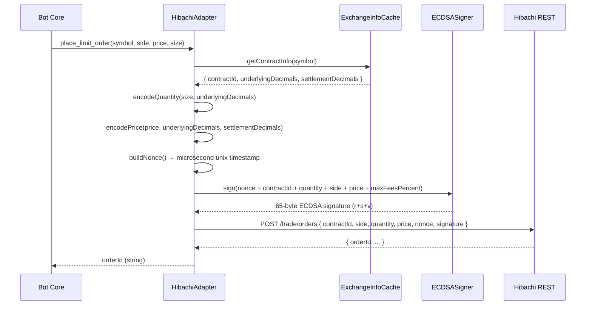
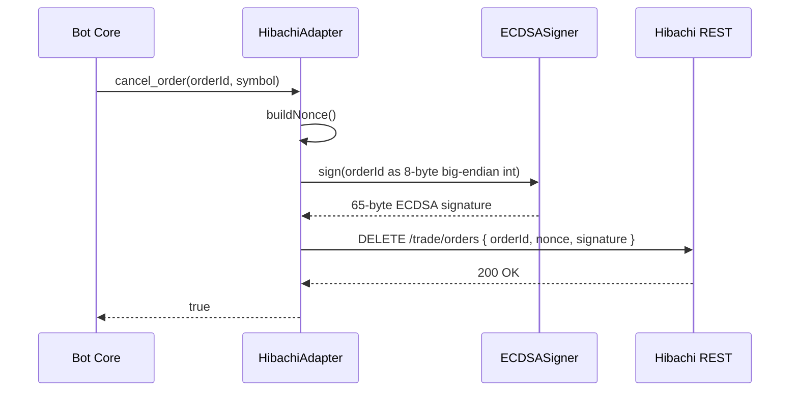
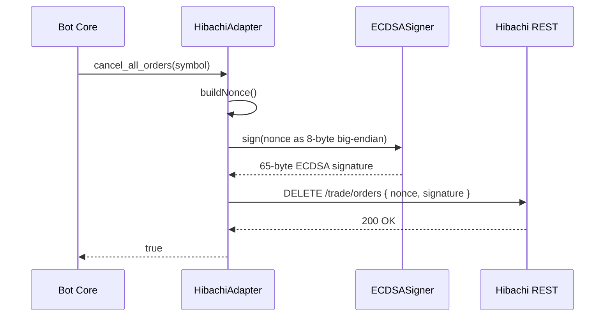

# Design Document: Hibachi PerpDex Exchange Adapter

## Overview

This document describes the design for integrating Hibachi PerpDex as a new exchange adapter in the Apex trading bot system. Hibachi is a perpetual DEX running on Arbitrum One and Base Mainnet, offering both Trustless (ECDSA) and Exchange Managed (HMAC-SHA256) account types. The adapter implements the existing `ExchangeAdapter` interface so the bot core, `BotManager`, `adapterFactory`, and `CredentialStore` require minimal changes.

The adapter follows the same structural pattern as `SodexAdapter` and `DecibelAdapter`: a single class that wraps raw HTTP calls to `https://api.hibachi.xyz`, handles authentication and request signing, normalizes Hibachi-specific numeric encodings (fixed-point prices, scaled quantities) into the bot's canonical float representation, and exposes both the snake_case `ExchangeAdapter` methods and the camelCase `IExchangeAdapter` aliases.

---

## Architecture

```mermaid
graph TD
    BotCore["Bot Core\n(Watcher / BotInstance)"]
    AdapterFactory["adapterFactory.ts\ncreateAdapter / createAdapterFromCredentials"]
    HibachiAdapter["HibachiAdapter\nsrc/adapters/hibachi_adapter.ts"]
    ExchangeInfo["GET /market/exchange-info\n(market metadata cache)"]
    REST["Hibachi REST API\nhttps://api.hibachi.xyz"]
    WS["Hibachi WebSocket\n(orderbook / market data)"]
    Signer["HibachiSigner\n(ECDSA or HMAC-SHA256)"]

    BotCore -->|ExchangeAdapter interface| AdapterFactory
    AdapterFactory -->|new HibachiAdapter(...)| HibachiAdapter
    HibachiAdapter --> Signer
    HibachiAdapter --> ExchangeInfo
    HibachiAdapter --> REST
    HibachiAdapter -.->|optional low-latency| WS
```

### Integration Points

| Touch point | Change |
|---|---|
| `src/adapters/hibachi_adapter.ts` | **New file** — the adapter class |
| `src/bot/adapterFactory.ts` | Add `case 'hibachi'` to both `createAdapter` and `createAdapterFromCredentials` |
| `src/bot/CredentialStore.ts` | Add `hibachi` to the `exchange` union type and document new credential fields |
| `src/bot.ts` | Add `case 'hibachi'` to the legacy single-bot `createAdapter` switch |
| `.env.example` | Document `HIBACHI_*` env vars |

---

## Sequence Diagrams

### Place Limit Order (Trustless / ECDSA)



### Cancel Single Order (Trustless / ECDSA)



### Cancel All Orders



---

## Components and Interfaces

### HibachiAdapter

**Purpose**: Implements `ExchangeAdapter` (and the camelCase `IExchangeAdapter` aliases) for Hibachi PerpDex.

**Interface** (implements):
```typescript
interface ExchangeAdapter {
    get_mark_price(symbol: string): Promise<number>;
    get_orderbook(symbol: string): Promise<{ best_bid: number; best_ask: number }>;
    place_limit_order(symbol, side, price, size, reduceOnly?, timeInForce?): Promise<string>;
    cancel_order(order_id: string, symbol: string): Promise<boolean>;
    cancel_all_orders(symbol: string): Promise<boolean>;
    get_open_orders(symbol: string): Promise<Order[]>;
    get_position(symbol: string, markPrice?: number): Promise<Position | null>;
    get_balance(): Promise<number>;
    get_orderbook_depth(symbol, limit): Promise<{ bids, asks }>;
    get_recent_trades(symbol, limit): Promise<RawTrade[]>;
    get_markets?(): Promise<string[]>;
}
```

**Responsibilities**:
- Maintain an `ExchangeInfoCache` (TTL 5 min) populated from `GET /market/exchange-info`
- Encode/decode Hibachi's fixed-point numeric formats for prices and quantities
- Generate monotonically increasing microsecond nonces, unique per subaccount, within ±15 s of server time
- Sign write operations using either ECDSA (Trustless) or HMAC-SHA256 (Exchange Managed)
- Attach `Authorization: <apiKey>` header to all non-market requests
- Provide camelCase method aliases (`getMarkPrice`, `placeLimitOrder`, etc.) for `IExchangeAdapter` compatibility
- Implement `connect()`, `disconnect()`, `isConnected()`, `getHealthStatus()` for connection lifecycle

### HibachiSigner (internal)

**Purpose**: Encapsulates the two signing modes so `HibachiAdapter` is agnostic to account type.

```typescript
interface HibachiSigner {
    signOrderPayload(payload: OrderSignPayload): string;   // hex signature
    signCancelPayload(orderId: bigint): string;            // hex signature
    signNonce(nonce: bigint): string;                      // hex signature (cancel-all)
}
```

**Implementations**:
- `ECDSASigner` — uses `ethers.Wallet` (secp256k1). Produces 65-byte signature (r+s+v). Recovery ID appended as last byte.
- `HMACSigner` — uses Node.js `crypto.createHmac('sha256', secretKey)`. Produces 32-byte hex digest.

### ExchangeInfoCache (internal)

**Purpose**: Caches the result of `GET /market/exchange-info` to avoid repeated round-trips on every order.

```typescript
interface ContractInfo {
    contractId: number;          // 4-byte uint32
    symbol: string;              // e.g. "BTC-USDT"
    underlyingDecimals: number;  // for quantity encoding
    settlementDecimals: number;  // for price encoding
    settlementAsset: string;     // "USDT" | "USDC"
    minQuantity: number;         // minimum order size (float)
    tickSize: number;            // minimum price increment (float)
}
```

---

## Data Models

### Constructor Credentials

```typescript
interface HibachiAdapterConfig {
    apiKey: string;              // Authorization header value
    accountType: 'trustless' | 'exchange_managed';
    // Trustless (ECDSA)
    privateKey?: string;         // 0x-prefixed 32-byte hex EVM private key
    // Exchange Managed (HMAC)
    secretKey?: string;          // HMAC-SHA256 secret
    subaccountId?: string;       // optional subaccount identifier
    baseUrl?: string;            // override for testing; defaults to https://api.hibachi.xyz
}
```

**Validation Rules**:
- `accountType === 'trustless'` requires `privateKey` to be present and 66 chars (0x + 64 hex)
- `accountType === 'exchange_managed'` requires `secretKey` to be present and non-empty
- `apiKey` must be non-empty for all authenticated endpoints

### OrderSignPayload

```typescript
interface OrderSignPayload {
    nonce: bigint;           // 8 bytes — microsecond unix timestamp
    contractId: number;      // 4 bytes
    quantity: bigint;        // 8 bytes — encoded with underlyingDecimals
    side: number;            // 4 bytes — 0 = buy, 1 = sell
    price: bigint;           // 8 bytes — encoded fixed-point (0 for market orders)
    maxFeesPercent: bigint;  // 8 bytes — e.g. 100n = 1%
}
```

**Encoding**:
- All fields packed into a 40-byte (or 32-byte for market) `Buffer` in big-endian order
- `quantity = Math.round(floatSize * 10^underlyingDecimals)` as `BigInt`
- `price = Math.round(floatPrice * 2^32 * 10^(settlementDecimals - underlyingDecimals))` as `BigInt`

### Normalized API Response Types

```typescript
// GET /account/positions response item (normalized)
interface HibachiPosition {
    contractId: number;
    size: number;        // float, negative = short
    entryPrice: number;  // float
    unrealizedPnl: number;
}

// GET /account/orders response item (normalized)
interface HibachiOrder {
    orderId: string;
    contractId: number;
    side: 'buy' | 'sell';
    price: number;       // float
    quantity: number;    // float
    status: string;
}
```

---

## Algorithmic Pseudocode

### Nonce Generation

```pascal
ALGORITHM buildNonce(lastNonce)
INPUT: lastNonce — last nonce used (microseconds, BigInt)
OUTPUT: nonce — new unique nonce (BigInt)

BEGIN
  candidate ← BigInt(Date.now()) * 1000n  // milliseconds → microseconds
  
  IF candidate <= lastNonce THEN
    candidate ← lastNonce + 1n
  END IF
  
  lastNonce ← candidate
  RETURN candidate
END
```

**Preconditions**: `lastNonce` is a non-negative BigInt  
**Postconditions**: returned nonce > `lastNonce`; nonce is within ±15 s of server time when called promptly

### Quantity Encoding

```pascal
ALGORITHM encodeQuantity(floatSize, underlyingDecimals)
INPUT: floatSize — human-readable float (e.g. 0.001 BTC)
       underlyingDecimals — from exchange-info (e.g. 8 for BTC)
OUTPUT: encoded — BigInt suitable for signing payload

BEGIN
  ASSERT floatSize > 0
  ASSERT underlyingDecimals >= 0
  
  scaled ← floatSize * 10^underlyingDecimals
  encoded ← BigInt(Math.round(scaled))
  
  ASSERT encoded > 0n
  RETURN encoded
END
```

### Price Encoding

```pascal
ALGORITHM encodePrice(floatPrice, underlyingDecimals, settlementDecimals)
INPUT: floatPrice — human-readable float (e.g. 65000.0)
       underlyingDecimals — from exchange-info
       settlementDecimals — from exchange-info (e.g. 6 for USDT)
OUTPUT: encoded — BigInt suitable for signing payload

BEGIN
  ASSERT floatPrice > 0
  
  // Hibachi formula: price * 2^32 * 10^(settlementDecimals - underlyingDecimals)
  factor ← 2^32 * 10^(settlementDecimals - underlyingDecimals)
  encoded ← BigInt(Math.round(floatPrice * factor))
  
  ASSERT encoded > 0n
  RETURN encoded
END
```

### ECDSA Order Signing

```pascal
ALGORITHM signOrderECDSA(payload, wallet)
INPUT: payload — OrderSignPayload
       wallet  — ethers.Wallet instance
OUTPUT: signature — 65-byte hex string (0x-prefixed)

BEGIN
  buf ← Buffer.alloc(40)
  buf.writeBigUInt64BE(payload.nonce, 0)
  buf.writeUInt32BE(payload.contractId, 8)
  buf.writeBigUInt64BE(payload.quantity, 12)
  buf.writeUInt32BE(payload.side, 20)
  buf.writeBigUInt64BE(payload.price, 24)
  buf.writeBigUInt64BE(payload.maxFeesPercent, 32)
  
  hash ← keccak256(buf)
  sig  ← wallet.signingKey.sign(hash)
  
  // Compact 65 bytes: r (32) + s (32) + recoveryId (1)
  // recoveryId = sig.v - 27 (normalize from 27/28 to 0/1)
  recoveryId ← sig.v - 27
  result ← sig.r + sig.s.slice(2) + recoveryId.toString(16).padStart(2, '0')
  
  RETURN '0x' + result
END
```

**Preconditions**: `payload` fields are all non-negative BigInts; `wallet` is initialized  
**Postconditions**: result is a 132-char hex string (0x + 130 hex chars = 65 bytes)

### HMAC Order Signing

```pascal
ALGORITHM signOrderHMAC(payload, secretKey)
INPUT: payload   — OrderSignPayload
       secretKey — string
OUTPUT: signature — 32-byte hex string

BEGIN
  buf ← (same 40-byte buffer construction as ECDSA above)
  
  hmac ← crypto.createHmac('sha256', secretKey)
  hmac.update(buf)
  result ← hmac.digest('hex')
  
  RETURN result
END
```

### Cancel Single Order Signing

```pascal
ALGORITHM signCancelOrder(orderId, nonce, wallet)
INPUT: orderId — string (numeric order ID from exchange)
       nonce   — BigInt (microsecond timestamp)
       wallet  — ethers.Wallet (or HMAC secret)
OUTPUT: signature — hex string

BEGIN
  orderIdBigInt ← BigInt(orderId)
  
  buf ← Buffer.alloc(8)
  buf.writeBigUInt64BE(orderIdBigInt, 0)
  
  hash ← keccak256(buf)
  sig  ← wallet.signingKey.sign(hash)
  
  RETURN normalizedSignature(sig)  // same 65-byte format as order signing
END
```

### Cancel All Orders Signing

```pascal
ALGORITHM signCancelAll(nonce, wallet)
INPUT: nonce  — BigInt (microsecond timestamp)
       wallet — ethers.Wallet
OUTPUT: signature — hex string

BEGIN
  buf ← Buffer.alloc(8)
  buf.writeBigUInt64BE(nonce, 0)
  
  hash ← keccak256(buf)
  sig  ← wallet.signingKey.sign(hash)
  
  RETURN normalizedSignature(sig)
END
```

### Symbol → ContractId Resolution

```pascal
ALGORITHM resolveContractInfo(symbol, cache, apiKey, baseUrl)
INPUT: symbol  — e.g. "BTC-USDT"
       cache   — Map<string, ContractInfo>
       apiKey  — string
       baseUrl — string
OUTPUT: info — ContractInfo

BEGIN
  IF cache.has(symbol) AND NOT cache.isExpired(symbol) THEN
    RETURN cache.get(symbol)
  END IF
  
  response ← GET baseUrl + '/market/exchange-info'
             headers: { Authorization: apiKey }
  
  FOR each contract IN response.contracts DO
    info ← parseContractInfo(contract)
    cache.set(info.symbol, info, TTL=300s)
  END FOR
  
  IF NOT cache.has(symbol) THEN
    THROW Error('Symbol not found: ' + symbol)
  END IF
  
  RETURN cache.get(symbol)
END
```

---

## Key Functions with Formal Specifications

### `get_mark_price(symbol)`

```typescript
async get_mark_price(symbol: string): Promise<number>
```

**Preconditions**:
- `symbol` is a non-empty string matching a Hibachi contract name
- Exchange info cache is populated or API is reachable

**Postconditions**:
- Returns a positive float representing the current mark price
- Throws if symbol is not found or API is unreachable

**Implementation**: `GET /market/exchange-info` (cached) to resolve `contractId`, then `GET /account/positions` or a dedicated mark-price endpoint. Falls back to mid-price from orderbook if no dedicated endpoint exists.

---

### `place_limit_order(symbol, side, price, size, reduceOnly?, timeInForce?)`

```typescript
async place_limit_order(
    symbol: string,
    side: 'buy' | 'sell',
    price: number,
    size: number,
    reduceOnly?: boolean,
    timeInForce?: number
): Promise<string>
```

**Preconditions**:
- `price > 0`, `size > 0`
- `side` is `'buy'` or `'sell'`
- `symbol` resolves to a known `contractId`
- Nonce is within ±15 s of server time

**Postconditions**:
- Returns a non-empty string `orderId`
- Order is registered on Hibachi with the specified parameters
- Throws on signing failure, network error, or API rejection

**Loop Invariants**: N/A (no loops)

---

### `cancel_order(order_id, symbol)`

```typescript
async cancel_order(order_id: string, symbol: string): Promise<boolean>
```

**Preconditions**:
- `order_id` is a numeric string (parseable as BigInt)
- Order belongs to the configured subaccount

**Postconditions**:
- Returns `true` if cancel succeeded or order was already gone (idempotent)
- Returns `false` on non-fatal errors (logs the error)
- Never throws — errors are caught and logged

---

### `cancel_all_orders(symbol)`

```typescript
async cancel_all_orders(symbol: string): Promise<boolean>
```

**Preconditions**:
- `symbol` resolves to a known `contractId`

**Postconditions**:
- Returns `true` if all open orders for the symbol are cancelled
- Uses `DELETE /trade/orders` with nonce + signature on nonce (not per-order)
- Returns `false` on API error

---

### `get_position(symbol, markPrice?)`

```typescript
async get_position(symbol: string, markPrice?: number): Promise<Position | null>
```

**Preconditions**:
- `symbol` resolves to a known `contractId`

**Postconditions**:
- Returns `null` if no open position exists
- Returns `Position` with `side`, `size` (positive float), `entryPrice`, `unrealizedPnl`
- If API does not return PnL and `markPrice` is provided, computes PnL locally
- `size` is always positive; `side` is derived from the sign of the raw API value

---

### `get_balance()`

```typescript
async get_balance(): Promise<number>
```

**Postconditions**:
- Returns the equity/available balance as a positive float in settlement asset units (USDT or USDC)
- Returns `0` on 404 (account not yet funded)

---

## Example Usage

```typescript
// Trustless (ECDSA) account
const adapter = new HibachiAdapter({
    apiKey: process.env.HIBACHI_API_KEY!,
    accountType: 'trustless',
    privateKey: process.env.HIBACHI_PRIVATE_KEY!,  // 0x + 64 hex chars
});

// Exchange Managed (HMAC) account
const adapter = new HibachiAdapter({
    apiKey: process.env.HIBACHI_API_KEY!,
    accountType: 'exchange_managed',
    secretKey: process.env.HIBACHI_SECRET_KEY!,
});

// Standard adapter usage (same as SodexAdapter / DecibelAdapter)
const price = await adapter.get_mark_price('BTC-USDT');
const ob    = await adapter.get_orderbook('BTC-USDT');
const orderId = await adapter.place_limit_order('BTC-USDT', 'buy', ob.best_bid, 0.001);
await adapter.cancel_order(orderId, 'BTC-USDT');
const pos = await adapter.get_position('BTC-USDT', price);
const bal = await adapter.get_balance();
```

---

## Correctness Properties

- **Nonce monotonicity**: For any two consecutive calls to `buildNonce()`, the second nonce is strictly greater than the first.
- **Quantity round-trip**: `decodeQuantity(encodeQuantity(x, d), d) ≈ x` within floating-point precision for any valid `x > 0`.
- **Price round-trip**: `decodePrice(encodePrice(p, ud, sd), ud, sd) ≈ p` within 1 tick for any valid `p > 0`.
- **Signature length (ECDSA)**: `signOrderECDSA(payload, wallet).length === 132` (0x + 130 hex chars = 65 bytes).
- **Cancel idempotency**: `cancel_order(id, sym)` returns `true` whether the order exists or has already been cancelled.
- **Position sign invariant**: `get_position` always returns `size > 0`; direction is encoded in `side`, never in `size`.
- **Balance non-negative**: `get_balance()` always returns a value `>= 0`.

---

## Error Handling

### Scenario 1: Stale Nonce (±15 s window violation)

**Condition**: System clock drift or rapid successive calls cause nonce to fall outside the ±15 s server window.  
**Response**: Hibachi returns HTTP 400 with a nonce-related error code.  
**Recovery**: Adapter catches the error, logs a warning, and throws so the bot's retry logic can handle it. A future enhancement could sync with server time via a `/market/time` endpoint.

### Scenario 2: Exchange Info Cache Miss

**Condition**: Symbol not found in cache and API call fails (network error).  
**Response**: Adapter throws `Error('Symbol not found: <symbol>')`.  
**Recovery**: Bot core catches and logs; no order is placed.

### Scenario 3: Invalid Signature

**Condition**: Wrong private key or malformed payload causes Hibachi to reject the signature.  
**Response**: Hibachi returns HTTP 401 or 403.  
**Recovery**: Adapter throws with the API error message. Operator must verify credentials.

### Scenario 4: Rate Limiting

**Condition**: Too many requests in a short window.  
**Response**: Hibachi returns HTTP 429.  
**Recovery**: Adapter logs a warning and throws. A `_rateLimitUntil` timestamp (same pattern as `SodexAdapter`) can be added to back off automatically.

### Scenario 5: Symbol Format Mismatch

**Condition**: Bot config uses `BTC-USD` but Hibachi uses `BTC-USDT`.  
**Response**: `resolveContractInfo` throws `Symbol not found`.  
**Recovery**: `get_markets()` returns Hibachi's canonical symbol names; the bot's Create Bot wizard uses these to populate the symbol picker, preventing mismatches at configuration time.

---

## Testing Strategy

### Unit Testing Approach

Each pure function (encoding, signing, nonce generation) is tested in isolation with known inputs and expected outputs. The `ExchangeInfoCache` is tested with a mock HTTP client.

Key unit test cases:
- `encodeQuantity(0.001, 8)` → `100000n`
- `encodePrice(65000.0, 8, 6)` → expected BigInt per formula
- `buildNonce()` called twice in rapid succession → second > first
- `signOrderECDSA(payload, wallet)` → 132-char hex string starting with `0x`
- `signOrderHMAC(payload, secret)` → 64-char hex string

### Property-Based Testing Approach

**Property Test Library**: `fast-check`

Properties to verify:
- For any `size > 0` and valid `decimals`, `encodeQuantity(size, decimals) > 0n`
- For any two calls to `buildNonce()`, the second result is strictly greater
- For any valid `price > 0`, `encodePrice` returns a positive BigInt
- `cancel_order` never throws (always returns boolean)

### Integration Testing Approach

A mock HTTP server (e.g. `msw` or `nock`) intercepts calls to `https://api.hibachi.xyz` and returns fixture responses. Integration tests verify:
- Full `place_limit_order` flow: exchange-info fetch → encoding → signing → POST → orderId returned
- `get_open_orders` correctly filters by `contractId`
- `get_position` returns `null` for zero-size positions
- `get_markets()` returns sorted symbol list

---

## Performance Considerations

- **Exchange info cache**: TTL of 5 minutes avoids a round-trip on every order. Cache is populated lazily on first use and refreshed in the background.
- **Nonce generation**: Pure in-memory BigInt arithmetic — negligible overhead.
- **Signing**: ECDSA signing via `ethers` is synchronous and fast (~0.1 ms). HMAC is even faster.
- **WebSocket for orderbook**: `get_orderbook` should use a WebSocket subscription (same pattern as `DecibelAdapter._obCache`) to avoid REST polling latency. The WS connection is established lazily on first `get_orderbook` call and reused.

---

## Security Considerations

- **Private key handling**: The ECDSA private key is stored only in memory (never logged). The `HibachiAdapter` constructor accepts it as a string and immediately wraps it in an `ethers.Wallet` instance; the raw string is not retained as a class field.
- **HMAC secret**: Similarly, the HMAC secret is passed to `crypto.createHmac` at signing time and not stored as a class field after construction.
- **Credential storage**: When used via `TenantRegistry`, credentials are encrypted at rest with AES-256-GCM by `CredentialStore`. The new `hibachi` exchange type is added to the `BotCredentials` union with fields `apiKey`, `privateKey` (trustless) or `secretKey` (exchange managed).
- **Nonce replay protection**: The ±15 s server-side window and the monotonically increasing nonce prevent replay attacks.
- **API key in headers**: The `Authorization` header is only sent over HTTPS to `api.hibachi.xyz`.

---

## Dependencies

| Dependency | Already in project | Purpose |
|---|---|---|
| `ethers` | ✅ Yes (used by SodexAdapter) | ECDSA signing via `ethers.Wallet` / `ethers.SigningKey` |
| `node:crypto` | ✅ Yes (built-in, used by CredentialStore) | HMAC-SHA256 for Exchange Managed accounts |
| `node:buffer` | ✅ Yes (built-in) | Binary payload construction for signing |
| `node:fetch` / global `fetch` | ✅ Yes (Node 18+, used by DecibelAdapter) | REST API calls |

No new npm dependencies are required.
