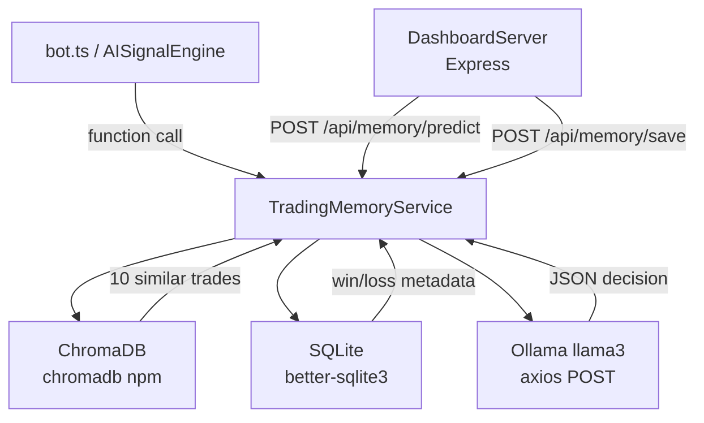
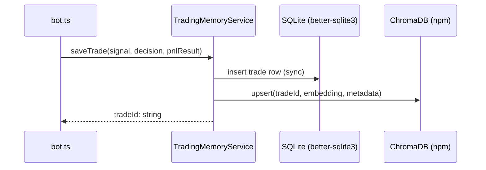
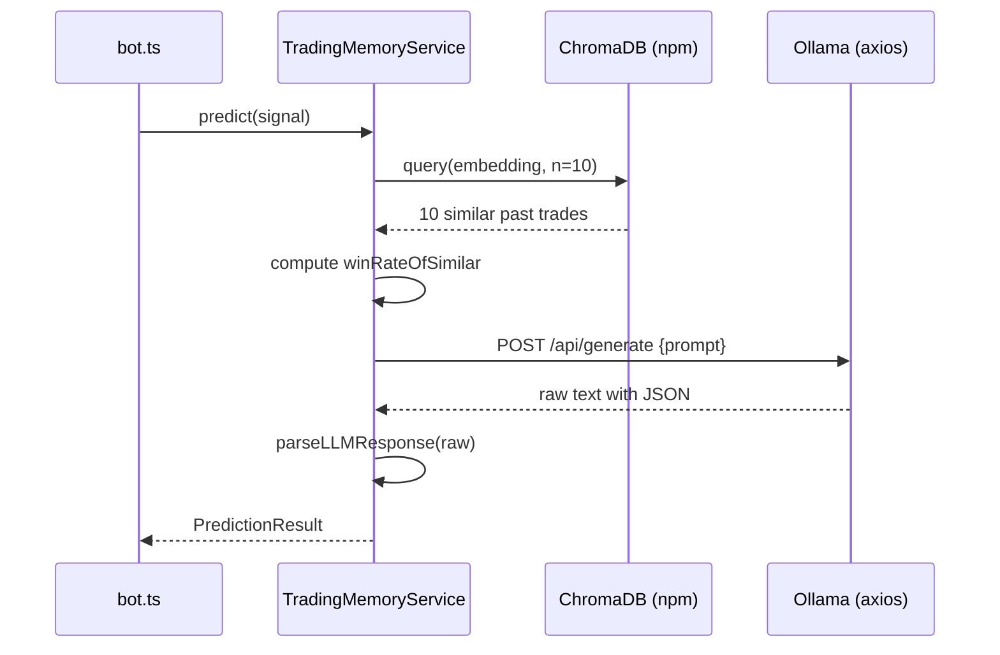

# Design Document: Local Trading Memory AI

## Overview

A TypeScript module integrated directly into the existing Node.js bot that gives the trading bot persistent memory of past trades. It stores every trade signal + outcome in ChromaDB (vector similarity via `chromadb` npm package) and SQLite (via `better-sqlite3`), then at prediction time retrieves the 10 most similar historical trades, feeds them as context to a local Ollama LLM (llama3) via `axios`, and returns a structured `long`/`short`/`skip` decision with confidence and reasoning.

The module lives at `src/ai/TradingMemory/` and integrates with the existing `DashboardServer` (Express) for HTTP endpoints, and can also be called directly as TypeScript functions from the bot.

## Architecture



## Sequence Diagrams

### saveTrade flow



### predict flow



## Components and Interfaces

### TradingMemoryService

**Purpose**: Core orchestrator — owns all reads/writes to ChromaDB and SQLite, builds LLM prompts, parses responses.

**Interface**:
```typescript
interface TradingMemoryService {
  saveTrade(signal: MemorySignal, decision: TradeDecision, pnlResult: PnLResult): Promise<string>
  predict(signal: MemorySignal): Promise<PredictionResult>
}
```

**Responsibilities**:
- Embed signal into a float vector for ChromaDB
- Persist raw trade data to SQLite via `better-sqlite3`
- Retrieve top-10 similar trades from ChromaDB
- Build structured prompt for Ollama
- Parse and validate LLM JSON output

### VectorStore (ChromaDB wrapper)

**Purpose**: Thin wrapper around `chromadb` npm client for upsert and similarity query.

**Interface**:
```typescript
interface VectorStore {
  upsert(tradeId: string, embedding: number[], metadata: Record<string, unknown>): Promise<void>
  query(embedding: number[], n: number): Promise<SimilarTrade[]>
}
```

### TradeDB (SQLite wrapper)

**Purpose**: Structured persistence using `better-sqlite3` — synchronous, used for win-rate aggregation and audit log.

**Interface**:
```typescript
interface TradeDB {
  insert(trade: TradeRecord): string        // returns tradeId
  getByIds(ids: string[]): TradeRecord[]
}
```

### OllamaClient

**Purpose**: Sends prompt to local Ollama instance via `axios`, returns raw text.

**Interface**:
```typescript
interface OllamaClient {
  complete(prompt: string): Promise<string>
}
```

### Express Routes (mounted on DashboardServer)

**Purpose**: HTTP interface so the bot or external tools can call saveTrade and predict over REST.

**Endpoints**:
- `POST /api/memory/save` → `SaveTradeRequest` → `SaveTradeResponse`
- `POST /api/memory/predict` → `PredictRequest` → `PredictionResult`
- `GET /api/memory/health` → `{ status: "ok" }`

## Data Models

### MemorySignal

```typescript
interface MemorySignal {
  price: number
  sma50: number
  ls_ratio: number
  orderbook_imbalance: number
  buy_pressure: number
  rsi: number
}
```

**Validation Rules**:
- All fields required, all numeric
- `rsi` in range [0, 100]
- `ls_ratio`, `orderbook_imbalance`, `buy_pressure` in range [0.0, 1.0]

### PnLResult

```typescript
interface PnLResult {
  pnlPercent: number    // e.g. 2.5 or -1.3
  outcome: 'WIN' | 'LOSS'
}
```

### TradeRecord

```typescript
interface TradeRecord {
  tradeId: string
  signal: MemorySignal
  decision: TradeDecision
  pnlPercent: number
  outcome: 'WIN' | 'LOSS'
  timestamp: string     // ISO 8601
}
```

### PredictionResult

```typescript
interface PredictionResult {
  direction: TradeDecision          // 'long' | 'short' | 'skip'
  confidence: number                // 0.0 – 1.0
  reasoning: string
  winRateOfSimilar: number          // 0.0 – 1.0, computed from retrieved trades
}
```

### TradeDecision

```typescript
type TradeDecision = 'long' | 'short' | 'skip'
```

## Key Functions with Formal Specifications

### signalToEmbedding()

```typescript
function signalToEmbedding(signal: MemorySignal): number[]
```

**Preconditions:**
- `signal` contains all 6 required fields with numeric values
- `rsi` in [0, 100], ratio fields in [0.0, 1.0]

**Postconditions:**
- Returns `number[]` of length exactly 6
- Each element is min-max normalized to [0.0, 1.0]
- Order is deterministic: `[priceNorm, sma50Norm, ls_ratio, orderbook_imbalance, buy_pressure, rsiNorm]`
- `price` and `sma50` normalized relative to each other: `priceNorm = price / (price + sma50)`
- `rsi` normalized: `rsiNorm = rsi / 100`

**Loop Invariants:** N/A (no loops)

### buildPrompt()

```typescript
function buildPrompt(signal: MemorySignal, similarTrades: TradeRecord[]): string
```

**Preconditions:**
- `signal` is valid
- `similarTrades` is an array of 0–10 `TradeRecord` objects

**Postconditions:**
- Returns a non-empty string
- Prompt contains all current signal field values
- Prompt contains each similar trade's signal, decision, pnlPercent, outcome
- Prompt instructs LLM to return JSON with keys: `direction`, `confidence`, `reasoning`

**Loop Invariants:**
- For each trade appended: all previously appended trades remain in the prompt string

### parseLLMResponse()

```typescript
function parseLLMResponse(raw: string, winRateOfSimilar: number): PredictionResult
```

**Preconditions:**
- `raw` is a string (may be empty or contain extra prose around JSON)
- `winRateOfSimilar` is a float in [0.0, 1.0]

**Postconditions:**
- Returns valid `PredictionResult`
- `direction` is one of `'long'`, `'short'`, `'skip'`
- `confidence` is float in [0.0, 1.0] (clamped if LLM returns out-of-range)
- `winRateOfSimilar` is set to the passed-in computed value (not from LLM)
- On parse failure: returns `{ direction: 'skip', confidence: 0, reasoning: 'parse_error', winRateOfSimilar }`

## Algorithmic Pseudocode

### Main predict() Algorithm

```pascal
ALGORITHM predict(signal: MemorySignal): Promise<PredictionResult>

BEGIN
  ASSERT all 6 signal fields are present and numeric

  // Step 1: embed signal
  embedding ← signalToEmbedding(signal)

  // Step 2: retrieve similar trades
  similarTrades ← await vectorStore.query(embedding, n=10)

  // Step 3: compute win rate from retrieved trades
  wins ← similarTrades.filter(t => t.outcome === "WIN")
  winRate ← similarTrades.length > 0 ? wins.length / similarTrades.length : 0.0

  // Step 4: build prompt and call LLM
  prompt ← buildPrompt(signal, similarTrades)
  rawResponse ← await ollamaClient.complete(prompt)

  // Step 5: parse response
  result ← parseLLMResponse(rawResponse, winRate)

  ASSERT result.direction IN {"long", "short", "skip"}
  ASSERT 0.0 <= result.confidence <= 1.0
  ASSERT result.winRateOfSimilar === winRate

  RETURN result
END
```

### Main saveTrade() Algorithm

```pascal
ALGORITHM saveTrade(signal, decision, pnlResult): Promise<string>

BEGIN
  ASSERT decision IN {"long", "short", "skip"}
  ASSERT pnlResult.outcome IN {"WIN", "LOSS"}

  tradeId ← crypto.randomUUID()
  timestamp ← new Date().toISOString()

  record ← TradeRecord {
    tradeId, signal, decision,
    pnlPercent: pnlResult.pnlPercent,
    outcome: pnlResult.outcome,
    timestamp
  }

  // Persist to SQLite (synchronous via better-sqlite3)
  tradeDB.insert(record)

  // Persist to ChromaDB (async)
  embedding ← signalToEmbedding(signal)
  await vectorStore.upsert(tradeId, embedding, metadata=record)

  ASSERT tradeId is non-empty string
  RETURN tradeId
END
```

## Example Usage

```typescript
import { TradingMemoryService } from './ai/TradingMemory/TradingMemoryService.js'

const memory = new TradingMemoryService()

// Save a completed trade
const tradeId = await memory.saveTrade(
  {
    price: 42500.0,
    sma50: 41800.0,
    ls_ratio: 0.62,
    orderbook_imbalance: 0.55,
    buy_pressure: 0.70,
    rsi: 58.3,
  },
  'long',
  { pnlPercent: 2.1, outcome: 'WIN' }
)

// Predict on a new signal
const result = await memory.predict({
  price: 43100.0,
  sma50: 42000.0,
  ls_ratio: 0.65,
  orderbook_imbalance: 0.58,
  buy_pressure: 0.72,
  rsi: 61.0,
})

console.log(result)
// {
//   direction: 'long',
//   confidence: 0.78,
//   reasoning: '7 of 10 similar trades were winning longs with RSI 58-63 and buy_pressure > 0.65',
//   winRateOfSimilar: 0.7
// }
```

## Correctness Properties

```typescript
// Property 1: save then predict returns a valid direction
// For any valid signal s, decision d, pnlResult p:
//   await saveTrade(s, d, p)
//   const result = await predict(s)
//   assert(['long', 'short', 'skip'].includes(result.direction))

// Property 2: confidence is always bounded
// For any valid signal s:
//   const result = await predict(s)
//   assert(result.confidence >= 0.0 && result.confidence <= 1.0)

// Property 3: winRateOfSimilar is always bounded
// For any valid signal s:
//   const result = await predict(s)
//   assert(result.winRateOfSimilar >= 0.0 && result.winRateOfSimilar <= 1.0)

// Property 4: predict never throws — always returns a result
// For any input (even malformed LLM response):
//   const result = await predict(s)
//   assert(result !== null && result !== undefined)

// Property 5: signalToEmbedding is deterministic
// For any valid signal s:
//   assert(JSON.stringify(signalToEmbedding(s)) === JSON.stringify(signalToEmbedding(s)))

// Property 6: saveTrade returns unique IDs
// For any two calls to saveTrade:
//   assert(tradeId1 !== tradeId2)

// Property 7: signalToEmbedding always returns 6 floats in [0, 1]
// For any valid signal s:
//   const emb = signalToEmbedding(s)
//   assert(emb.length === 6)
//   assert(emb.every(v => v >= 0.0 && v <= 1.0))
```

## Error Handling

### LLM Parse Failure

**Condition**: Ollama returns malformed JSON or extra prose around JSON  
**Response**: `parseLLMResponse` uses regex to extract first JSON block; on failure returns safe default `skip` result  
**Recovery**: Log raw response for debugging; system continues operating

### ChromaDB Unavailable

**Condition**: ChromaDB collection not initialized or connection fails  
**Response**: Log error, `predict` falls back to LLM-only call with empty context  
**Recovery**: Re-initialize collection on next startup; SQLite remains source of truth

### Ollama Unreachable

**Condition**: `axios` throws connection error on `POST http://localhost:11434/api/generate`  
**Response**: Catch exception, return `{ direction: 'skip', confidence: 0, reasoning: 'llm_unavailable', winRateOfSimilar: <computed> }`  
**Recovery**: Log error; bot continues operating in signal-only mode

### Empty Memory (Cold Start)

**Condition**: No trades saved yet; ChromaDB returns 0 results  
**Response**: `predict` calls LLM with empty context section; LLM returns signal-only analysis  
**Recovery**: Normal operation; memory improves as trades accumulate

## Testing Strategy

### Unit Testing Approach

- Test `signalToEmbedding` with known inputs → assert exact output vector (vitest)
- Test `buildPrompt` → assert all signal fields and trade outcomes appear in output string
- Test `parseLLMResponse` with valid JSON, JSON embedded in prose, and garbage input
- Test `saveTrade` with mocked ChromaDB and SQLite → assert both stores called

### Property-Based Testing Approach

**Property Test Library**: `fast-check`

- For any valid `MemorySignal`, `signalToEmbedding` returns an array of 6 floats all in [0, 1]
- For any sequence of save/predict calls, `predict` always returns a valid `PredictionResult`
- `parseLLMResponse` never throws — always returns a `PredictionResult`

### Integration Testing Approach

- Use ChromaDB in-memory mode + SQLite in-memory (`:memory:`)
- Save 20 synthetic trades, call predict, assert result shape
- Assert `winRateOfSimilar` matches manually computed value from saved trades

## Performance Considerations

- Embedding is a simple 6-element normalization — sub-millisecond, no model needed
- ChromaDB query over thousands of trades is fast (cosine similarity on 6-dim vectors)
- LLM latency is the bottleneck: llama3 on CPU ~2-8s; on GPU <1s
- `better-sqlite3` is synchronous and very fast for local file access
- Ollama call is async via `axios` — does not block the Node.js event loop

## Security Considerations

- Service is local-only by default (Ollama binds to `127.0.0.1:11434`)
- Express routes are protected by the existing `DashboardServer` auth middleware
- SQLite file should have restricted filesystem permissions
- LLM prompt contains only numeric signal values and trade outcomes — no PII

## File Structure

```
src/ai/TradingMemory/
  index.ts                  — re-exports public API
  types.ts                  — MemorySignal, PnLResult, TradeRecord, PredictionResult, TradeDecision
  signalEmbedding.ts        — signalToEmbedding(), buildPrompt(), parseLLMResponse()
  TradeDB.ts                — SQLite wrapper (better-sqlite3)
  VectorStore.ts            — ChromaDB wrapper (chromadb npm)
  OllamaClient.ts           — Ollama REST client (axios)
  TradingMemoryService.ts   — orchestrator: saveTrade(), predict()
  routes.ts                 — Express route handlers (mounted in DashboardServer)
src/ai/TradingMemory/__tests__/
  signalEmbedding.test.ts
  parseLLMResponse.test.ts
  TradingMemoryService.test.ts
  properties.test.ts        — fast-check property tests
```

## Dependencies

```json
{
  "chromadb": "npm package — vector store client",
  "better-sqlite3": "already in project — structured storage",
  "axios": "already in project — Ollama REST calls",
  "express": "already in project — HTTP routes",
  "vitest": "already in project — test runner",
  "fast-check": "already in project — property-based tests"
}
```

Only `chromadb` npm package needs to be added. All other dependencies are already present.
