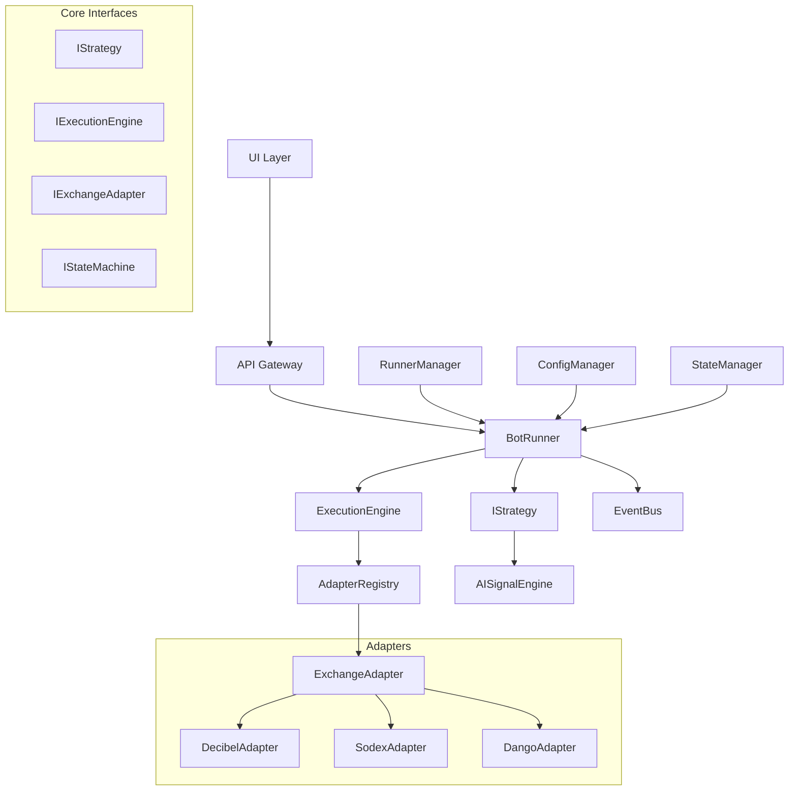
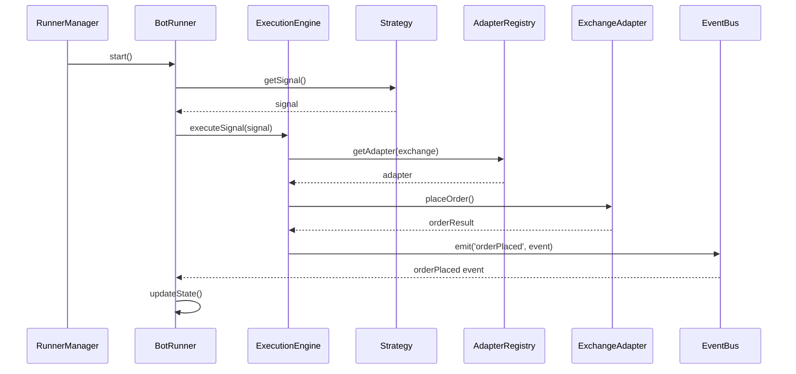
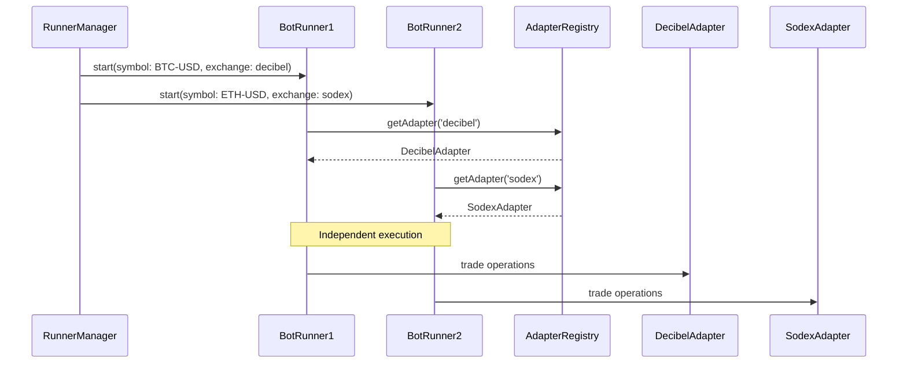

# Design Document: Modular Architecture Refactor

## Overview

This design refactors the DRIFT trading system from a tightly coupled monolithic architecture to a modular, scalable system that supports multi-DEX adapters, multi-runner scaling, and clean separation of concerns. The refactor maintains backward compatibility while introducing proper abstraction layers and dependency injection patterns.

## Architecture



## Sequence Diagrams

### Main Trading Flow



### Multi-Runner Scaling



## Components and Interfaces

### Core Interfaces

#### IStrategy

```typescript
interface IStrategy {
  getSignal(symbol: string, context: MarketContext): Promise<TradingSignal>;
  invalidateCache(): void;
  configure(config: StrategyConfig): void;
}

interface TradingSignal {
  direction: 'long' | 'short' | 'skip';
  confidence: number;
  reasoning: string;
  metadata: Record<string, any>;
}
```

**Responsibilities**:
- Generate trading signals based on market data
- Manage signal caching and invalidation
- Provide reasoning for decisions
- Never directly interact with exchange adapters

#### IExecutionEngine

```typescript
interface IExecutionEngine {
  executeSignal(signal: TradingSignal, context: ExecutionContext): Promise<ExecutionResult>;
  placeOrder(orderRequest: OrderRequest): Promise<OrderResult>;
  cancelOrder(orderId: string, symbol: string): Promise<boolean>;
  getPositions(symbol?: string): Promise<Position[]>;
  setAdapter(adapter: IExchangeAdapter): void;
}

interface ExecutionContext {
  symbol: string;
  balance: number;
  currentPosition?: Position;
  riskLimits: RiskLimits;
}

interface ExecutionResult {
  success: boolean;
  orderId?: string;
  error?: string;
  metadata: Record<string, any>;
}
```

**Responsibilities**:
- Bridge between strategy and exchange adapter
- Handle order placement and management
- Enforce risk management rules
- Manage position state
- Only component that directly calls adapter methods

#### IExchangeAdapter

```typescript
interface IExchangeAdapter {
  readonly exchangeName: string;
  readonly supportedSymbols: string[];
  
  // Market Data
  getMarkPrice(symbol: string): Promise<number>;
  getOrderbook(symbol: string): Promise<Orderbook>;
  getPosition(symbol: string, markPrice?: number): Promise<Position | null>;
  getBalance(): Promise<number>;
  
  // Order Management
  placeLimitOrder(params: OrderParams): Promise<string>;
  cancelOrder(orderId: string, symbol: string): Promise<boolean>;
  cancelAllOrders(symbol: string): Promise<boolean>;
  getOpenOrders(symbol: string): Promise<Order[]>;
  
  // Connection Management
  connect(): Promise<void>;
  disconnect(): Promise<void>;
  isConnected(): boolean;
}

interface OrderParams {
  symbol: string;
  side: 'buy' | 'sell';
  price: number;
  size: number;
  reduceOnly?: boolean;
  timeInForce?: TimeInForce;
}
```

**Responsibilities**:
- Abstract exchange-specific API implementations
- Handle authentication and connection management
- Normalize data formats across exchanges
- Implement exchange-specific order types and features

#### IStateMachine

```typescript
interface IStateMachine {
  readonly currentState: BotState;
  
  transition(event: StateEvent): Promise<void>;
  canTransition(from: BotState, to: BotState): boolean;
  onStateChange(callback: (from: BotState, to: BotState) => void): void;
  getStateHistory(): StateTransition[];
}

type BotState = 'IDLE' | 'PENDING_ENTRY' | 'IN_POSITION' | 'PENDING_EXIT' | 'ERROR';

interface StateEvent {
  type: string;
  payload: any;
  timestamp: number;
}
```

**Responsibilities**:
- Manage bot state transitions
- Enforce valid state changes
- Provide state change notifications
- Maintain state history for debugging

### Component Implementations

#### AdapterRegistry

```typescript
class AdapterRegistry {
  private adapters = new Map<string, IExchangeAdapter>();
  private factories = new Map<string, AdapterFactory>();
  
  register(name: string, factory: AdapterFactory): void;
  unregister(name: string): void;
  getAdapter(name: string): IExchangeAdapter;
  createAdapter(name: string, config: AdapterConfig): IExchangeAdapter;
  listAvailable(): string[];
  isSupported(exchange: string, symbol: string): boolean;
}

interface AdapterFactory {
  create(config: AdapterConfig): IExchangeAdapter;
  validate(config: AdapterConfig): boolean;
}
```

**Responsibilities**:
- Manage adapter lifecycle and registration
- Provide adapter discovery and creation
- Validate adapter configurations
- Support hot-swapping of adapters

#### BotRunner

```typescript
class BotRunner {
  private strategy: IStrategy;
  private executionEngine: IExecutionEngine;
  private stateMachine: IStateMachine;
  private eventBus: EventBus;
  private config: RunnerConfig;
  
  constructor(config: RunnerConfig) {
    this.strategy = this.createStrategy(config.strategyType);
    this.executionEngine = new ExecutionEngine();
    this.stateMachine = new StateMachine();
    this.eventBus = new EventBus();
  }
  
  async start(): Promise<void>;
  async stop(): Promise<void>;
  async tick(): Promise<void>;
  getStatus(): RunnerStatus;
  updateConfig(config: Partial<RunnerConfig>): void;
}

interface RunnerConfig {
  symbol: string;
  exchange: string;
  strategyType: string;
  riskLimits: RiskLimits;
  executionParams: ExecutionParams;
}
```

**Responsibilities**:
- Orchestrate trading loop execution
- Manage component lifecycle
- Handle configuration updates
- Emit events for monitoring and logging

#### RunnerManager

```typescript
class RunnerManager {
  private runners = new Map<string, BotRunner>();
  private adapterRegistry: AdapterRegistry;
  private eventBus: EventBus;
  
  async createRunner(config: RunnerConfig): Promise<string>;
  async destroyRunner(runnerId: string): Promise<void>;
  async startRunner(runnerId: string): Promise<void>;
  async stopRunner(runnerId: string): Promise<void>;
  async stopAll(): Promise<void>;
  
  getRunner(runnerId: string): BotRunner | undefined;
  listRunners(): RunnerInfo[];
  getRunnerStatus(runnerId: string): RunnerStatus;
}

interface RunnerInfo {
  id: string;
  symbol: string;
  exchange: string;
  status: 'running' | 'stopped' | 'error';
  uptime: number;
  lastActivity: Date;
}
```

**Responsibilities**:
- Manage multiple bot runner instances
- Provide runner lifecycle management
- Support dynamic scaling and configuration
- Aggregate status and metrics across runners

## Data Models

### Configuration Models

```typescript
interface SystemConfig {
  adapters: Record<string, AdapterConfig>;
  strategies: Record<string, StrategyConfig>;
  runners: RunnerConfig[];
  api: ApiConfig;
  monitoring: MonitoringConfig;
}

interface AdapterConfig {
  type: string;
  credentials: Record<string, string>;
  endpoints: Record<string, string>;
  limits: RateLimits;
  features: string[];
}

interface StrategyConfig {
  type: string;
  parameters: Record<string, any>;
  riskLimits: RiskLimits;
  filters: FilterConfig[];
}
```

**Validation Rules**:
- All required credentials must be provided
- Rate limits must be positive numbers
- Strategy parameters must match schema
- Runner configs must reference valid adapters and strategies

### Trading Models

```typescript
interface Position {
  symbol: string;
  side: 'long' | 'short';
  size: number;
  entryPrice: number;
  unrealizedPnl: number;
  timestamp: Date;
}

interface Order {
  id: string;
  symbol: string;
  side: 'buy' | 'sell';
  price: number;
  size: number;
  status: OrderStatus;
  timestamp: Date;
}

type OrderStatus = 'pending' | 'filled' | 'cancelled' | 'rejected';
```

**Validation Rules**:
- Size must be positive
- Price must be positive
- Symbol must be supported by adapter
- Order status transitions must be valid

## Algorithmic Pseudocode

### Main Trading Loop Algorithm

```pascal
ALGORITHM runTradingLoop(runner)
INPUT: runner of type BotRunner
OUTPUT: continuous execution until stopped

BEGIN
  WHILE runner.isRunning() DO
    TRY
      // State machine validation
      ASSERT runner.stateMachine.currentState IN validStates
      
      // Get market context
      context ← runner.executionEngine.getMarketContext(runner.config.symbol)
      ASSERT context.balance > 0 AND context.markPrice > 0
      
      // Strategy signal generation
      signal ← runner.strategy.getSignal(runner.config.symbol, context)
      
      // State-based execution
      MATCH runner.stateMachine.currentState WITH
        | 'IDLE' → handleIdleState(runner, signal, context)
        | 'PENDING_ENTRY' → handlePendingEntry(runner, context)
        | 'IN_POSITION' → handleInPosition(runner, context)
        | 'PENDING_EXIT' → handlePendingExit(runner, context)
        | 'ERROR' → handleErrorState(runner)
      END MATCH
      
      // Event emission
      runner.eventBus.emit('tick_completed', {
        runnerId: runner.id,
        state: runner.stateMachine.currentState,
        timestamp: now()
      })
      
    CATCH error
      runner.eventBus.emit('error', { runnerId: runner.id, error: error })
      runner.stateMachine.transition({ type: 'ERROR', payload: error })
    END TRY
    
    // Dynamic delay based on state
    delay ← computeLoopDelay(runner.stateMachine.currentState)
    WAIT delay milliseconds
  END WHILE
END
```

**Preconditions**:
- Runner is properly initialized with valid config
- All required adapters are connected and functional
- Strategy is configured and ready

**Postconditions**:
- Runner state is consistent
- All events are properly emitted
- Resources are cleaned up on exit

**Loop Invariants**:
- Runner state machine is always in a valid state
- Market context is refreshed each iteration
- Error handling prevents infinite loops

### Adapter Registry Management Algorithm

```pascal
ALGORITHM getAdapter(registry, exchangeName)
INPUT: registry of type AdapterRegistry, exchangeName of type String
OUTPUT: adapter of type IExchangeAdapter

BEGIN
  // Check if adapter already exists
  IF registry.adapters.has(exchangeName) THEN
    adapter ← registry.adapters.get(exchangeName)
    
    // Verify adapter is still connected
    IF adapter.isConnected() THEN
      RETURN adapter
    ELSE
      // Reconnect existing adapter
      adapter.connect()
      RETURN adapter
    END IF
  END IF
  
  // Create new adapter if factory exists
  IF registry.factories.has(exchangeName) THEN
    factory ← registry.factories.get(exchangeName)
    config ← registry.getConfig(exchangeName)
    
    // Validate configuration
    ASSERT factory.validate(config) = true
    
    // Create and initialize adapter
    adapter ← factory.create(config)
    adapter.connect()
    
    // Register for future use
    registry.adapters.set(exchangeName, adapter)
    
    RETURN adapter
  ELSE
    THROW AdapterNotSupportedException(exchangeName)
  END IF
END
```

**Preconditions**:
- Registry is properly initialized
- Exchange name is non-empty string
- Required configuration exists for the exchange

**Postconditions**:
- Returned adapter is connected and functional
- Adapter is cached for future use
- Connection state is verified

**Loop Invariants**:
- Registry state remains consistent
- No duplicate adapters are created
- Failed connections are properly handled

### Signal Execution Algorithm

```pascal
ALGORITHM executeSignal(engine, signal, context)
INPUT: engine of type IExecutionEngine, signal of type TradingSignal, context of type ExecutionContext
OUTPUT: result of type ExecutionResult

BEGIN
  // Pre-execution validation
  ASSERT signal.direction IN ['long', 'short', 'skip']
  ASSERT signal.confidence >= 0 AND signal.confidence <= 1
  ASSERT context.balance > 0
  
  // Skip execution if signal is neutral
  IF signal.direction = 'skip' THEN
    RETURN ExecutionResult{success: true, metadata: {reason: 'signal_skip'}}
  END IF
  
  // Risk management checks
  riskCheck ← engine.validateRisk(signal, context)
  IF NOT riskCheck.passed THEN
    RETURN ExecutionResult{success: false, error: riskCheck.reason}
  END IF
  
  // Position sizing
  size ← engine.calculatePositionSize(signal.confidence, context)
  ASSERT size > 0 AND size <= context.riskLimits.maxPositionSize
  
  // Order preparation
  orderRequest ← OrderRequest{
    symbol: context.symbol,
    side: signal.direction = 'long' ? 'buy' : 'sell',
    size: size,
    price: engine.calculateEntryPrice(context.symbol, signal.direction)
  }
  
  // Order execution
  orderResult ← engine.placeOrder(orderRequest)
  
  // Result processing
  IF orderResult.success THEN
    engine.eventBus.emit('order_placed', {
      orderId: orderResult.orderId,
      signal: signal,
      context: context
    })
    
    RETURN ExecutionResult{
      success: true,
      orderId: orderResult.orderId,
      metadata: {
        signal: signal,
        size: size,
        price: orderRequest.price
      }
    }
  ELSE
    RETURN ExecutionResult{
      success: false,
      error: orderResult.error
    }
  END IF
END
```

**Preconditions**:
- Signal is valid and well-formed
- Execution context contains required market data
- Engine has valid adapter connection
- Risk limits are properly configured

**Postconditions**:
- Order is placed if signal is actionable
- All events are properly emitted
- Execution result accurately reflects outcome
- System state remains consistent

**Loop Invariants**:
- Risk limits are never exceeded
- Order parameters are always valid
- Error conditions are properly handled

## Key Functions with Formal Specifications

### Function 1: AdapterRegistry.getAdapter()

```typescript
function getAdapter(exchangeName: string): IExchangeAdapter
```

**Preconditions:**
- `exchangeName` is non-empty string
- Registry is initialized and contains valid factories
- Required configuration exists for the exchange

**Postconditions:**
- Returns connected and functional adapter
- Adapter is cached for future use
- Connection state is verified and valid
- No side effects on existing adapters

**Loop Invariants:** N/A (no loops in this function)

### Function 2: BotRunner.tick()

```typescript
async function tick(): Promise<void>
```

**Preconditions:**
- Runner is in running state
- All required components are initialized
- Market connection is active

**Postconditions:**
- State machine is in valid state
- Market context is updated
- Appropriate actions taken based on current state
- Events emitted for monitoring

**Loop Invariants:** N/A (single execution per call)

### Function 3: ExecutionEngine.executeSignal()

```typescript
async function executeSignal(signal: TradingSignal, context: ExecutionContext): Promise<ExecutionResult>
```

**Preconditions:**
- Signal contains valid direction and confidence
- Context contains current market data and balance
- Risk limits are properly configured
- Adapter is connected and functional

**Postconditions:**
- Order placed if signal is actionable and passes risk checks
- Execution result accurately reflects outcome
- System state remains consistent
- All events properly emitted

**Loop Invariants:** N/A (single execution per call)

## Example Usage

### Basic System Setup

```typescript
// Initialize core components
const adapterRegistry = new AdapterRegistry();
const runnerManager = new RunnerManager(adapterRegistry);
const eventBus = new EventBus();

// Register exchange adapters
adapterRegistry.register('decibel', new DecibelAdapterFactory());
adapterRegistry.register('sodex', new SodexAdapterFactory());

// Create and start a runner
const runnerConfig: RunnerConfig = {
  symbol: 'BTC-USD',
  exchange: 'decibel',
  strategyType: 'ai-signal',
  riskLimits: {
    maxPositionSize: 0.1,
    maxLoss: 100,
    maxDrawdown: 0.05
  },
  executionParams: {
    orderType: 'limit',
    timeInForce: 'post-only'
  }
};

const runnerId = await runnerManager.createRunner(runnerConfig);
await runnerManager.startRunner(runnerId);
```

### Multi-Exchange Trading

```typescript
// Start multiple runners on different exchanges
const configs = [
  { symbol: 'BTC-USD', exchange: 'decibel', strategyType: 'ai-signal' },
  { symbol: 'ETH-USD', exchange: 'sodex', strategyType: 'momentum' },
  { symbol: 'SOL-USD', exchange: 'decibel', strategyType: 'mean-reversion' }
];

const runnerIds = await Promise.all(
  configs.map(config => runnerManager.createRunner(config))
);

// Start all runners
await Promise.all(
  runnerIds.map(id => runnerManager.startRunner(id))
);

// Monitor status
setInterval(() => {
  const statuses = runnerIds.map(id => runnerManager.getRunnerStatus(id));
  console.log('Runner statuses:', statuses);
}, 30000);
```

### Custom Strategy Implementation

```typescript
class CustomMomentumStrategy implements IStrategy {
  private cache: Map<string, { signal: TradingSignal; timestamp: number }> = new Map();
  
  async getSignal(symbol: string, context: MarketContext): Promise<TradingSignal> {
    // Check cache first
    const cached = this.cache.get(symbol);
    if (cached && Date.now() - cached.timestamp < 60000) {
      return cached.signal;
    }
    
    // Generate new signal
    const signal = await this.generateMomentumSignal(symbol, context);
    
    // Cache result
    this.cache.set(symbol, { signal, timestamp: Date.now() });
    
    return signal;
  }
  
  private async generateMomentumSignal(symbol: string, context: MarketContext): Promise<TradingSignal> {
    // Custom momentum logic here
    const momentum = this.calculateMomentum(context);
    
    return {
      direction: momentum > 0.6 ? 'long' : momentum < 0.4 ? 'short' : 'skip',
      confidence: Math.abs(momentum - 0.5) * 2,
      reasoning: `Momentum score: ${momentum.toFixed(3)}`,
      metadata: { momentum, symbol }
    };
  }
  
  invalidateCache(): void {
    this.cache.clear();
  }
  
  configure(config: StrategyConfig): void {
    // Apply configuration
  }
}
```

## Correctness Properties

*A property is a characteristic or behavior that should hold true across all valid executions of a system-essentially, a formal statement about what the system should do. Properties serve as the bridge between human-readable specifications and machine-verifiable correctness guarantees.*

### Property 1: Strategy Isolation

*For any* strategy component and exchange adapter, the strategy SHALL never directly call adapter methods, and all adapter interactions SHALL go through the ExecutionEngine

**Validates: Requirements 3.1, 4.1**

### Property 2: Multi-Exchange Independence

*For any* set of concurrent exchange adapters, operations on one adapter SHALL not affect the state or behavior of other adapters

**Validates: Requirements 1.1, 1.3, 1.4**

### Property 3: Runner Isolation

*For any* set of concurrent BotRunner instances, actions performed by one runner SHALL not interfere with the state or operations of other runners

**Validates: Requirements 2.1, 2.3, 2.4**

### Property 4: State Machine Consistency

*For any* bot runner state machine, all state transitions SHALL be valid according to the defined state transition rules, and the system SHALL maintain consistent state history

**Validates: Requirements 6.1, 6.2, 6.4**

### Property 5: Risk Limit Enforcement

*For any* trading order, the order parameters SHALL comply with all configured risk limits, and orders exceeding limits SHALL be rejected

**Validates: Requirements 4.2, 4.4, 12.1, 12.3**

### Property 6: Adapter Registry Uniqueness

*For any* supported exchange, there SHALL exist exactly one registered adapter in the AdapterRegistry, with no duplicate or conflicting adapters

**Validates: Requirements 5.1, 5.2**

### Property 7: Event-Driven Communication

*For any* inter-component communication, components SHALL use the EventBus rather than direct method calls, and events SHALL be delivered in chronological order with causal consistency

**Validates: Requirements 7.1, 7.2, 7.4, 7.5**

### Property 8: Configuration Validation

*For any* configuration change, the system SHALL validate the configuration before applying it, and invalid configurations SHALL be rejected while maintaining current settings

**Validates: Requirements 8.2, 8.4**

### Property 9: Data Format Normalization

*For any* exchange adapter, the data formats returned SHALL be normalized and consistent regardless of the underlying exchange API

**Validates: Requirements 1.5, 3.3**

### Property 10: Backward Compatibility Preservation

*For any* existing functionality in the original system, the refactored system SHALL produce identical results for the same inputs and maintain API compatibility

**Validates: Requirements 9.1, 9.3, 9.4**

### Property 11: Performance Bounds

*For any* order placement or cancellation operation, the system SHALL complete the operation within sub-second latency bounds

**Validates: Requirements 10.1, 10.2**

### Property 12: Fault Tolerance

*For any* component failure, the system SHALL implement graceful degradation and continue operating with remaining functional components

**Validates: Requirements 10.4, 10.5**

### Property 13: Audit Trail Completeness

*For any* significant system operation or trading decision, the system SHALL generate appropriate log entries and maintain complete audit trails

**Validates: Requirements 11.1, 11.5**

### Property 14: Security Enforcement

*For any* trading operation, the system SHALL validate all parameters against security policies and enforce credential protection mechanisms

**Validates: Requirements 12.2, 12.4**

### Property 15: Migration Data Integrity

*For any* data migration operation, the system SHALL preserve all historical records and state information without loss or corruption

**Validates: Requirements 15.4, 15.5**

## Error Handling

### Error Scenario 1: Adapter Connection Failure

**Condition**: Exchange adapter loses connection or fails to authenticate
**Response**: 
- ExecutionEngine detects connection failure
- Attempts automatic reconnection with exponential backoff
- Falls back to cached market data if available
- Emits connection_lost event

**Recovery**: 
- Retry connection every 30 seconds
- Switch to backup adapter if configured
- Gracefully degrade functionality (read-only mode)
- Resume normal operation when connection restored

### Error Scenario 2: Invalid Signal Generation

**Condition**: Strategy generates malformed or invalid trading signal
**Response**:
- ExecutionEngine validates signal before processing
- Logs validation errors with full context
- Skips execution and continues monitoring
- Emits signal_validation_error event

**Recovery**:
- Strategy cache is invalidated
- Fallback to previous valid signal if available
- Alert monitoring system of repeated failures
- Manual intervention required for persistent issues

### Error Scenario 3: Order Placement Failure

**Condition**: Exchange rejects order due to insufficient balance, invalid parameters, or API errors
**Response**:
- ExecutionEngine captures detailed error information
- Updates position state to reflect failure
- Emits order_failed event with error details
- Transitions state machine appropriately

**Recovery**:
- Retry with adjusted parameters if error is recoverable
- Update risk limits if balance insufficient
- Skip current signal and wait for next opportunity
- Log incident for post-mortem analysis

## Testing Strategy

### Unit Testing Approach

Each component will have comprehensive unit tests covering:
- Interface compliance and contract validation
- Error handling and edge cases
- State management and transitions
- Configuration validation
- Mock dependencies for isolated testing

**Coverage Goals**: 90% line coverage, 100% branch coverage for critical paths

### Property-Based Testing Approach

**Property Test Library**: fast-check (TypeScript/JavaScript)

Key properties to test:
1. **State Machine Properties**: Valid state transitions, no invalid states
2. **Risk Management Properties**: Orders never exceed limits, position sizing is correct
3. **Adapter Registry Properties**: Unique adapters, valid configurations
4. **Event Ordering Properties**: Chronological order, causal consistency
5. **Signal Processing Properties**: Valid signal formats, confidence bounds

### Integration Testing Approach

Integration tests will cover:
- End-to-end trading flows with mock exchanges
- Multi-runner coordination and isolation
- Event bus message delivery and ordering
- Configuration hot-reloading
- Graceful shutdown and cleanup

**Test Environments**: 
- Mock exchange simulators for deterministic testing
- Testnet environments for real API validation
- Load testing with multiple concurrent runners

## Performance Considerations

### Latency Optimization
- Connection pooling for exchange APIs
- Signal caching with TTL to reduce computation
- Async/await patterns for non-blocking operations
- Event-driven architecture to minimize polling

### Memory Management
- LRU caches for market data and signals
- Periodic cleanup of historical data
- Efficient data structures for order books
- Memory profiling and leak detection

### Scalability Patterns
- Horizontal scaling through multiple runner instances
- Load balancing across exchange connections
- Database connection pooling
- Metrics collection and monitoring

## Security Considerations

### Credential Management
- Secure storage of API keys and private keys
- Environment-based configuration
- Rotation of credentials without downtime
- Audit logging of credential access

### API Security
- Rate limiting and request throttling
- Input validation and sanitization
- HTTPS/WSS for all external communications
- Authentication and authorization for management APIs

### Risk Controls
- Position size limits and validation
- Balance checks before order placement
- Emergency stop mechanisms
- Audit trails for all trading decisions

## Dependencies

### Core Dependencies
- **TypeScript**: Type safety and modern JavaScript features
- **Node.js**: Runtime environment with async/await support
- **EventEmitter**: Built-in event system for loose coupling
- **WebSocket libraries**: Real-time market data connections

### Exchange SDKs
- **@decibeltrade/sdk**: Decibel exchange integration
- **Custom adapters**: For Sodex, Dango, and other DEXs
- **HTTP clients**: Axios or similar for REST API calls

### Development Dependencies
- **Jest**: Unit and integration testing framework
- **fast-check**: Property-based testing library
- **ESLint/Prettier**: Code quality and formatting
- **TypeDoc**: API documentation generation

### Optional Dependencies
- **Redis**: Distributed caching and pub/sub
- **PostgreSQL**: Persistent storage for trade history
- **Prometheus**: Metrics collection and monitoring
- **Docker**: Containerization for deployment