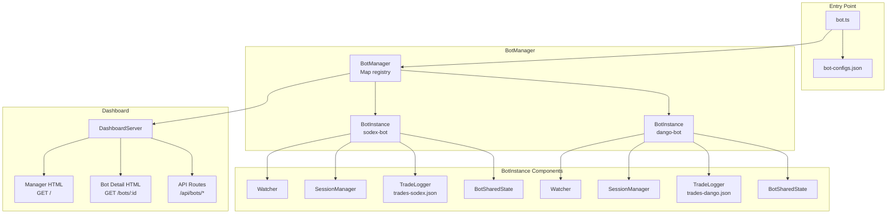
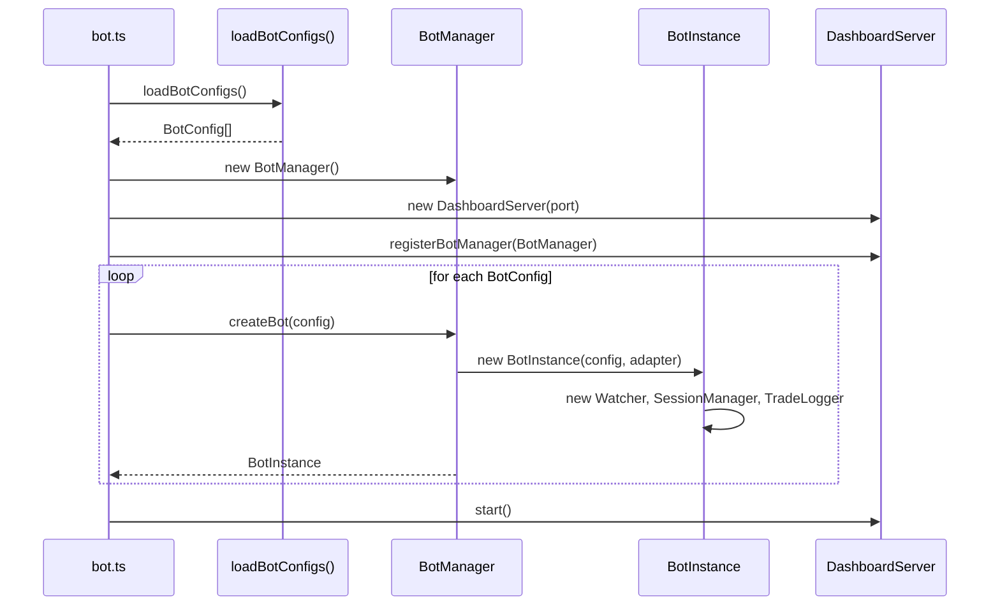
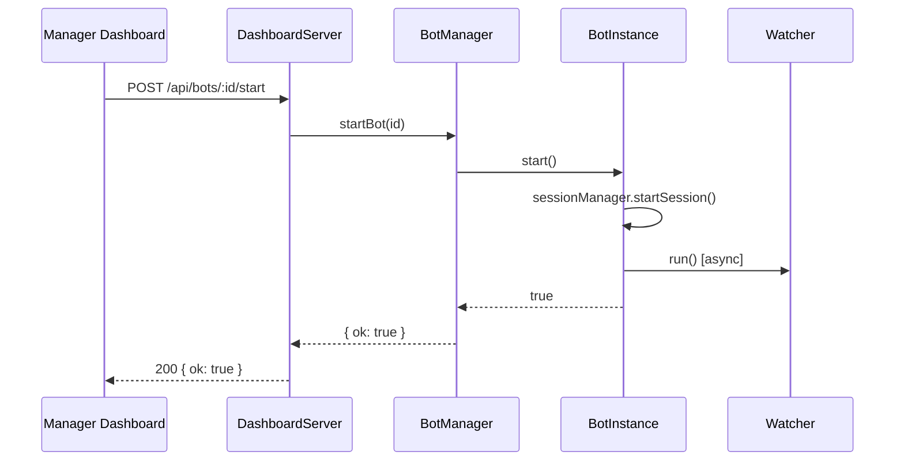
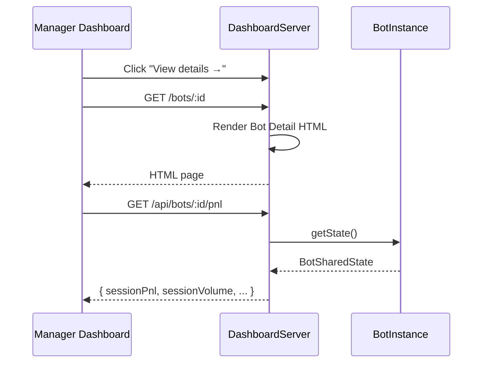

# Design Document: Multi-Bot Manager

## Overview

Multi-Bot Manager mở rộng kiến trúc single-bot hiện tại để hỗ trợ chạy nhiều bot trading song song trên các sàn khác nhau (SoDEX, Dango, Decibel). Thiết kế tập trung vào **tối thiểu hóa thay đổi** và **tái sử dụng tối đa** code hiện có.

**Nguyên tắc thiết kế:**
- Giữ nguyên `src/bot.ts` entry point
- Thêm `BotManager` class đơn giản - chỉ là registry `Map<botId, BotInstance>`
- `BotInstance` là wrapper nhẹ quanh Watcher + SessionManager + state riêng
- Mỗi bot có `BotSharedState` riêng (clone từ structure của `sharedState` singleton)
- Dashboard mở rộng thêm routes `/api/bots/*` cho multi-bot, giữ nguyên routes hiện tại

Dashboard gồm hai tầng:
- **Manager Dashboard** (`GET /`): Danh sách bot cards, aggregated stats, filter
- **Bot Detail Dashboard** (`GET /bots/:id`): Giữ nguyên UI hiện tại, scoped cho 1 bot

---

## Architecture



**Kiến trúc đơn giản hóa:**
- `bot.ts` đọc `bot-configs.json` → tạo `BotManager` → tạo `BotInstance` cho mỗi config
- Mỗi `BotInstance` có: Watcher riêng, SessionManager riêng, TradeLogger riêng (file riêng)
- `DashboardServer` nhận `BotManager` reference → serve Manager Dashboard + proxy requests đến đúng bot
- **Không thay đổi**: Watcher, SessionManager, Executor, MarketMaker - giữ nguyên interface
- **Backward compat**: Telegram commands hoạt động với bot đầu tiên

---

## Sequence Diagrams

### Bootstrap: Khởi động Multi-Bot



### Start Bot: Khởi động bot từ Dashboard



### View Details: Xem chi tiết bot



---

## Components and Interfaces

### BotConfig

Cấu hình để tạo một bot instance, đọc từ `bot-configs.json`.

```typescript
interface BotConfig {
  // Định danh
  id: string;                    // e.g. "sodex-bot", "dango-bot"
  name: string;                  // Display name: "Bot SoDEX"
  exchange: 'sodex' | 'dango' | 'decibel';
  symbol: string;                // e.g. "BTC-USD"
  tags: string[];                // e.g. ["TWAP", "Aggressive"]
  autoStart: boolean;

  // Trading config
  mode: 'farm' | 'trade';
  orderSizeMin: number;
  orderSizeMax: number;

  // Credentials (env var prefix)
  credentialKey: string;         // e.g. "SODEX" → đọc SODEX_API_KEY, SODEX_API_SECRET

  // Logging
  tradeLogBackend: 'json' | 'sqlite';
  tradeLogPath: string;          // e.g. "./trades-sodex.json"
  
  // Optional overridable fields (for config persistence)
  farmMinHoldSecs?: number;
  farmMaxHoldSecs?: number;
  farmTpUsd?: number;
  farmSlPercent?: number;
  farmScoreEdge?: number;
  farmMinConfidence?: number;
  farmEarlyExitSecs?: number;
  farmEarlyExitPnl?: number;
  farmExtraWaitSecs?: number;
  farmBlockedHours?: string;
  farmCooldownSecs?: number;
  tradeTpPercent?: number;
  tradeSlPercent?: number;
  cooldownMinMins?: number;
  cooldownMaxMins?: number;
  minPositionValueUsd?: number;
}
```

### BotSharedState

State riêng của từng bot, tương đương structure của `sharedState` singleton hiện tại.

```typescript
interface BotSharedState {
  botId: string;
  sessionPnl: number;
  sessionVolume: number;
  sessionFees: number;
  updatedAt: string;
  botStatus: 'RUNNING' | 'STOPPED';
  symbol: string;
  walletAddress: string;
  pnlHistory: PnlDataPoint[];
  volumeHistory: PnlDataPoint[];
  eventLog: EventLogEntry[];
  openPosition: OpenPositionState | null;
}

// Factory function
function createBotSharedState(botId: string): BotSharedState {
  return {
    botId,
    sessionPnl: 0,
    sessionVolume: 0,
    sessionFees: 0,
    updatedAt: new Date().toISOString(),
    botStatus: 'STOPPED',
    symbol: '',
    walletAddress: '',
    pnlHistory: [],
    volumeHistory: [],
    eventLog: [],
    openPosition: null,
  };
}
```

### BotInstance

Wrapper nhẹ quản lý lifecycle của một bot.

```typescript
class BotInstance {
  readonly id: string;
  readonly config: BotConfig;
  readonly state: BotSharedState;
  
  private adapter: ExchangeAdapter;
  private watcher: Watcher;
  private sessionManager: SessionManager;
  private tradeLogger: TradeLogger;
  private telegram: TelegramManager;

  constructor(config: BotConfig, adapter: ExchangeAdapter, telegram: TelegramManager) {
    this.id = config.id;
    this.config = config;
    this.state = createBotSharedState(config.id);
    this.adapter = adapter;
    this.telegram = telegram;
    
    // Khởi tạo components
    this.sessionManager = new SessionManager();
    this.tradeLogger = new TradeLogger(config.tradeLogBackend, config.tradeLogPath);
    this.watcher = new Watcher(adapter, config.symbol, telegram, this.sessionManager);
  }

  async start(): Promise<boolean> {
    if (this.state.botStatus === 'RUNNING') return false;
    
    const success = this.sessionManager.startSession();
    if (success) {
      this.watcher.resetSession();
      this.state.botStatus = 'RUNNING';
      
      // Run watcher in background, catch crash
      this.watcher.run().catch(err => {
        console.error(`[BotInstance:${this.id}] Watcher crashed:`, err);
        this.sessionManager.stopSession();
        this.state.botStatus = 'STOPPED';
      });
    }
    return success;
  }

  async stop(): Promise<void> {
    this.sessionManager.stopSession();
    this.watcher.stop();
    this.state.botStatus = 'STOPPED';
  }

  getStatus(): BotStatus {
    const session = this.sessionManager.getState();
    const uptime = session.startTime ? Math.floor((Date.now() - session.startTime) / 60000) : 0;
    const efficiencyBps = this.state.sessionVolume > 0 
      ? (this.state.sessionPnl / this.state.sessionVolume) * 10000 
      : 0;
    const progress = Math.min(100, Math.abs(this.state.sessionPnl) / session.maxLoss * 100);

    return {
      id: this.id,
      name: this.config.name,
      exchange: this.config.exchange,
      status: this.state.botStatus === 'RUNNING' ? 'active' : 'inactive',
      symbol: this.config.symbol,
      tags: this.config.tags,
      sessionPnl: this.state.sessionPnl,
      sessionVolume: this.state.sessionVolume,
      sessionFees: this.state.sessionFees,
      efficiencyBps,
      walletAddress: this.state.walletAddress,
      uptime,
      hasPosition: this.state.openPosition !== null,
      progress,
    };
  }

  async forceClosePosition(): Promise<boolean> {
    return this.watcher.forceClosePosition();
  }

  getTradeLogger(): TradeLogger { return this.tradeLogger; }
  getSessionManager(): SessionManager { return this.sessionManager; }
  getWatcher(): Watcher { return this.watcher; }
}

interface BotStatus {
  id: string;
  name: string;
  exchange: string;
  status: 'active' | 'inactive';
  symbol: string;
  tags: string[];
  sessionPnl: number;
  sessionVolume: number;
  sessionFees: number;
  efficiencyBps: number;
  walletAddress: string;
  uptime: number;
  hasPosition: boolean;
  progress: number;
}
```

### BotManager

Registry đơn giản quản lý tất cả bot instances.

```typescript
class BotManager {
  private registry = new Map<string, BotInstance>();

  createBot(config: BotConfig, adapter: ExchangeAdapter, telegram: TelegramManager): BotInstance {
    if (this.registry.has(config.id)) {
      throw new Error(`Bot with id "${config.id}" already exists`);
    }
    
    const instance = new BotInstance(config, adapter, telegram);
    this.registry.set(config.id, instance);
    return instance;
  }

  removeBot(id: string): void {
    const bot = this.registry.get(id);
    if (bot && bot.state.botStatus === 'RUNNING') {
      throw new Error(`Cannot remove running bot "${id}". Stop it first.`);
    }
    this.registry.delete(id);
  }

  getBot(id: string): BotInstance | undefined {
    return this.registry.get(id);
  }

  getAllBots(): BotInstance[] {
    return Array.from(this.registry.values());
  }

  async startBot(id: string): Promise<boolean> {
    const bot = this.getBot(id);
    if (!bot) throw new Error(`Bot "${id}" not found`);
    return bot.start();
  }

  async stopBot(id: string): Promise<void> {
    const bot = this.getBot(id);
    if (!bot) throw new Error(`Bot "${id}" not found`);
    await bot.stop();
  }

  getAggregatedStats(): AggregatedStats {
    let totalVolume = 0;
    let activeBotCount = 0;
    let totalFees = 0;
    let totalPnl = 0;

    for (const bot of this.registry.values()) {
      totalVolume += bot.state.sessionVolume;
      totalFees += bot.state.sessionFees;
      totalPnl += bot.state.sessionPnl;
      if (bot.state.botStatus === 'RUNNING') {
        activeBotCount++;
      }
    }

    return { totalVolume, activeBotCount, totalFees, totalPnl };
  }
}

interface AggregatedStats {
  totalVolume: number;
  activeBotCount: number;
  totalFees: number;
  totalPnl: number;
}
```

---

## Data Models

### BotCardViewModel

Model dùng để render bot card trên Manager Dashboard.

```typescript
interface BotCardViewModel {
  id: string;
  name: string;
  exchange: 'sodex' | 'dango' | 'decibel';
  status: 'active' | 'inactive';
  tags: string[];
  sessionVolume: number;
  sessionFees: number;
  sessionPnl: number;
  efficiencyBps: number;
  walletAddress: string;
  progress: number;
  uptime: number;
  hasPosition: boolean;
}
```

### Adapter Factory

Factory function để tạo adapter từ config.

```typescript
function createAdapter(exchange: string, credentialKey: string): ExchangeAdapter {
  switch (exchange.toLowerCase()) {
    case 'sodex': {
      const apiKey = process.env[`${credentialKey}_API_KEY`];
      const apiSecret = process.env[`${credentialKey}_API_SECRET`];
      const subaccount = process.env[`${credentialKey}_SUBACCOUNT`];
      
      if (!apiKey || !apiSecret || !subaccount) {
        throw new Error(`Missing credentials for ${exchange}: ${credentialKey}_*`);
      }
      return new SodexAdapter(apiKey, apiSecret, subaccount);
    }
    
    case 'dango': {
      const privateKey = process.env[`${credentialKey}_PRIVATE_KEY`];
      const userAddress = process.env[`${credentialKey}_USER_ADDRESS`];
      const network = process.env[`${credentialKey}_NETWORK`] ?? 'mainnet';
      
      if (!privateKey || !userAddress) {
        throw new Error(`Missing credentials for ${exchange}: ${credentialKey}_*`);
      }
      return new DangoAdapter(privateKey, userAddress, network as 'mainnet' | 'testnet');
    }
    
    case 'decibel':
    default: {
      const privateKey = process.env[`${credentialKey}_PRIVATE_KEY`];
      const nodeApiKey = process.env[`${credentialKey}_NODE_API_KEY`] ?? '';
      const subaccount = process.env[`${credentialKey}_SUBACCOUNT`] ?? '';
      const builderAddress = process.env[`${credentialKey}_BUILDER_ADDRESS`]?.trim() ?? '';
      const gasStationApiKey = process.env[`${credentialKey}_GAS_STATION_API_KEY`];
      
      if (!privateKey) {
        throw new Error(`Missing credentials for ${exchange}: ${credentialKey}_PRIVATE_KEY`);
      }
      return new DecibelAdapter(privateKey, nodeApiKey, subaccount, builderAddress, 10, gasStationApiKey);
    }
  }
}
```

---

## Key Functions with Formal Specifications

### loadBotConfigs()

```typescript
function loadBotConfigs(): BotConfig[]
```

**Preconditions:**
- `BOT_CONFIGS_PATH` env var (optional, default: `./bot-configs.json`)

**Postconditions:**
- Returns array of valid `BotConfig` objects
- If file doesn't exist, creates it with 3 default configs (sodex-bot, decibel-bot, dango-bot)
- If file exists, reads and validates configs
- Invalid configs are logged as warnings and skipped

**Algorithm:**

```pascal
ALGORITHM loadBotConfigs()
INPUT: BOT_CONFIGS_PATH env var (default: "./bot-configs.json")
OUTPUT: BotConfig[]

BEGIN
  configPath ← process.env.BOT_CONFIGS_PATH ?? "./bot-configs.json"
  
  // Check if file exists
  IF NOT fileExists(configPath) THEN
    // Create default configs
    defaultConfigs ← [
      {
        id: "sodex-bot",
        name: "SoDEX Bot",
        exchange: "sodex",
        symbol: "BTC-USD",
        credentialKey: "SODEX",
        tradeLogBackend: "json",
        tradeLogPath: "./trades-sodex.json",
        autoStart: false,
        mode: "farm",
        orderSizeMin: 0.003,
        orderSizeMax: 0.005,
        tags: ["TWAP", "Farm"]
      },
      {
        id: "decibel-bot",
        name: "Decibel Bot",
        exchange: "decibel",
        symbol: "BTC-USD",
        credentialKey: "DECIBELS",
        tradeLogBackend: "json",
        tradeLogPath: "./trades-decibel.json",
        autoStart: false,
        mode: "farm",
        orderSizeMin: 0.003,
        orderSizeMax: 0.005,
        tags: ["Market Making", "Farm"]
      },
      {
        id: "dango-bot",
        name: "Dango Bot",
        exchange: "dango",
        symbol: "BTC-USD",
        credentialKey: "DANGO",
        tradeLogBackend: "json",
        tradeLogPath: "./trades-dango.json",
        autoStart: false,
        mode: "farm",
        orderSizeMin: 0.003,
        orderSizeMax: 0.005,
        tags: ["Scalping", "Farm"]
      }
    ]
    
    // Write to file
    writeFile(configPath, JSON.stringify({ version: 1, bots: defaultConfigs }, null, 2))
    console.log("[loadBotConfigs] Created default bot-configs.json with 3 bots")
    
    RETURN defaultConfigs
  END IF
  
  // Read existing file
  fileContent ← readFile(configPath)
  data ← JSON.parse(fileContent)
  
  validConfigs ← []
  FOR each config IN data.bots DO
    IF validateBotConfig(config) THEN
      validConfigs.push(config)
    ELSE
      console.warn("[loadBotConfigs] Invalid config skipped:", config.id)
    END IF
  END FOR
  
  ASSERT validConfigs.length > 0
  RETURN validConfigs
END
```

### createAdapter()

```typescript
function createAdapter(exchange: string, credentialKey: string): ExchangeAdapter
```

**Preconditions:**
- `exchange` thuộc `['sodex', 'dango', 'decibel']`
- Credentials tương ứng với `credentialKey` phải có trong `process.env`

**Postconditions:**
- Returns valid `ExchangeAdapter` instance
- Throws error nếu credentials thiếu

### BotManager.createBot()

```typescript
function createBot(config: BotConfig, adapter: ExchangeAdapter, telegram: TelegramManager): BotInstance
```

**Preconditions:**
- `config.id` là unique trong registry (không trùng với bot đã tồn tại)
- `adapter` đã được khởi tạo thành công

**Postconditions:**
- Bot instance được thêm vào registry
- Bot ở trạng thái `STOPPED`
- `getAllBots().length` tăng thêm 1

### BotInstance.start()

```typescript
async function start(): Promise<boolean>
```

**Preconditions:**
- Bot chưa ở trạng thái `RUNNING`

**Postconditions:**
- Nếu thành công: `state.botStatus === 'RUNNING'`, `sessionManager.getState().isRunning === true`, Watcher loop đang chạy, returns `true`
- Nếu đã running: returns `false`, không có side effects

### BotInstance.stop()

```typescript
async function stop(): Promise<void>
```

**Preconditions:**
- Không có (có thể gọi bất cứ lúc nào)

**Postconditions:**
- `state.botStatus === 'STOPPED'`
- `sessionManager.getState().isRunning === false`
- Watcher loop đã dừng
- Open position KHÔNG bị force-close

### BotManager.getAggregatedStats()

```typescript
function getAggregatedStats(): AggregatedStats
```

**Preconditions:** Không có

**Postconditions:**
- `totalVolume = Σ bot.state.sessionVolume` cho tất cả bots
- `activeBotCount = count(bots where status === 'RUNNING')`
- `totalFees = Σ bot.state.sessionFees`
- `totalPnl = Σ bot.state.sessionPnl`
- `activeBotCount ∈ [0, registry.size]`

---

## Algorithmic Pseudocode

### Bootstrap Algorithm

```pascal
ALGORITHM bootstrapMultiBotManager()
INPUT: process.env, bot-configs.json
OUTPUT: running BotManager với DashboardServer

BEGIN
  configs ← loadBotConfigs()  // đọc bot-configs.json
  manager ← new BotManager()
  telegram ← new TelegramManager()
  dashboard ← new DashboardServer(port)
  
  FOR each config IN configs DO
    ASSERT config.id NOT IN manager.registry
    
    adapter ← createAdapter(config.exchange, config.credentialKey)
    instance ← manager.createBot(config, adapter, telegram)
    
    IF config.autoStart = true THEN
      instance.start()
    END IF
  END FOR
  
  dashboard.registerBotManager(manager)
  dashboard.start()
  
  ASSERT dashboard.isListening = true
  ASSERT manager.getAllBots().length = configs.length
END
```

### BotInstance Lifecycle

```pascal
ALGORITHM botInstanceLifecycle(instance)
INPUT: instance — BotInstance
OUTPUT: state transitions

BEGIN
  // Start transition
  PROCEDURE start()
    IF instance.state.botStatus = RUNNING THEN
      RETURN false
    END IF
    
    success ← instance.sessionManager.startSession()
    IF success THEN
      instance.watcher.resetSession()
      instance.state.botStatus ← RUNNING
      
      // Run watcher async, catch crash
      ASYNC instance.watcher.run()
        ON ERROR →
          instance.sessionManager.stopSession()
          instance.state.botStatus ← STOPPED
      
      RETURN true
    END IF
    RETURN false
  END PROCEDURE

  // Stop transition
  PROCEDURE stop()
    instance.sessionManager.stopSession()
    instance.watcher.stop()
    instance.state.botStatus ← STOPPED
  END PROCEDURE
END
```

### Aggregated Stats Computation

```pascal
ALGORITHM computeAggregatedStats(registry)
INPUT: registry — Map<botId, BotInstance>
OUTPUT: AggregatedStats

BEGIN
  totalVolume ← 0
  activeBotCount ← 0
  totalFees ← 0
  totalPnl ← 0

  FOR each instance IN registry.values() DO
    totalVolume ← totalVolume + instance.state.sessionVolume
    totalFees ← totalFees + instance.state.sessionFees
    totalPnl ← totalPnl + instance.state.sessionPnl
    
    IF instance.state.botStatus = RUNNING THEN
      activeBotCount ← activeBotCount + 1
    END IF
  END FOR

  ASSERT totalVolume >= 0
  ASSERT activeBotCount >= 0 AND activeBotCount <= registry.size

  RETURN { totalVolume, activeBotCount, totalFees, totalPnl }
END
```

---

## Manager Dashboard UI Design

### Layout Overview

```
┌─────────────────────────────────────────────────────────────┐
│  APEX Multi-Bot Manager                    [+ Create Bot]   │
├─────────────────────────────────────────────────────────────┤
│  ┌──────────────┐ ┌──────────────┐ ┌──────────────────────┐ │
│  │ Total Volume │ │ Active Bots  │ │  Total Fees & PnL    │ │
│  │  $124,500    │ │     2 / 3    │ │  Fees: $14.9         │ │
│  └──────────────┘ └──────────────┘ │  PnL:  +$3.2         │ │
│                                    └──────────────────────┘ │
├─────────────────────────────────────────────────────────────┤
│  [All] [Active] [Inactive]                                  │
├─────────────────────────────────────────────────────────────┤
│  ┌─────────────────────────────────────────────────────┐    │
│  │ Bot SoDEX                    ● ACTIVE               │    │
│  │ ID: sodex-bot  [TWAP] [Aggressive]                  │    │
│  │ Volume: $42,100  Fees: $5.1  PnL: +$1.2  Eff: 2.8bp│    │
│  │ Wallet: 0x1234...abcd                               │    │
│  │ ████████████░░░░░░░░  60%                           │    │
│  │                    [Stop]  [View details →]         │    │
│  └─────────────────────────────────────────────────────┘    │
│  ┌─────────────────────────────────────────────────────┐    │
│  │ Bot Dango                    ○ INACTIVE             │    │
│  │ ...                                                 │    │
│  │                    [Start] [View details →]         │    │
│  └─────────────────────────────────────────────────────┘    │
└─────────────────────────────────────────────────────────────┘
```

### Bot Card Components

**Status Badge:**
- `ACTIVE` (green) khi `botStatus === 'RUNNING'`
- `INACTIVE` (gray) khi `botStatus === 'STOPPED'`

**Metrics:**
- Volume: `sessionVolume` (USD)
- Fees: `sessionFees` (USD)
- PnL: `sessionPnl` (USD, màu xanh nếu > 0, đỏ nếu < 0)
- Efficiency: `(sessionPnl / sessionVolume) * 10000` bps

**Progress Bar:**
- `progress = Math.min(100, Math.abs(sessionPnl) / maxLoss * 100)`

**Actions:**
- `Start` button khi inactive → `POST /api/bots/:id/start`
- `Stop` button khi active → `POST /api/bots/:id/stop`
- `View details →` link → navigate đến `/bots/:id`

### Navigation Flow

- `/` → Manager Dashboard (danh sách tất cả bots)
- `/bots/:id` → Bot Detail Dashboard (UI hiện tại, scoped cho bot đó)
- "View details →" button trên card → navigate đến `/bots/:id`
- "← Back to Manager" link trên Bot Detail page → navigate về `/`

---

## Error Handling

### Scenario 1: Adapter initialization failure

**Condition**: Credentials thiếu hoặc sai khi tạo bot  
**Response**: `createAdapter()` throw error với message mô tả field thiếu  
**Recovery**: Bot không được thêm vào registry; log error

### Scenario 2: Bot crash trong khi running

**Condition**: `watcher.run()` throw unhandled error  
**Response**: `BotInstance` catch error trong promise, set `state.botStatus = 'STOPPED'`, log error  
**Recovery**: Bot có thể restart thủ công từ dashboard; state được preserve

### Scenario 3: Duplicate bot ID

**Condition**: `createBot()` được gọi với `id` đã tồn tại trong registry  
**Response**: Throw error `"Bot with id ... already exists"`  
**Recovery**: Caller handle error

### Scenario 4: Start bot đang running

**Condition**: `start()` được gọi khi bot đã `RUNNING`  
**Response**: Returns `false`, không có side effects  
**Recovery**: Caller check return value

### Scenario 5: Bot không tìm thấy

**Condition**: Request đến `/api/bots/:id/*` với id không tồn tại  
**Response**: 404 Not Found `{ error: 'Bot not found' }`  
**Recovery**: Client hiển thị error message

---

## Testing Strategy

### Unit Testing Approach

- `BotManager`: test `createBot`, `removeBot`, `getAggregatedStats` với mock `BotInstance`
- `BotInstance`: test state transitions (start/stop), error handling khi watcher crash
- Manager Routes: test tất cả API endpoints với supertest, mock `BotManager`
- `createAdapter`: test credential validation, error messages

**Test files:**
- `src/bot/__tests__/BotManager.test.ts`
- `src/bot/__tests__/BotInstance.test.ts`
- `src/dashboard/__tests__/manager-routes.test.ts`

### Property-Based Testing Approach

**Property Test Library**: fast-check

Key properties:
- **P1 — State Isolation**: Update bot i không ảnh hưởng bot j
- **P2 — Aggregation Consistency**: `totalVolume = Σ sessionVolume`
- **P3 — Active Count Range**: `activeBotCount ∈ [0, registry.size]`
- **P4 — Stop Idempotency**: Sau `stop()`, bot luôn ở trạng thái `STOPPED`
- **P5 — Efficiency Calculation**: `efficiencyBps = (pnl/volume)*10000` (với volume > 0)

**Test file:**
- `src/bot/__tests__/BotManager.properties.test.ts`

### Integration Testing Approach

- End-to-end test: tạo 2 bot instances với mock adapters, start/stop qua API, verify aggregated stats
- Verify trade logs tách biệt (mỗi bot ghi vào file riêng)
- Test Manager Dashboard HTML render

**Test file:**
- `src/bot/__tests__/multi-bot.integration.test.ts`

---

## Performance Considerations

- `getAggregatedStats()` là O(n) với n = số bots — acceptable vì n ≤ 10 trong thực tế
- Mỗi bot có polling loop riêng với random delay (2-90s) — không có shared lock
- `BotSharedState` được update in-memory, không có DB write trên mỗi tick
- TradeLogger writes được debounce per-bot

## Security Considerations

- Authentication middleware hiện tại (`dash_token` cookie) áp dụng cho tất cả routes kể cả `/api/bots/*`
- Credentials của từng bot chỉ đọc từ `process.env`, không expose qua API
- `removeBot()` yêu cầu bot phải ở trạng thái `STOPPED` trước khi xóa

## Default Bot Configs

Hệ thống phải có sẵn 3 bot configs mặc định trong `bot-configs.json` khi khởi động lần đầu:

```json
{
  "version": 1,
  "bots": [
    {
      "id": "sodex-bot",
      "name": "SoDEX Bot",
      "exchange": "sodex",
      "symbol": "BTC-USD",
      "credentialKey": "SODEX",
      "tradeLogBackend": "json",
      "tradeLogPath": "./trades-sodex.json",
      "autoStart": false,
      "mode": "farm",
      "orderSizeMin": 0.003,
      "orderSizeMax": 0.005,
      "tags": ["TWAP", "Farm"]
    },
    {
      "id": "decibel-bot",
      "name": "Decibel Bot",
      "exchange": "decibel",
      "symbol": "BTC-USD",
      "credentialKey": "DECIBELS",
      "tradeLogBackend": "json",
      "tradeLogPath": "./trades-decibel.json",
      "autoStart": false,
      "mode": "farm",
      "orderSizeMin": 0.003,
      "orderSizeMax": 0.005,
      "tags": ["Market Making", "Farm"]
    },
    {
      "id": "dango-bot",
      "name": "Dango Bot",
      "exchange": "dango",
      "symbol": "BTC-USD",
      "credentialKey": "DANGO",
      "tradeLogBackend": "json",
      "tradeLogPath": "./trades-dango.json",
      "autoStart": false,
      "mode": "farm",
      "orderSizeMin": 0.003,
      "orderSizeMax": 0.005,
      "tags": ["Scalping", "Farm"]
    }
  ]
}
```

**Behavior:**
- Nếu `bot-configs.json` không tồn tại khi khởi động, tạo file với 3 configs mặc định này
- Nếu file đã tồn tại, giữ nguyên (không overwrite)

---

## Config Persistence

### Overview

Khi user thay đổi config của bot qua UI (e.g., `POST /api/bots/:id/config`), changes phải được lưu vào `bot-configs.json` để survive qua docker restart.

### Design

**1. Per-Bot ConfigStore**

Mỗi `BotInstance` có `ConfigStore` riêng:

```typescript
class BotInstance {
  private configStore: ConfigStore;
  
  constructor(config: BotConfig, ...) {
    // Initialize ConfigStore with bot-specific config
    this.configStore = new ConfigStore(config.id);
    
    // Apply initial config values as overrides
    this.configStore.applyOverrides({
      ORDER_SIZE_MIN: config.orderSizeMin,
      ORDER_SIZE_MAX: config.orderSizeMax,
      FARM_MIN_HOLD_SECS: config.farmMinHoldSecs,
      // ... other overridable fields
    });
  }
  
  getConfigStore(): ConfigStore {
    return this.configStore;
  }
}
```

**2. Config Persistence Function**

```typescript
// src/bot/persistBotConfigs.ts

import fs from 'fs';
import type { BotManager } from './BotManager.js';
import type { BotConfig } from './types.js';

/**
 * Save all bot configs (including runtime overrides) back to bot-configs.json
 */
export function saveBotConfigsToFile(manager: BotManager, filePath: string): void {
  const configs: BotConfig[] = manager.getAllBots().map(bot => {
    const baseConfig = bot.config;
    const overrides = bot.getConfigStore().getOverrides();
    
    // Merge overrides back into config
    return {
      ...baseConfig,
      orderSizeMin: overrides.ORDER_SIZE_MIN ?? baseConfig.orderSizeMin,
      orderSizeMax: overrides.ORDER_SIZE_MAX ?? baseConfig.orderSizeMax,
      farmMinHoldSecs: overrides.FARM_MIN_HOLD_SECS ?? baseConfig.farmMinHoldSecs,
      farmMaxHoldSecs: overrides.FARM_MAX_HOLD_SECS ?? baseConfig.farmMaxHoldSecs,
      farmTpUsd: overrides.FARM_TP_USD ?? baseConfig.farmTpUsd,
      farmSlPercent: overrides.FARM_SL_PERCENT ?? baseConfig.farmSlPercent,
      // ... map all overridable fields
    };
  });
  
  const data = {
    version: 1,
    bots: configs,
  };
  
  fs.writeFileSync(filePath, JSON.stringify(data, null, 2), 'utf-8');
  console.log(`[BotManager] Saved ${configs.length} bot configs to ${filePath}`);
}
```

**3. API Route Update**

```typescript
// In DashboardServer._setupRoutes()

this.app.post('/api/bots/:id/config', (req, res) => {
  if (!this.botManager) {
    res.status(503).json({ error: 'Bot manager not available' });
    return;
  }
  
  const bot = this.botManager.getBot(req.params.id);
  if (!bot) {
    res.status(404).json({ error: 'Bot not found' });
    return;
  }
  
  try {
    const patch = req.body as Partial<OverridableConfig>;
    
    // Validate overrides
    const errors = validateOverrides(patch, bot.getConfigStore().getEffective());
    if (errors.length > 0) {
      res.status(400).json({ errors });
      return;
    }
    
    // Apply overrides to bot's ConfigStore
    bot.getConfigStore().applyOverrides(patch);
    
    // Persist to file
    const configPath = process.env.BOT_CONFIGS_PATH ?? './bot-configs.json';
    saveBotConfigsToFile(this.botManager, configPath);
    
    res.json(bot.getConfigStore().getEffective());
  } catch (err) {
    res.status(500).json({ error: String(err) });
  }
});

this.app.get('/api/bots/:id/config', (req, res) => {
  if (!this.botManager) {
    res.status(503).json({ error: 'Bot manager not available' });
    return;
  }
  
  const bot = this.botManager.getBot(req.params.id);
  if (!bot) {
    res.status(404).json({ error: 'Bot not found' });
    return;
  }
  
  res.json(bot.getConfigStore().getEffective());
});

this.app.delete('/api/bots/:id/config', (req, res) => {
  if (!this.botManager) {
    res.status(503).json({ error: 'Bot manager not available' });
    return;
  }
  
  const bot = this.botManager.getBot(req.params.id);
  if (!bot) {
    res.status(404).json({ error: 'Bot not found' });
    return;
  }
  
  try {
    bot.getConfigStore().resetToDefaults();
    
    // Persist to file
    const configPath = process.env.BOT_CONFIGS_PATH ?? './bot-configs.json';
    saveBotConfigsToFile(this.botManager, configPath);
    
    res.json(bot.getConfigStore().getEffective());
  } catch (err) {
    res.status(500).json({ error: String(err) });
  }
});
```

**Preconditions:**
- `BotManager` đã được registered với `DashboardServer`
- Bot với `id` tồn tại trong registry
- `patch` object chứa valid overridable config keys

**Postconditions:**
- Config changes được apply vào bot's `ConfigStore`
- Changes được persist vào `bot-configs.json`
- File survive qua docker restart (docker down → build → up)

---

## HTML Partials Structure

### Overview

Manager Dashboard sử dụng EJS partials để tách biệt components và dễ quản lý.

### File Structure

```
src/dashboard/views/
├── layout.ejs              (existing - Bot Detail Dashboard)
├── manager.ejs             (new - Manager Dashboard layout)
└── partials/
    ├── bot-card.ejs        (new - single bot card template)
    └── bot-cards.ejs       (new - bot cards container)
```

### manager.ejs

Manager Dashboard layout chính:

```html
<!DOCTYPE html>
<html lang="en">
<head>
  <meta charset="UTF-8">
  <meta name="viewport" content="width=device-width, initial-scale=1.0">
  <title>APEX Multi-Bot Manager</title>
  <link rel="stylesheet" href="/css/main.css">
</head>
<body>
  <div class="manager-container">
    <header>
      <h1>APEX Multi-Bot Manager</h1>
    </header>
    
    <!-- Aggregated Stats -->
    <div class="stats-row">
      <div class="stat-card">
        <h3>Total Volume</h3>
        <p id="total-volume">$0</p>
      </div>
      <div class="stat-card">
        <h3>Active Bots</h3>
        <p id="active-bots">0 / 0</p>
      </div>
      <div class="stat-card">
        <h3>Total Fees & PnL</h3>
        <p id="total-fees">Fees: $0</p>
        <p id="total-pnl">PnL: $0</p>
      </div>
    </div>
    
    <!-- Filter Tabs -->
    <div class="filter-tabs">
      <button class="tab active" data-filter="all">All</button>
      <button class="tab" data-filter="active">Active</button>
      <button class="tab" data-filter="inactive">Inactive</button>
    </div>
    
    <!-- Bot Cards List (partial) -->
    <%- include('partials/bot-cards') %>
  </div>
  
  <script src="/js/manager-dashboard.js"></script>
</body>
</html>
```

### partials/bot-cards.ejs

Container cho bot cards list:

```html
<div class="bot-cards-container" id="bot-cards">
  <!-- Bot cards will be rendered here by JavaScript -->
  <!-- Template is defined in bot-card.ejs -->
</div>
```

### partials/bot-card.ejs

Template cho single bot card (dùng bởi JavaScript để render):

```html
<!-- This is a template for JavaScript rendering, not directly included -->
<template id="bot-card-template">
  <div class="bot-card" data-bot-id="{id}" data-status="{status}">
    <div class="bot-header">
      <h3>{name}</h3>
      <span class="status-badge {status}">{statusText}</span>
    </div>
    <div class="bot-info">
      <p><strong>ID:</strong> {id}</p>
      <p><strong>Exchange:</strong> {exchange}</p>
      <p><strong>Tags:</strong> {tags}</p>
    </div>
    <div class="bot-metrics">
      <p><strong>Volume:</strong> ${volume}</p>
      <p><strong>Fees:</strong> ${fees}</p>
      <p><strong>PnL:</strong> <span class="pnl {pnlClass}">${pnl}</span></p>
      <p><strong>Efficiency:</strong> {efficiency} bps</p>
    </div>
    <div class="bot-progress">
      <div class="progress-bar" style="width: {progress}%"></div>
    </div>
    <div class="bot-actions">
      <button class="btn-start" data-bot-id="{id}" style="display: {startDisplay}">Start</button>
      <button class="btn-stop" data-bot-id="{id}" style="display: {stopDisplay}">Stop</button>
      <a href="/bots/{id}" class="btn-details">View details →</a>
    </div>
  </div>
</template>
```

### DashboardServer Route Update

```typescript
// In DashboardServer._setupRoutes()

this.app.get('/', (_req, res) => {
  res.render('manager', (err: Error | null, html: string) => {
    if (err) {
      console.error('[DashboardServer] Manager template render error:', err);
      res.status(500).send(`Template render error: ${err.message}`);
      return;
    }
    res.setHeader('Content-Type', 'text/html');
    res.send(html);
  });
});

this.app.get('/bots/:id', (req, res) => {
  if (!this.botManager) {
    res.status(503).send('Bot manager not available');
    return;
  }
  
  const bot = this.botManager.getBot(req.params.id);
  if (!bot) {
    res.status(404).send('Bot not found');
    return;
  }
  
  // Render Bot Detail Dashboard (existing layout.ejs)
  res.render('layout', { botId: req.params.id }, (err: Error | null, html: string) => {
    if (err) {
      console.error('[DashboardServer] Bot detail template render error:', err);
      res.status(500).send(`Template render error: ${err.message}`);
      return;
    }
    res.setHeader('Content-Type', 'text/html');
    res.send(html);
  });
});
```

### JavaScript Rendering Logic

`src/dashboard/public/js/manager-dashboard.js`:

```javascript
// Fetch bot card template
const template = document.getElementById('bot-card-template').innerHTML;

// Fetch bots from API
fetch('/api/bots')
  .then(res => res.json())
  .then(bots => {
    const container = document.getElementById('bot-cards');
    container.innerHTML = bots.map(bot => {
      return template
        .replace(/{id}/g, bot.id)
        .replace(/{name}/g, bot.name)
        .replace(/{exchange}/g, bot.exchange)
        .replace(/{status}/g, bot.status)
        .replace(/{statusText}/g, bot.status === 'active' ? 'ACTIVE' : 'INACTIVE')
        .replace(/{tags}/g, bot.tags.join(', '))
        .replace(/{volume}/g, bot.sessionVolume.toFixed(2))
        .replace(/{fees}/g, bot.sessionFees.toFixed(2))
        .replace(/{pnl}/g, bot.sessionPnl.toFixed(2))
        .replace(/{pnlClass}/g, bot.sessionPnl >= 0 ? 'positive' : 'negative')
        .replace(/{efficiency}/g, bot.efficiencyBps.toFixed(2))
        .replace(/{progress}/g, bot.progress)
        .replace(/{startDisplay}/g, bot.status === 'active' ? 'none' : 'inline-block')
        .replace(/{stopDisplay}/g, bot.status === 'active' ? 'inline-block' : 'none');
    }).join('');
  });
```

**Benefits:**
- Tách biệt structure (HTML) và logic (JS)
- Dễ maintain và extend
- Consistent với EJS pattern hiện tại
- Template reusable cho dynamic rendering

---

## Dependencies

- Tất cả dependencies hiện tại được tái sử dụng — không cần thêm package mới
- `express` (đã có): routing cho manager routes
- `fast-check` (đã có): property-based tests
- `vitest` + `supertest` (đã có): unit và integration tests
- `ejs` (đã có): template engine cho HTML partials
