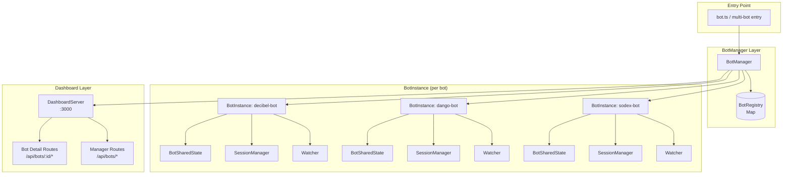
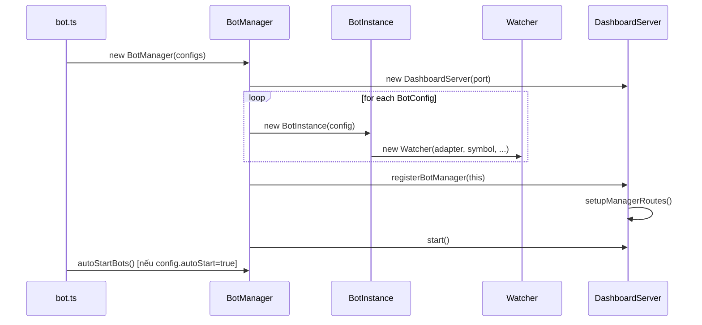
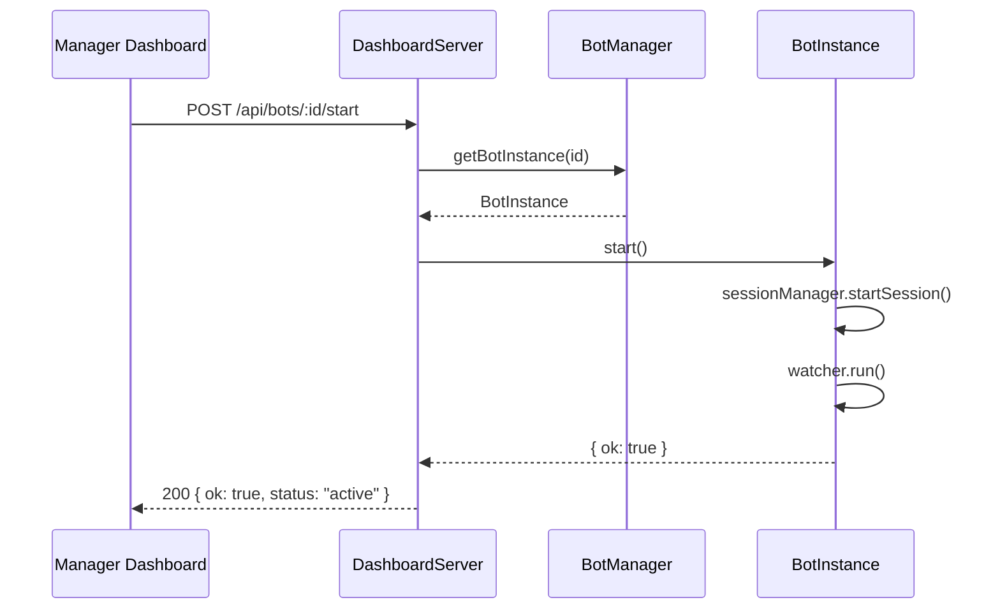
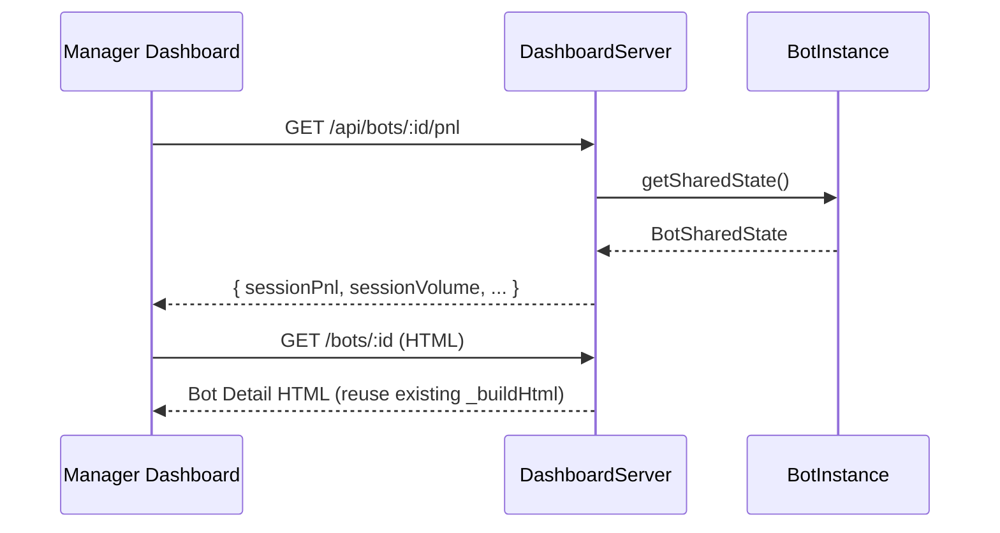

# Design Document: Multi-Bot Manager

## Overview

Multi-Bot Manager cho phép chạy nhiều bot trading song song, mỗi bot gắn với một sàn riêng biệt (SoDEX, Dango, Decibel), được quản lý tập trung qua một Dashboard tổng quan mới. Kiến trúc hiện tại là single-bot (một `bot.ts` entry point, một `sharedState`, một `DashboardServer`) sẽ được refactor thành multi-bot registry với một `BotManager` điều phối nhiều `BotInstance` độc lập, mỗi instance có state riêng và vẫn tái sử dụng toàn bộ module hiện có (Watcher, SessionManager, Executor, v.v.).

Dashboard mới gồm hai lớp: **Manager Dashboard** (tổng quan tất cả bot, tạo/xóa/start/stop) và **Bot Detail Dashboard** (giữ nguyên UI hiện tại, truy cập qua "View details" từ card).

---

## Architecture



### Nguyên tắc thiết kế

- **Zero breaking change**: `Watcher`, `SessionManager`, `Executor`, `MarketMaker`, tất cả module hiện tại không thay đổi interface.
- **Isolated state**: Mỗi `BotInstance` có `BotSharedState` riêng (thay vì singleton `sharedState`). `sharedState` singleton hiện tại được giữ lại cho backward compat nhưng chỉ dùng bởi bot đầu tiên (hoặc deprecated dần).
- **Single HTTP server**: `DashboardServer` mở rộng thêm routes `/api/bots/*` thay vì tạo server mới.
- **Per-bot TradeLogger**: Mỗi bot ghi log vào file riêng (`trades-{botId}.json` hoặc SQLite table riêng).

---

## Sequence Diagrams

### Khởi động Multi-Bot



### Start/Stop Bot từ Dashboard



### View Bot Details



---

## Components and Interfaces

### BotConfig

Cấu hình để tạo một bot instance. Extend từ config hiện tại, thêm các field định danh.

```typescript
interface BotConfig {
  // Định danh
  id: string;              // e.g. "sodex-bot", "dango-bot"
  name: string;            // Display name: "Bot SoDEX"
  exchange: 'sodex' | 'dango' | 'decibel';
  symbol: string;          // e.g. "BTC-USD"
  tags: string[];          // e.g. ["TWAP", "Aggressive"]
  autoStart: boolean;

  // Trading config (subset của config.ts)
  mode: 'farm' | 'trade';
  orderSizeMin: number;
  orderSizeMax: number;

  // Credentials (từ env vars, không hardcode)
  credentialKey: string;   // env var prefix, e.g. "SODEX" → đọc SODEX_API_KEY, etc.

  // Logging
  tradeLogBackend: 'json' | 'sqlite';
  tradeLogPath: string;    // e.g. "./trades-sodex.json"
}
```

### BotSharedState

State riêng của từng bot, tương đương `sharedState` singleton hiện tại.

```typescript
interface BotSharedState {
  botId: string;
  sessionPnl: number;
  sessionVolume: number;
  sessionFees: number;
  updatedAt: string;
  botStatus: 'RUNNING' | 'STOPPED';
  symbol: string;
  walletAddress: string;
  pnlHistory: PnlDataPoint[];
  volumeHistory: PnlDataPoint[];
  eventLog: EventLogEntry[];
  openPosition: OpenPositionState | null;
  // Aggregated stats
  totalTrades: number;
  winRate: number;
  efficiencyBps: number;   // (PnL / Volume) * 10000
}
```

### BotInstance

Wrapper quản lý lifecycle của một bot.

```typescript
interface BotInstanceInterface {
  readonly id: string;
  readonly config: BotConfig;
  readonly state: BotSharedState;

  start(): Promise<boolean>;
  stop(): Promise<void>;
  getStatus(): BotStatus;
  getDetailedStatus(): Promise<DetailedBotStatus>;
  forceClosePosition(): Promise<boolean>;
  getTradeLogger(): TradeLogger;
  getSessionManager(): SessionManager;
  getWatcher(): Watcher;
}

interface BotStatus {
  id: string;
  name: string;
  exchange: string;
  status: 'active' | 'inactive' | 'completed';
  symbol: string;
  tags: string[];
  sessionPnl: number;
  sessionVolume: number;
  sessionFees: number;
  efficiencyBps: number;
  walletAddress: string;
  uptime: number;          // minutes
  hasPosition: boolean;
  progress: number;        // 0-100, based on session PnL vs maxLoss
}
```

### BotManager

Registry trung tâm quản lý tất cả bot instances.

```typescript
interface BotManagerInterface {
  createBot(config: BotConfig): BotInstance;
  removeBot(id: string): void;
  getBot(id: string): BotInstance | undefined;
  getAllBots(): BotInstance[];
  startBot(id: string): Promise<boolean>;
  stopBot(id: string): Promise<void>;
  getAggregatedStats(): AggregatedStats;
}

interface AggregatedStats {
  totalVolume: number;
  activeBotCount: number;
  totalFees: number;
  totalPnl: number;
}
```

### DashboardServer (extended)

Thêm Manager Routes vào `DashboardServer` hiện tại.

```typescript
// New routes added to existing DashboardServer
interface ManagerRoutes {
  // Manager Dashboard HTML
  'GET /bots':                    () => HTML;
  'GET /bots/:id':                (id: string) => HTML;  // Bot detail page

  // Bot list & aggregated stats
  'GET /api/bots':                () => BotStatus[];
  'GET /api/bots/stats':          () => AggregatedStats;

  // Per-bot control
  'POST /api/bots/:id/start':     (id: string) => { ok: boolean };
  'POST /api/bots/:id/stop':      (id: string) => { ok: boolean };
  'POST /api/bots/:id/close':     (id: string) => { ok: boolean };

  // Per-bot data (proxy to BotInstance state)
  'GET /api/bots/:id/pnl':        (id: string) => BotSharedState;
  'GET /api/bots/:id/trades':     (id: string) => TradeRecord[];
  'GET /api/bots/:id/status':     (id: string) => DetailedBotStatus;
  'GET /api/bots/:id/events':     (id: string) => EventLogEntry[];
  'GET /api/bots/:id/position':   (id: string) => OpenPositionState | null;
  'GET /api/bots/:id/analytics':  (id: string) => AnalyticsSummary;
  'GET /api/bots/:id/config':     (id: string) => OverridableConfig;
  'POST /api/bots/:id/config':    (id: string, patch: Partial<OverridableConfig>) => OverridableConfig;

  // Create/delete bot (runtime)
  'POST /api/bots':               (config: BotConfig) => BotStatus;
  'DELETE /api/bots/:id':         (id: string) => { ok: boolean };
}
```

---

## Data Models

### BotCardViewModel

Model dùng để render bot card trên Manager Dashboard.

```typescript
interface BotCardViewModel {
  id: string;
  name: string;
  exchange: 'SoDEX' | 'Dango' | 'Decibel';
  status: 'active' | 'inactive' | 'completed';
  tags: string[];          // ["TWAP", "Aggressive", "Neutral"]
  sessionVolume: number;   // USD
  sessionFees: number;     // USD (estimated from FEE_RATE_MAKER)
  sessionPnl: number;      // USD
  efficiencyBps: number;   // (netPnl / volume) * 10000
  walletAddress: string;
  progress: number;        // 0-100
  uptime: number;          // minutes
  hasPosition: boolean;
}
```

### ManagerDashboardViewModel

```typescript
interface ManagerDashboardViewModel {
  stats: {
    totalVolume: number;
    activeBotCount: number;
    totalFees: number;
    totalPnl: number;
  };
  bots: BotCardViewModel[];
  filter: 'all' | 'active' | 'inactive' | 'completed';
}
```

### BotInstanceConfig (persistence)

Lưu vào `bot-configs.json` để restore khi restart.

```typescript
interface PersistedBotConfig {
  version: 1;
  bots: BotConfig[];
}
```

---

## Key Functions with Formal Specifications

### BotManager.createBot()

```typescript
function createBot(config: BotConfig): BotInstance
```

**Preconditions:**
- `config.id` là unique trong registry (không trùng với bot đã tồn tại)
- `config.exchange` thuộc `['sodex', 'dango', 'decibel']`
- Credentials tương ứng với `config.credentialKey` phải có trong `process.env`

**Postconditions:**
- Bot instance được thêm vào registry
- Bot ở trạng thái `inactive` (chưa start)
- `getAllBots().length` tăng thêm 1

### BotInstance.start()

```typescript
async function start(): Promise<boolean>
```

**Preconditions:**
- Bot chưa ở trạng thái `RUNNING`
- Adapter đã được khởi tạo thành công

**Postconditions:**
- `state.botStatus === 'RUNNING'`
- `sessionManager.getState().isRunning === true`
- Watcher loop đang chạy trong background
- Returns `true` nếu thành công, `false` nếu đã running

### BotInstance.stop()

```typescript
async function stop(): Promise<void>
```

**Preconditions:**
- Bot đang ở trạng thái `RUNNING`

**Postconditions:**
- `state.botStatus === 'STOPPED'`
- `sessionManager.getState().isRunning === false`
- Watcher loop đã dừng
- Open position KHÔNG bị force-close (user phải close thủ công)

### BotManager.getAggregatedStats()

```typescript
function getAggregatedStats(): AggregatedStats
```

**Preconditions:** Không có

**Postconditions:**
- `totalVolume = Σ bot.state.sessionVolume` cho tất cả bots
- `activeBotCount = count(bots where status === 'RUNNING')`
- `totalFees = Σ bot.state.sessionFees`
- `totalPnl = Σ bot.state.sessionPnl`

---

## Algorithmic Pseudocode

### BotManager Bootstrap Algorithm

```pascal
ALGORITHM bootstrapMultiBotManager(envConfig)
INPUT: envConfig — environment variables và bot configs
OUTPUT: running BotManager với DashboardServer

BEGIN
  manager ← new BotManager()
  dashboard ← new DashboardServer(port)
  dashboard.registerBotManager(manager)

  FOR each botConfig IN loadBotConfigs(envConfig) DO
    ASSERT botConfig.id IS UNIQUE IN manager.registry
    
    adapter ← createAdapter(botConfig.exchange, botConfig.credentialKey)
    instance ← new BotInstance(botConfig, adapter)
    manager.registry.set(botConfig.id, instance)
    
    IF botConfig.autoStart = true THEN
      instance.start()
    END IF
  END FOR

  dashboard.start()
  
  ASSERT dashboard.isListening = true
  ASSERT manager.getAllBots().length = loadBotConfigs(envConfig).length
END
```

### BotInstance State Machine

```pascal
ALGORITHM botInstanceLifecycle(instance)
INPUT: instance — BotInstance
OUTPUT: state transitions

STATES: INACTIVE → RUNNING → STOPPED

BEGIN
  // Start transition
  PROCEDURE start()
    ASSERT instance.status = INACTIVE OR STOPPED
    instance.sessionManager.startSession()
    instance.watcher.resetSession()
    instance.state.botStatus ← RUNNING
    
    // Non-blocking: run in background
    ASYNC instance.watcher.run()
      ON ERROR → instance.sessionManager.stopSession()
                 instance.state.botStatus ← STOPPED
  END PROCEDURE

  // Stop transition
  PROCEDURE stop()
    ASSERT instance.status = RUNNING
    instance.sessionManager.stopSession()
    instance.watcher.stop()
    instance.state.botStatus ← STOPPED
  END PROCEDURE
END
```

### Manager Dashboard Aggregation

```pascal
ALGORITHM computeAggregatedStats(registry)
INPUT: registry — Map<botId, BotInstance>
OUTPUT: AggregatedStats

BEGIN
  totalVolume ← 0
  activeBotCount ← 0
  totalFees ← 0
  totalPnl ← 0

  FOR each instance IN registry.values() DO
    totalVolume ← totalVolume + instance.state.sessionVolume
    totalFees ← totalFees + instance.state.sessionFees
    totalPnl ← totalPnl + instance.state.sessionPnl
    
    IF instance.state.botStatus = RUNNING THEN
      activeBotCount ← activeBotCount + 1
    END IF
  END FOR

  ASSERT totalVolume >= 0
  ASSERT activeBotCount >= 0 AND activeBotCount <= registry.size

  RETURN { totalVolume, activeBotCount, totalFees, totalPnl }
END
```

### Bot Card Filter Algorithm

```pascal
ALGORITHM filterBotCards(bots, filter)
INPUT: bots — BotCardViewModel[], filter — 'all'|'active'|'inactive'|'completed'
OUTPUT: filtered BotCardViewModel[]

BEGIN
  IF filter = 'all' THEN
    RETURN bots
  END IF

  RETURN bots WHERE
    (filter = 'active'    AND bot.status = 'active')   OR
    (filter = 'inactive'  AND bot.status = 'inactive') OR
    (filter = 'completed' AND bot.status = 'completed')
END
```

---

## Manager Dashboard UI Design

### Layout Overview

```
┌─────────────────────────────────────────────────────────────┐
│  APEX Multi-Bot Manager                    [+ Create Bot]   │
├─────────────────────────────────────────────────────────────┤
│  ┌──────────────┐ ┌──────────────┐ ┌──────────────────────┐ │
│  │ Total Volume │ │ Active Bots  │ │  Total Fees & PnL    │ │
│  │  $124,500    │ │     2 / 3    │ │  Fees: $14.9         │ │
│  └──────────────┘ └──────────────┘ │  PnL:  +$3.2         │ │
│                                    └──────────────────────┘ │
├─────────────────────────────────────────────────────────────┤
│  [All] [Active] [Inactive] [Completed]                      │
├─────────────────────────────────────────────────────────────┤
│  ┌─────────────────────────────────────────────────────┐    │
│  │ Bot SoDEX                    ● ACTIVE               │    │
│  │ ID: sodex-bot  [TWAP] [Aggressive]                  │    │
│  │ Volume: $42,100  Fees: $5.1  PnL: +$1.2  Eff: 2.8bp│    │
│  │ Wallet: 0x1234...abcd                               │    │
│  │ ████████████░░░░░░░░  60%                           │    │
│  │                    [Stop]  [View details →]         │    │
│  └─────────────────────────────────────────────────────┘    │
│  ┌─────────────────────────────────────────────────────┐    │
│  │ Bot Dango                    ○ INACTIVE             │    │
│  │ ...                                                 │    │
│  │                    [Start] [View details →]         │    │
│  └─────────────────────────────────────────────────────┘    │
└─────────────────────────────────────────────────────────────┘
```

### Navigation Flow

- `/` → Manager Dashboard (danh sách tất cả bots)
- `/bots/:id` → Bot Detail Dashboard (UI hiện tại, scoped cho bot đó)
- "View details →" button trên card → navigate đến `/bots/:id`
- "← Back to Manager" link trên Bot Detail page

---

## Error Handling

### Scenario 1: Adapter initialization failure

**Condition**: Credentials thiếu hoặc sai khi tạo bot  
**Response**: `createBot()` throw `BotConfigError` với message mô tả field thiếu  
**Recovery**: Bot không được thêm vào registry; dashboard hiển thị error toast

### Scenario 2: Bot crash trong khi running

**Condition**: `watcher.run()` throw unhandled error  
**Response**: `BotInstance` catch error, set `state.botStatus = 'STOPPED'`, log event `ERROR`  
**Recovery**: Bot có thể restart thủ công từ dashboard; state được preserve

### Scenario 3: Duplicate bot ID

**Condition**: `createBot()` được gọi với `id` đã tồn tại trong registry  
**Response**: Throw `DuplicateBotError`  
**Recovery**: Client nhận 409 Conflict từ API

### Scenario 4: Start bot đang running

**Condition**: `POST /api/bots/:id/start` khi bot đã `RUNNING`  
**Response**: 400 Bad Request `{ error: 'Already running' }`  
**Recovery**: Client refresh status

### Scenario 5: Bot không tìm thấy

**Condition**: Request đến `/api/bots/:id/*` với id không tồn tại  
**Response**: 404 Not Found `{ error: 'Bot not found' }`

---

## Testing Strategy

### Unit Testing Approach

- `BotManager`: test `createBot`, `removeBot`, `getAggregatedStats` với mock `BotInstance`
- `BotInstance`: test state transitions (start/stop), error handling khi adapter fail
- Manager Routes: test tất cả API endpoints với supertest, mock `BotManager`
- `filterBotCards`: pure function, test tất cả filter cases

### Property-Based Testing Approach

**Property Test Library**: fast-check (đã có trong devDependencies)

Key properties:
- `getAggregatedStats().totalVolume` luôn bằng tổng `sessionVolume` của tất cả bots
- `activeBotCount` luôn trong range `[0, registry.size]`
- Sau `stop()`, bot không bao giờ ở trạng thái `RUNNING`
- `filterBotCards(bots, 'all').length === bots.length` với mọi input

### Integration Testing Approach

- End-to-end test: tạo 2 bot instances với mock adapters, start/stop qua API, verify aggregated stats
- Dashboard HTML render test: verify Manager Dashboard HTML chứa đúng bot cards

---

## Performance Considerations

- `getAggregatedStats()` là O(n) với n = số bots — acceptable vì n ≤ 10 trong thực tế
- Mỗi bot có polling loop riêng với random delay (2-90s) — không có shared lock
- SSE streams được tách biệt per-bot: `/api/bots/:id/events/stream`
- `BotSharedState` được update in-memory, không có DB write trên mỗi tick

## Security Considerations

- Authentication middleware hiện tại (`dash_token` cookie) áp dụng cho tất cả routes kể cả `/api/bots/*`
- Credentials của từng bot chỉ đọc từ `process.env`, không expose qua API
- `DELETE /api/bots/:id` yêu cầu bot phải ở trạng thái `STOPPED` trước khi xóa

## Dependencies

- Tất cả dependencies hiện tại được tái sử dụng — không cần thêm package mới
- `express` (đã có): routing cho manager routes
- `fast-check` (đã có): property-based tests
- `vitest` + `supertest` (đã có): unit và integration tests
