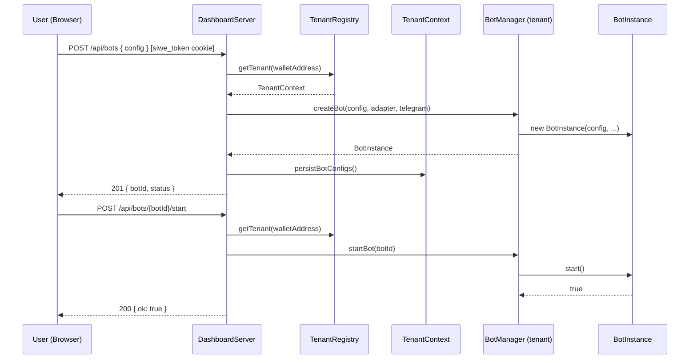
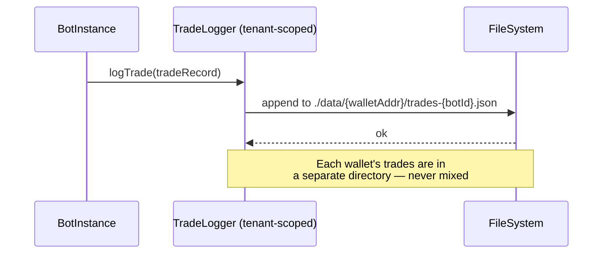

# Design Document: Multi-Wallet SaaS Platform

## Overview

The multi-wallet SaaS feature transforms APEX from a single-operator trading system into a multi-tenant platform where each Solana/EVM wallet address is an independent tenant. Each wallet authenticates via the existing SIWE (Sign-In with Ethereum) flow, then gets a fully isolated namespace: their own bot configurations, bot lifecycle, trade history, state, and PnL. The platform operator runs one server instance; tenants self-serve through the dashboard.

The core architectural change is introducing a **wallet-scoped layer** between the HTTP session and the existing `BotManager`. Instead of one global `BotManager`, the server maintains a `TenantRegistry` that maps `walletAddress → TenantContext`, where each `TenantContext` owns its own `BotManager`, config store, and data directory. The existing `BotManager`, `BotInstance`, `HedgeBot`, and adapter code are reused without modification.

---

## Architecture

```mermaid
graph TD
    subgraph Client
        WL[wallet-login.html<br/>SIWE auth]
        DB[Dashboard UI<br/>wallet-scoped views]
    end

    subgraph Server["DashboardServer (Express)"]
        AM[Auth Middleware<br/>siwe_token → walletAddress]
        TR[TenantRegistry<br/>walletAddress → TenantContext]
        WR[Wallet-Scoped Router<br/>/api/wallet/:addr/*]
        AR[Admin Router<br/>/api/admin/*]
    end

    subgraph Tenant["TenantContext (per wallet)"]
        BM[BotManager]
        CS[ConfigStore]
        TL[TradeLogger]
        DD[Data Dir<br/>./data/{walletAddr}/]
    end

    subgraph Bots["Bot Instances (per tenant)"]
        BI[BotInstance]
        HB[HedgeBot]
    end

    subgraph Storage["Persistent Storage"]
        WC[wallet-configs/<br/>{addr}/bot-configs.json]
        WS[wallet-state/<br/>{addr}/bot_state.json]
        WT[wallet-trades/<br/>{addr}/trades-{botId}.json]
    end

    WL -->|SIWE sign| AM
    DB -->|cookie: siwe_token| AM
    AM -->|resolve walletAddress| TR
    TR -->|get or create| Tenant
    WR -->|scoped API calls| TR
    AR -->|platform-level ops| TR
    Tenant --> Bots
    Tenant --> Storage
```

---

## Sequence Diagrams

### Tenant Authentication & First Access

```mermaid
sequenceDiagram
    participant W as Wallet (Browser)
    participant S as DashboardServer
    participant TR as TenantRegistry
    participant TC as TenantContext

    W->>S: GET /api/auth/nonce
    S-->>W: { nonce }
    W->>W: Build EIP-4361 message, sign with wallet
    W->>S: POST /api/auth/verify { message, signature }
    S->>S: verifySiweMessage() → walletAddress
    S->>TR: ensureTenant(walletAddress)
    TR->>TC: new TenantContext(walletAddress)
    TC->>TC: mkdir ./data/{walletAddr}/
    TC->>TC: load bot-configs.json (or create empty)
    TR-->>S: TenantContext
    S-->>W: Set-Cookie: siwe_token=...; 200 OK { address }
    W->>S: GET /dashboard
    S->>S: resolve walletAddress from siwe_token
    S-->>W: Render wallet-scoped dashboard
```

### Wallet-Scoped Bot Lifecycle



### Data Isolation — Trade Logging



---

## Components and Interfaces

### Component 1: TenantRegistry

**Purpose**: Central registry that maps wallet addresses to their isolated `TenantContext`. Acts as the multi-tenancy boundary — all wallet-scoped operations go through here.

**Interface**:
```typescript
interface TenantRegistry {
  /** Get or create a TenantContext for a wallet address. Idempotent. */
  ensureTenant(walletAddress: string): TenantContext;

  /** Get an existing TenantContext. Returns undefined if wallet has never logged in. */
  getTenant(walletAddress: string): TenantContext | undefined;

  /** List all active tenant wallet addresses. */
  listTenants(): string[];

  /** Gracefully shut down all tenants (stop all bots). */
  shutdownAll(): Promise<void>;
}
```

**Responsibilities**:
- Normalize wallet addresses to lowercase for consistent keying
- Lazily create `TenantContext` on first login
- Provide platform-level visibility for admin operations

---

### Component 2: TenantContext

**Purpose**: Encapsulates all resources owned by a single wallet tenant. Owns the `BotManager`, config persistence, and data directory for that wallet.

**Interface**:
```typescript
interface TenantContext {
  readonly walletAddress: string;       // normalized lowercase
  readonly dataDir: string;             // ./data/{walletAddr}/
  readonly botManager: BotManager;
  readonly configPath: string;          // {dataDir}/bot-configs.json

  /** Persist current bot configs to disk. */
  persistConfigs(): void;

  /** Load bot configs from disk and recreate bot instances. */
  loadConfigs(telegram: TelegramManager): Promise<void>;

  /** Stop all running bots for this tenant. */
  shutdown(): Promise<void>;
}
```

**Responsibilities**:
- Own the `BotManager` instance for this wallet
- Manage the `./data/{walletAddr}/` directory lifecycle
- Persist and reload bot configs on server restart
- Provide clean shutdown for graceful process termination

---

### Component 3: WalletScopedRouter

**Purpose**: Express router that extracts the authenticated wallet address from the session cookie and routes all bot management API calls to the correct `TenantContext`.

**Interface**:
```typescript
// Middleware signature — attaches tenant to request
interface WalletScopedRequest extends Request {
  walletAddress: string;
  tenant: TenantContext;
}

// Router mounts at /api (replaces current flat /api/bots/* routes)
// All routes require valid siwe_token cookie
```

**Responsibilities**:
- Extract `walletAddress` from `siwe_token` cookie via `validTokenAddresses` map
- Reject requests with no valid wallet session (401)
- Attach `tenant` to the request object for downstream handlers
- Scope all bot CRUD, start/stop, config, trades, and PnL endpoints to the tenant

---

### Component 4: WalletAwareDashboard (UI)

**Purpose**: Updated dashboard UI that shows only the authenticated wallet's bots and data, with a wallet address indicator in the header.

**Interface** (EJS template variables):
```typescript
interface ManagerTemplateLocals {
  walletAddress: string;       // shown in header, truncated
  walletShort: string;         // e.g. "0x1234…abcd"
}
```

**Responsibilities**:
- Display connected wallet address in the nav header
- All API calls from the frontend are automatically scoped (cookie carries identity)
- Show "no bots yet" empty state for new wallets
- Provide "Add Bot" flow that creates bots under the authenticated wallet

---

### Component 5: TenantConfigStore

**Purpose**: Per-tenant config persistence. Replaces the single global `bot-configs.json` with per-wallet config files stored in `./data/{walletAddr}/bot-configs.json`.

**Interface**:
```typescript
interface TenantConfigStore {
  /** Load configs from {dataDir}/bot-configs.json */
  load(): (BotConfig | HedgeBotConfig)[];

  /** Save current configs to {dataDir}/bot-configs.json */
  save(configs: (BotConfig | HedgeBotConfig)[]): void;

  /** Path to the config file */
  readonly configPath: string;
}
```

**Responsibilities**:
- Ensure `dataDir` exists before reading/writing
- Atomic writes (write to temp file, rename) to prevent corruption
- Return empty array if no config file exists yet (new tenant)

---

## Data Models

### WalletSession

```typescript
interface WalletSession {
  token: string;           // hex token stored in siwe_token cookie
  walletAddress: string;   // checksummed EVM address
  expiresAt: number;       // Unix ms
  authType: 'wallet';
}
```

**Validation Rules**:
- `walletAddress` must match `/^0x[a-fA-F0-9]{40}$/`
- `expiresAt` must be in the future
- Token must be 64 hex characters

---

### TenantBotConfig (extends existing BotConfig)

```typescript
interface TenantBotConfig extends BotConfig {
  /** Wallet address that owns this bot. Injected at creation time. */
  ownerWallet: string;
  /** Trade log path is always relative to tenant data dir */
  tradeLogPath: string;   // e.g. "./data/{walletAddr}/trades-{botId}.json"
}
```

**Validation Rules**:
- `ownerWallet` must be a valid checksummed address
- `tradeLogPath` must be within the tenant's `dataDir` (path traversal prevention)
- `id` must be unique within the tenant's `BotManager` (not globally unique)

---

### TenantDataDirectory

```
./data/
  {walletAddress}/              ← normalized lowercase
    bot-configs.json            ← tenant's bot definitions
    bot_state_{botId}.json      ← per-bot state (existing format)
    trades-{botId}.json         ← per-bot trade log (existing format)
    trades-{botId}.db           ← SQLite variant (if tradeLogBackend=sqlite)
```

**Validation Rules**:
- Directory name must be a valid lowercase hex address (40 chars after `0x`)
- No path traversal: all file paths must resolve within `./data/{walletAddr}/`

---

### PlatformStats (admin view)

```typescript
interface PlatformStats {
  totalTenants: number;
  activeTenants: number;       // tenants with ≥1 running bot
  totalBots: number;
  activeBots: number;
  totalVolumeUsd: number;      // sum across all tenants
  totalPnlUsd: number;
}
```

---

## Algorithmic Pseudocode

### Main Request Routing Algorithm

```pascal
ALGORITHM routeWalletScopedRequest(req, res, next)
INPUT: req (HTTP request with siwe_token cookie)
OUTPUT: next() with req.tenant attached, or 401 response

BEGIN
  cookies ← parseCookies(req.headers.cookie)
  token ← cookies['siwe_token']

  IF token IS NULL OR token IS EMPTY THEN
    RETURN res.status(401).json({ error: 'Unauthorized' })
  END IF

  expiry ← validTokens.get(token)
  IF expiry IS NULL OR Date.now() > expiry THEN
    validTokens.delete(token)
    RETURN res.status(401).json({ error: 'Session expired' })
  END IF

  walletAddress ← validTokenAddresses.get(token)
  IF walletAddress IS NULL THEN
    RETURN res.status(401).json({ error: 'No wallet address for session' })
  END IF

  tenant ← tenantRegistry.ensureTenant(walletAddress)
  req.walletAddress ← walletAddress
  req.tenant ← tenant

  CALL next()
END
```

**Preconditions:**
- `validTokens` and `validTokenAddresses` maps are populated by `/api/auth/verify`
- `tenantRegistry` is initialized at server startup

**Postconditions:**
- If successful: `req.tenant` is a valid `TenantContext` for the authenticated wallet
- If failed: response is sent with 401, `next()` is NOT called

---

### TenantRegistry.ensureTenant Algorithm

```pascal
ALGORITHM ensureTenant(walletAddress)
INPUT: walletAddress (string, any case)
OUTPUT: TenantContext

BEGIN
  key ← walletAddress.toLowerCase()

  IF registry.has(key) THEN
    RETURN registry.get(key)
  END IF

  // Create new tenant context
  dataDir ← path.join('./data', key)
  fs.mkdirSync(dataDir, { recursive: true })

  botManager ← new BotManager()
  configStore ← new TenantConfigStore(dataDir)

  tenant ← new TenantContext({
    walletAddress: key,
    dataDir,
    botManager,
    configStore,
  })

  registry.set(key, tenant)
  console.log('[TenantRegistry] Created tenant:', key)

  RETURN tenant
END
```

**Preconditions:**
- `walletAddress` is a non-empty string
- `./data/` directory is writable

**Postconditions:**
- `registry.has(walletAddress.toLowerCase())` is true
- `./data/{walletAddress}/` directory exists
- Returned `TenantContext` has an initialized `BotManager`

**Loop Invariants:** N/A (no loops)

---

### Server Startup — Tenant Restoration Algorithm

```pascal
ALGORITHM restoreTenantsOnStartup(dataBaseDir, telegram)
INPUT: dataBaseDir (string), telegram (TelegramManager)
OUTPUT: number of tenants restored

BEGIN
  IF NOT fs.existsSync(dataBaseDir) THEN
    fs.mkdirSync(dataBaseDir, { recursive: true })
    RETURN 0
  END IF

  walletDirs ← fs.readdirSync(dataBaseDir)
    .filter(d => isValidWalletAddress(d))

  restoredCount ← 0

  FOR each walletDir IN walletDirs DO
    ASSERT isValidWalletAddress(walletDir)

    configPath ← path.join(dataBaseDir, walletDir, 'bot-configs.json')

    IF NOT fs.existsSync(configPath) THEN
      CONTINUE
    END IF

    tenant ← tenantRegistry.ensureTenant(walletDir)
    configs ← tenant.configStore.load()

    FOR each config IN configs DO
      IF config.autoStart = true THEN
        TRY
          adapter ← createBotAdapter(config.exchange, config.credentialKey)
          bot ← tenant.botManager.createBot(config, adapter, telegram)
          AWAIT bot.start()
          console.log('[Startup] Auto-started bot:', config.id, 'for wallet:', walletDir)
        CATCH err
          console.error('[Startup] Failed to restore bot:', config.id, err)
        END TRY
      END IF
    END FOR

    restoredCount ← restoredCount + 1
  END FOR

  RETURN restoredCount
END
```

**Preconditions:**
- `dataBaseDir` is a valid filesystem path
- `tenantRegistry` is initialized

**Postconditions:**
- All wallets with `bot-configs.json` have a `TenantContext` in the registry
- All bots with `autoStart: true` are running
- Bots that fail to start are logged but do not block other tenants

**Loop Invariants:**
- All previously processed wallet directories have valid `TenantContext` entries
- `restoredCount` equals the number of successfully processed wallet directories

---

### Bot Config Persistence Algorithm

```pascal
ALGORITHM persistTenantBotConfigs(tenant)
INPUT: tenant (TenantContext)
OUTPUT: void (writes to disk)

BEGIN
  configs ← tenant.botManager.getAllBots()
    .map(bot => bot.config)

  // Rewrite tradeLogPath to be relative to tenant dataDir
  // Prevents path leakage if config is copied between tenants
  sanitizedConfigs ← configs.map(config => ({
    ...config,
    tradeLogPath: path.join(tenant.dataDir, path.basename(config.tradeLogPath))
  }))

  data ← { version: 1, bots: sanitizedConfigs }
  tmpPath ← tenant.configStore.configPath + '.tmp'

  fs.writeFileSync(tmpPath, JSON.stringify(data, null, 2), 'utf-8')
  fs.renameSync(tmpPath, tenant.configStore.configPath)
END
```

**Preconditions:**
- `tenant.dataDir` exists and is writable
- `tenant.botManager` is initialized

**Postconditions:**
- `{tenant.dataDir}/bot-configs.json` contains current bot configs
- Write is atomic (tmp → rename prevents partial writes)
- All `tradeLogPath` values are within `tenant.dataDir`

---

## Key Functions with Formal Specifications

### `TenantRegistry.ensureTenant(walletAddress: string): TenantContext`

**Preconditions:**
- `walletAddress` is a non-empty string
- `./data/` directory is writable by the process

**Postconditions:**
- Returns a `TenantContext` where `context.walletAddress === walletAddress.toLowerCase()`
- `./data/{walletAddress.toLowerCase()}/` directory exists on disk
- Calling `ensureTenant` again with the same address returns the same object (identity equality)
- No existing tenant data is overwritten

---

### `walletScopedMiddleware(req, res, next): void`

**Preconditions:**
- `req.headers.cookie` may or may not contain `siwe_token`
- `validTokens` and `validTokenAddresses` are in-memory maps populated by auth flow

**Postconditions:**
- If token is valid and not expired: `req.tenant` is set, `next()` is called
- If token is missing, expired, or has no wallet address: `res.status(401)` is sent, `next()` is NOT called
- Token expiry is checked on every request (no stale sessions)

**Loop Invariants:** N/A

---

### `TenantContext.persistConfigs(): void`

**Preconditions:**
- `this.dataDir` exists
- `this.botManager.getAllBots()` returns current bot list

**Postconditions:**
- `{this.dataDir}/bot-configs.json` reflects current bot configs
- Write is atomic
- All `tradeLogPath` values are scoped to `this.dataDir`

---

### `TenantContext.shutdown(): Promise<void>`

**Preconditions:**
- `this.botManager` is initialized

**Postconditions:**
- All bots in `this.botManager` with `botStatus === 'RUNNING'` have been stopped
- `persistConfigs()` has been called
- No running bot loops remain for this tenant

---

## Example Usage

```typescript
// Server startup — restore all tenants
const tenantRegistry = new TenantRegistry('./data');
await tenantRegistry.restoreAll(telegram);

// Auth verify endpoint — create tenant on first login
app.post('/api/auth/verify', (req, res) => {
  const result = verifySiweMessage(message, signature);
  if (!result.ok) return res.status(401).json({ error: result.error });

  const token = generateToken();
  validTokens.set(token, Date.now() + TOKEN_TTL_MS);
  validTokenAddresses.set(token, result.address!);

  // Eagerly create tenant context on first login
  tenantRegistry.ensureTenant(result.address!);

  res.setHeader('Set-Cookie', `siwe_token=${token}; Path=/; HttpOnly; SameSite=Lax`);
  res.json({ ok: true, address: result.address });
});

// Wallet-scoped bot creation
app.post('/api/bots', walletScopedMiddleware, async (req, res) => {
  const { tenant } = req as WalletScopedRequest;
  const config = req.body as BotConfig;

  // Scope trade log path to tenant's data directory
  config.tradeLogPath = path.join(tenant.dataDir, `trades-${config.id}.json`);

  const adapter = createBotAdapter(config.exchange, config.credentialKey);
  const bot = tenant.botManager.createBot(config, adapter, telegram);

  tenant.persistConfigs();
  res.status(201).json(bot.getStatus());
});

// Wallet-scoped bot listing
app.get('/api/bots', walletScopedMiddleware, (req, res) => {
  const { tenant } = req as WalletScopedRequest;
  const statuses = tenant.botManager.getAllBots().map(b => b.getStatus());
  res.json(statuses);
});

// Admin: platform-wide stats (no wallet scoping)
app.get('/api/admin/stats', adminAuthMiddleware, (req, res) => {
  const stats = tenantRegistry.getPlatformStats();
  res.json(stats);
});
```

---

## Correctness Properties

- **Tenant isolation**: For any two distinct wallet addresses `A` and `B`, `getTenant(A).botManager !== getTenant(B).botManager` — bot registries are never shared.
- **Data isolation**: For any bot `b` owned by wallet `A`, `b.config.tradeLogPath` starts with `./data/{A.toLowerCase()}/` — trade logs are never written outside the tenant's directory.
- **Idempotent tenant creation**: `ensureTenant(addr) === ensureTenant(addr)` — calling twice returns the same object.
- **Session-wallet binding**: For any valid `siwe_token`, `validTokenAddresses.get(token)` returns the wallet address that signed the SIWE message — sessions cannot be forged or transferred.
- **Config scoping**: After `persistConfigs()`, loading the config file for wallet `A` never returns bots owned by wallet `B`.
- **Auth middleware completeness**: Every route under `/api/bots/*` passes through `walletScopedMiddleware` — no bot endpoint is reachable without a valid wallet session.

---

## Error Handling

### Error Scenario 1: Wallet has no bots yet (new tenant)

**Condition**: `GET /api/bots` called by a wallet that just authenticated for the first time.
**Response**: `200 []` — empty array, not an error.
**Recovery**: Frontend shows "Add your first bot" empty state.

---

### Error Scenario 2: Bot ID collision within a tenant

**Condition**: `POST /api/bots` with an `id` that already exists in the tenant's `BotManager`.
**Response**: `409 { error: 'Bot with id "..." already exists' }` — `BotManager.createBot` throws, caught by route handler.
**Recovery**: Client must choose a different bot ID or delete the existing bot first.

---

### Error Scenario 3: Invalid wallet address in data directory

**Condition**: A directory under `./data/` has a name that is not a valid wallet address (e.g., leftover temp files).
**Response**: Silently skipped during `restoreTenantsOnStartup` — `isValidWalletAddress()` filter excludes it.
**Recovery**: No action needed; invalid directories are ignored.

---

### Error Scenario 4: Bot adapter credential missing for a tenant

**Condition**: A tenant's `bot-configs.json` references `credentialKey: "MYBOT"` but `MYBOT_API_KEY` is not in `.env`.
**Response**: `createBotAdapter` throws; the error is caught per-bot during startup restoration. Other bots for the same tenant continue loading.
**Recovery**: Tenant must update their bot config with a valid credential key, or the operator must add the env var and restart.

---

### Error Scenario 5: Concurrent bot creation race

**Condition**: Two requests from the same wallet create a bot with the same ID simultaneously.
**Response**: The second `createBot` call throws `'Bot with id "..." already exists'` → `409`.
**Recovery**: Node.js single-threaded event loop makes this unlikely in practice; the 409 response is the safety net.

---

### Error Scenario 6: Session token used after wallet logout

**Condition**: Client sends a `siwe_token` cookie after calling `POST /api/auth/logout`.
**Response**: `401 { error: 'Session expired' }` — token is deleted from `validTokens` on logout.
**Recovery**: Client is redirected to `/wallet-login`.

---

## Testing Strategy

### Unit Testing Approach

- `TenantRegistry`: test `ensureTenant` idempotency, address normalization (mixed case → lowercase), and isolation between two different addresses.
- `walletScopedMiddleware`: test with valid token, expired token, missing token, and token with no wallet address.
- `TenantConfigStore`: test atomic write (tmp → rename), load of missing file returns `[]`, path sanitization.
- `TenantContext.shutdown()`: verify all running bots are stopped and `persistConfigs()` is called.

### Property-Based Testing Approach

**Property Test Library**: `fast-check` (already in `devDependencies`)

Key properties to test:
- **Isolation property**: For any two distinct wallet addresses generated by `fc.hexaString()`, their `TenantContext` objects are never the same reference.
- **Address normalization**: For any mixed-case wallet address string, `ensureTenant(addr).walletAddress === addr.toLowerCase()`.
- **Config round-trip**: For any valid `BotConfig` array, `save(configs)` followed by `load()` returns an equivalent array.
- **Path containment**: For any bot config created via the API, `tradeLogPath` always starts with the tenant's `dataDir`.

### Integration Testing Approach

- Full auth flow: nonce → sign → verify → cookie → `/api/bots` returns empty array for new wallet.
- Bot lifecycle: create bot → start → verify status is `active` → stop → verify status is `inactive`.
- Data isolation: two wallets each create a bot with the same ID; verify each sees only their own bot.
- Server restart: create bots with `autoStart: true`, restart server, verify bots are running again.

---

## Performance Considerations

- **Tenant context is lazy-loaded**: `TenantContext` is only created when a wallet first authenticates. Wallets that never log in consume no memory.
- **In-memory registry**: The `TenantRegistry` map is in-memory. For a SaaS with thousands of wallets, consider evicting idle tenants (no active bots, no recent requests) after a TTL (e.g., 1 hour) and reloading from disk on next access.
- **File I/O on config persist**: `persistConfigs()` is called on every bot create/update/delete. This is a small JSON file write and is acceptable for the expected scale. For high-frequency config changes, debounce the write.
- **Bot process isolation**: All bots run in the same Node.js process. A CPU-intensive bot tick loop can affect other tenants. For production scale, consider running each tenant's bots in a worker thread or separate process.
- **Trade log file growth**: Each tenant's trade log grows unboundedly. Add a log rotation or archival strategy (e.g., rotate at 10 MB, keep last 3 files).

---

## Security Considerations

- **Wallet address as tenant key**: The wallet address is derived from the SIWE signature verification — it cannot be spoofed without the private key. The existing `SiweAuth.ts` handles this correctly.
- **Path traversal prevention**: All file paths for tenant data must be validated to resolve within `./data/{walletAddr}/`. Use `path.resolve()` and check the prefix before any file operation.
- **Credential isolation**: Bot `credentialKey` values (e.g., `DECIBELS_PRIVATE_KEY`) are read from the server's `.env`. In a true multi-tenant SaaS, tenants should not share the operator's private keys — each tenant would need to provide their own credentials (stored encrypted). This is a Phase 2 concern; Phase 1 uses the operator's keys for all tenants.
- **Admin endpoint protection**: The `/api/admin/*` routes must require a separate admin token (not a wallet session) to prevent any tenant from accessing platform-wide stats.
- **Session TTL**: Sessions expire after 24 hours (existing `TOKEN_TTL_MS`). This is appropriate for a trading dashboard.
- **CORS**: The dashboard is served from the same origin as the API, so CORS is not a concern for the cookie-based auth flow.

---

## Dependencies

- **ethers v6** — already in `dependencies`; used by `SiweAuth.ts` for SIWE verification
- **express v5** — already in `dependencies`; used for routing
- **better-sqlite3** — already in `dependencies`; used for SQLite trade log backend
- **fast-check** — already in `devDependencies`; used for property-based tests
- **vitest** — already in `devDependencies`; used for all tests
- No new npm packages required for Phase 1
