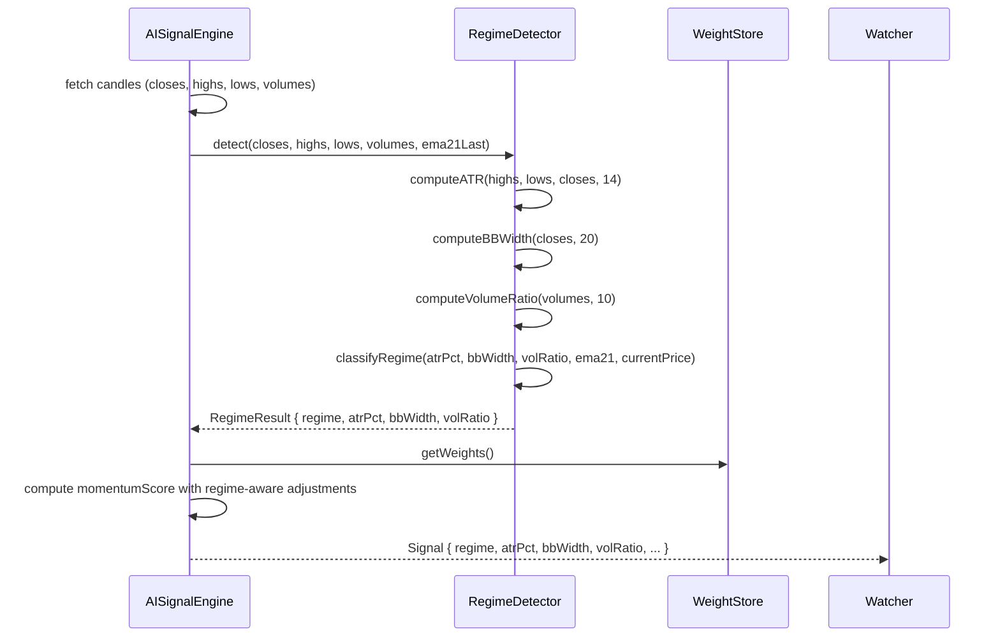
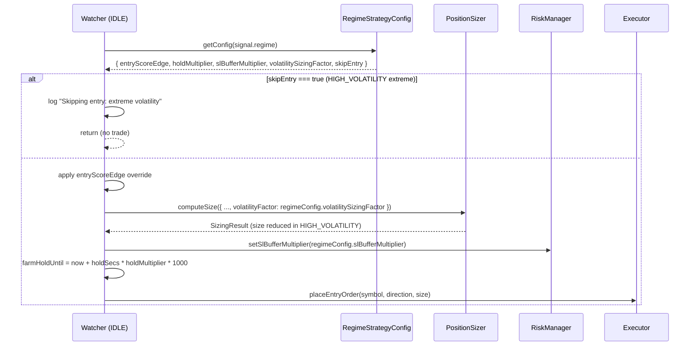
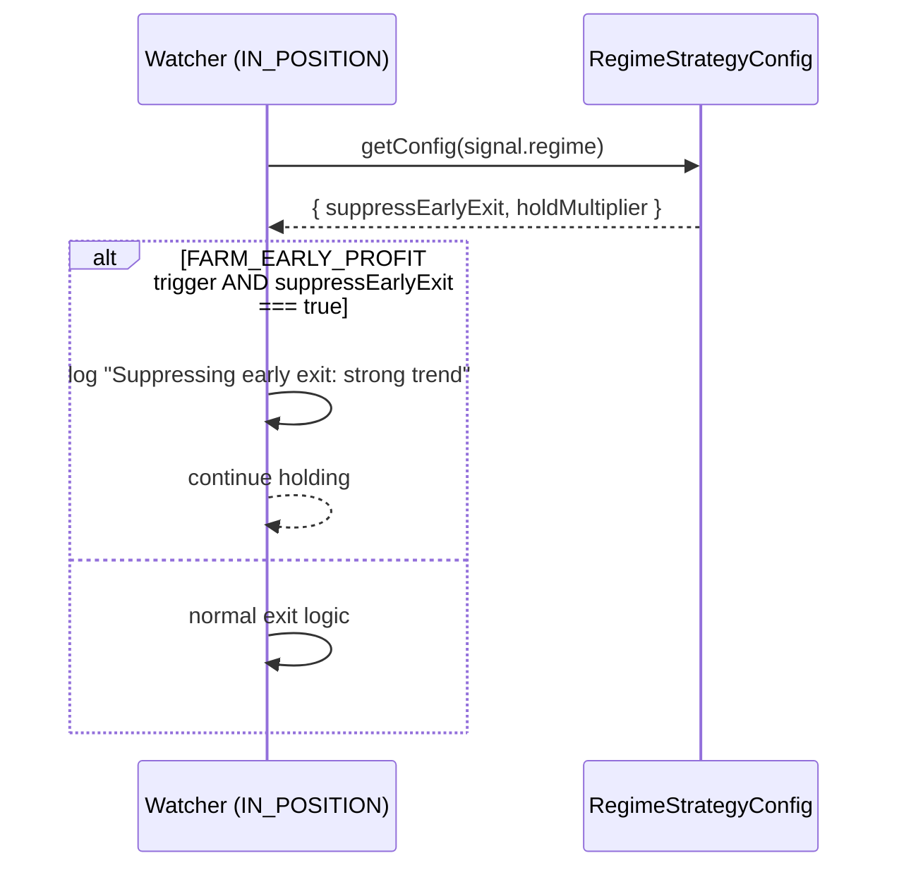

# Design Document: Regime-Adaptive Strategy (Phase 3)

## Overview

Phase 3 upgrades APEX's market regime detection from a single EMA-distance heuristic into a multi-signal `RegimeDetector` service, and introduces a `RegimeStrategy` configuration layer that translates the detected regime into concrete behavioural adjustments across all three subsystems: signal scoring (`AISignalEngine`), position sizing (`PositionSizer`), and trade management (`Watcher`).

The current regime detection — comparing `currentPrice` to `ema21 ± 0.2%` — produces only three states and carries no volatility information. Phase 3 adds **ATR-based volatility measurement**, **Bollinger Band width for range compression/expansion**, and **volume confirmation** to produce a richer four-state regime: `TREND_UP`, `TREND_DOWN`, `SIDEWAY`, and `HIGH_VOLATILITY`. Each regime maps to a `RegimeStrategyConfig` object that specifies hold-time multipliers, SL buffer adjustments, entry threshold overrides, and a volatility sizing factor that feeds directly into `PositionSizer`.

The new `RegimeDetector` is a pure, stateless service extracted from `AISignalEngine._fetchSignal()`. It receives pre-computed candle arrays and returns a `RegimeResult` with the regime label plus the raw indicator values (ATR, BB width, volume ratio) for logging and dashboard transparency. `AISignalEngine` calls it once per signal fetch; `Watcher` reads the regime from the returned `Signal` (already present as `signal.regime`) and applies the corresponding `RegimeStrategyConfig` at entry and exit decision points.

---

## Architecture

```mermaid
graph TD
    subgraph AISignalEngine
        FetchSignal["_fetchSignal()"] --> RD["RegimeDetector.detect()"]
        RD --> RegimeResult["RegimeResult\n{regime, atr, bbWidth, volRatio}"]
        RegimeResult --> MomentumScore["momentumScore computation\n(regime-aware adjustments)"]
        RegimeResult --> Signal["Signal output\n{regime, atrPct, bbWidth, volRatio}"]
    end

    subgraph RegimeDetector
        ATR["computeATR(highs, lows, closes, 14)"]
        BB["computeBBWidth(closes, 20)"]
        VOL["computeVolumeRatio(volumes, 10)"]
        Classify["classifyRegime(atrPct, bbWidth, volRatio, ema21)"]
        ATR --> Classify
        BB --> Classify
        VOL --> Classify
    end

    subgraph Watcher
        IDLE["IDLE state\n(entry decision)"] --> RSC["RegimeStrategyConfig\nlookup by regime"]
        RSC --> EntryThreshold["entry threshold override"]
        RSC --> SizingFactor["volatility sizing factor\n→ PositionSizer"]
        RSC --> HoldMultiplier["hold time multiplier\n→ farmHoldUntil"]
        IN_POS["IN_POSITION state\n(exit decision)"] --> SLBuffer["SL buffer override\n→ RiskManager"]
        IN_POS --> EarlyExitSuppression["suppress FARM_EARLY_PROFIT\nin strong trend"]
    end

    subgraph PositionSizer
        ComputeSize["computeSize()"] --> VolatilityMult["volatilityMultiplier\n(new, from RegimeResult)"]
        VolatilityMult --> Combined["combined multiplier"]
    end

    Signal -->|regime + atrPct| Watcher
    Signal -->|regime + atrPct| PositionSizer
    FeedbackLoop["Phase 1\nAdaptiveWeightAdjuster"] -.->|per-regime weight buckets\n(future extension)| AISignalEngine
```

Key design decisions:

| Decision | Choice | Rationale |
|---|---|---|
| New service vs inline | New `RegimeDetector` class | Testable in isolation; `AISignalEngine` stays focused on scoring |
| Where `RegimeStrategyConfig` lives | `config.ts` + `ConfigStore` | Consistent with existing override pattern; dashboard-editable |
| `HIGH_VOLATILITY` threshold | `ATR/price > 0.5%` (configurable) | Standard BTC scalping threshold; tunable via config |
| BB width metric | `(upperBand - lowerBand) / middleBand` | Normalised, price-independent; easy to threshold |
| Volume confirmation | `currentVolume / avg10Volume` ratio | Simple, no extra data fetch needed (volumes already in candles) |
| Regime feeds PositionSizer | New `volatilityMultiplier` input | Keeps sizing logic in one place; regime is just another multiplier |
| Hold time adjustment | Multiplier on `FARM_MAX_HOLD_SECS` | Non-breaking; existing random hold range still applies |
| SL buffer | Multiplier on `FARM_SL_PERCENT` | Widens SL in HIGH_VOLATILITY without changing RiskManager interface |
| Phase 1 interaction | Regime stored in `TradeRecord` (already done); per-regime weight buckets deferred | Avoids over-engineering; Phase 1 already adapts weights globally |
| `SignalSnapshot` extension | Add `atrPct`, `bbWidth`, `volRatio` fields | Enables per-regime analytics in future |

---

## Sequence Diagrams

### Regime Detection Flow (inside _fetchSignal)



### Entry Decision with Regime Strategy (IDLE state)



### Exit Decision with Regime Strategy (IN_POSITION state)



---

## Components and Interfaces

### RegimeDetector

**Purpose**: Pure stateless service that computes ATR, Bollinger Band width, and volume ratio from candle arrays, then classifies the current market regime.

**Interface**:
```typescript
type Regime = 'TREND_UP' | 'TREND_DOWN' | 'SIDEWAY' | 'HIGH_VOLATILITY';

interface RegimeResult {
  regime: Regime;
  atrPct: number;       // ATR as % of current price (e.g. 0.004 = 0.4%)
  bbWidth: number;      // (upperBand - lowerBand) / middleBand
  volRatio: number;     // currentVolume / avg10Volume
}

interface RegimeDetectorInterface {
  detect(
    closes: number[],
    highs: number[],
    lows: number[],
    volumes: number[],
    ema21Last: number
  ): RegimeResult;
}
```

**Responsibilities**:
- Compute 14-period ATR from highs, lows, closes
- Compute 20-period Bollinger Band width (normalised)
- Compute volume ratio (current candle vs 10-candle average)
- Classify regime using priority order: HIGH_VOLATILITY → TREND → SIDEWAY
- Return raw indicator values alongside regime label for logging

**Classification priority** (evaluated top-down, first match wins):
1. `HIGH_VOLATILITY`: `atrPct > REGIME_HIGH_VOL_THRESHOLD` (default 0.005 = 0.5%)
2. `TREND_UP`: `currentPrice > ema21Last * (1 + REGIME_TREND_EMA_BAND)` AND `bbWidth > REGIME_BB_TREND_MIN`
3. `TREND_DOWN`: `currentPrice < ema21Last * (1 - REGIME_TREND_EMA_BAND)` AND `bbWidth > REGIME_BB_TREND_MIN`
4. `SIDEWAY`: default (none of the above)

---

### RegimeStrategyConfig

**Purpose**: Per-regime configuration object that specifies how each regime modifies entry, sizing, hold time, and exit behaviour.

**Interface**:
```typescript
interface RegimeStrategyConfig {
  // Entry
  entryScoreEdge: number;         // override FARM_SCORE_EDGE for this regime
  skipEntry: boolean;             // true = skip all entries (extreme HIGH_VOLATILITY)

  // Sizing
  volatilitySizingFactor: number; // multiplier fed to PositionSizer (< 1 = reduce size)

  // Hold time
  holdMultiplier: number;         // multiplied against FARM_MAX_HOLD_SECS random draw

  // Exit
  slBufferMultiplier: number;     // multiplied against FARM_SL_PERCENT
  suppressEarlyExit: boolean;     // true = ignore FARM_EARLY_PROFIT trigger
}
```

**Default configs per regime**:

| Regime | entryScoreEdge | skipEntry | volatilitySizingFactor | holdMultiplier | slBufferMultiplier | suppressEarlyExit |
|---|---|---|---|---|---|---|
| `TREND_UP` | 0.02 (lower) | false | 1.0 | 1.5 | 1.0 | true |
| `TREND_DOWN` | 0.02 (lower) | false | 1.0 | 1.5 | 1.0 | true |
| `SIDEWAY` | 0.05 (higher) | false | 0.85 | 0.8 | 1.0 | false |
| `HIGH_VOLATILITY` | 0.08 (much higher) | false | 0.5 | 0.7 | 1.5 | false |

Note: `skipEntry` is `false` by default for `HIGH_VOLATILITY` — the system reduces size and widens SL instead of skipping entirely. A separate config flag `REGIME_HIGH_VOL_SKIP_ENTRY` (default `false`) can enable full skip.

---

### Config Extensions

New keys added to `config.ts` and `OverridableConfig`:

```typescript
// ── Regime Detection ──────────────────────────────────────────────────────
REGIME_ATR_PERIOD: 14,                  // ATR lookback period
REGIME_BB_PERIOD: 20,                   // Bollinger Band period
REGIME_BB_STD_DEV: 2,                   // BB standard deviation multiplier
REGIME_VOL_LOOKBACK: 10,                // volume average lookback
REGIME_HIGH_VOL_THRESHOLD: 0.005,       // ATR/price > this → HIGH_VOLATILITY (0.5%)
REGIME_TREND_EMA_BAND: 0.002,           // price vs ema21 band for TREND (0.2%, same as current)
REGIME_BB_TREND_MIN: 0.01,              // min BB width to confirm trend (vs compression)

// ── Regime Strategy ───────────────────────────────────────────────────────
REGIME_TREND_HOLD_MULT: 1.5,            // hold time multiplier in TREND
REGIME_SIDEWAY_HOLD_MULT: 0.8,          // hold time multiplier in SIDEWAY
REGIME_HIGH_VOL_HOLD_MULT: 0.7,         // hold time multiplier in HIGH_VOLATILITY
REGIME_HIGH_VOL_SIZE_FACTOR: 0.5,       // sizing factor in HIGH_VOLATILITY
REGIME_SIDEWAY_SIZE_FACTOR: 0.85,       // sizing factor in SIDEWAY
REGIME_HIGH_VOL_SL_MULT: 1.5,           // SL buffer multiplier in HIGH_VOLATILITY
REGIME_HIGH_VOL_SKIP_ENTRY: false,      // skip entries entirely in HIGH_VOLATILITY
REGIME_TREND_SUPPRESS_EARLY_EXIT: true, // suppress FARM_EARLY_PROFIT in TREND
```

---

## Data Models

### RegimeResult

```typescript
interface RegimeResult {
  regime: 'TREND_UP' | 'TREND_DOWN' | 'SIDEWAY' | 'HIGH_VOLATILITY';
  atrPct: number;    // ATR / currentPrice; e.g. 0.004 = 0.4%
  bbWidth: number;   // (upper - lower) / middle; e.g. 0.02 = 2%
  volRatio: number;  // currentVol / avg10Vol; e.g. 1.8 = 80% above average
}
```

**Validation rules**:
- `atrPct >= 0`
- `bbWidth >= 0`
- `volRatio >= 0`
- `regime` is one of the four valid values

### SignalSnapshot extension

New optional fields added to `SignalSnapshot` (and `TradeRecord`) for analytics:

```typescript
interface SignalSnapshot {
  // ... existing fields ...
  atrPct?: number;      // ATR % at entry signal time
  bbWidth?: number;     // BB width at entry signal time
  volRatio?: number;    // volume ratio at entry signal time
}
```

### SizingInput extension

New optional field added to `SizingInput`:

```typescript
interface SizingInput {
  // ... existing fields ...
  volatilityFactor?: number;  // regime-based multiplier [0, 1]; default 1.0
}
```


---

## Algorithmic Pseudocode

### Main: RegimeDetector.detect()

```pascal
ALGORITHM detect(closes, highs, lows, volumes, ema21Last)
INPUT: closes, highs, lows, volumes — arrays of float (length >= 20),
       ema21Last — float (current EMA21 value)
OUTPUT: RegimeResult

BEGIN
  currentPrice ← closes[closes.length - 1]

  // Step 1: ATR (14-period)
  atr ← computeATR(highs, lows, closes, REGIME_ATR_PERIOD)
  atrPct ← atr / currentPrice

  // Step 2: Bollinger Band width (20-period, 2 std dev)
  bbWidth ← computeBBWidth(closes, REGIME_BB_PERIOD, REGIME_BB_STD_DEV)

  // Step 3: Volume ratio
  volRatio ← computeVolumeRatio(volumes, REGIME_VOL_LOOKBACK)

  // Step 4: Classify (priority order)
  IF atrPct > REGIME_HIGH_VOL_THRESHOLD THEN
    regime ← 'HIGH_VOLATILITY'
  ELSE IF currentPrice > ema21Last * (1 + REGIME_TREND_EMA_BAND)
       AND bbWidth > REGIME_BB_TREND_MIN THEN
    regime ← 'TREND_UP'
  ELSE IF currentPrice < ema21Last * (1 - REGIME_TREND_EMA_BAND)
       AND bbWidth > REGIME_BB_TREND_MIN THEN
    regime ← 'TREND_DOWN'
  ELSE
    regime ← 'SIDEWAY'
  END IF

  RETURN RegimeResult { regime, atrPct, bbWidth, volRatio }
END
```

**Preconditions**:
- `closes.length >= REGIME_BB_PERIOD` (20 minimum)
- `highs.length = lows.length = closes.length`
- `ema21Last > 0`
- `currentPrice > 0`

**Postconditions**:
- `result.atrPct >= 0`
- `result.bbWidth >= 0`
- `result.volRatio >= 0`
- `result.regime ∈ { 'TREND_UP', 'TREND_DOWN', 'SIDEWAY', 'HIGH_VOLATILITY' }`

---

### Sub-algorithm: computeATR

```pascal
ALGORITHM computeATR(highs, lows, closes, period)
INPUT: highs, lows, closes — float arrays, period — integer
OUTPUT: atr — float (average true range)

BEGIN
  trueRanges ← []

  FOR i FROM 1 TO closes.length - 1 DO
    high ← highs[i]
    low ← lows[i]
    prevClose ← closes[i - 1]

    tr ← max(
      high - low,
      abs(high - prevClose),
      abs(low - prevClose)
    )
    trueRanges.append(tr)
  END FOR

  // Simple average of last `period` true ranges
  recent ← trueRanges.slice(-period)
  atr ← sum(recent) / recent.length

  RETURN atr
END
```

**Preconditions**: `closes.length > period`, `period > 0`

**Postconditions**: `atr >= 0`

**Loop invariants**: Each `tr` is the true range for candle `i`, always >= 0

---

### Sub-algorithm: computeBBWidth

```pascal
ALGORITHM computeBBWidth(closes, period, stdDevMult)
INPUT: closes — float array, period — integer, stdDevMult — float
OUTPUT: bbWidth — float (normalised band width)

BEGIN
  recent ← closes.slice(-period)
  mean ← sum(recent) / period

  variance ← sum((x - mean)^2 for x in recent) / period
  stdDev ← sqrt(variance)

  upperBand ← mean + stdDevMult * stdDev
  lowerBand ← mean - stdDevMult * stdDev

  IF mean = 0 THEN
    RETURN 0
  END IF

  bbWidth ← (upperBand - lowerBand) / mean

  RETURN bbWidth
END
```

**Preconditions**: `closes.length >= period`, `period > 0`, `stdDevMult > 0`

**Postconditions**: `bbWidth >= 0`; `bbWidth = 0` only when all closes are identical

---

### Sub-algorithm: computeVolumeRatio

```pascal
ALGORITHM computeVolumeRatio(volumes, lookback)
INPUT: volumes — float array, lookback — integer
OUTPUT: volRatio — float

BEGIN
  IF volumes.length < 2 THEN
    RETURN 1.0  // insufficient data → neutral
  END IF

  currentVol ← volumes[volumes.length - 1]
  avgVol ← sum(volumes.slice(-lookback - 1, -1)) / lookback

  IF avgVol = 0 THEN
    RETURN 1.0
  END IF

  RETURN currentVol / avgVol
END
```

**Preconditions**: `lookback > 0`

**Postconditions**: `volRatio >= 0`; returns 1.0 on insufficient data (neutral)

---

### Main: getRegimeStrategyConfig

```pascal
ALGORITHM getRegimeStrategyConfig(regime)
INPUT: regime ∈ { 'TREND_UP', 'TREND_DOWN', 'SIDEWAY', 'HIGH_VOLATILITY' }
OUTPUT: RegimeStrategyConfig

BEGIN
  MATCH regime WITH
    CASE 'TREND_UP' OR 'TREND_DOWN':
      RETURN {
        entryScoreEdge:        0.02,
        skipEntry:             false,
        volatilitySizingFactor: 1.0,
        holdMultiplier:        REGIME_TREND_HOLD_MULT,
        slBufferMultiplier:    1.0,
        suppressEarlyExit:     REGIME_TREND_SUPPRESS_EARLY_EXIT
      }

    CASE 'SIDEWAY':
      RETURN {
        entryScoreEdge:        0.05,
        skipEntry:             false,
        volatilitySizingFactor: REGIME_SIDEWAY_SIZE_FACTOR,
        holdMultiplier:        REGIME_SIDEWAY_HOLD_MULT,
        slBufferMultiplier:    1.0,
        suppressEarlyExit:     false
      }

    CASE 'HIGH_VOLATILITY':
      RETURN {
        entryScoreEdge:        0.08,
        skipEntry:             REGIME_HIGH_VOL_SKIP_ENTRY,
        volatilitySizingFactor: REGIME_HIGH_VOL_SIZE_FACTOR,
        holdMultiplier:        REGIME_HIGH_VOL_HOLD_MULT,
        slBufferMultiplier:    REGIME_HIGH_VOL_SL_MULT,
        suppressEarlyExit:     false
      }
  END MATCH
END
```

**Preconditions**: `regime` is a valid Regime value

**Postconditions**:
- `result.volatilitySizingFactor ∈ (0, 1]`
- `result.holdMultiplier > 0`
- `result.slBufferMultiplier >= 1.0`
- `result.entryScoreEdge > 0`

---

### Main: PositionSizer.computeSize() (extended)

The existing `computeSize()` gains a `volatilityFactor` input that is applied as a fourth multiplier before the risk caps:

```pascal
ALGORITHM computeSize(input)
INPUT: input — SizingInput (with optional volatilityFactor)
OUTPUT: SizingResult

BEGIN
  ASSERT input.balance > 0
  ASSERT input.confidence ∈ [0, 1]

  baseSize ← ORDER_SIZE_MIN + random() × (ORDER_SIZE_MAX - ORDER_SIZE_MIN)

  confMult ← confidenceMultiplier(input.confidence, input.mode)
  perfMult ← performanceMultiplier(input.recentPnLs, input.sessionPnl, input.profile)

  combined ← (confMult × SIZING_CONF_WEIGHT) + (perfMult × SIZING_PERF_WEIGHT)
  combined ← clamp(combined, SIZING_MIN_MULTIPLIER, SIZING_MAX_MULTIPLIER)

  // NEW: apply volatility factor from regime (default 1.0 = no change)
  volFactor ← input.volatilityFactor ?? 1.0
  volFactor ← clamp(volFactor, 0.1, 1.0)  // never amplify, only reduce

  rawSize ← baseSize × combined × volFactor

  { finalSize, cappedBy } ← applyRiskCaps(rawSize)

  ASSERT finalSize >= ORDER_SIZE_MIN
  ASSERT finalSize <= SIZING_MAX_BTC

  RETURN SizingResult {
    size: finalSize,
    confidenceMultiplier: confMult,
    performanceMultiplier: perfMult,
    combinedMultiplier: combined,
    volatilityFactor: volFactor,
    cappedBy
  }
END
```

**Preconditions** (unchanged from Phase 2, plus):
- `input.volatilityFactor ∈ (0, 1]` if provided

**Postconditions**:
- `result.size ∈ [ORDER_SIZE_MIN, SIZING_MAX_BTC]`
- `result.volatilityFactor ∈ [0.1, 1.0]`
- `result.size <= Phase2_result.size` when `volatilityFactor < 1.0` (regime reduces size)

**Loop invariants**: N/A

---

### Main: Watcher IDLE entry with regime strategy

```pascal
ALGORITHM applyRegimeStrategy(signal, balance, markPrice)
INPUT: signal — Signal (with regime, atrPct, bbWidth, volRatio),
       balance — float, markPrice — float
OUTPUT: { finalDirection, size, holdSecs, slPercent } OR skip

BEGIN
  regimeConfig ← getRegimeStrategyConfig(signal.regime)

  // Skip check
  IF regimeConfig.skipEntry THEN
    LOG "Skipping entry: HIGH_VOLATILITY skip enabled"
    RETURN skip
  END IF

  // Entry score edge override
  effectiveScoreEdge ← regimeConfig.entryScoreEdge
  scoreStrong ← abs(signal.score - 0.5) > effectiveScoreEdge

  IF NOT scoreStrong THEN
    RETURN skip
  END IF

  // Sizing with volatility factor
  sizingResult ← positionSizer.computeSize({
    confidence: signal.confidence,
    recentPnLs: recentPnLs,
    sessionPnl: sessionCurrentPnl,
    balance: balance,
    mode: config.MODE,
    profile: currentProfile,
    volatilityFactor: regimeConfig.volatilitySizingFactor
  })

  // Balance-% soft cap (unchanged from Phase 2)
  size ← sizingResult.size
  maxSizeFromBalance ← (balance × SIZING_MAX_BALANCE_PCT) / markPrice
  IF size > maxSizeFromBalance THEN
    size ← max(ORDER_SIZE_MIN, maxSizeFromBalance)
  END IF

  // Hold time with regime multiplier
  baseHoldSecs ← random(FARM_MIN_HOLD_SECS, FARM_MAX_HOLD_SECS)
  holdSecs ← round(baseHoldSecs × regimeConfig.holdMultiplier)
  holdSecs ← clamp(holdSecs, FARM_MIN_HOLD_SECS, FARM_MAX_HOLD_SECS × 2)

  // SL buffer with regime multiplier
  slPercent ← FARM_SL_PERCENT × regimeConfig.slBufferMultiplier

  RETURN { finalDirection: signal.direction, size, holdSecs, slPercent }
END
```

**Preconditions**:
- `signal.regime` is a valid Regime value
- `balance > 0`, `markPrice > 0`

**Postconditions**:
- If not skip: `size ∈ [ORDER_SIZE_MIN, SIZING_MAX_BTC]`
- `holdSecs >= FARM_MIN_HOLD_SECS`
- `slPercent >= FARM_SL_PERCENT` (regime never tightens SL, only widens)

---

## Key Functions with Formal Specifications

### RegimeDetector.detect()

```typescript
detect(
  closes: number[],
  highs: number[],
  lows: number[],
  volumes: number[],
  ema21Last: number
): RegimeResult
```

**Preconditions**:
- `closes.length >= 20` (BB period)
- `highs.length === lows.length === closes.length`
- `ema21Last > 0`

**Postconditions**:
- `result.regime ∈ { 'TREND_UP', 'TREND_DOWN', 'SIDEWAY', 'HIGH_VOLATILITY' }`
- `result.atrPct >= 0`
- `result.bbWidth >= 0`
- `result.volRatio >= 0`
- No I/O performed (pure function)
- `result.regime === 'HIGH_VOLATILITY'` if and only if `result.atrPct > REGIME_HIGH_VOL_THRESHOLD`

**Loop invariants**: Each true range computation is independent; ATR is the mean of the last `period` true ranges

---

### getRegimeStrategyConfig()

```typescript
getRegimeStrategyConfig(regime: Regime): RegimeStrategyConfig
```

**Preconditions**: `regime` is a valid Regime value

**Postconditions**:
- `result.volatilitySizingFactor ∈ (0, 1]` (never amplifies size)
- `result.slBufferMultiplier >= 1.0` (never tightens SL)
- `result.holdMultiplier > 0`
- For `TREND_UP` or `TREND_DOWN`: `result.entryScoreEdge < config.FARM_SCORE_EDGE` (lower bar to enter)
- For `SIDEWAY` or `HIGH_VOLATILITY`: `result.entryScoreEdge >= config.FARM_SCORE_EDGE` (higher bar to enter)

---

### PositionSizer.computeSize() (extended)

```typescript
computeSize(input: SizingInput): SizingResult
```

**Preconditions** (Phase 2 preconditions plus):
- `input.volatilityFactor === undefined` OR `input.volatilityFactor ∈ (0, 1]`

**Postconditions** (Phase 2 postconditions plus):
- `result.size <= computeSize({ ...input, volatilityFactor: 1.0 }).size` when `volatilityFactor < 1.0`
- `result.volatilityFactor ∈ [0.1, 1.0]`

---

## Example Usage

```typescript
// In AISignalEngine._fetchSignal() — replace inline regime detection:

// Before (Phase 2):
let regime: 'TREND_UP' | 'TREND_DOWN' | 'SIDEWAY' = 'SIDEWAY';
if (currentPrice > ema21Last * 1.002) regime = 'TREND_UP';
else if (currentPrice < ema21Last * 0.998) regime = 'TREND_DOWN';

// After (Phase 3):
const regimeDetector = new RegimeDetector();
const regimeResult = regimeDetector.detect(closes, highs, lows, volumes, ema21Last);
const { regime, atrPct, bbWidth, volRatio } = regimeResult;

// Return signal with new fields:
return {
  base_score, regime, direction, confidence,
  imbalance, tradePressure, score: momentumScore,
  chartTrend: emaAbove ? 'bullish' : 'bearish',
  reasoning: decision.reasoning,
  fallback: false,
  atrPct,    // new
  bbWidth,   // new
  volRatio,  // new
};
```

```typescript
// In Watcher.ts — IDLE state, after finalDirection is determined:

const regimeConfig = getRegimeStrategyConfig(signal.regime);

// Skip entry if extreme volatility
if (regimeConfig.skipEntry) {
  console.log(`⚠️ [REGIME] Skipping entry: HIGH_VOLATILITY skip enabled`);
  return;
}

// Override score edge
const effectiveScoreEdge = regimeConfig.entryScoreEdge;
const scoreStrong = Math.abs(signal.score - 0.5) > effectiveScoreEdge;
if (!scoreStrong) {
  console.log(`😴 [REGIME] Score edge not met for ${signal.regime}. Skipping.`);
  return;
}

// Sizing with volatility factor
const sizingResult = this.positionSizer.computeSize({
  confidence: signal.confidence,
  recentPnLs: this.recentPnLs,
  sessionPnl: this.sessionCurrentPnl,
  balance,
  mode: config.MODE as 'farm' | 'trade',
  profile: this.currentProfile,
  volatilityFactor: regimeConfig.volatilitySizingFactor,  // new
});

// Hold time with regime multiplier
const baseHoldSecs = Math.floor(Math.random() * (config.FARM_MAX_HOLD_SECS - config.FARM_MIN_HOLD_SECS + 1)) + config.FARM_MIN_HOLD_SECS;
const holdSecs = Math.round(baseHoldSecs * regimeConfig.holdMultiplier);
this.farmHoldUntil = Date.now() + holdSecs * 1000;

// SL buffer with regime multiplier (passed to RiskManager)
const effectiveSlPercent = config.FARM_SL_PERCENT * regimeConfig.slBufferMultiplier;
this.riskManager.setSlPercent(effectiveSlPercent);

console.log(`🎯 [REGIME] ${signal.regime} | ATR: ${(signal.atrPct * 100).toFixed(3)}% | BB: ${(signal.bbWidth * 100).toFixed(2)}% | Vol: ${signal.volRatio.toFixed(2)}x | Hold: ${holdSecs}s | SL: ${(effectiveSlPercent * 100).toFixed(2)}%`);
```

```typescript
// In Watcher.ts — IN_POSITION state, early exit suppression:

// Before (Phase 2):
if (duration >= config.FARM_EARLY_EXIT_SECS && pnl >= config.FARM_EARLY_EXIT_PNL) {
  shouldExit = true;
  exitTrigger = `FARM EARLY PROFIT (${pnl.toFixed(2)} after ${duration}s)`;
}

// After (Phase 3):
const regimeConfig = getRegimeStrategyConfig(signal.regime);
if (duration >= config.FARM_EARLY_EXIT_SECS && pnl >= config.FARM_EARLY_EXIT_PNL) {
  if (regimeConfig.suppressEarlyExit) {
    console.log(`🚜 [REGIME] Suppressing early exit in ${signal.regime} — letting trend run`);
  } else {
    shouldExit = true;
    exitTrigger = `FARM EARLY PROFIT (${pnl.toFixed(2)} after ${duration}s)`;
  }
}
```

---

## Correctness Properties

*A property is a characteristic or behavior that should hold true across all valid executions of a system — essentially, a formal statement about what the system should do. Properties serve as the bridge between human-readable specifications and machine-verifiable correctness guarantees.*

### Property 1: Regime completeness

For any valid candle arrays with `closes.length >= 20`, `RegimeDetector.detect()` always returns exactly one of the four regime values (`TREND_UP`, `TREND_DOWN`, `SIDEWAY`, `HIGH_VOLATILITY`) — the result is never undefined or null.

**Validates: Requirements 4.1**

### Property 2: HIGH_VOLATILITY priority

For any valid candle arrays where the computed `atrPct > REGIME_HIGH_VOL_THRESHOLD`, `RegimeDetector.detect()` returns `regime === 'HIGH_VOLATILITY'` regardless of EMA distance or BB width.

**Validates: Requirements 4.2**

### Property 3: Volatility factor monotonicity

For any `SizingInput`, `computeSize({ ...input, volatilityFactor: f1 }).size <= computeSize({ ...input, volatilityFactor: f2 }).size` when `f1 <= f2` — a lower volatility factor produces a smaller or equal position size.

**Validates: Requirements 6.6**

### Property 4: SL never tightens

For all four regime values, `getRegimeStrategyConfig(regime).slBufferMultiplier >= 1.0` — the regime strategy never makes the stop loss tighter than the base config.

**Validates: Requirements 5.4, 8.8**

### Property 5: Sizing factor never amplifies

For all four regime values, `getRegimeStrategyConfig(regime).volatilitySizingFactor ∈ (0, 1]` — the regime strategy never amplifies position size above the baseline.

**Validates: Requirements 5.5, 6.4**

### Property 6: ATR non-negativity

For any valid candle arrays, `computeATR(highs, lows, closes, period)` returns a value `>= 0`, and therefore `atrPct >= 0`.

**Validates: Requirements 1.3**

### Property 7: BB width non-negativity

For any valid closes array with `closes.length >= period`, `computeBBWidth(closes, period, stdDevMult) >= 0`; equals 0 only when all closes in the window are identical.

**Validates: Requirements 2.2, 2.3**

### Property 8: Volume ratio neutral on insufficient data

For any volumes array with `volumes.length < 2`, `computeVolumeRatio(volumes, lookback) === 1.0` (insufficient data returns neutral).

**Validates: Requirements 3.3**

### Property 9: Regime strategy config completeness

For all four regime values, `getRegimeStrategyConfig(regime)` returns a fully populated `RegimeStrategyConfig` with no undefined fields.

**Validates: Requirements 5.6**

### Property 10: Hold time lower bound

For any valid `holdMultiplier` from `getRegimeStrategyConfig`, after computing `holdSecs = clamp(round(baseHoldSecs * holdMultiplier), FARM_MIN_HOLD_SECS, FARM_MAX_HOLD_SECS * 2)`, the result satisfies `holdSecs >= FARM_MIN_HOLD_SECS`.

**Validates: Requirements 8.5, 8.6**

---

## Error Handling

### Scenario 1: Insufficient candle data for BB calculation

**Condition**: `closes.length < REGIME_BB_PERIOD` (fewer than 20 candles)

**Response**: `computeBBWidth()` uses available candles (slice to available length). If fewer than 2 candles, returns `bbWidth = 0` (treated as SIDEWAY — no trend confirmation).

**Recovery**: Automatic on next signal fetch when full candle history is available

---

### Scenario 2: ATR computation with zero true ranges

**Condition**: All candles have identical OHLC values (e.g. exchange outage, stale data)

**Response**: `computeATR()` returns 0; `atrPct = 0`. Regime falls through to TREND or SIDEWAY classification based on EMA distance. No HIGH_VOLATILITY false positive.

**Recovery**: Normal operation resumes when live candle data returns

---

### Scenario 3: Volume data missing or zero

**Condition**: Exchange returns zero volumes for all candles

**Response**: `computeVolumeRatio()` returns 1.0 (neutral). Volume confirmation is effectively disabled — regime classification proceeds on ATR and EMA distance alone.

**Recovery**: Automatic when volume data is available

---

### Scenario 4: Regime changes mid-position

**Condition**: Regime was TREND_UP at entry; changes to HIGH_VOLATILITY while IN_POSITION

**Response**: The `suppressEarlyExit` flag is evaluated using the regime at signal time (stored in `_pendingEntrySignalMeta.signalSnapshot.regime`). The SL buffer is set at entry and not re-evaluated mid-position. This is intentional — changing SL mid-trade is risky.

**Recovery**: New regime applies on the next entry after the current position closes

---

### Scenario 5: Config override produces invalid volatility factor

**Condition**: Dashboard sends `REGIME_HIGH_VOL_SIZE_FACTOR: 1.5` (> 1.0, would amplify size)

**Response**: `validateOverrides` rejects: "REGIME_HIGH_VOL_SIZE_FACTOR must be in (0, 1]"

**Recovery**: Config unchanged; existing factor remains in effect

---

## Testing Strategy

### Unit Testing Approach

`RegimeDetector` is a pure function class — all methods are tested in isolation with synthetic candle data:

- `computeATR`: verify true range formula (high-low, high-prevClose, low-prevClose), verify period averaging, verify zero-range candles
- `computeBBWidth`: verify band formula, verify zero-width when all closes identical, verify normalisation
- `computeVolumeRatio`: verify ratio formula, verify neutral return on insufficient data
- `detect`: verify priority order (HIGH_VOLATILITY beats TREND), verify all four regime classifications, verify boundary conditions at thresholds
- `getRegimeStrategyConfig`: verify all four regimes return complete configs, verify SL multiplier >= 1.0 invariant

### Property-Based Testing Approach

**Property Test Library**: `fast-check`

Key properties to test with generated inputs:

1. `detect()` always returns one of the four valid regime values for any candle arrays of length >= 20
2. `atrPct >= 0` for any valid candle arrays
3. `bbWidth >= 0` for any valid closes array
4. `volRatio >= 0` for any valid volumes array; equals 1.0 when volumes.length < 2
5. `getRegimeStrategyConfig(regime).slBufferMultiplier >= 1.0` for all four regimes
6. `getRegimeStrategyConfig(regime).volatilitySizingFactor ∈ (0, 1]` for all four regimes
7. `computeSize({ ...input, volatilityFactor: f }).size` is monotonically non-increasing as `f` decreases from 1.0 to 0.1
8. If `atrPct > REGIME_HIGH_VOL_THRESHOLD`, then `detect().regime === 'HIGH_VOLATILITY'` (priority invariant)

### Integration Testing Approach

- Replace inline regime detection in `AISignalEngine._fetchSignal()` with `RegimeDetector.detect()` and verify existing signal tests still pass
- Verify `signal.atrPct`, `signal.bbWidth`, `signal.volRatio` are populated in the returned `Signal`
- Verify `Watcher` applies `regimeConfig.holdMultiplier` to `farmHoldUntil` correctly
- Verify `PositionSizer.computeSize()` with `volatilityFactor: 0.5` produces a size <= the same call with `volatilityFactor: 1.0`
- Verify `TradeRecord.signalSnapshot` includes `atrPct`, `bbWidth`, `volRatio` after a trade

---

## Performance Considerations

- `RegimeDetector.detect()` is a pure synchronous computation over the candle arrays already fetched — zero additional API calls
- ATR, BB, and volume ratio are O(n) passes over arrays of length 20–30 — negligible overhead
- `getRegimeStrategyConfig()` is a constant-time lookup (switch/map)
- All regime-based adjustments in `Watcher` are arithmetic operations — no I/O on the hot path

---

## Security Considerations

- All `REGIME_*` config values are validated by `validateOverrides` before being applied
- `volatilitySizingFactor` is clamped to `(0, 1]` in `PositionSizer` even if an invalid value slips through config validation — no amplification possible
- `slBufferMultiplier` is floored at 1.0 in `getRegimeStrategyConfig()` — regime cannot tighten SL below base config

---

## Dependencies

- No new npm dependencies
- `src/ai/AISignalEngine.ts` — replace inline regime detection with `RegimeDetector.detect()`; extend `Signal` return type with `atrPct`, `bbWidth`, `volRatio`
- `src/ai/TradeLogger.ts` — extend `SignalSnapshot` with `atrPct`, `bbWidth`, `volRatio` optional fields
- `src/modules/PositionSizer.ts` — add `volatilityFactor` to `SizingInput`; apply in `computeSize()`
- `src/modules/Watcher.ts` — apply `RegimeStrategyConfig` at entry (score edge, sizing, hold time, SL) and exit (early exit suppression)
- `src/modules/RiskManager.ts` — add `setSlPercent(pct: number)` method for runtime SL override
- `src/config.ts` — new `REGIME_*` keys
- `src/config/ConfigStore.ts` — expose new keys in `OverridableConfig` + `validateOverrides`
- `fast-check` (already in project) — property-based tests
