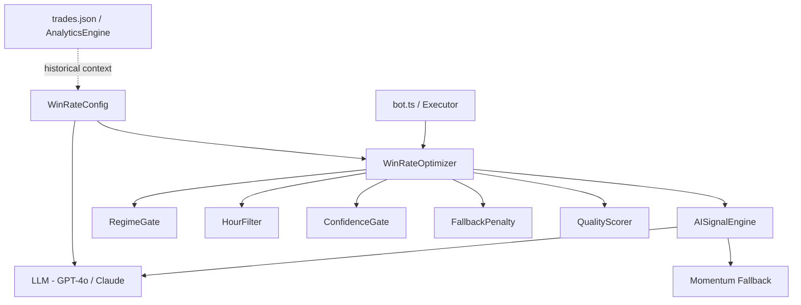

# Design Document: Signal Win Rate Optimizer

## Overview

The `WinRateOptimizer` is a filtering and scoring layer that wraps `AISignalEngine` to suppress low-quality signals before they reach the executor. It addresses the core analytics findings: ~0% win rate in trending regimes, no time-of-day filtering, confidence too low (avg 42.8%), and a 43.5% fallback rate that bypasses LLM quality entirely. The optimizer does not replace the signal engine — it gates, scores, and enriches signals using historical win rate context.

The design introduces four independent gates (regime, hour, confidence, fallback penalty) plus a composite quality score, and feeds win rate context back into the LLM prompt so the model can self-calibrate based on what has historically worked.

## Architecture



The optimizer sits between the bot/executor and `AISignalEngine`. It calls `AISignalEngine.getSignal()`, then applies gates sequentially. If any gate rejects the signal, it returns `direction: 'skip'` with a reason. If all gates pass, it computes a quality score and optionally enriches the LLM prompt context for the next call.

## Sequence Diagrams

### Signal Evaluation Flow

```mermaid
sequenceDiagram
    participant Bot as bot.ts
    participant Opt as WinRateOptimizer
    participant AI as AISignalEngine
    participant LLM as LLMClient

    Bot->>Opt: getSignal(symbol)
    Opt->>AI: getSignal(symbol) [with enriched context]
    AI->>LLM: call(ctx + winRateHints)
    LLM-->>AI: LLMDecision
    AI-->>Opt: Signal
    Opt->>Opt: applyRegimeGate(signal)
    Opt->>Opt: applyHourFilter(signal)
    Opt->>Opt: applyConfidenceGate(signal)
    Opt->>Opt: applyFallbackPenalty(signal)
    Opt->>Opt: computeQualityScore(signal)
    Opt-->>Bot: OptimizedSignal (skip | enriched)
```

### LLM Prompt Enrichment Flow

```mermaid
sequenceDiagram
    participant Opt as WinRateOptimizer
    participant Cfg as WinRateConfig
    participant LLM as LLMClient

    Opt->>Cfg: getWinRateHints(regime, hour)
    Cfg-->>Opt: WinRateHints
    Opt->>LLM: buildPrompt(ctx, hints)
    Note over LLM: Prompt includes regime win rate,<br/>hour performance, fallback warning
    LLM-->>Opt: LLMDecision (higher quality)
```

## Components and Interfaces

### WinRateOptimizer

**Purpose**: Main entry point. Wraps `AISignalEngine`, applies all gates, returns enriched or skipped signal.

**Interface**:
```typescript
interface OptimizedSignal extends Signal {
  qualityScore: number;        // 0-1 composite score
  skipReason?: string;         // set when direction forced to 'skip'
  gatesPassed: string[];       // which gates this signal passed
  gatesFailed: string[];       // which gates rejected (for logging)
}

class WinRateOptimizer {
  constructor(engine: AISignalEngine, config: WinRateOptimizerConfig)
  async getSignal(symbol: string): Promise<OptimizedSignal>
  private applyRegimeGate(signal: Signal): GateResult
  private applyHourFilter(signal: Signal): GateResult
  private applyConfidenceGate(signal: Signal): GateResult
  private applyFallbackPenalty(signal: Signal): GateResult
  private computeQualityScore(signal: Signal): number
  private buildWinRateHints(regime: string, hourUtc: number): WinRateHints
}
```

**Responsibilities**:
- Orchestrate all gate checks in order
- Inject win rate hints into LLM context before calling AISignalEngine
- Return a fully annotated `OptimizedSignal` for logging and executor use

---

### RegimeGate

**Purpose**: Block trades in TREND_UP / TREND_DOWN unless confidence exceeds the trend threshold.

**Interface**:
```typescript
interface RegimeGateConfig {
  allowedRegimes: ('TREND_UP' | 'TREND_DOWN' | 'SIDEWAY')[]
  trendConfidenceOverride: number   // default 0.75 — allow trend trades above this
}

function applyRegimeGate(signal: Signal, cfg: RegimeGateConfig): GateResult
```

**Responsibilities**:
- Pass SIDEWAY signals unconditionally
- Pass TREND_UP / TREND_DOWN only if `signal.confidence >= trendConfidenceOverride`
- Return `{ pass: false, reason: 'regime:TREND_UP' }` otherwise

---

### HourFilter

**Purpose**: Block trading during historically low-performing UTC hours.

**Interface**:
```typescript
interface HourFilterConfig {
  blockedHours: number[]           // UTC hours to block, e.g. [1,2,3,4,5,6,7,9,10,11,12,13,14,16,17,18,19,20,21,22]
  hourWinRates: Record<number, number>  // optional: per-hour win rate for dynamic weighting
}

function applyHourFilter(hourUtc: number, cfg: HourFilterConfig): GateResult
```

**Responsibilities**:
- Reject signals during blocked hours
- Provide `hourPerformanceWeight` (0-1) for quality score calculation

---

### ConfidenceGate

**Purpose**: Enforce a minimum confidence threshold, with a stricter threshold for fallback signals.

**Interface**:
```typescript
interface ConfidenceGateConfig {
  minConfidence: number       // default 0.60
  fallbackMinConfidence: number  // default 0.70 (stricter for fallback signals)
}

function applyConfidenceGate(signal: Signal, cfg: ConfidenceGateConfig): GateResult
```

**Responsibilities**:
- Apply `fallbackMinConfidence` when `signal.fallback === true`
- Apply `minConfidence` otherwise
- Return gate result with effective threshold used

---

### QualityScorer

**Purpose**: Compute a composite 0-1 score representing overall signal quality.

**Interface**:
```typescript
interface QualityScorerConfig {
  weights: {
    confidence: number        // default 0.40
    regimeSuitability: number // default 0.35
    hourPerformance: number   // default 0.25
  }
}

function computeQualityScore(signal: Signal, hourUtc: number, cfg: QualityScorerConfig): number
```

**Responsibilities**:
- Combine confidence, regime suitability score, and hour performance weight
- Penalize fallback signals (multiply by 0.85)
- Return normalized 0-1 score

---

### LLM Prompt Enhancer

**Purpose**: Inject historical win rate context into the LLM prompt so the model can factor in regime/hour performance.

**Interface**:
```typescript
interface WinRateHints {
  regimeWinRate: number | null      // historical win rate for current regime
  hourWinRate: number | null        // historical win rate for current UTC hour
  isFallbackWarning: boolean        // true if previous signal was fallback
  contextNote: string               // human-readable summary for prompt injection
}

// Extension to LLMClient.buildPrompt
function buildPromptWithHints(ctx: MarketContext, hints: WinRateHints): string
```

**Responsibilities**:
- Append a `Historical Performance Context` section to the existing LLM prompt
- Warn the LLM when regime or hour has historically poor win rates
- Encourage higher confidence threshold or `skip` when context is unfavorable

## Data Models

### WinRateOptimizerConfig

```typescript
interface WinRateOptimizerConfig {
  // Regime gate
  trendConfidenceOverride: number      // default: 0.75
  
  // Hour filter
  blockedHours: number[]               // default: hours with <25% win rate from analytics
  hourWinRates: Record<number, number> // per-hour historical win rates (0-1)
  
  // Confidence gate
  minConfidence: number                // default: 0.60
  fallbackMinConfidence: number        // default: 0.70
  
  // Quality scorer weights
  qualityWeights: {
    confidence: number                 // default: 0.40
    regimeSuitability: number          // default: 0.35
    hourPerformance: number            // default: 0.25
  }
  
  // Regime win rates (from analytics)
  regimeWinRates: {
    TREND_UP: number                   // ~0.0 from analytics
    TREND_DOWN: number                 // ~0.0 from analytics
    SIDEWAY: number                    // ~0.30 from analytics
  }
  
  // Feature flags
  enableRegimeGate: boolean            // default: true
  enableHourFilter: boolean            // default: true
  enableConfidenceGate: boolean        // default: true
  enableLLMHints: boolean              // default: true
}
```

**Validation Rules**:
- `trendConfidenceOverride` must be in [0, 1]
- `minConfidence` must be < `fallbackMinConfidence`
- `blockedHours` values must be in [0, 23]
- Quality weights must sum to 1.0

### GateResult

```typescript
interface GateResult {
  pass: boolean
  reason?: string    // e.g. 'regime:TREND_UP', 'hour:blocked:14', 'confidence:0.45<0.60'
  metadata?: Record<string, unknown>
}
```

## Algorithmic Pseudocode

### Main Optimizer Flow

```pascal
ALGORITHM WinRateOptimizer.getSignal(symbol)
INPUT: symbol: string
OUTPUT: OptimizedSignal

BEGIN
  hourUtc ← getCurrentUTCHour()
  hints ← buildWinRateHints(regime_from_last_signal, hourUtc)
  
  // Inject hints into LLM context BEFORE calling engine
  IF config.enableLLMHints THEN
    enrichContext(hints)
  END IF
  
  signal ← AISignalEngine.getSignal(symbol)
  
  gatesPassed ← []
  gatesFailed ← []
  
  // Gate 1: Regime
  IF config.enableRegimeGate THEN
    result ← applyRegimeGate(signal)
    IF NOT result.pass THEN
      RETURN skip(signal, result.reason, gatesPassed, [result.reason])
    END IF
    gatesPassed.push('regime')
  END IF
  
  // Gate 2: Hour
  IF config.enableHourFilter THEN
    result ← applyHourFilter(hourUtc)
    IF NOT result.pass THEN
      RETURN skip(signal, result.reason, gatesPassed, [result.reason])
    END IF
    gatesPassed.push('hour')
  END IF
  
  // Gate 3: Confidence (with fallback penalty)
  IF config.enableConfidenceGate THEN
    result ← applyConfidenceGate(signal)
    IF NOT result.pass THEN
      RETURN skip(signal, result.reason, gatesPassed, [result.reason])
    END IF
    gatesPassed.push('confidence')
  END IF
  
  qualityScore ← computeQualityScore(signal, hourUtc)
  
  RETURN {
    ...signal,
    qualityScore,
    gatesPassed,
    gatesFailed: []
  }
END
```

**Preconditions**:
- `AISignalEngine` is initialized and reachable
- `WinRateOptimizerConfig` is valid (weights sum to 1, thresholds in range)

**Postconditions**:
- If any gate fails: `result.direction === 'skip'` and `result.skipReason` is set
- If all gates pass: `result.qualityScore` is in [0, 1]
- `gatesPassed` and `gatesFailed` are always populated

---

### Regime Gate Algorithm

```pascal
ALGORITHM applyRegimeGate(signal)
INPUT: signal: Signal
OUTPUT: GateResult

BEGIN
  IF signal.regime = 'SIDEWAY' THEN
    RETURN { pass: true }
  END IF
  
  // TREND_UP or TREND_DOWN — only allow with high confidence
  IF signal.confidence >= config.trendConfidenceOverride THEN
    RETURN { pass: true, metadata: { overrideUsed: true } }
  END IF
  
  RETURN {
    pass: false,
    reason: 'regime:' + signal.regime + ':confidence:' + signal.confidence.toFixed(2) + '<' + config.trendConfidenceOverride
  }
END
```

**Preconditions**: `signal.regime` is one of TREND_UP, TREND_DOWN, SIDEWAY

**Postconditions**: Returns pass=true only for SIDEWAY or high-confidence trend signals

**Loop Invariants**: N/A

---

### Confidence Gate Algorithm

```pascal
ALGORITHM applyConfidenceGate(signal)
INPUT: signal: Signal
OUTPUT: GateResult

BEGIN
  threshold ← IF signal.fallback
    THEN config.fallbackMinConfidence
    ELSE config.minConfidence
  END IF
  
  IF signal.confidence >= threshold THEN
    RETURN { pass: true, metadata: { threshold, isFallback: signal.fallback } }
  END IF
  
  RETURN {
    pass: false,
    reason: 'confidence:' + signal.confidence.toFixed(2) + '<' + threshold + (signal.fallback ? ':fallback' : '')
  }
END
```

**Preconditions**: `signal.confidence` is in [0, 1]

**Postconditions**: Fallback signals always face stricter threshold (`fallbackMinConfidence > minConfidence`)

---

### Quality Score Algorithm

```pascal
ALGORITHM computeQualityScore(signal, hourUtc)
INPUT: signal: Signal, hourUtc: number
OUTPUT: score: number in [0, 1]

BEGIN
  // Component 1: Confidence (normalized)
  confidenceScore ← signal.confidence  // already 0-1
  
  // Component 2: Regime suitability
  regimeSuitability ← CASE signal.regime OF
    'SIDEWAY'    → 1.0
    'TREND_UP'   → 0.1   // historically ~0% win rate
    'TREND_DOWN' → 0.1   // historically ~0% win rate
  END CASE
  
  // Component 3: Hour performance weight
  hourWinRate ← config.hourWinRates[hourUtc] ?? 0.5
  hourScore ← hourWinRate  // 0-1 normalized
  
  // Weighted composite
  score ← (confidenceScore * weights.confidence)
         + (regimeSuitability * weights.regimeSuitability)
         + (hourScore * weights.hourPerformance)
  
  // Fallback penalty
  IF signal.fallback THEN
    score ← score * 0.85
  END IF
  
  RETURN CLAMP(score, 0, 1)
END
```

**Preconditions**: All weight values sum to 1.0

**Postconditions**: Score is always in [0, 1]; fallback signals always score lower than equivalent non-fallback

**Loop Invariants**: N/A

---

### LLM Prompt Enhancement Algorithm

```pascal
ALGORITHM buildWinRateHints(regime, hourUtc)
INPUT: regime: string, hourUtc: number
OUTPUT: WinRateHints

BEGIN
  regimeWinRate ← config.regimeWinRates[regime] ?? null
  hourWinRate ← config.hourWinRates[hourUtc] ?? null
  
  notes ← []
  
  IF regimeWinRate IS NOT NULL AND regimeWinRate < 0.30 THEN
    notes.push('Current regime (' + regime + ') has historically low win rate: ' + (regimeWinRate * 100).toFixed(0) + '%')
  END IF
  
  IF hourWinRate IS NOT NULL AND hourWinRate < 0.25 THEN
    notes.push('Current UTC hour (' + hourUtc + ':00) has historically low win rate: ' + (hourWinRate * 100).toFixed(0) + '%')
  END IF
  
  contextNote ← IF notes.length > 0
    THEN 'HISTORICAL WARNING: ' + notes.join('. ') + '. Prefer skip or require very high confidence.'
    ELSE 'Historical context: conditions are within acceptable performance range.'
  END IF
  
  RETURN {
    regimeWinRate,
    hourWinRate,
    isFallbackWarning: false,
    contextNote
  }
END
```

## Key Functions with Formal Specifications

### WinRateOptimizer.getSignal()

```typescript
async getSignal(symbol: string): Promise<OptimizedSignal>
```

**Preconditions**:
- `symbol` is a valid trading pair string (e.g. "BTC-USD")
- `AISignalEngine` is initialized
- `WinRateOptimizerConfig` has been validated on construction

**Postconditions**:
- If any gate fails: `result.direction === 'skip'` AND `result.skipReason !== undefined`
- If all gates pass: `result.direction` is the original LLM/fallback direction
- `result.qualityScore` is always in [0, 1]
- `result.gatesPassed.length + result.gatesFailed.length` equals number of enabled gates

---

### applyRegimeGate()

```typescript
private applyRegimeGate(signal: Signal): GateResult
```

**Preconditions**: `signal.regime` ∈ { TREND_UP, TREND_DOWN, SIDEWAY }

**Postconditions**:
- `result.pass === true` if `signal.regime === 'SIDEWAY'`
- `result.pass === true` if `signal.confidence >= trendConfidenceOverride`
- `result.pass === false` otherwise, with descriptive `reason`

---

### applyConfidenceGate()

```typescript
private applyConfidenceGate(signal: Signal): GateResult
```

**Preconditions**: `signal.confidence` ∈ [0, 1], `minConfidence < fallbackMinConfidence`

**Postconditions**:
- Effective threshold = `fallbackMinConfidence` when `signal.fallback === true`
- Effective threshold = `minConfidence` when `signal.fallback === false`
- `result.pass === (signal.confidence >= effectiveThreshold)`

---

### computeQualityScore()

```typescript
private computeQualityScore(signal: Signal, hourUtc: number): number
```

**Preconditions**: `weights.confidence + weights.regimeSuitability + weights.hourPerformance === 1.0`

**Postconditions**:
- Return value ∈ [0, 1]
- `∀ fallback signals: score(fallback=true) ≤ score(fallback=false)` given identical other inputs
- `∀ SIDEWAY signals: regimeSuitability component = 1.0`

---

### LLMClient.buildPromptWithHints()

```typescript
buildPromptWithHints(ctx: MarketContext, hints: WinRateHints): string
```

**Preconditions**: `ctx` is a valid `MarketContext`, `hints.contextNote` is non-empty

**Postconditions**:
- Returned string contains all original prompt content
- Returned string contains `hints.contextNote` appended as a new section
- LLM is instructed to prefer `skip` when `hints.regimeWinRate < 0.30`

## Example Usage

```typescript
// Initialization
const engine = new AISignalEngine(adapter);
const optimizer = new WinRateOptimizer(engine, {
  trendConfidenceOverride: 0.75,
  blockedHours: [1, 2, 3, 4, 5, 6, 7, 9, 10, 11, 12, 13, 14, 16, 17, 18, 19, 20, 21, 22],
  hourWinRates: { 0: 0.60, 8: 0.55, 15: 0.58, 23: 0.62 }, // from analytics
  minConfidence: 0.60,
  fallbackMinConfidence: 0.70,
  qualityWeights: { confidence: 0.40, regimeSuitability: 0.35, hourPerformance: 0.25 },
  regimeWinRates: { TREND_UP: 0.0, TREND_DOWN: 0.0, SIDEWAY: 0.32 },
  enableRegimeGate: true,
  enableHourFilter: true,
  enableConfidenceGate: true,
  enableLLMHints: true,
});

// In bot.ts — replace direct AISignalEngine call
const signal = await optimizer.getSignal('BTC-USD');

if (signal.direction === 'skip') {
  console.log(`[Optimizer] Skipped: ${signal.skipReason}`);
  return;
}

console.log(`[Optimizer] Quality: ${signal.qualityScore.toFixed(2)} | Gates: ${signal.gatesPassed.join(',')}`);
// proceed to executor
```

```typescript
// LLM prompt enrichment (inside LLMClient)
buildPromptWithHints(ctx: MarketContext, hints: WinRateHints): string {
  const base = this.buildPrompt(ctx);
  return base + `\n\nHistorical Performance Context:\n${hints.contextNote}`;
}
```

## Correctness Properties

*A property is a characteristic or behavior that should hold true across all valid executions of a system — essentially, a formal statement about what the system should do. Properties serve as the bridge between human-readable specifications and machine-verifiable correctness guarantees.*

### Property 1: Trend regime signals below threshold are always skipped

*For any* signal where `regime ∈ {TREND_UP, TREND_DOWN}` and `confidence < trendConfidenceOverride`, the optimizer SHALL return `direction: 'skip'`.

**Validates: Requirements 2.3, 1.3**

### Property 2: SIDEWAY signals always pass the regime gate

*For any* signal where `regime === 'SIDEWAY'`, the RegimeGate SHALL return `pass: true` regardless of confidence value.

**Validates: Requirements 2.1**

### Property 3: Blocked hour signals are always skipped

*For any* signal evaluated when `hourUtc ∈ blockedHours`, the optimizer SHALL return `direction: 'skip'`.

**Validates: Requirements 3.1, 1.3**

### Property 4: Fallback signals below stricter threshold are always skipped

*For any* signal where `fallback === true` and `confidence < fallbackMinConfidence`, the optimizer SHALL return `direction: 'skip'`.

**Validates: Requirements 4.2, 1.3**

### Property 5: Non-fallback signals below base threshold are always skipped

*For any* signal where `fallback === false` and `confidence < minConfidence`, the optimizer SHALL return `direction: 'skip'`.

**Validates: Requirements 4.1, 1.3**

### Property 6: Quality score is always in [0, 1]

*For any* signal that passes all gates, the `qualityScore` returned by the optimizer SHALL be in [0, 1].

**Validates: Requirements 5.4, 1.2**

### Property 7: Fallback signals always score lower than equivalent non-fallback signals

*For any* two signals that are identical except `fallback` flag, the signal with `fallback === true` SHALL have a `qualityScore` less than or equal to the signal with `fallback === false`.

**Validates: Requirements 5.3, 5.5**

### Property 8: Gate evaluation order is deterministic

*For any* signal that fails multiple gates, the optimizer SHALL always report the regime gate failure before the hour gate failure, and the hour gate failure before the confidence gate failure.

**Validates: Requirements 1.5**

### Property 9: skipReason is set if and only if direction is skip

*For any* `OptimizedSignal`, `skipReason !== undefined` if and only if `direction === 'skip'` due to a gate failure.

**Validates: Requirements 1.3, 1.4**

### Property 10: LLM prompt enrichment preserves original content

*For any* `MarketContext` and `WinRateHints`, the enriched prompt returned by `buildPromptWithHints` SHALL contain all content from the base `buildPrompt` output as a substring.

**Validates: Requirements 6.2**

### Property 11: Invalid config always throws at construction

*For any* `WinRateOptimizerConfig` that violates a validation rule (weights not summing to 1, thresholds out of range, invalid blocked hours, or `minConfidence >= fallbackMinConfidence`), constructing a `WinRateOptimizer` SHALL throw a `ConfigValidationError`.

**Validates: Requirements 7.1, 7.2, 7.3, 7.4**

## Error Handling

### AISignalEngine Failure

**Condition**: `AISignalEngine.getSignal()` throws or returns null  
**Response**: Return `direction: 'skip'` with `skipReason: 'engine:error'`  
**Recovery**: Log error, do not propagate exception to bot

### Invalid Config

**Condition**: `WinRateOptimizerConfig` fails validation (weights don't sum to 1, thresholds out of range)  
**Response**: Throw `ConfigValidationError` at construction time  
**Recovery**: Bot startup fails fast with descriptive message

### Missing Hour Win Rate

**Condition**: `hourWinRates[currentHour]` is undefined  
**Response**: Use default weight of 0.5 (neutral) for quality score; do not block  
**Recovery**: Log warning, continue with neutral weight

## Testing Strategy

### Unit Testing Approach

Each gate function is pure and independently testable. Test cases:
- `applyRegimeGate`: SIDEWAY always passes; TREND_UP/DOWN blocked below threshold; TREND_UP/DOWN passes above threshold
- `applyConfidenceGate`: fallback uses stricter threshold; non-fallback uses base threshold
- `applyHourFilter`: blocked hours return pass=false; allowed hours return pass=true
- `computeQualityScore`: weights sum correctly; fallback penalty applied; output clamped to [0,1]

### Property-Based Testing Approach

**Property Test Library**: fast-check

Key properties:
- For any signal with `regime !== 'SIDEWAY'` and `confidence < trendConfidenceOverride`: optimizer always returns `skip`
- For any signal with `fallback === true`: effective threshold is always `>= fallbackMinConfidence`
- `qualityScore` is always in [0, 1] regardless of input values
- Gate order is deterministic: regime gate always evaluated before confidence gate

### Integration Testing Approach

- Mock `AISignalEngine` to return controlled signals, verify optimizer output
- Test full pipeline: signal → all gates → quality score → OptimizedSignal shape
- Verify LLM prompt contains win rate hints when `enableLLMHints === true`

## Performance Considerations

The optimizer adds negligible latency — all gate checks are synchronous O(1) operations. The only async call is the existing `AISignalEngine.getSignal()`. The `buildWinRateHints()` call happens before the engine call to enrich the LLM prompt, adding no extra network round-trips.

## Security Considerations

- `WinRateOptimizerConfig` should be validated at startup to prevent misconfiguration silently disabling all gates
- `blockedHours` and `hourWinRates` should be sourced from config, not user input, to prevent injection
- LLM prompt injection via `hints.contextNote` is safe as it is constructed internally from numeric win rate data

## Dependencies

- `src/ai/AISignalEngine.ts` — wrapped signal engine
- `src/ai/LLMClient.ts` — prompt builder to extend with hints
- `src/config.ts` — source of default thresholds (MIN_CONFIDENCE)
- `src/modules/SignalEngine.ts` — Signal type definition
- `fast-check` — property-based testing (dev dependency, already available)
