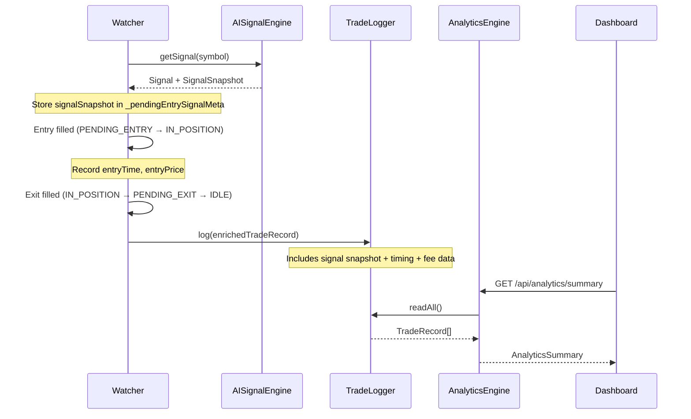

# Design Document: Trade Analytics Reporting

## Overview

This feature extends the trading bot with a comprehensive analytics layer that captures rich signal and trade data at every lifecycle stage, computes win-rate and performance metrics across multiple dimensions, exposes them via new API endpoints, and renders them in a dedicated Analytics tab on the existing Express dashboard.

The goal is to give the operator actionable insight into what is working (which regime, confidence band, time-of-day, direction) so they can tune the bot's parameters and improve win rate over time.

---

## Architecture

```mermaid
graph TD
    W[Watcher] -->|enriched TradeRecord| TL[TradeLogger]
    TL -->|persist| DB[(SQLite / JSON)]
    DB -->|readAll| AE[AnalyticsEngine]
    AE -->|computed reports| API[/api/analytics/*]
    API -->|JSON| UI[Dashboard Analytics Tab]

    W -->|signal snapshot| TL
    AIE[AISignalEngine] -->|SignalSnapshot| W
```

---

## Sequence Diagrams

### Trade Lifecycle with Analytics Capture



---

## Components and Interfaces

### Component 1: Extended TradeRecord

The existing `TradeRecord` is extended with signal-time and close-time fields. All new fields are optional so existing JSON/SQLite records remain readable.

**Interface**:
```typescript
interface TradeRecord {
  // ── Existing fields ──────────────────────────────────────────────
  id: string;
  timestamp: string;        // ISO 8601 — trade close time
  symbol: string;
  direction: 'long' | 'short';
  confidence: number;
  reasoning: string;
  fallback: boolean;
  entryPrice: number;
  exitPrice: number;
  pnl: number;              // realised PnL in USD (after fee deduction)
  sessionPnl: number;

  // ── New: trade metadata ──────────────────────────────────────────
  mode?: 'farm' | 'trade';          // bot mode at trade time
  entryTime?: string;               // ISO 8601 — when entry was filled
  exitTime?: string;                // ISO 8601 — when exit was filled (= timestamp)
  holdingTimeSecs?: number;         // exitTime - entryTime in seconds
  exitTrigger?: 'FARM_TP' | 'FARM_TIME' | 'FARM_EARLY_PROFIT' | 'SL' | 'TP' | 'FORCE' | 'EXTERNAL';

  // ── New: fee analysis ────────────────────────────────────────────
  grossPnl?: number;                // PnL before fees
  feePaid?: number;                 // total fee in USD (round-trip)
  wonBeforeFee?: boolean;           // grossPnl > 0 but pnl <= 0

  // ── New: signal snapshot (captured at signal time) ───────────────
  regime?: 'TREND_UP' | 'TREND_DOWN' | 'SIDEWAY';
  momentumScore?: number;           // 0–1 composite score
  ema9?: number;
  ema21?: number;
  rsi?: number;
  momentum3candles?: number;        // 3-candle price momentum %
  volSpike?: boolean;
  emaCrossUp?: boolean;
  emaCrossDown?: boolean;
  imbalance?: number;               // orderbook bid/ask ratio
  tradePressure?: number;           // buy/(buy+sell) ratio
  lsRatio?: number;                 // long/short ratio
  llmDirection?: 'long' | 'short' | 'skip';  // raw LLM output
  llmConfidence?: number;           // raw LLM confidence
  llmMatchesMomentum?: boolean;     // llmDirection matches momentumScore direction
}
```

**Responsibilities**:
- Single source of truth for all per-trade data
- Backward-compatible (new fields optional)
- Stored identically in both JSON and SQLite backends

---

### Component 2: AnalyticsEngine

Pure computation module — reads `TradeRecord[]` and produces structured reports. No I/O, fully testable.

**Interface**:
```typescript
interface WinRateBreakdown {
  total: number;
  wins: number;
  losses: number;
  winRate: number;          // 0–1
  avgPnl: number;
  totalPnl: number;
}

interface ConfidenceBucket {
  label: string;            // e.g. "0.6–0.7"
  min: number;
  max: number;
}

interface AnalyticsSummary {
  overall: WinRateBreakdown;
  byMode: Record<'farm' | 'trade', WinRateBreakdown>;
  byDirection: Record<'long' | 'short', WinRateBreakdown>;
  byRegime: Record<'TREND_UP' | 'TREND_DOWN' | 'SIDEWAY', WinRateBreakdown>;
  byConfidence: Array<ConfidenceBucket & WinRateBreakdown>;
  byHour: Array<{ hour: number; label: string } & WinRateBreakdown>;
  bestTrade: TradeRecord | null;
  worstTrade: TradeRecord | null;
  avgPnl: number;
  maxConsecWins: number;
  maxConsecLosses: number;
  currentStreak: { type: 'win' | 'loss'; count: number };
  signalQuality: {
    llmMatchesMomentumRate: number;   // % trades where LLM matched momentum direction
    fallbackRate: number;             // % trades using momentum fallback
    avgConfidence: number;
  };
  feeImpact: {
    totalFeePaid: number;
    tradesWonBeforeFee: number;       // count of fee-losers
    feeLoserRate: number;             // % of trades that won gross but lost net
  };
  holdingTime: {
    avgSecs: number;
    medianSecs: number;
    distribution: Array<{ bucket: string; count: number }>;  // farm mode only
  };
}

class AnalyticsEngine {
  compute(trades: TradeRecord[]): AnalyticsSummary;
  private _breakdown(trades: TradeRecord[]): WinRateBreakdown;
  private _streaks(trades: TradeRecord[]): { maxWins: number; maxLosses: number; current: { type: 'win' | 'loss'; count: number } };
  private _holdingDistribution(trades: TradeRecord[]): Array<{ bucket: string; count: number }>;
}
```

**Responsibilities**:
- All analytics computation in one place
- Stateless — same input always produces same output
- Handles missing/optional fields gracefully (older records without new fields)

---

### Component 3: Analytics API Routes

New Express routes mounted at `/api/analytics/*`.

**Interface**:
```typescript
// GET /api/analytics/summary
// Returns: AnalyticsSummary

// GET /api/analytics/trades
// Query params: ?mode=farm|trade&direction=long|short&regime=TREND_UP|...&limit=100&offset=0
// Returns: { trades: TradeRecord[], total: number }

// GET /api/analytics/signal-quality
// Returns: signalQuality section of AnalyticsSummary (fast path)

// GET /api/analytics/fee-impact
// Returns: feeImpact section of AnalyticsSummary (fast path)
```

**Responsibilities**:
- Thin HTTP layer — delegates all computation to AnalyticsEngine
- Caches summary for 30 seconds to avoid re-computing on every poll
- Supports filtered trade list for drill-down

---

### Component 4: Dashboard Analytics Tab

New tab in the existing inline HTML dashboard. Renders all reports using Chart.js (already loaded).

**Responsibilities**:
- Tab navigation alongside existing dashboard sections
- Polls `/api/analytics/summary` every 30 seconds
- Renders win-rate cards, bar charts, and tables
- No external dependencies beyond Chart.js (already in page)

---

## Data Models

### SQLite Schema Extension

```sql
-- New columns added to existing trades table via ALTER TABLE (migration on startup)
ALTER TABLE trades ADD COLUMN mode TEXT;
ALTER TABLE trades ADD COLUMN entry_time TEXT;
ALTER TABLE trades ADD COLUMN exit_time TEXT;
ALTER TABLE trades ADD COLUMN holding_time_secs REAL;
ALTER TABLE trades ADD COLUMN exit_trigger TEXT;
ALTER TABLE trades ADD COLUMN gross_pnl REAL;
ALTER TABLE trades ADD COLUMN fee_paid REAL;
ALTER TABLE trades ADD COLUMN won_before_fee INTEGER;
ALTER TABLE trades ADD COLUMN regime TEXT;
ALTER TABLE trades ADD COLUMN momentum_score REAL;
ALTER TABLE trades ADD COLUMN ema9 REAL;
ALTER TABLE trades ADD COLUMN ema21 REAL;
ALTER TABLE trades ADD COLUMN rsi REAL;
ALTER TABLE trades ADD COLUMN momentum_3candles REAL;
ALTER TABLE trades ADD COLUMN vol_spike INTEGER;
ALTER TABLE trades ADD COLUMN ema_cross_up INTEGER;
ALTER TABLE trades ADD COLUMN ema_cross_down INTEGER;
ALTER TABLE trades ADD COLUMN imbalance REAL;
ALTER TABLE trades ADD COLUMN trade_pressure REAL;
ALTER TABLE trades ADD COLUMN ls_ratio REAL;
ALTER TABLE trades ADD COLUMN llm_direction TEXT;
ALTER TABLE trades ADD COLUMN llm_confidence REAL;
ALTER TABLE trades ADD COLUMN llm_matches_momentum INTEGER;
```

**Validation Rules**:
- `mode` must be `'farm'` or `'trade'` when present
- `holdingTimeSecs` must be >= 0
- `grossPnl` = `pnl` + `feePaid` (enforced at write time)
- `wonBeforeFee` = `grossPnl > 0 && pnl <= 0`
- `llmMatchesMomentum` = `llmDirection` aligns with `momentumScore > 0.5` direction

### SignalSnapshot (captured in Watcher, passed to TradeLogger)

```typescript
interface SignalSnapshot {
  regime: 'TREND_UP' | 'TREND_DOWN' | 'SIDEWAY';
  momentumScore: number;
  ema9: number;
  ema21: number;
  rsi: number;
  momentum3candles: number;
  volSpike: boolean;
  emaCrossUp: boolean;
  emaCrossDown: boolean;
  imbalance: number;
  tradePressure: number;
  lsRatio: number;
  llmDirection: 'long' | 'short' | 'skip';
  llmConfidence: number;
  llmMatchesMomentum: boolean;
}
```

---

## Algorithmic Pseudocode

### Main Analytics Computation

```pascal
ALGORITHM compute(trades)
INPUT: trades — array of TradeRecord
OUTPUT: summary — AnalyticsSummary

BEGIN
  IF trades is empty THEN
    RETURN emptyAnalyticsSummary()
  END IF

  // Overall breakdown
  summary.overall ← _breakdown(trades)

  // By mode
  FOR each mode IN ['farm', 'trade'] DO
    filtered ← trades WHERE trade.mode = mode
    summary.byMode[mode] ← _breakdown(filtered)
  END FOR

  // By direction
  FOR each dir IN ['long', 'short'] DO
    filtered ← trades WHERE trade.direction = dir
    summary.byDirection[dir] ← _breakdown(filtered)
  END FOR

  // By regime
  FOR each regime IN ['TREND_UP', 'TREND_DOWN', 'SIDEWAY'] DO
    filtered ← trades WHERE trade.regime = regime
    summary.byRegime[regime] ← _breakdown(filtered)
  END FOR

  // By confidence bucket
  buckets ← [{0.5,0.6}, {0.6,0.7}, {0.7,0.8}, {0.8,1.0}]
  FOR each bucket IN buckets DO
    filtered ← trades WHERE bucket.min <= trade.confidence < bucket.max
    summary.byConfidence.push(_breakdown(filtered) + bucket)
  END FOR

  // By hour of day (UTC)
  FOR hour IN 0..23 DO
    filtered ← trades WHERE hour(trade.timestamp) = hour
    IF filtered is not empty THEN
      summary.byHour.push(_breakdown(filtered) + {hour})
    END IF
  END FOR

  // Best / worst
  summary.bestTrade  ← trades.maxBy(t => t.pnl)
  summary.worstTrade ← trades.minBy(t => t.pnl)
  summary.avgPnl     ← mean(trades.map(t => t.pnl))

  // Streaks
  streaks ← _streaks(trades)
  summary.maxConsecWins   ← streaks.maxWins
  summary.maxConsecLosses ← streaks.maxLosses
  summary.currentStreak   ← streaks.current

  // Signal quality (only trades with llmMatchesMomentum defined)
  llmTrades ← trades WHERE trade.llmMatchesMomentum IS NOT NULL
  summary.signalQuality.llmMatchesMomentumRate ← mean(llmTrades.map(t => t.llmMatchesMomentum ? 1 : 0))
  summary.signalQuality.fallbackRate ← mean(trades.map(t => t.fallback ? 1 : 0))
  summary.signalQuality.avgConfidence ← mean(trades.map(t => t.confidence))

  // Fee impact
  feeTrades ← trades WHERE trade.feePaid IS NOT NULL
  summary.feeImpact.totalFeePaid ← sum(feeTrades.map(t => t.feePaid))
  feeLoserTrades ← feeTrades WHERE trade.wonBeforeFee = true
  summary.feeImpact.tradesWonBeforeFee ← count(feeLoserTrades)
  summary.feeImpact.feeLoserRate ← count(feeLoserTrades) / count(feeTrades)

  // Holding time (farm mode)
  farmTrades ← trades WHERE trade.mode = 'farm' AND trade.holdingTimeSecs IS NOT NULL
  summary.holdingTime.avgSecs    ← mean(farmTrades.map(t => t.holdingTimeSecs))
  summary.holdingTime.medianSecs ← median(farmTrades.map(t => t.holdingTimeSecs))
  summary.holdingTime.distribution ← _holdingDistribution(farmTrades)

  RETURN summary
END
```

**Preconditions**:
- `trades` is a valid array (may be empty)
- Each `TradeRecord` has at minimum: `pnl`, `direction`, `confidence`, `timestamp`

**Postconditions**:
- All `winRate` values are in [0, 1]
- `bestTrade.pnl >= worstTrade.pnl` when both are non-null
- `maxConsecWins >= currentStreak.count` when `currentStreak.type = 'win'`

---

### Win Rate Breakdown Helper

```pascal
ALGORITHM _breakdown(trades)
INPUT: trades — filtered array of TradeRecord
OUTPUT: WinRateBreakdown

BEGIN
  IF trades is empty THEN
    RETURN { total:0, wins:0, losses:0, winRate:0, avgPnl:0, totalPnl:0 }
  END IF

  wins   ← count(trades WHERE trade.pnl > 0)
  losses ← count(trades WHERE trade.pnl <= 0)
  total  ← count(trades)

  ASSERT wins + losses = total

  RETURN {
    total,
    wins,
    losses,
    winRate: wins / total,
    avgPnl:  mean(trades.map(t => t.pnl)),
    totalPnl: sum(trades.map(t => t.pnl))
  }
END
```

**Loop Invariants**: N/A (no loops — uses functional aggregation)

---

### Streak Computation

```pascal
ALGORITHM _streaks(trades)
INPUT: trades — array of TradeRecord sorted by timestamp ascending
OUTPUT: { maxWins, maxLosses, current }

BEGIN
  // Sort ascending by timestamp
  sorted ← trades.sortBy(t => t.timestamp)

  maxWins   ← 0
  maxLosses ← 0
  curWins   ← 0
  curLosses ← 0

  FOR each trade IN sorted DO
    ASSERT curWins = 0 OR curLosses = 0   // only one streak active at a time

    IF trade.pnl > 0 THEN
      curWins   ← curWins + 1
      curLosses ← 0
      maxWins   ← max(maxWins, curWins)
    ELSE
      curLosses ← curLosses + 1
      curWins   ← 0
      maxLosses ← max(maxLosses, curLosses)
    END IF
  END FOR

  current ← IF curWins > 0
             THEN { type: 'win',  count: curWins }
             ELSE { type: 'loss', count: curLosses }

  RETURN { maxWins, maxLosses, current }
END
```

**Preconditions**: `trades` is non-empty

**Postconditions**:
- `maxWins >= 0`, `maxLosses >= 0`
- `current.count >= 0`
- `maxWins >= current.count` when `current.type = 'win'`

**Loop Invariants**:
- `curWins = 0 OR curLosses = 0` at start of each iteration
- `maxWins >= curWins` and `maxLosses >= curLosses` throughout

---

### Holding Time Distribution (Farm Mode)

```pascal
ALGORITHM _holdingDistribution(farmTrades)
INPUT: farmTrades — farm-mode trades with holdingTimeSecs defined
OUTPUT: array of { bucket: string, count: number }

BEGIN
  buckets ← [
    { label: '0–60s',   min: 0,   max: 60   },
    { label: '1–2min',  min: 60,  max: 120  },
    { label: '2–3min',  min: 120, max: 180  },
    { label: '3–4min',  min: 180, max: 240  },
    { label: '4–5min',  min: 240, max: 300  },
    { label: '5min+',   min: 300, max: ∞    }
  ]

  FOR each bucket IN buckets DO
    bucket.count ← count(farmTrades WHERE bucket.min <= t.holdingTimeSecs < bucket.max)
  END FOR

  RETURN buckets
END
```

---

## Key Functions with Formal Specifications

### TradeLogger.log() — extended

```typescript
log(record: TradeRecord): void
```

**Preconditions**:
- `record.id` is a valid UUID
- `record.pnl` is a finite number
- If `record.grossPnl` is defined: `record.grossPnl = record.pnl + (record.feePaid ?? 0)`
- If `record.wonBeforeFee` is defined: `record.wonBeforeFee = (record.grossPnl > 0 && record.pnl <= 0)`

**Postconditions**:
- Record is persisted to the configured backend (JSON or SQLite)
- All new optional fields are stored when present
- No exception thrown (errors are logged internally)

---

### TradeLogger.migrate() — new

```typescript
migrate(): void
```

**Preconditions**:
- SQLite backend is initialised
- Database connection is open

**Postconditions**:
- All new columns exist in the `trades` table
- Existing rows are unmodified (new columns default to NULL)
- Idempotent — safe to call on every startup

---

### AnalyticsEngine.compute()

```typescript
compute(trades: TradeRecord[]): AnalyticsSummary
```

**Preconditions**:
- `trades` is a valid array (may be empty)

**Postconditions**:
- Returns a complete `AnalyticsSummary` object
- All `winRate` values ∈ [0, 1]
- `overall.total = sum of all byMode totals` (for trades with mode defined)
- No mutations to input array

---

## Example Usage

```typescript
// 1. Watcher captures signal snapshot and enriches TradeRecord at close
const signalSnapshot: SignalSnapshot = {
  regime: signal.regime,
  momentumScore: signal.score,
  ema9: signal.ema9,
  ema21: signal.ema21,
  rsi: signal.rsi,
  momentum3candles: signal.momentum3candles,
  volSpike: signal.volSpike,
  emaCrossUp: signal.emaCrossUp,
  emaCrossDown: signal.emaCrossDown,
  imbalance: signal.imbalance,
  tradePressure: signal.tradePressure,
  lsRatio: signal.lsRatio,
  llmDirection: decision.direction,
  llmConfidence: decision.confidence,
  llmMatchesMomentum: decision.direction === (signal.score > 0.5 ? 'long' : 'short'),
};

const positionValue = Math.abs(position.size) * entryPrice;
const feePaid = positionValue * config.FEE_RATE_MAKER * 2;
const grossPnl = pnl + feePaid;

const record: TradeRecord = {
  id: crypto.randomUUID(),
  timestamp: new Date().toISOString(),
  symbol: this.symbol,
  direction: positionSide,
  confidence: signalSnapshot.llmConfidence,
  reasoning: reasoning,
  fallback: fallback,
  entryPrice: entryPrice,
  exitPrice: exitPrice,
  pnl: pnl,
  sessionPnl: this.sessionCurrentPnl,
  // New fields
  mode: config.MODE,
  entryTime: new Date(this.entryFilledAt!).toISOString(),
  exitTime: new Date().toISOString(),
  holdingTimeSecs: (Date.now() - this.entryFilledAt!) / 1000,
  exitTrigger: exitTrigger,
  grossPnl,
  feePaid,
  wonBeforeFee: grossPnl > 0 && pnl <= 0,
  ...signalSnapshot,
};
this.tradeLogger.log(record);

// 2. Dashboard polls analytics
// GET /api/analytics/summary → AnalyticsSummary
const summary = await fetch('/api/analytics/summary').then(r => r.json());
renderWinRateCards(summary.overall, summary.byMode);
renderRegimeChart(summary.byRegime);
renderConfidenceChart(summary.byConfidence);
```

---

## Correctness Properties

```typescript
// P1: Win rate is always in [0, 1]
∀ breakdown ∈ [summary.overall, ...Object.values(summary.byMode), ...]:
  0 <= breakdown.winRate && breakdown.winRate <= 1

// P2: wins + losses = total for every breakdown
∀ breakdown: breakdown.wins + breakdown.losses === breakdown.total

// P3: Best trade PnL >= worst trade PnL
summary.bestTrade !== null && summary.worstTrade !== null →
  summary.bestTrade.pnl >= summary.worstTrade.pnl

// P4: Streak invariant
summary.currentStreak.type === 'win' →
  summary.maxConsecWins >= summary.currentStreak.count

// P5: Fee relationship
∀ trade WHERE trade.feePaid !== undefined:
  Math.abs(trade.grossPnl - (trade.pnl + trade.feePaid)) < 0.0001

// P6: wonBeforeFee consistency
∀ trade WHERE trade.wonBeforeFee !== undefined:
  trade.wonBeforeFee === (trade.grossPnl > 0 && trade.pnl <= 0)

// P7: Holding time non-negative
∀ trade WHERE trade.holdingTimeSecs !== undefined:
  trade.holdingTimeSecs >= 0

// P8: LLM match consistency
∀ trade WHERE trade.llmMatchesMomentum !== undefined:
  trade.llmMatchesMomentum ===
    (trade.llmDirection === (trade.momentumScore > 0.5 ? 'long' : 'short'))

// P9: Analytics compute is pure (same input → same output)
compute(trades) deepEquals compute([...trades])

// P10: Empty input returns zero totals
compute([]).overall.total === 0 && compute([]).overall.winRate === 0
```

---

## Error Handling

### Missing optional fields (legacy records)

**Condition**: Older `TradeRecord` entries lack new fields (mode, regime, holdingTimeSecs, etc.)

**Response**: `AnalyticsEngine` treats missing fields as `undefined`; those records are excluded from breakdowns that require the missing field (e.g. a record without `regime` is excluded from `byRegime` but counted in `overall`).

**Recovery**: No action needed — graceful degradation.

---

### SQLite migration failure

**Condition**: `ALTER TABLE` fails (e.g. column already exists from a previous partial migration)

**Response**: Catch `SQLITE_ERROR: duplicate column name` and continue — idempotent migration.

**Recovery**: Log warning, continue startup normally.

---

### Analytics computation on large dataset

**Condition**: Thousands of trade records cause slow response

**Response**: 30-second server-side cache on `/api/analytics/summary`. Cache is invalidated when a new trade is logged.

**Recovery**: Stale cache served if recomputation takes > 5 seconds (timeout guard).

---

### JSON backend — missing new fields

**Condition**: JSON lines written before this feature lack new fields

**Response**: `JSON.parse` returns object without new keys; TypeScript optional fields handle this transparently.

**Recovery**: No action needed.

---

## Testing Strategy

### Unit Testing Approach

Test `AnalyticsEngine.compute()` with hand-crafted `TradeRecord` arrays:
- Empty array → all zeros
- Single win / single loss
- Mixed win/loss → correct win rate
- Streak detection: 3 wins then 2 losses → maxConsecWins=3, current={loss,2}
- Fee impact: trade with grossPnl=0.01, pnl=-0.005 → wonBeforeFee=true
- Confidence buckets: trades at 0.55, 0.65, 0.75, 0.85 → correct bucket assignment
- Hour bucketing: trades at 00:00, 12:00, 23:00 UTC

### Property-Based Testing Approach

**Property Test Library**: fast-check

```typescript
// Property: winRate always in [0,1]
fc.assert(fc.property(
  fc.array(tradeRecordArbitrary()),
  (trades) => {
    const s = engine.compute(trades);
    return s.overall.winRate >= 0 && s.overall.winRate <= 1;
  }
));

// Property: wins + losses = total
fc.assert(fc.property(
  fc.array(tradeRecordArbitrary()),
  (trades) => {
    const s = engine.compute(trades);
    return s.overall.wins + s.overall.losses === s.overall.total;
  }
));

// Property: compute is pure
fc.assert(fc.property(
  fc.array(tradeRecordArbitrary()),
  (trades) => {
    const copy = [...trades];
    return deepEqual(engine.compute(trades), engine.compute(copy));
  }
));
```

### Integration Testing Approach

- Mount analytics routes against a real `TradeLogger` (SQLite in-memory)
- Seed with known records, call `GET /api/analytics/summary`, assert response shape
- Test cache invalidation: log a new trade, verify summary updates within 30s

---

## Performance Considerations

- `AnalyticsEngine.compute()` is O(n) in number of trades — acceptable for expected volumes (< 10,000 trades)
- 30-second cache on summary endpoint prevents redundant recomputation during dashboard polling
- Cache invalidation is triggered by `TradeLogger.log()` via a simple callback/event
- No indexing needed for JSON backend at current scale; SQLite queries use existing `timestamp` ordering

---

## Security Considerations

- Analytics endpoints are behind the existing `_authMiddleware` (passcode-protected)
- No user-supplied input is passed to `AnalyticsEngine` — all data comes from the internal `TradeLogger`
- SQL injection not possible — all SQLite queries use parameterised statements

---

## Dependencies

- `better-sqlite3` — already in use for SQLite backend
- `Chart.js 4.4.0` — already loaded in dashboard HTML
- `fast-check` — for property-based tests (add to devDependencies if not present)
- No new runtime dependencies required
