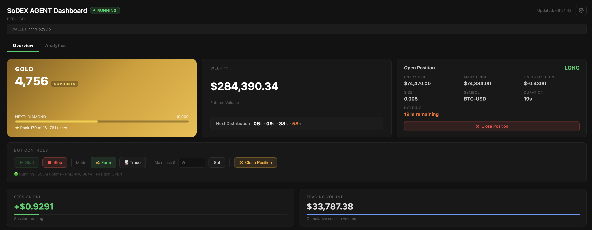
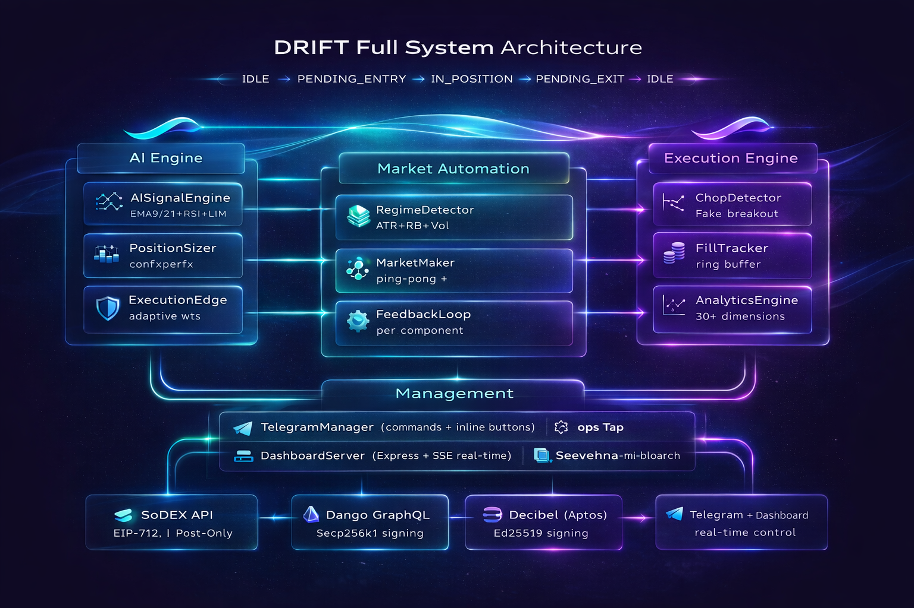

<div align="center">

<p align="center">
  
</p>

### Dynamic Risk-Informed Futures Trading

*AI-powered perpetual futures bot với adaptive learning, intelligent execution, và correlation hedging*

[](https://www.typescriptlang.org/)
[](https://nodejs.org/)
[](https://www.docker.com/)

</div>

---

DRIFT là multi-bot trading system cho perpetual futures, hỗ trợ 3 sàn: **SoDEX**, **Dango Exchange**, và **Decibel**. Hệ thống chạy nhiều bot song song với 3 chiến lược: **Farm Mode** (volume tối đa), **Trade Mode** (win rate tối đa), và **Hedge Bot** (correlation divergence).

## Dashboard

<p align="center">
  
</p>

## System Architecture

<p align="center">
  
</p>

---

## Ba chiến lược

### 1. Farm Mode — Tối đa hóa Volume

Thiết kế cho các DEX có volume incentive (SoPoints, rebate). Mục tiêu là **luôn luôn trade**, không bao giờ bỏ qua cơ hội.

**Signal pipeline (farm mode)**:
```
Signal từ AISignalEngine
  │
  ▼
[1] RegimeConfidenceThreshold  — SIDEWAY ≥ 0.45, TREND ≥ 0.35
  │
  ▼
[2] TradePressureGate          — skip nếu pressure=0 AND confidence < 0.55
  │
  ▼
[3] FallbackQualityGate        — skip nếu fallback=true AND confidence < 0.25
  │
  ▼
[4] FeeAwareEntryFilter        — skip nếu expectedEdge ≤ minRequiredMove × 1.5
  │
  ▼
[5] LLMMomentumAdjuster        — điều chỉnh effectiveConfidence (±10–20%)
  │
  ▼
[6] MinHoldTimeEnforcer        — tính dynamicMinHold từ ATR và fee
  │
  ▼
PositionSizer → placeEntryOrder
```

**Direction resolution** (không bao giờ skip):
- `pricePosition > 0.65` → SHORT (giá gần đỉnh range)
- `pricePosition < 0.35` → LONG (giá gần đáy range)
- Mid-range → dùng adjustedMomentumScore
- Fallback → alternate với lệnh trước (long ↔ short)

**Exit conditions** (theo thứ tự ưu tiên):
1. SL: `FARM_SL_PERCENT = 5%`
2. Dynamic TP (MM enabled): `max(spreadBps/10000 × price × 1.5, feeFloor)`, capped $2.0
3. Farm TP: `FARM_TP_USD = $0.5`
4. Early profit: hold ≥ 60s AND pnl ≥ fee × 1.2 (suppressed trong TREND regime)
5. Time exit: sau `dynamicMinHold` (120–480s), chờ thêm 30s nếu profitable

**Cooldown**: fixed 30s (`FARM_COOLDOWN_SECS`)

---

### 2. Trade Mode — Tối đa hóa Win Rate

Chỉ vào khi có edge rõ ràng. Không có time exit — để trade chạy đến TP hoặc SL.

**Signal pipeline (trade mode)**:
```
Signal từ AISignalEngine
  │
  ▼
[1] Regime check       — HIGH_VOLATILITY → skip nếu REGIME_HIGH_VOL_SKIP_ENTRY=true
  │
  ▼
[2] ChopDetector       — chopScore ≥ 0.55 → skip
  │
  ▼
[3] FakeBreakoutFilter — OB imbalance contradicts direction → skip
  │
  ▼
[4] Confidence gate    — confidence < MIN_CONFIDENCE (0.65) → skip
  │
  ▼
[5] 2-tick confirmation — phải confirm trong 60s window
  │
  ▼
PositionSizer → placeEntryOrder
```

**Exit**: SL 5% hoặc TP 5%. **Không có time exit**.

**Cooldown**: random `[COOLDOWN_MIN_MINS, COOLDOWN_MAX_MINS]` (mặc định 2–5 phút)

---

### 3. Hedge Bot — Correlation Divergence

Giao dịch **đồng thời 2 tài sản tương quan** (BTC + ETH) theo hướng ngược nhau. Một leg long, một leg short với cùng USD notional. Lợi nhuận đến từ sự phân kỳ tạm thời.

**State machine**:
```
IDLE → OPENING → WAITING_FILL → IN_PAIR → CLOSING → COOLDOWN
```

**Entry trigger**: Volume spike đồng thời trên cả 2 symbol + AI signal phân kỳ.

**Fill management** (one-action-per-tick):
- Case 1: 1 filled + 1 rejected → re-place lệnh bị reject ngay tick tiếp theo
- Case 2: 1 filled + 1 pending → chờ fill; timeout 30s → cancel pending → OPENING
- Case 3: 2 pending → chờ fill; timeout 30s → cancel cả 2 → OPENING

**Exit conditions**: profit target, max loss, mean reversion, hoặc holding period hết hạn.

---

## Kiến trúc tổng quan

```
bot.ts (Multi-Bot Manager)
  ├── BotManager                    # Quản lý nhiều bot song song
  │     ├── BotInstance (Farm/Trade)
  │     │     └── Watcher           # 5-state: IDLE→PENDING→IN_POSITION→EXITING→COOLDOWN
  │     │           ├── AISignalEngine      # EMA9/21, RSI, momentum, OB + regime
  │     │           ├── FarmSignalFilters   # 4-gate pipeline + LLM adjuster + MinHold
  │     │           ├── PositionSizer       # Dynamic sizing (confidence × performance)
  │     │           ├── MarketMaker         # Ping-pong + inventory + dynamic TP
  │     │           ├── ExecutionEdge       # Dynamic offset + spread guard + fill rate
  │     │           ├── ChopDetector        # Trade mode only
  │     │           ├── FakeBreakoutFilter  # Trade mode only
  │     │           └── Executor            # Post-Only maker orders
  │     │
  │     └── HedgeBot                # Correlation hedging bot
  │           ├── VolumeMonitor     # Dual-symbol volume spike detection
  │           ├── AISignalEngine ×2 # Một engine per symbol
  │           └── State Machine     # IDLE→OPENING→WAITING_FILL→IN_PAIR→CLOSING→COOLDOWN
  │
  ├── FeedbackLoop/                 # Adaptive signal weights
  │     ├── ComponentPerformanceTracker
  │     ├── AdaptiveWeightAdjuster
  │     ├── WeightStore
  │     └── ConfidenceCalibrator
  │
  ├── TelegramManager               # Commands + inline buttons
  ├── TradeLogger                   # JSON hoặc SQLite
  ├── DashboardServer               # Express + SSE real-time
  ├── ConfigStore                   # Runtime config override (70+ params)
  └── SessionManager                # Max loss, session state
```

---

## Farm/Trade Bot — State Machine Chi Tiết

```
                    ┌─────────────────────────────────────────────────────┐
                    │                    IDLE                             │
                    │  1. Dust check (ignore position < MIN_POS_USD)      │
                    │  2. Hour blocking (FARM_BLOCKED_HOURS)              │
                    │  3. Cancel stale orders → RETURN                    │
                    │  4. _retryEntry? → re-place → PENDING               │
                    │  5. Signal pipeline → PositionSizer → placeOrder    │
                    └──────────────────────┬──────────────────────────────┘
                                           │ order placed
                                           ▼
                    ┌─────────────────────────────────────────────────────┐
                    │                   PENDING                           │
                    │  • position detected → IN_POSITION                  │
                    │  • timeout → cancel (tick N) → check (tick N+1)     │
                    │  • confirmed cancel → save _retryEntry → IDLE       │
                    └──────────────────────┬──────────────────────────────┘
                                           │ fill confirmed
                                           ▼
                    ┌─────────────────────────────────────────────────────┐
                    │                 IN_POSITION                         │
                    │  Exit triggers (priority order):                    │
                    │  1. SL 5%                                           │
                    │  2. Dynamic TP (MM spread-based)                    │
                    │  3. Farm TP $0.5                                    │
                    │  4. Early profit (≥60s + fee×1.2)                  │
                    │  5. Time exit (dynamicMinHold + 30s grace)          │
                    └──────────────────────┬──────────────────────────────┘
                                           │ exit trigger fired
                                           ▼
                    ┌─────────────────────────────────────────────────────┐
                    │                   EXITING                           │
                    │  Case A: no pendingExit                             │
                    │    → cancel open orders → re-verify position        │
                    │    → dust check → skip if < MIN_POS_USD             │
                    │    → placeExitOrder → pendingExit                   │
                    │  Case B: pendingExit exists                         │
                    │    → position gone → _onExitFilled → COOLDOWN       │
                    │    → timeout 15s → cancel → retry Case A            │
                    └──────────────────────┬──────────────────────────────┘
                                           │ exit filled
                                           ▼
                    ┌─────────────────────────────────────────────────────┐
                    │                  COOLDOWN                           │
                    │  Farm: fixed 30s                                    │
                    │  Trade: random [COOLDOWN_MIN, COOLDOWN_MAX] mins    │
                    └──────────────────────┬──────────────────────────────┘
                                           │ cooldown expired
                                           └──────────────────► IDLE
```

**Strict tick isolation**: mỗi tick chỉ thực hiện đúng **một** action (place OR cancel OR wait) rồi return. Per-tick mutex (`_tickLock`) ngăn tick mới chạy khi tick cũ chưa xong.

---

## Hedge Bot — State Machine Chi Tiết

```
                    ┌─────────────────────────────────────────────────────┐
                    │                    IDLE                             │
                    │  • VolumeMonitor.sample() mỗi 15s                  │
                    │  • shouldEnter(): cả 2 symbol spike đồng thời?      │
                    │  • getSignal(A) + getSignal(B) song song            │
                    │  • assignDirections(scoreA, scoreB)                 │
                    │    → scoreA > scoreB: long A, short B               │
                    │    → scoreB > scoreA: long B, short A               │
                    │    → equal: skip                                    │
                    └──────────────────────┬──────────────────────────────┘
                                           │ entry triggered
                                           ▼
                    ┌─────────────────────────────────────────────────────┐
                    │                  OPENING                            │
                    │  Tick A: check open orders → cancel nếu có → RETURN │
                    │  Tick B: check existing positions (anti-double-trade)│
                    │    → legA filled? skip order A                      │
                    │    → legB filled? skip order B                      │
                    │    → place_limit_order(A) + place_limit_order(B)    │
                    │    → 1 leg fails → cancel successful leg → IDLE     │
                    └──────────────────────┬──────────────────────────────┘
                                           │ orders placed
                                           ▼
                    ┌─────────────────────────────────────────────────────┐
                    │               WAITING_FILL                          │
                    │  Mỗi tick: query positions + open orders            │
                    │                                                     │
                    │  ✅ Both filled → IN_PAIR                           │
                    │                                                     │
                    │  Case 1: filled A + rejected B (no pending)         │
                    │    → re-place B ngay tick này                       │
                    │                                                     │
                    │  Case 2: filled A + pending B                       │
                    │    → wait; timeout 30s → cancel B → OPENING         │
                    │                                                     │
                    │  Case 3: pending A + pending B                      │
                    │    → wait; timeout 30s → cancel A+B → OPENING       │
                    └──────────────────────┬──────────────────────────────┘
                                           │ both legs filled
                                           ▼
                    ┌─────────────────────────────────────────────────────┐
                    │                  IN_PAIR                            │
                    │  Mỗi tick (5s): update PnL, check exit conditions   │
                    │  Exit triggers:                                     │
                    │  • PROFIT_TARGET: combinedPnl ≥ profitTargetUsd     │
                    │  • MAX_LOSS: combinedPnl ≤ -maxLossUsd              │
                    │  • MEAN_REVERSION: ratio trở về equilibrium spread  │
                    │  • TIME_EXPIRY: elapsedSecs ≥ holdingPeriodSecs     │
                    └──────────────────────┬──────────────────────────────┘
                                           │ exit condition met
                                           ▼
                    ┌─────────────────────────────────────────────────────┐
                    │                  CLOSING                            │
                    │  Tick A: cancel open orders → RETURN                │
                    │  Tick B: query ACTUAL positions từ exchange          │
                    │    → close chỉ legs còn mở (tránh ghost close)      │
                    │    → poll flat confirmation (5 lần, 1s interval)    │
                    └──────────────────────┬──────────────────────────────┘
                                           │ both legs closed
                                           ▼
                    ┌─────────────────────────────────────────────────────┐
                    │                 COOLDOWN                            │
                    │  Chờ cooldownSecs → IDLE                            │
                    └─────────────────────────────────────────────────────┘
```

---

## AI Signal Engine

Fetch song song 4 nguồn dữ liệu:
- Orderbook depth (20 levels) — từ exchange adapter
- Recent trades (100 trades) — từ exchange adapter
- Binance 5m klines (30 candles) — EMA, RSI, momentum
- Binance top L/S position ratio (5m) — sentiment

**Momentum score** với adaptive weights (tự điều chỉnh mỗi 10 trades):

| Nguồn | Logic | Default weight |
|---|---|---|
| EMA9 vs EMA21 | EMA9 > EMA21 → bullish (0.65), ngược lại (0.35) | ~40% |
| RSI(14) | < 35 oversold (0.75), > 65 overbought (0.25), linear giữa | ~25% |
| 3-candle momentum | `(currentPrice - closes[-4]) / closes[-4] × 50 + 0.5` | ~20% |
| Orderbook imbalance | `(bidVol/askVol - 1) × 0.5 + 0.5` | ~15% |

**Candle pattern bonus**: EMA crossover hoặc hammer/shooting star → ±0.05

**SIDEWAY regime**: price position trong 10-candle range điều chỉnh score thêm ±0.08

**Cache**: 60s TTL. Invalidate sau khi place entry order.

**Fallback**: nếu Binance API lỗi → dùng SignalEngine cơ bản (OB + trades only)

---

## Farm Signal Cost Optimizer

6 bộ lọc/điều chỉnh để giảm trades có chi phí âm (fee > gross PnL):

| Filter | Điều kiện reject | Config key |
|---|---|---|
| RegimeConfidenceThreshold | SIDEWAY: conf < 0.45; TREND: conf < 0.35 | `FARM_SIDEWAY_MIN_CONFIDENCE`, `FARM_TREND_MIN_CONFIDENCE` |
| TradePressureGate | tradePressure=0 AND conf < 0.55 | `FARM_MIN_CONFIDENCE_PRESSURE_GATE` |
| FallbackQualityGate | fallback=true AND conf < 0.25 | `FARM_MIN_FALLBACK_CONFIDENCE` |
| FeeAwareEntryFilter | `\|score-0.5\|×2×atrPct ≤ FEE_RATE×2×1.5` | `FEE_RATE_MAKER` |
| LLMMomentumAdjuster | (không reject) boost ×1.1 hoặc penalty ×0.8 | — |
| MinHoldTimeEnforcer | (không reject) `feeBreakEvenSecs = (FEE×2/atrPct)×300` | `FARM_MIN_HOLD_SECS`, `FARM_MAX_HOLD_SECS` |

---

## Exchange Integration

| Sàn | Signing | Đặc điểm |
|---|---|---|
| SoDEX | EIP-712 typed data | Post-Only, 0.012% maker fee, SoPoints |
| Decibel | Ed25519 (Aptos) | Gas Station, per-order cancel |
| Dango | Secp256k1 + GraphQL | USD notional sizing |

**SoDEX quirks**: API trả về tất cả positions bất kể `?symbol=` query → filter client-side. Size âm = short → normalize `Math.abs()`.

---

## Cài đặt

```bash
npm install
cp .env.example .env
npm start
```

### Docker

```bash
cp .env.example .env
docker build -f Dockerfile -t drift:latest .
docker compose up -d
```

---

## Cấu hình `.env`

```env
# SoDEX
SODEX_API_KEY=...
SODEX_API_SECRET=0x...
SODEX_SUBACCOUNT=0x...

# Decibel
DECIBELS_PRIVATE_KEY=0x...
DECIBELS_NODE_API_KEY=...
DECIBELS_SUBACCOUNT=0x...

# Dango
DANGO_PRIVATE_KEY=0x...
DANGO_USER_ADDRESS=0x...

TELEGRAM_BOT_TOKEN=...
TELEGRAM_CHAT_ID=...

LLM_PROVIDER=openai
OPENAI_API_KEY=sk-...

TRADE_LOG_BACKEND=json
TRADE_LOG_PATH=/app/data/trades.json
DASHBOARD_PORT=3000
```

---

## Dashboard

Truy cập `http://localhost:3000`

- **Manager view**: tất cả bots, PnL tổng hợp, start/stop từng bot
- **Bot detail**: session PnL, volume, real-time console (SSE), trade history
- **Hedge bot**: hiển thị 2 legs đang mở (symbol, side, entry price, unrealized PnL, combined PnL)
- **Analytics tab**: win rate, signal quality, fee impact, regime performance, filter skip stats, effective confidence stats, dynamic min hold stats
- **Bot Settings**: chỉnh 70+ config params runtime không cần restart

---

## Telegram commands

| Command | Mô tả |
|---|---|
| `/start_bot` | Bắt đầu session |
| `/stop_bot` | Dừng bot |
| `/status` | Trạng thái, uptime, PnL |
| `/check` | Position đang mở |
| `/set_mode farm\|trade` | Đổi mode |
| `/set_max_loss <usd>` | Giới hạn lỗ session |

---

## Cấu trúc thư mục

```
src/
├── bot.ts                    # Bootstrap, multi-bot manager, graceful shutdown
├── config.ts                 # 70+ tham số mặc định
├── adapters/
│   ├── ExchangeAdapter.ts    # Interface chung
│   ├── sodex_adapter.ts      # SoDEX (EIP-712 signing)
│   ├── decibel_adapter.ts    # Decibel (Aptos Ed25519)
│   └── dango_adapter.ts      # Dango (Secp256k1 + GraphQL)
├── bot/
│   ├── BotManager.ts         # Quản lý nhiều bot
│   ├── BotInstance.ts        # Farm/Trade bot wrapper
│   ├── HedgeBot.ts           # Correlation hedging bot (6-state machine)
│   ├── VolumeMonitor.ts      # Dual-symbol volume spike detection
│   └── hedgeBotHelpers.ts    # assignDirections, evaluateExitConditions
├── modules/
│   ├── Watcher.ts            # 5-state machine chính
│   ├── FarmSignalFilters.ts  # 4-gate pipeline + LLM adjuster + MinHold
│   ├── Executor.ts           # Đặt/hủy lệnh (Post-Only + IOC)
│   ├── ExecutionEdge.ts      # Dynamic offset + spread guard
│   ├── FillTracker.ts        # Fill rate ring buffer (20 orders)
│   ├── PositionSizer.ts      # Dynamic sizing
│   ├── MarketMaker.ts        # Ping-pong + inventory + dynamic TP
│   ├── RiskManager.ts        # TP/SL check
│   └── SessionManager.ts     # Max loss, session state
├── ai/
│   ├── AISignalEngine.ts     # Signal engine chính (EMA/RSI/momentum/OB)
│   ├── RegimeDetector.ts     # ATR + BB + volume → SIDEWAY/TREND/HIGH_VOL
│   ├── ChopDetector.ts       # Flip rate + momentum neutrality + BB compression
│   ├── FakeBreakoutFilter.ts # Volume + OB imbalance contradiction check
│   ├── AnalyticsEngine.ts    # 30+ dimensions per trade
│   ├── TradeLogger.ts        # JSON hoặc SQLite
│   └── FeedbackLoop/
│       ├── WeightStore.ts
│       ├── ComponentPerformanceTracker.ts
│       ├── AdaptiveWeightAdjuster.ts
│       └── ConfidenceCalibrator.ts
├── config/
│   ├── ConfigStore.ts        # Runtime config override
│   └── validateOverrides.ts  # 41+ validation rules
└── dashboard/
    ├── server.ts             # Express dashboard + SSE
    └── views/                # EJS templates
```

---

> **Cảnh báo**: Phần mềm này chỉ dành cho mục đích nghiên cứu và giáo dục. Trading cryptocurrency có rủi ro cao. Không commit file `.env` lên git.

---

<div align="center">

**Made with ❤️ for the DeFi community**

*DRIFT — Where intelligent execution meets adaptive learning*

</div>
