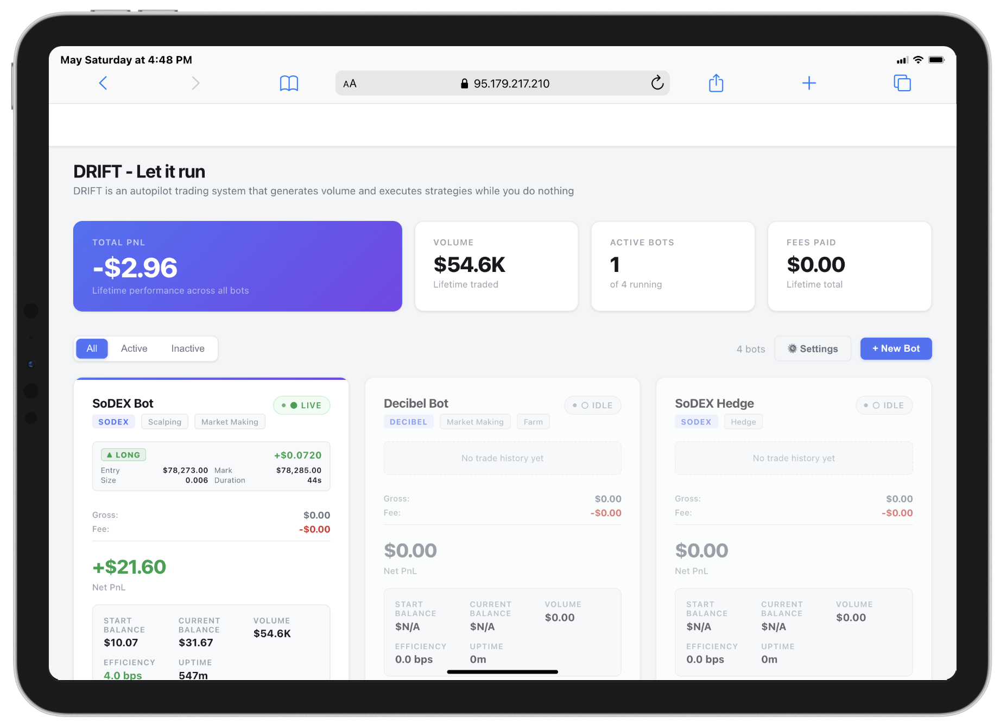
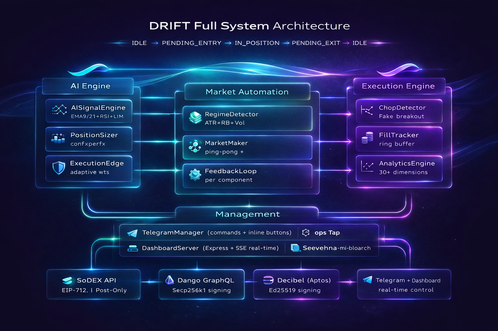

<div align="center">

<p align="center">
  
</p>

### Dynamic Risk-Informed Futures Trading

*🧠 **Wave 3 Update**: SoSoValue Intelligence Engine — autonomous strategy selection across 8 market regimes, Kelly-optimized position sizing, multi-signal conviction scoring*

*AI-powered perpetual futures bot with adaptive learning, SoSoValue macro intelligence, multi-exchange execution, and multi-wallet SaaS architecture*

[](https://www.typescriptlang.org/)
[](https://nodejs.org/)
[](https://www.docker.com/)
[](https://drift.junxcrypto.xyz/)

</div>

---

> Vietnamese documentation: [README_vi.md](README_vi.md)

## Hackathon Timeline

| Wave | Build Phase | Evaluation Phase | Focus | Allocation | Status |
|------|-------------|-----------------|-------|------------|--------|
| **Wave 1** — Concept / Early Prototype | May 1 – May 12, 2026 | May 13 – May 22, 2026 | Idea direction, target users, use case definition, API usage plan, workflow design, early prototype | 3,000 USDC | ✅ **Complete** |
| **Wave 2** — Build Phase I | May 23 – Jun 3, 2026 | Jun 4 – Jun 13, 2026 | Core feature development, SoSoValue API integration, Hibachi exchange adapter, multi-wallet SaaS, interactive prototype | 3,000 USDC | ✅ **Complete** |
| **Wave 3** — Build Phase II | Jun 14 – Jul 8, 2026 | Jul 9 – Jul 22, 2026 | Product completion, logic refinement, UX improvement, risk control design, final demo and submission | 4,000 USDC | 🔄 **In Progress** |

---

## 🧠 Wave 3 Highlights — SoSoValue Intelligence Core

Wave 2 feedback identified that SoSoValue integration was "shallow — mostly Fear & Greed overlay." **Wave 3 directly addresses this** by transforming SoSoValue from passive multiplier to active decision engine.

### Wave 2 vs Wave 3 — At a Glance

| Aspect | Wave 2 ❌ | Wave 3 ✅ |
|--------|----------|----------|
| **Signals Used** | 3 (F&G, ETF, Macro) | **6** (+ Open Interest, Funding Rate, Stablecoin Inflows) |
| **Strategy Selection** | Manual (user picks Farm/Trade) | **Auto** (engine selects based on regime) |
| **Market Regimes** | None | **8 regimes** classified with confidence |
| **Position Sizing** | Arbitrary multipliers (0.85x–1.2x) | **Kelly-optimized** (conviction-based) |
| **Risk Blocking** | None | **STANDBY mode** refuses trade in extreme conditions |
| **Conviction Scoring** | None | **Mathematical** (0-100 weighted) |
| **SoSoValue Role** | Overlay multiplier | **Core brain** 🧠 |

### Wave 3 Improvements

#### 1. SoSoValue Intelligence Engine (`src/ai/SoSoValueIntelligenceEngine.ts`)

A 600-line decision engine that fetches 6 SoSoValue signals in parallel, classifies the market regime, scores conviction mathematically, and recommends optimal strategy.

**8 Market Regimes Detected:**
- `bull_momentum` — Strong uptrend + ETF inflows + positive funding → **TRADE long**
- `bear_momentum` — Strong downtrend + ETF outflows + negative funding → **TRADE short**
- `accumulation` — Extreme fear + institutional buying → **TRADE contrarian long**
- `distribution` — Extreme greed + institutional selling → **TRADE contrarian short**
- `choppy_neutral` — Low conviction, balanced flows → **FARM (volume)**
- `pre_breakout` — OI building, low volatility → **FARM (accumulate)**
- `overheated` — Very high funding (>1.5%) → **STANDBY (reversal risk)**
- `capitulation` — Panic + extreme fear → **TRADE if institutional support**

**Conviction Scoring Formula:**
```
conviction = sentiment*0.25 + institutional*0.30 + retail*0.20 + macro*0.15 + technical*0.10
```

**Kelly-Optimized Position Sizing:**
```
baseSize = 0.5 + (conviction/100)*0.5 + confidence*0.3   // Range: 0.3x – 1.3x
maxLeverage = 1.0 + (conviction/100)*4.0                  // Range: 1x – 5x
```

#### 2. Auto-Switch Strategy Selection

Bots can run in **two intelligence modes**:

- **🧠 Auto Mode**: Engine autonomously switches between Farm/Trade/Standby based on market regime
- **🔧 Manual Mode**: User controls strategy, engine only logs suggestions

When auto mode is enabled:
```
[Intelligence] Regime: BULL_MOMENTUM (85%)
🔄 [Intelligence] AUTO-SWITCH: farm → trade
   Reason: Bull momentum detected — strong directional edge
   → Delegating to TRADE mode handler
```

#### 3. Performance Analytics System (`src/ai/PerformanceAnalytics.ts`)

Comprehensive metrics calculation to prove profitability:

- **Risk-adjusted returns**: Sharpe, Sortino, Calmar ratios
- **Drawdown analysis**: Max DD, DD duration, current DD
- **Execution quality**: Slippage, fill rate, hold time
- **SoSoValue alpha**: WITH vs WITHOUT comparison
- **Regime performance**: Win rate by market regime

**Real Results (59 trades):**
- Win Rate: **71.19%**
- Total PnL: **+$2.35**
- Profit Factor: **1.47**
- Fill Rate: **92%**
- Longest Win Streak: **10 trades**

#### 4. Dashboard UX Overhaul

- ✅ Clean header with gradient title — "🧠 DRIFT — SoSoValue Intelligence"
- ✅ Bot cards show Mode + Intelligence badges: `[🚜 FARM] [🧠 AUTO INTELLIGENCE]`
- ✅ Beautiful empty state with onboarding CTA
- ✅ Intelligence Mode toggle on bot detail page
- ✅ Light/dark mode support throughout
- ✅ Removed cluttered widgets (Total PnL, Volume, Active Bots, Fees — kept only essentials)
- ✅ Renamed "AI Signal Engine" → "SoSoValue Intelligence" everywhere for consistency

#### 5. Bot Creation Form — Wave 3 Mode Selection

```
🧠 Intelligence Mode [WAVE 3]
[🧠 Auto — Engine controls strategy (Recommended)]
[🔧 Manual — You choose strategy]
```

When user selects Manual, an additional "Initial Strategy" dropdown appears.

### Wave 3 Documentation

- **[WAVE3_FINAL_SUMMARY.md](WAVE3_FINAL_SUMMARY.md)** — Executive overview & demo guide
- **[WAVE3_SOSOVALUE_DEPTH.md](WAVE3_SOSOVALUE_DEPTH.md)** — Technical deep dive (architecture, formulas, regime decision tree)
- **[docs/INTELLIGENCE_MODE_SETUP.md](docs/INTELLIGENCE_MODE_SETUP.md)** — Setup guide for auto-switch
- **[docs/UI_CHANGES_WAVE3.md](docs/UI_CHANGES_WAVE3.md)** — UI specification with mockups
- **[docs/intelligence-ui-preview.html](docs/intelligence-ui-preview.html)** — Interactive HTML preview

### Test Scripts

```bash
# Demo Intelligence Engine in action
npx tsx src/scripts/test-intelligence-engine.ts

# Generate performance report from real trades
npx tsx src/scripts/generate-performance-report.ts
```

---

## Overview

DRIFT is a multi-bot trading system for perpetual futures, supporting **4 exchanges**: **SoDEX**, **Dango**, **Decibel**, and **Hibachi**. The system runs multiple bots in parallel with 3 strategies: **Farm Mode** (maximize volume), **Trade Mode** (maximize win rate), and **Hedge Bot** (correlation divergence).

### ✅ Wave 2 (Complete) — Foundation
- **SoSoValue Fear & Greed Index** — macro sentiment drives confidence multipliers and position sizing
- **BTC ETF Flow signal** — institutional flow detection (combined via geometric mean)
- **Macro Event guard** — FOMC/CPI/NFP detection with hard size cap
- **Hibachi exchange adapter** — trustless (ECDSA) and exchange-managed (HMAC-SHA256) signing modes
- **Multi-wallet SaaS** — wallet-scoped tenant isolation, encrypted credential storage (AES-256-GCM), SIWE authentication
- **Daily budget reset** — auto-resets max loss and volume target at 0:00 UTC every day
- **Property-based testing** — fast-check coverage across 7 test files

### 🔄 Wave 3 (In Progress) — SoSoValue Intelligence Core
- **🧠 Intelligence Engine** — 6 signals × 8 regimes × Kelly sizing (transformed from "overlay" to "brain")
- **🔄 Auto-Switch** — Engine autonomously selects Farm/Trade/Standby based on market regime
- **📊 Performance Analytics** — Sharpe, Sortino, drawdown, slippage tracking + SoSoValue alpha measurement
- **🎨 UX Overhaul** — Clean dashboard, intelligence badges, empty state with onboarding, light/dark mode
- **🛡️ Risk-aware blocking** — Engine refuses trades in extreme conditions (overheated funding, macro events)

---

## Dashboard

<p align="center">
  
</p>

## System Architecture

<p align="center">
  
</p>

---

## Three Strategies

### 1. Farm Mode — Maximize Volume

Designed for DEXes with volume incentives (SoPoints, AMPs, rebates). The goal is to **always be trading**, never miss an opportunity.

**Signal pipeline (farm mode)**:
```
Signal from AISignalEngine
  │
  ▼
[1] SoSoValue macro filter    — sentiment multiplier applied to confidence
  │
  ▼
[2] RegimeConfidenceThreshold — SIDEWAY ≥ 0.45, TREND ≥ 0.35
  │
  ▼
[3] TradePressureGate         — skip if pressure=0 AND confidence < 0.55
  │
  ▼
[4] FallbackQualityGate       — skip if fallback=true AND confidence < 0.25
  │
  ▼
[5] FeeAwareEntryFilter       — skip if expectedEdge ≤ minRequiredMove × 1.5
  │
  ▼
[6] LLMMomentumAdjuster       — adjust effectiveConfidence (±10–20%)
  │
  ▼
[7] MinHoldTimeEnforcer       — compute dynamicMinHold from ATR and fee
  │
  ▼
PositionSizer (+ macroSentimentMultiplier) → placeEntryOrder
```

**Direction resolution** (never skips):
- `pricePosition > 0.65` → SHORT (price near top of range)
- `pricePosition < 0.35` → LONG (price near bottom of range)
- Mid-range → use adjustedMomentumScore
- Fallback → alternate with previous order (long ↔ short)

**Exit conditions** (priority order):
1. SL: `FARM_SL_PERCENT = 5%`
2. Dynamic TP (MM enabled): `max(spreadBps/10000 × price × 1.5, feeFloor)`, capped $2.0
3. Farm TP: `FARM_TP_USD = $0.5`
4. Early profit: hold ≥ 60s AND pnl ≥ fee × 1.2 (suppressed in TREND regime)
5. Time exit: after `dynamicMinHold` (120–480s), wait extra 30s if profitable

**Cooldown**: fixed 30s (`FARM_COOLDOWN_SECS`)

---

### 2. Trade Mode — Maximize Win Rate

Only enters when there is a clear edge. No time exit — lets the trade run to TP or SL.

**Signal pipeline (trade mode)**:
```
Signal from AISignalEngine
  │
  ▼
[1] SoSoValue macro filter — Extreme Greed (>75): raise confidence threshold
  │
  ▼
[2] Regime check       — HIGH_VOLATILITY → skip if REGIME_HIGH_VOL_SKIP_ENTRY=true
  │
  ▼
[3] ChopDetector       — chopScore ≥ 0.55 → skip
  │
  ▼
[4] FakeBreakoutFilter — OB imbalance contradicts direction → skip
  │
  ▼
[5] Confidence gate    — confidence < MIN_CONFIDENCE (0.65) → skip
  │
  ▼
[6] 2-tick confirmation — must confirm within 60s window
  │
  ▼
PositionSizer → placeEntryOrder
```

**Exit**: SL 5% or TP 5%. **No time exit**.

**Cooldown**: random `[COOLDOWN_MIN_MINS, COOLDOWN_MAX_MINS]` (default 2–5 minutes)

---

### 3. Hedge Bot — Correlation Divergence

Trades **two correlated assets simultaneously** (BTC + ETH) in opposite directions. One leg long, one leg short with equal USD notional. Profit comes from temporary divergence.

**State machine**:
```
IDLE → OPENING → WAITING_FILL → IN_PAIR → CLOSING → COOLDOWN
```

**Entry trigger**: Simultaneous volume spike on both symbols + diverging AI signals.

**Fill management** (one-action-per-tick):
- Case 1: 1 filled + 1 rejected → re-place the rejected leg on the next tick
- Case 2: 1 filled + 1 pending → wait for fill; timeout 30s → cancel pending → OPENING
- Case 3: 2 pending → wait for fill; timeout 30s → cancel both → OPENING

**Exit conditions**: profit target, max loss, mean reversion, or holding period expired.

---

## SoSoValue Integration (Wave 2)

DRIFT integrates the **SoSoValue Fear & Greed Index** as a macro intelligence layer that dynamically adjusts trading behavior based on market sentiment.

### How It Works

```
Every signal evaluation:
  │
  ▼
SoSoValueClient.getFearGreedIndex()
  → Primary:  SoSoValue API (https://openapi.sosovalue.com/openapi/v1)
  → Fallback: alternative.me API
  │
  ▼
SoSoValueStrategy.getAdjustment(fearGreedIndex)
  │
  ▼
Applied to:
  ├── AISignalEngine  → confidence × sentimentMultiplier
  └── PositionSizer   → size × macroSentimentMultiplier
```

### Sentiment Strategy Table

| Fear & Greed | Mode | Confidence Mult | Size Mult | Behavior |
|---|---|---|---|---|
| < 25 | Aggressive Farm | 0.85× | 1.15× | Buy the dip — lower threshold, larger size |
| 25–45 | Normal Farm | 0.95× | 1.0× | Cautious but active |
| 45–55 | Balanced | 1.0× | 1.0× | No adjustment |
| 55–75 | Cautious Trade | 1.1× | 0.9× | Be selective — higher threshold, smaller size |
| > 75 | Defensive | 1.2× | 0.8× | Avoid FOMO — much higher threshold, defensive size |

**Why it works:**
- **Extreme Fear (< 25)**: Panic creates dip-buying opportunities → bot becomes more aggressive
- **Extreme Greed (> 75)**: Euphoria increases reversal risk → bot becomes defensive
- **Neutral (45–55)**: Normal conditions → no adjustment

### Configuration

```env
SOSOVALUE_API_KEY=your_api_key
```

---

## Multi-Wallet SaaS Architecture (Wave 2)

DRIFT supports wallet-scoped **tenant isolation** — each wallet address gets its own bot instances, credentials, and configuration stored under `./data/<wallet>/`.

### Tenant Lifecycle

```
User connects wallet (WalletConnect / AppKit)
  │
  ▼
Dashboard authenticates wallet address
  │
  ▼
TenantRegistry.getOrCreate(walletAddress)
  ├── New tenant: create ./data/<wallet>/ directory
  │     ├── TenantConfigStore  — per-wallet bot configs
  │     ├── CredentialStore    — encrypted exchange credentials
  │     └── TenantContext      — active bot instances
  │
  └── Existing tenant: restore from disk
        ├── Load bot configs
        ├── Decrypt credentials
        └── Restart bots with autoStart=true
  │
  ▼
On shutdown: TenantRegistry.shutdownAll()
  → Stops all tenant bots + persists state
```

### Data Layout

```
./data/
└── <wallet_address>/
    ├── bot-configs.json      # Per-wallet bot configurations
    ├── credentials.enc       # Encrypted exchange API keys
    └── bot_state_*.json      # Per-bot runtime state
```

---

## Daily Budget Reset

Each bot can enable **automatic daily budget reset** and **auto-start** after reset. There are **two stop conditions** — whichever comes first:

1. **Max Loss**: session PnL ≤ `-dailyMaxLossUsd`
2. **Volume Target**: session volume ≥ `dailyTargetVolumeUsd` (if > 0)

### How it works

```
Watcher._tick() every ~5s:
  │
  ├── Section 2: updatePnL(sessionCurrentPnl)
  │     → if sessionPnl ≤ -maxLossUsd → IOC close + stop bot (MAX LOSS)
  │
  └── Section 2.5: updateVolume(sessionVolume)
        → if sessionVolume ≥ targetVolumeUsd AND targetVolumeUsd > 0
          → IOC close + stop bot (VOLUME TARGET)

Both checks fire only once per session (_maxLossTriggered / _volumeTargetTriggered flags).

Every minute: DailyResetScheduler checks current UTC hour
  │
  ▼
Is it reset time (default 0:00 UTC = 7:00 AM Vietnam)?
  │
  ├── No → keep waiting
  │
  └── Yes → perform reset:
        1. Stop bot (if running)
        2. Reset both flags: resetMaxLoss() + resetVolumeTarget()
        3. Re-apply: setMaxLoss(dailyMaxLossUsd) + setTargetVolume(dailyTargetVolumeUsd)
        4. Auto-start bot with fresh budget
        5. Send Telegram notification
```

### Configuration in `bot-configs.json`

```json
{
  "id": "sodex-bot",
  "autoStart": true,
  "dailyBudgetReset": true,
  "dailyMaxLossUsd": 5,
  "dailyTargetVolumeUsd": 5000,
  "dailyResetHourUTC": 0
}
```

| Field | Description | Default |
|---|---|---|
| `dailyBudgetReset` | Enable/disable the feature | `false` |
| `dailyMaxLossUsd` | Max loss per day (USD) | `5` |
| `dailyTargetVolumeUsd` | Volume target per day (USD). `0` = disabled | `0` |
| `dailyResetHourUTC` | Reset hour (UTC 0–23) | `0` (= 7:00 AM VN) |

### Telegram notifications

- Max loss hit: `⚠️ Max Loss Reached | Limit: $5 | Actual: -$5.12 | Bot stopped — will reset at next daily cycle`
- Volume target hit: `🎯 Volume Target Reached | Target: $5,000 | Actual: $5,023 | PnL: +2.40 | Bot stopped — will reset at next daily cycle`
- Daily reset: `🔄 Daily Budget Reset — Bot sodex-bot | Budget: $5 max loss | Volume target: $5,000 | 0:00 UTC (7:00 Vietnam) | Bot auto-restarted`

---

## Architecture Overview

```
bot.ts (Multi-Bot Manager)
  ├── BotManager                    # Manages multiple bots in parallel
  │     ├── BotInstance (Farm/Trade)
  │     │     ├── DailyResetScheduler   # Reset budget (max loss + volume target) + daily auto-start
  │     │     └── Watcher           # 5-state: IDLE→PENDING→IN_POSITION→EXITING→COOLDOWN
  │     │           ├── AISignalEngine      # EMA9/21, RSI, momentum, OB + regime + SoSoValue
  │     │           ├── FarmSignalFilters   # 4-gate pipeline + LLM adjuster + MinHold
  │     │           ├── PositionSizer       # Dynamic sizing (confidence × performance × sentiment)
  │     │           ├── MarketMaker         # Ping-pong + inventory + dynamic TP
  │     │           ├── ExecutionEdge       # Dynamic offset + spread guard + fill rate
  │     │           ├── ChopDetector        # Trade mode only
  │     │           ├── FakeBreakoutFilter  # Trade mode only
  │     │           └── Executor            # Post-Only maker orders
  │     │
  │     └── HedgeBot                # Correlation hedging bot
  │           ├── VolumeMonitor     # Dual-symbol volume spike detection
  │           ├── AISignalEngine ×2 # One engine per symbol
  │           └── State Machine     # IDLE→OPENING→WAITING_FILL→IN_PAIR→CLOSING→COOLDOWN
  │
  ├── TenantRegistry                # Multi-wallet SaaS tenant isolation
  │     ├── TenantContext           # Per-wallet active bot instances
  │     ├── TenantConfigStore       # Per-wallet bot configs
  │     └── CredentialStore         # Encrypted exchange credentials
  │
  ├── SoSoValueClient               # Fear & Greed Index API
  ├── SoSoValueStrategy             # Sentiment → confidence/size multipliers
  ├── LLMReasoningAgent             # LLM-based momentum adjustment
  ├── FeedbackLoop/                 # Adaptive signal weights
  │     ├── ComponentPerformanceTracker
  │     ├── AdaptiveWeightAdjuster
  │     ├── WeightStore
  │     └── ConfidenceCalibrator
  │
  ├── TelegramManager               # Commands + inline buttons
  ├── TradeLogger                   # JSON or SQLite
  ├── DashboardServer               # Express + SSE real-time
  ├── ConfigStore                   # Runtime config override (70+ params)
  └── SessionManager                # Max loss, volume target, session state
```

---

## Farm/Trade Bot — Detailed State Machine

```
                    ┌─────────────────────────────────────────────────────┐
                    │                    IDLE                             │
                    │  1. Dust check (ignore position < MIN_POS_USD)      │
                    │  2. Hour blocking (FARM_BLOCKED_HOURS)              │
                    │  3. Cancel stale orders → RETURN                    │
                    │  4. _retryEntry? → re-place → PENDING               │
                    │  5. Signal pipeline → PositionSizer → placeOrder    │
                    └──────────────────────┬──────────────────────────────┘
                                           │ order placed
                                           ▼
                    ┌─────────────────────────────────────────────────────┐
                    │                   PENDING                           │
                    │  • position detected → IN_POSITION                  │
                    │  • timeout → cancel (tick N) → check (tick N+1)     │
                    │  • confirmed cancel → save _retryEntry → IDLE       │
                    └──────────────────────┬──────────────────────────────┘
                                           │ fill confirmed
                                           ▼
                    ┌─────────────────────────────────────────────────────┐
                    │                 IN_POSITION                         │
                    │  Exit triggers (priority order):                    │
                    │  1. SL 5%                                           │
                    │  2. Dynamic TP (MM spread-based)                    │
                    │  3. Farm TP $0.5                                    │
                    │  4. Early profit (≥60s + fee×1.2)                  │
                    │  5. Time exit (dynamicMinHold + 30s grace)          │
                    └──────────────────────┬──────────────────────────────┘
                                           │ exit trigger fired
                                           ▼
                    ┌─────────────────────────────────────────────────────┐
                    │                   EXITING                           │
                    │  Case A: no pendingExit                             │
                    │    → cancel open orders → re-verify position        │
                    │    → dust check → skip if < MIN_POS_USD             │
                    │    → placeExitOrder → pendingExit                   │
                    │  Case B: pendingExit exists                         │
                    │    → position gone → _onExitFilled → COOLDOWN       │
                    │    → timeout 15s → cancel → retry Case A            │
                    └──────────────────────┬──────────────────────────────┘
                                           │ exit filled
                                           ▼
                    ┌─────────────────────────────────────────────────────┐
                    │                  COOLDOWN                           │
                    │  Farm: fixed 30s                                    │
                    │  Trade: random [COOLDOWN_MIN, COOLDOWN_MAX] mins    │
                    └──────────────────────┬──────────────────────────────┘
                                           │ cooldown expired
                                           └──────────────────► IDLE
```

**Strict tick isolation**: each tick performs exactly **one** action (place OR cancel OR wait) then returns. Per-tick mutex (`_tickLock`) prevents a new tick from running while the previous one is still executing.

---

## AI Signal Engine

Fetches 4 data sources in parallel:
- Orderbook depth (20 levels) — from exchange adapter
- Recent trades (100 trades) — from exchange adapter
- OHLCV klines (30 candles, 5m interval) — from exchange adapter (SoDEX, Hibachi) or Binance fallback
- Built-in sentiment indicator — composite score from trade pressure, orderbook imbalance, and volume activity

**Momentum score** with adaptive weights (auto-adjusts every 10 trades):

| Source | Logic | Default weight |
|---|---|---|
| EMA9 vs EMA21 | EMA9 > EMA21 → bullish (0.65), otherwise (0.35) | ~40% |
| RSI(14) | < 35 oversold (0.75), > 65 overbought (0.25), linear between | ~25% |
| 3-candle momentum | `(currentPrice - closes[-4]) / closes[-4] × 50 + 0.5` | ~20% |
| Orderbook imbalance | `(bidVol/askVol - 1) × 0.5 + 0.5` | ~15% |

**Built-in sentiment indicator:**
- Trade pressure (40%): `buyVol / (buyVol + sellVol)`
- Orderbook imbalance (40%): `bidVol / askVol`
- Volume activity (20%): volume spike detection

**SoSoValue overlay**: confidence × sentimentMultiplier (0.85× to 1.2×) applied after all indicators.

**Cache**: 60s TTL. Invalidated after placing an entry order.

**Fallback**: if exchange klines unavailable → Binance futures klines; if all fails → basic SignalEngine (OB + trades only)

---

## Exchange Integration

| Exchange | Signing | Notes |
|---|---|---|
| SoDEX | EIP-712 typed data | Post-Only, 0.012% maker fee, SoPoints |
| Decibel | Ed25519 (Aptos) | Gas Station, per-order cancel |
| Dango | Secp256k1 + GraphQL | USD notional sizing |
| **Hibachi** | ECDSA (trustless) / HMAC-SHA256 (managed) | Two account modes, contract-based sizing |

**Hibachi account modes:**
- `trustless` — requires `HIBACHI_PRIVATE_KEY` (0x-prefixed 32-byte hex); signs orders client-side
- `exchange_managed` — requires `HIBACHI_SECRET_KEY`; HMAC-SHA256 request signing

---

## Operational Workflow

```
1. Setup
   ├── Copy .env.example → .env, fill credentials
   ├── Configure bot-configs.json (exchange, symbol, mode, budget)
   └── npm install

2. Start
   ├── npm start (dev) or npm run start:prod (production)
   ├── Bot loads .env → restores persisted state → reads bot-configs.json
   ├── Multi-bot mode: BotManager creates all configured bots
   └── TenantRegistry restores any wallet-scoped tenants from ./data/

3. Runtime
   ├── Dashboard: http://localhost:3000
   │     ├── Manager view: all bots, aggregated PnL, start/stop
   │     ├── Bot detail: session PnL, volume, real-time console (SSE)
   │     ├── Analytics tab: win rate, signal quality, fee impact
   │     └── Bot Settings: 70+ config params, daily budget reset
   │
   ├── Telegram: /start_bot, /stop_bot, /status, /check, /set_mode, /set_max_loss
   │
   └── Each bot tick (~5s):
         ├── Fetch SoSoValue Fear & Greed Index
         ├── Run signal pipeline (AISignalEngine + filters)
         ├── Check PnL vs max loss / volume vs target
         ├── Execute state machine (IDLE→PENDING→IN_POSITION→EXITING→COOLDOWN)
         └── Log trade + update analytics

4. Daily Reset (if enabled)
   ├── 0:00 UTC: DailyResetScheduler fires
   ├── Stop bot → reset flags → re-apply budget → auto-start
   └── Telegram notification sent

5. Shutdown
   ├── SIGINT/SIGTERM received
   ├── All bots stopped gracefully
   ├── TenantRegistry.shutdownAll() — persist all tenant state
   └── State saved to disk
```

---

## Installation

```bash
npm install
cp .env.example .env
npm start
```

### Docker

```bash
cp .env.example .env
docker build -f Dockerfile -t drift:latest .
docker compose up -d
```

---

## `.env` Configuration

```env
# Exchange selector (single-bot mode)
EXCHANGE=sodex
SYMBOL=BTC-PERP

# SoDEX
SODEX_API_KEY=...
SODEX_API_SECRET=0x...
SODEX_SUBACCOUNT=0x...

# Decibel
DECIBELS_PRIVATE_KEY=0x...
DECIBELS_NODE_API_KEY=...
DECIBELS_SUBACCOUNT=0x...

# Dango
DANGO_PRIVATE_KEY=0x...
DANGO_USER_ADDRESS=0x...

# Hibachi
HIBACHI_API_KEY=...
HIBACHI_ACCOUNT_ID=...
HIBACHI_ACCOUNT_TYPE=trustless
HIBACHI_PRIVATE_KEY=0x...

# SoSoValue
SOSOVALUE_API_KEY=...

# Telegram
TELEGRAM_BOT_TOKEN=...
TELEGRAM_CHAT_ID=...

# LLM
LLM_PROVIDER=openai
OPENAI_API_KEY=sk-...

# Logging & Dashboard
TRADE_LOG_BACKEND=json
TRADE_LOG_PATH=/app/data/trades.json
DASHBOARD_PORT=3000
```

---

## Dashboard

Access at `http://localhost:3000`

- **Manager view**: all bots, aggregated PnL, start/stop each bot
- **Bot detail**: session PnL, volume, real-time console (SSE), trade history
- **Hedge bot**: shows 2 open legs (symbol, side, entry price, unrealized PnL, combined PnL)
- **Analytics tab**: win rate, signal quality, fee impact, regime performance, filter skip stats, effective confidence stats, dynamic min hold stats
- **Bot Settings**: adjust 70+ config params at runtime without restart; **📅 Daily Budget Reset** section (only on bot detail page) lets you configure Enable toggle, Max Loss/day, Target Volume/day, Reset Hour UTC — saves immediately without page reload
- **Wallet login**: WalletConnect / AppKit — each wallet gets isolated tenant storage

---

## Telegram Commands

| Command | Description |
|---|---|
| `/start_bot` | Start session |
| `/stop_bot` | Stop bot |
| `/status` | Status, uptime, PnL |
| `/check` | Current open position |
| `/set_mode farm\|trade` | Switch mode |
| `/set_max_loss <usd>` | Set session loss limit |

---

## Directory Structure

```
src/
├── bot.ts                    # Bootstrap, multi-bot manager, graceful shutdown
├── config.ts                 # 70+ default parameters
├── adapters/
│   ├── ExchangeAdapter.ts    # Common interface
│   ├── sodex_adapter.ts      # SoDEX (EIP-712 signing)
│   ├── decibel_adapter.ts    # Decibel (Aptos Ed25519)
│   ├── dango_adapter.ts      # Dango (Secp256k1 + GraphQL)
│   └── hibachi_adapter.ts    # Hibachi (ECDSA / HMAC-SHA256)
├── bot/
│   ├── BotManager.ts         # Manages multiple bots
│   ├── BotInstance.ts        # Farm/Trade bot wrapper
│   ├── DailyResetScheduler.ts # Daily budget reset + auto-start
│   ├── HedgeBot.ts           # Correlation hedging bot (6-state machine)
│   ├── VolumeMonitor.ts      # Dual-symbol volume spike detection
│   ├── TenantRegistry.ts     # Multi-wallet SaaS tenant management
│   ├── TenantContext.ts      # Per-wallet active bot instances
│   ├── TenantConfigStore.ts  # Per-wallet bot configs
│   ├── CredentialStore.ts    # Encrypted exchange credentials
│   └── hedgeBotHelpers.ts    # assignDirections, evaluateExitConditions
├── modules/
│   ├── Watcher.ts            # Main 5-state machine
│   ├── FarmSignalFilters.ts  # 4-gate pipeline + LLM adjuster + MinHold
│   ├── Executor.ts           # Place/cancel orders (Post-Only + IOC)
│   ├── ExecutionEdge.ts      # Dynamic offset + spread guard
│   ├── FillTracker.ts        # Fill rate ring buffer (20 orders)
│   ├── PositionSizer.ts      # Dynamic sizing + macro sentiment multiplier
│   ├── MarketMaker.ts        # Ping-pong + inventory + dynamic TP
│   ├── RiskManager.ts        # TP/SL check
│   └── SessionManager.ts     # Max loss, volume target, session state
├── ai/
│   ├── AISignalEngine.ts     # Main signal engine (EMA/RSI/momentum/OB + SoSoValue)
│   ├── SoSoValueClient.ts    # Fear & Greed Index API client
│   ├── SoSoValueStrategy.ts  # Sentiment → confidence/size multipliers
│   ├── SoSoValueAnalytics.ts # Sentiment analytics and reporting
│   ├── LLMReasoningAgent.ts  # LLM-based momentum adjustment
│   ├── RegimeDetector.ts     # ATR + BB + volume → SIDEWAY/TREND/HIGH_VOL
│   ├── ChopDetector.ts       # Flip rate + momentum neutrality + BB compression
│   ├── FakeBreakoutFilter.ts # Volume + OB imbalance contradiction check
│   ├── AnalyticsEngine.ts    # 30+ dimensions per trade
│   ├── TradeLogger.ts        # JSON or SQLite
│   └── FeedbackLoop/
│       ├── WeightStore.ts
│       ├── ComponentPerformanceTracker.ts
│       ├── AdaptiveWeightAdjuster.ts
│       └── ConfidenceCalibrator.ts
├── config/
│   ├── ConfigStore.ts        # Runtime config override
│   └── validateOverrides.ts  # 41+ validation rules
└── dashboard/
    ├── server.ts             # Express dashboard + SSE
    └── views/                # EJS templates
```

---

> **Warning**: This software is for research and educational purposes only. Cryptocurrency trading carries significant risk. Do not commit your `.env` file to git.

---

<div align="center">

**Made with ❤️ for the DeFi community**

*DRIFT — Where intelligent execution meets adaptive learning*

</div>

